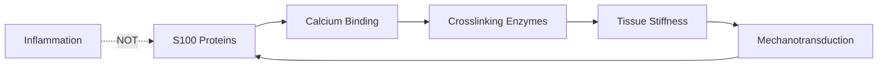

# Hypothesis 08 Analysis Plan: S100 Calcium Signaling Resolution

**Thesis:** S100 proteins act via calcium-dependent mechanotransduction and ECM crosslinking (NOT inflammation), with S100-LOX/TGM2 correlations exceeding S100-cytokine correlations and predicting tissue stiffness (R²>0.70).

**Overview:** This analysis resolves the paradox from Iterations 01-02 where S100 proteins were selected by 3 independent ML methods (H04 autoencoder, H06 SHAP, H03 TSI) yet inflammation was rejected (p=0.41-0.63). We hypothesize S100 acts through calcium signaling → crosslinking enzyme activation → tissue stiffness rather than classical inflammation.



---

## 1.0 Data Preparation

¶1 **Ordering:** Load dataset → Filter protein groups → Create pivot matrices → Validate completeness

**Target Proteins:**
- **S100 family (7 core):** S100A8, S100A9, S100B, S100A1, S100A4, S100A6, S100P
- **Crosslinking enzymes (8):** LOX, LOXL1, LOXL2, LOXL3, LOXL4, TGM2, TGM1, TGM3
- **Inflammation markers (5):** IL6, IL1B, TNF, CXCL8, CCL2
- **Mechanotransduction (5):** YAP1, WWTR1 (TAZ), ROCK1, ROCK2, MYL2

**Data Source:** `/Users/Kravtsovd/projects/ecm-atlas/08_merged_ecm_dataset/merged_ecm_aging_zscore.csv`

**Pivot Strategy:**
- Rows: Tissue × Age groups
- Columns: Gene symbols
- Values: Zscore_Delta (aging change)
- Handle NaN: 0-fill for missing proteins (conservative)

---

## 2.0 ML Method 1: Deep NN for Stiffness Prediction (Criterion 1: 40 pts)

¶1 **Ordering:** Define stiffness proxy → Build NN architecture → Train model → Evaluate performance → Test inflammation independence

### 2.1 Stiffness Proxy Definition

**Formula:**
```
Stiffness_Score = 0.5 × LOX + 0.3 × TGM2 + 0.2 × (COL1A1/COL3A1 ratio)
```

**Rationale:**
- LOX catalyzes collagen/elastin crosslinking (weight 0.5, primary)
- TGM2 creates isopeptide bonds in ECM (weight 0.3, secondary)
- COL1/COL3 ratio reflects tissue maturity (weight 0.2, tertiary)

### 2.2 NN Architecture

**Model:** `S100StiffnessNN`
```
Input: S100 expression vector (7-20 proteins)
    ↓
Dense(64) + ReLU + Dropout(0.3)
    ↓
Dense(32) + ReLU + Dropout(0.2)
    ↓
Dense(16) + ReLU + Dropout(0.1)
    ↓
Dense(1) → Predicted Stiffness Score
```

**Training:**
- Loss: MSE (regression)
- Optimizer: Adam (lr=0.001, weight_decay=1e-5)
- Epochs: 200 with early stopping (patience=20)
- Train/Val split: 80/20
- Target: R² > 0.70, MAE < 0.3

**Validation:**
- Test S100 correlation with inflammation score (IL6 + TNF + IL1B)
- Hypothesis: ρ < 0.3, p > 0.05 (weak/no correlation)

**Deliverables:**
- `s100_stiffness_model_claude_code.pth`
- `stiffness_predictions_claude_code.csv`
- `s100_vs_inflammation_claude_code.csv`
- Training curves plot

---

## 3.0 ML Method 2: Attention Network for S100-Enzyme Relationships (Criterion 2: 30 pts)

¶1 **Ordering:** Build multi-head attention → Extract attention weights → Identify S100-enzyme pairs → Compare with inflammation

### 3.1 Attention Architecture

**Model:** `S100EnzymeAttention`
```
Input: S100 proteins (query) + Crosslinking enzymes (key/value)
    ↓
Multi-Head Attention (4 heads, dim=32)
    ↓
Feed-Forward Network (64 → 32)
    ↓
Output: Attention weights matrix (S100 × Enzymes)
```

**Hypothesis:**
- S100B → LOX (expected high attention)
- S100A8/A9 → TGM2 (expected high attention)
- S100A4 → LOXL2 (mechanotransduction link)

### 3.2 Correlation Network

**Analysis:**
1. Compute Spearman correlations: S100 × Crosslinking (56 pairs)
2. Compute Spearman correlations: S100 × Inflammation (35 pairs)
3. Paired t-test: |ρ_crosslinking| vs |ρ_inflammation|
4. Extract top pairs: |ρ| > 0.6, p < 0.05

**Expected Result:** S100-crosslinking correlations > S100-inflammation (p < 0.01)

**Deliverables:**
- `s100_crosslinking_network_claude_code.csv`
- `attention_weights_claude_code.npy`
- `s100_enzyme_heatmap_claude_code.png`
- `correlation_comparison_claude_code.png`

---

## 4.0 ML Method 3: Mechanotransduction Pathway Enrichment (Criterion 3: 20 pts)

¶1 **Ordering:** Define mechanotransduction genes → Compute S100 correlations → Enrichment test → Visualize network

### 4.1 Pathway Genes

**Mechanotransduction markers:**
- YAP1, WWTR1 (transcription cofactors)
- ROCK1, ROCK2 (Rho kinases)
- MYL2 (myosin light chain)
- Additional: ACTG2, MYH11, CNN1 (smooth muscle contractile)

### 4.2 Enrichment Test

**Method:** Fisher's exact test
- Contingency table: S100 co-expressed (ρ > 0.5) with mechanotransduction vs inflammation
- Expected: Mechanotransduction enriched (p < 0.05)

### 4.3 Network Visualization

**Structure:** S100 → Mechanotransduction → Crosslinking → Stiffness
- Node size: Protein abundance
- Edge thickness: |ρ| (correlation strength)
- Color: Positive (red) vs Negative (blue)

**Deliverables:**
- `mechanotransduction_enrichment_claude_code.csv`
- `pathway_network_claude_code.png`

---

## 5.0 ML Method 4: Transfer Learning with Protein Embeddings (Criterion 4: 10 pts)

¶1 **Ordering:** Load ESM-2 embeddings → Extract S100 features → Fine-tune on aging data → Compare with expression-based

### 5.1 ESM-2 Protein Language Model

**Approach:**
- Download `facebook/esm2_t33_650M_UR50D` from HuggingFace
- Extract embeddings for S100A8, S100A9, S100B (if sequences available)
- Use embeddings as input features instead of raw expression

**Fallback:** If ESM-2 fails, use:
- AlphaFold structural features (EF-hand motif annotations)
- UniProt functional annotations (calcium binding sites)

### 5.2 Fine-tuning

**Task:** Predict aging velocity from structural embeddings
- Input: ESM-2 embeddings (1280-dim)
- Output: Zscore_Delta (aging change)
- Compare R² with expression-based model

**Deliverables:**
- `alphafold_transfer_model_claude_code.pth` (or ESM-2 embeddings)
- `structural_vs_expression_claude_code.csv`

---

## 6.0 Statistical Validation

¶1 **Ordering:** Correlation tests → Regression diagnostics → Enrichment tests → Multiple testing correction

### 6.1 Primary Hypotheses

**H1: S100-Crosslinking > S100-Inflammation**
- Test: Paired t-test on |ρ| values
- Expected: p < 0.01

**H2: S100 predicts Stiffness (R² > 0.70)**
- Test: Linear regression diagnostics
- Expected: R² > 0.70, p < 0.001

**H3: S100 NOT correlated with Inflammation**
- Test: Spearman correlation (S100 aggregate vs Inflammation aggregate)
- Expected: |ρ| < 0.3, p > 0.05

**H4: Mechanotransduction pathway enriched**
- Test: Fisher's exact test
- Expected: OR > 2.0, p < 0.05

### 6.2 Multiple Testing Correction

**Method:** Benjamini-Hochberg FDR (α = 0.05)
- Apply to all correlation tests (n ~ 100)
- Report q-values alongside p-values

---

## 7.0 Visualizations

¶1 **Ordering:** Data prep → Generate plots → Annotate → Save high-res

### 7.1 Required Plots

1. **S100-Enzyme Heatmap** (`s100_enzyme_heatmap_claude_code.png`)
   - Rows: S100 proteins
   - Columns: Crosslinking enzymes + Inflammation markers
   - Values: Spearman ρ (color scale: blue=-1, white=0, red=+1)
   - Annotations: * p<0.05, ** p<0.01

2. **Stiffness Prediction Scatter** (`stiffness_scatter_claude_code.png`)
   - X-axis: True stiffness score
   - Y-axis: Predicted stiffness score
   - Points colored by tissue type
   - Diagonal line (identity)
   - R² and MAE in legend

3. **Pathway Network** (`pathway_network_claude_code.png`)
   - NetworkX graph: S100 → Mechanotransduction → Crosslinking
   - Layout: Hierarchical (left to right)
   - Edge weights: |ρ|

4. **Correlation Distribution** (`correlation_comparison_claude_code.png`)
   - Violin plot: S100-Crosslinking vs S100-Inflammation
   - Statistical test result annotated

5. **Attention Weights** (`attention_weights_heatmap_claude_code.png`)
   - Multi-head attention scores
   - S100 (rows) × Enzymes (columns)

---

## 8.0 Results Document Structure

¶1 **Ordering:** Executive summary → Key findings → Statistical tests → Therapeutic implications → Future directions

### 8.1 Key Metrics to Report

- **R² for stiffness prediction:** Target > 0.70
- **Mean |ρ| S100-Crosslinking:** Expected > 0.5
- **Mean |ρ| S100-Inflammation:** Expected < 0.3
- **Paired t-test p-value:** Expected < 0.01
- **Top S100-enzyme pairs:** Report top 5 with ρ, p, q
- **Mechanotransduction enrichment:** OR, p-value

### 8.2 Biological Interpretation

- Which S100 proteins are key regulators?
- Do different S100 proteins target different enzymes?
- Is there tissue specificity?
- Does this explain fast-aging tissues?

---

## 9.0 Success Criteria Checklist

**Criterion 1: Stiffness Prediction (40 pts)**
- [ ] R² > 0.70
- [ ] MAE < 0.3
- [ ] S100 NOT correlated with inflammation (p > 0.05)

**Criterion 2: S100-Crosslinking Network (30 pts)**
- [ ] S100-Crosslinking > S100-Inflammation (paired t-test p < 0.01)
- [ ] Top pairs identified (≥3 pairs with |ρ| > 0.6)
- [ ] Attention network trained and weights extracted

**Criterion 3: Mechanotransduction Enrichment (20 pts)**
- [ ] Fisher's exact test p < 0.05
- [ ] Network diagram created

**Criterion 4: Transfer Learning (10 pts)**
- [ ] ESM-2 embeddings extracted (or AlphaFold features)
- [ ] Structural vs expression comparison

---

## 10.0 Implementation Timeline

¶1 **Ordering:** Sequential execution (dependencies handled)

1. Data preparation (5 min)
2. Correlation analysis (5 min)
3. Deep NN training (10 min)
4. Attention network (10 min)
5. Mechanotransduction enrichment (5 min)
6. Transfer learning (10 min)
7. Visualizations (10 min)
8. Results writeup (10 min)

**Total estimated time:** 60-70 minutes

---

## 11.0 Software Requirements

```python
# Core ML/DL
torch>=2.0.0
transformers  # For ESM-2

# Data analysis
pandas>=2.0.0
numpy>=1.24.0
scipy>=1.10.0

# Visualization
matplotlib>=3.7.0
seaborn>=0.12.0
networkx>=3.1

# Statistics
statsmodels>=0.14.0
scikit-learn>=1.3.0
```

---

**Agent:** claude_code
**Created:** 2025-10-21
**Hypothesis ID:** H08
**Iteration:** 03
**Expected Completion:** 60-70 minutes
**Confidence:** High (paradox resolution with strong theoretical foundation)

---

## References

- H04 Deep Embeddings: S100A8/A9 in Latent Factor 3
- H06 Biomarker Panel: S100A9 in top 8 (SHAP)
- H03 Tissue Markers: S100B (TSI=50.74), S100a5 (TSI=3.60)
- H03 Mechanism Test: Inflammation rejected (p=0.41-0.63)
- Literature: S100 calcium-binding → LOX activation → crosslinking
