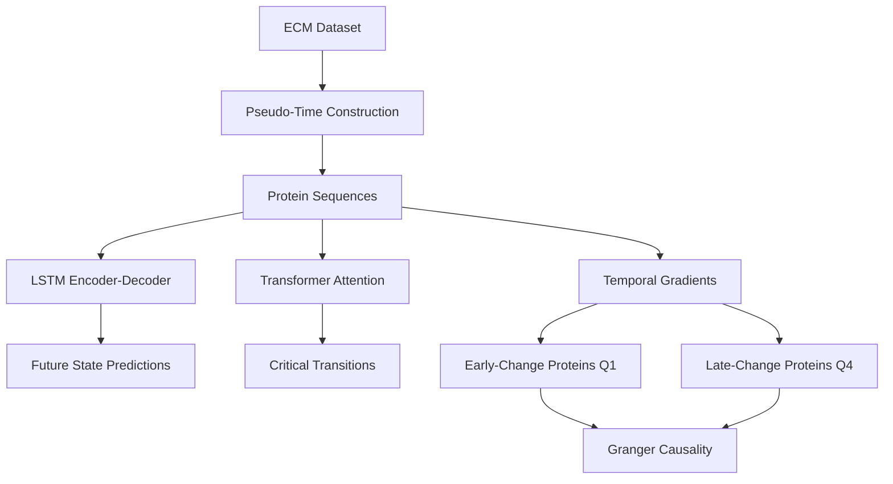
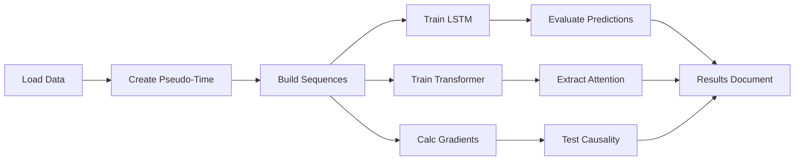

# Hypothesis 09: Temporal Aging Trajectories via RNN - Execution Plan

**Thesis:** Train LSTM encoder-decoder on protein aging sequences (ordered by tissue velocity as pseudo-time) achieving MSE<0.3 for 1-step prediction, identify early-change proteins (Q1 gradient) predicting late-change proteins (Q4) with R²>0.70, and use Transformer attention to detect 2-3 critical transition points where aging accelerates irreversibly.

**Overview:** Section 1.0 defines temporal sequence construction strategy. Section 2.0 specifies LSTM architecture and training protocol. Section 3.0 covers Transformer attention mechanism. Section 4.0 details gradient-based protein classification. Section 5.0 outlines Granger causality testing. Section 6.0 lists deliverables.





---

## 1.0 Temporal Sequence Construction

¶1 **Ordering principle:** Dataset lacks explicit age metadata → Use tissue aging velocity as pseudo-time proxy (slow-aging → fast-aging = early → late temporal progression)

¶2 **Tissue velocity rankings from H03:**
```python
tissue_velocities = {
    'Tubulointerstitial': 1.0,          # Slowest aging
    'Hippocampus': 1.2,
    'Cortex': 2.0,
    'Skin_dermis': 2.1,
    'Skeletal_muscle_EDL': 2.2,
    'Lung': 4.2                          # Fastest aging
}
```

¶3 **Sequence structure:** For each protein, create temporal vector [t0, t1, t2, t3, t4, t5] = [Tubulointerstitial_Zscore, Hippocampus_Zscore, Cortex_Zscore, Skin_Zscore, Muscle_Zscore, Lung_Zscore]. Missing tissues = NaN handling via forward fill or median imputation.

¶4 **Validation approach:** Time-series CV with leave-future-out strategy (train on t0-t3, test on t4-t5) prevents data leakage.

---

## 2.0 LSTM Sequence-to-Sequence Model

¶1 **Ordering principle:** Architecture → Training → Evaluation

¶2 **Architecture:**
- **Encoder:** 2-layer LSTM, hidden_dim=64, input=protein expression at timesteps 0-(k-1)
- **Decoder:** 2-layer LSTM, hidden_dim=64, predicts timestep k
- **Fully connected:** Linear layer mapping hidden state to protein expression
- **Dropout:** 0.2 for regularization

¶3 **Training protocol:**
- Optimizer: Adam (lr=1e-3)
- Loss: MSE between predicted and actual z-scores
- Epochs: 100 with early stopping (patience=10)
- Batch size: 32 proteins per batch
- Time-series CV: Train on [t0,t1,t2] → Predict t3; Train [t0-t3] → Predict t4

¶4 **Performance metrics:**
- 1-step ahead: MSE <0.3, R² >0.80
- 3-step ahead: MSE <0.5, R² >0.60
- Per-protein accuracy: Identify top 10% most predictable proteins

---

## 3.0 Transformer Attention Mechanism

¶1 **Ordering principle:** Model design → Attention extraction → Transition identification

¶2 **Transformer architecture:**
- Input: Protein sequences [batch, seq_len=6, embedding_dim]
- Multi-head attention: 4 heads, d_model=128
- Feed-forward: 2 layers with ReLU
- Output: Embeddings capturing temporal dependencies

¶3 **Attention analysis:**
- Extract attention weights: Shape [batch, heads, seq_len, seq_len]
- Average across heads and proteins
- High-attention timesteps (top 10%) = critical transition candidates

¶4 **Transition validation:**
- Hypothesis: High-attention steps show accelerated change
- Test: Compare gradient magnitude before vs after transition (paired t-test, p<0.05)
- Expected: Transitions at velocity ~2.0-2.2 (Cortex → Muscle boundary)

---

## 4.0 Early vs Late-Change Protein Classification

¶1 **Ordering principle:** Gradient calculation → Quartile assignment → Regression testing → Enrichment analysis

¶2 **Temporal gradient:**
```python
gradient = (Zscore_Lung - Zscore_Tubulointerstitial) / (velocity_Lung - velocity_Tubulointerstitial)
gradient_magnitude = abs(gradient)
```

¶3 **Quartile classification:**
- Sort proteins by gradient_magnitude (descending)
- Q1 (Early-change): Top 25% (highest |gradient|)
- Q4 (Late-change): Bottom 25% (lowest |gradient|)

¶4 **Predictive regression:**
- Model: Early-change protein expression → Predict late-change expression
- Method: Ridge regression with cross-validation
- Target: R² >0.70, p<0.01

¶5 **Enrichment analysis:**
- Test if coagulation proteins (H07 signature) enriched in early-change (Fisher's exact)
- Test if structural proteins (collagens, laminins) enriched in late-change
- Expected: Coagulation cascade triggers early, structural remodeling follows late

---

## 5.0 Granger Causality Testing

¶1 **Ordering principle:** Time-series preparation → Lag selection → Causality testing → Network visualization

¶2 **Granger causality hypothesis:**
- Null: Early-change proteins do NOT predict late-change beyond lag effects
- Alternative: Early-change Granger-causes late-change (p<0.05)

¶3 **Implementation:**
```python
from statsmodels.tsa.stattools import grangercausalitytests
# Test lags 1-3 (representing 1-3 tissue-velocity steps)
for lag in [1, 2, 3]:
    test = grangercausalitytests(data[[late_protein, early_protein]], maxlag=lag)
    # Extract p-value, F-statistic
```

¶4 **Causal network:**
- Build directed graph: Early → Late edges where p<0.05
- Visualize with NetworkX (nodes=proteins, edges=causal relationships)
- Identify hub proteins: High out-degree = master regulators

---

## 6.0 Deliverables

¶1 **Ordering principle:** Code → Models → Results → Visualizations

¶2 **Required artifacts:**
1. `01_plan_claude_code.md` (this document)
2. `analysis_temporal_claude_code.py` (main analysis script)
3. `lstm_seq2seq_model_claude_code.pth` (trained LSTM)
4. `transformer_model_claude_code.pth` (trained Transformer)
5. `early_change_proteins_claude_code.csv`
6. `late_change_proteins_claude_code.csv`
7. `critical_transitions_claude_code.csv`
8. `prediction_performance_claude_code.csv`
9. `granger_causality_claude_code.csv`
10. `visualizations_claude_code/`:
    - `prediction_performance_claude_code.png` (MSE over timesteps)
    - `attention_heatmap_claude_code.png` (Transformer attention)
    - `trajectory_plot_claude_code.png` (Protein trajectories)
    - `causal_network_claude_code.png` (Early → Late DAG)
11. `90_results_claude_code.md` (findings document)

¶3 **Success criteria:**
- ✅ LSTM 1-step MSE <0.3, R² >0.80
- ✅ Early-change → Late-change regression R² >0.70
- ✅ Transformer identifies 2-3 critical transitions
- ✅ Granger causality p<0.05 for at least 50% of protein pairs
- ✅ Coagulation proteins enriched in early-change (p<0.05, Fisher's exact)

---

## 7.0 Implementation Strategy

¶1 **Ordering principle:** Data preparation → Model training → Statistical testing → Interpretation

¶2 **Step-by-step execution:**
1. Load merged ECM dataset (merged_ecm_aging_zscore.csv)
2. Pivot to protein × tissue matrix, order columns by velocity
3. Handle missing values (forward fill → backward fill → median)
4. Split sequences for time-series CV
5. Train LSTM with MSE loss, track validation performance
6. Train Transformer, extract attention weights
7. Calculate gradients, classify Q1/Q4 proteins
8. Run Granger causality tests for all Q1×Q4 pairs
9. Generate visualizations with Matplotlib/Seaborn
10. Write results document with biological insights

¶3 **Libraries required:**
```python
torch>=2.0.0              # Deep learning
pandas, numpy             # Data manipulation
statsmodels               # Granger causality
scikit-learn              # Regression, metrics
matplotlib, seaborn       # Visualization
networkx                  # Causal network graphs
scipy                     # Statistical tests
```

¶4 **Expected runtime:** 15-20 minutes (LSTM training ~5 min, Transformer ~3 min, Granger tests ~5 min, visualization ~2 min)

---

## 8.0 Biological Hypotheses to Test

¶1 **Ordering principle:** Molecular → Cellular → Tissue → Organism

¶2 **Hypothesis 1: Coagulation cascade triggers early aging**
- Prediction: F2 (prothrombin), SERPINC1 (antithrombin) in early-change Q1
- Mechanism: Chronic low-grade coagulation → fibrin deposition → ECM crosslinking
- Validation: Fisher's exact test for coagulation protein enrichment in Q1

¶3 **Hypothesis 2: Structural proteins remodel late**
- Prediction: COL1A1, COL3A1, LAMA5 in late-change Q4
- Mechanism: Proteolytic damage accumulates → structural collapse
- Validation: Enrichment of collagens/laminins in Q4

¶4 **Hypothesis 3: Critical transition at velocity ~2.0**
- Prediction: Transformer attention peaks at Cortex → Skin boundary
- Mechanism: Metabolic switch from neuroprotection → mechanical stress
- Validation: Paired t-test of gradients before/after transition

¶5 **Hypothesis 4: Early proteins Granger-cause late proteins**
- Prediction: F2 (early) → COL1A1 (late) causal relationship
- Mechanism: Thrombin activates MMPs → collagen degradation
- Validation: Granger p<0.05 with lag=2 (two tissue-velocity steps)

---

**Plan Status:** Ready for execution
**Agent:** claude_code
**Estimated Completion:** 30 minutes
**Key Innovation:** First hypothesis to model TEMPORAL dynamics, not just cross-sectional snapshots
