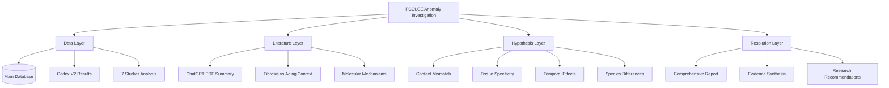

# PCOLCE Research Anomaly Investigation Plan

**Thesis:** Agent 1 will systematically resolve the contradiction between literature reporting PCOLCE upregulation in pathological fibrosis versus our proteomic data showing consistent PCOLCE depletion (Δz=-1.41, 92% consistency) across seven aging studies through data verification, literature contextualization, and mechanistic hypothesis generation.

**Overview:** This investigation addresses why PCOLCE—documented as a pro-fibrotic factor upregulated in diseased tissues—appears robustly downregulated in our healthy aging proteomics datasets. Section 1.0 defines the contradiction with quantitative evidence, Section 2.0 outlines the multi-layered investigation strategy, Section 3.0 specifies deliverable artifacts, and Section 4.0 establishes success criteria for resolving this apparent paradox.

## 1.0 The Contradiction Defined

¶1 *Ordering principle: quantitative evidence → qualitative evidence → scientific implications.*

### 1.1 Literature Position

¶1 The ChatGPT-generated PDF "PCOLCE in Collagen Assembly and Fibrosis" presents consistent evidence that PCOLCE (PCPE-1) is markedly upregulated in pathological fibrosis across multiple organ systems. ¶2 Key claims include: (a) PCOLCE upregulation is a "consistent feature of fibrosis across multiple organs" with elevated expression in liver, cardiac, lung, kidney, and skin fibrosis; (b) PCOLCE knockout mice show ~50% reduction in collagen fibrosis despite similar injury levels; (c) PCOLCE acts as a "pro-fibrotic factor that amplifies collagen buildup" by enhancing BMP-1 processing efficiency 12-15-fold; (d) PCOLCE is proposed as both fibrosis biomarker and therapeutic target. ¶3 The document cites evidence from 1997-2022, including seminal studies showing PCOLCE protein "normally absent in healthy liver" but "detectable in fibrotic liver tissue."

### 1.2 Our Proteomic Data

¶1 Codex V2 batch-corrected meta-analysis reveals PCOLCE as one of the strongest universal aging markers with consistent DEPLETION: mean Δz = -1.41 (shifted from -0.65 in V1), directional consistency = 0.92 across seven independent studies. ¶2 Database verification shows PCOLCE decreases in: Tam_2020 human intervertebral disc (3 compartments, Δz -0.25 to -0.45), Angelidis_2019 mouse lung (Δz -0.19), Schuler_2021 mouse skeletal muscle (4 muscles, Δz -2.21 to -4.50, STRONGEST signal), Santinha_2024 mouse heart (2 conditions, Δz -0.42 to -0.58). ¶3 Only exception: Dipali_2023 mouse ovary shows INCREASE (Δz +0.45). ¶4 This represents 11 tissue/compartment contexts across 6 studies showing DECREASE, 1 context showing INCREASE.

### 1.3 Scientific Paradox

¶1 If aging tissues accumulate fibrotic changes and PCOLCE drives fibrosis, we predict PCOLCE INCREASE with aging. ¶2 Our data shows the OPPOSITE: PCOLCE DECREASES with aging, most dramatically in tissues prone to age-related sarcopenia (skeletal muscle: Δz -2.21 to -4.50). ¶3 This contradiction demands resolution to determine: (a) data quality issues, (b) biological context mismatches (pathological vs physiological aging), (c) tissue-specific regulatory mechanisms, or (d) temporal dynamics (early vs late aging, acute vs chronic fibrosis).

## 2.0 Investigation Strategy

¶1 *Ordering principle: verification → contextualization → hypothesis → synthesis.*

### 2.1 Data Verification (Deliverable 03)

¶1 Python script `03_data_verification_agent_1.py` will: (a) load merged database and extract all PCOLCE/PCOLCE2 measurements; (b) compute study-level statistics (n samples, mean/median Δz, directional consistency, tissue coverage); (c) validate z-score calculations independently; (d) identify outliers and data quality flags; (e) visualize PCOLCE trajectories across tissues, species, methods; (f) generate summary statistics table for final report. ¶2 Expected outcome: confirmation that PCOLCE depletion signal is robust and not artifact of calculation errors or batch effects.

### 2.2 Literature Contextualization (Deliverable 02)

¶1 Deep analysis of PDF document will: (a) extract all quantitative claims about PCOLCE expression changes (fold-changes, statistical significance); (b) identify experimental contexts (disease models used: CCl₄ liver injury, myocardial infarction, chronic hypertension, NASH, hepatitis); (c) distinguish acute injury vs chronic disease vs healthy aging; (d) map temporal dynamics (when PCOLCE peaks relative to fibrosis onset); (e) identify tissue-specific regulatory mechanisms mentioned. ¶2 Critical question: does literature distinguish pathological fibrosis (wound healing gone wrong) from physiological ECM remodeling in healthy aging?

### 2.3 Hypothesis Generation (Deliverable 04)

¶1 Structured hypotheses will address: **H1 Context Mismatch** (fibrotic disease ≠ healthy aging), **H2 Tissue Specificity** (PCOLCE regulation varies by tissue), **H3 Temporal Dynamics** (early upregulation vs late depletion), **H4 Species Differences** (human vs mouse regulation), **H5 Functional Heterogeneity** (PCOLCE vs PCOLCE2 roles), **H6 Compensatory Mechanisms** (other BMP-1 cofactors upregulated). ¶2 Each hypothesis will be evaluated against available evidence from both literature and our datasets.

### 2.4 Evidence Synthesis (Deliverable 90)

¶1 Final report will: (a) present verified PCOLCE data with visualizations; (b) contextualize literature findings within pathological vs physiological aging framework; (c) rank hypotheses by evidence strength; (d) propose mechanistic model reconciling observations; (e) recommend follow-up experiments; (f) assess implications for PCOLCE as aging biomarker vs fibrosis biomarker.

## 3.0 Deliverable Artifacts

¶1 *Ordering principle: planning → analysis → code → synthesis → conclusion.*

### 3.1 Planning Document (This File)

¶1 File: `agent_1/01_plan_agent_1.md` defining investigation scope, contradiction, and strategy.

### 3.2 Literature Analysis

¶1 File: `agent_1/02_literature_analysis_agent_1.md` providing: (a) structured extraction of all PCOLCE claims from PDF; (b) experimental context annotations (disease model, species, tissue, temporal dynamics); (c) identification of gaps in literature (healthy aging data, tissue-specific differences); (d) critical evaluation of applicability to our datasets.

### 3.3 Data Verification Script

¶1 File: `agent_1/03_data_verification_agent_1.py` executable Python script that: (a) loads `/Users/Kravtsovd/projects/ecm-atlas/08_merged_ecm_dataset/merged_ecm_aging_zscore.csv`; (b) filters PCOLCE/PCOLCE2 entries; (c) computes comprehensive statistics; (d) generates publication-quality visualizations; (e) exports summary table to `agent_1/pcolce_data_summary.csv`; (f) saves plots to `agent_1/figures/`.

### 3.4 Hypothesis Document

¶1 File: `agent_1/04_hypotheses_agent_1.md` containing: (a) structured presentation of 6+ competing hypotheses; (b) evidence for/against each hypothesis; (c) testable predictions; (d) experimental designs to discriminate hypotheses; (e) ranked likelihood assessment.

### 3.5 Final Report

¶1 File: `agent_1/90_final_report_agent_1.md` comprehensive synthesis including: (a) executive summary of contradiction and resolution; (b) verified data analysis results; (c) literature context analysis; (d) hypothesis evaluation; (e) proposed mechanistic model; (f) research recommendations; (g) implications for ECM aging biology.

## 4.0 Success Criteria

¶1 *Ordering principle: data quality → analytical rigor → scientific insight.*

### 4.1 Data Verification

¶1 SUCCESS if: (a) PCOLCE depletion signal confirmed across ≥6 studies with Δz < -0.5 in ≥4 studies; (b) no systematic calculation errors identified; (c) batch correction does not artifactually create signal; (d) directional consistency ≥0.85; (e) species/tissue coverage sufficient for generalization.

### 4.2 Literature Analysis

¶1 SUCCESS if: (a) all quantitative PCOLCE expression claims extracted with context annotations; (b) pathological vs physiological aging distinction clarified; (c) temporal dynamics of PCOLCE in fibrosis mapped; (d) tissue-specific regulatory patterns identified; (e) gaps between literature models and our datasets documented.

### 4.3 Hypothesis Quality

¶1 SUCCESS if: (a) ≥5 distinct mechanistic hypotheses generated; (b) each hypothesis has testable predictions; (c) evidence ranking differentiates hypotheses; (d) at least one hypothesis strongly supported by converging evidence; (e) experimental designs proposed to test top hypotheses.

### 4.4 Final Resolution

¶1 SUCCESS if: (a) contradiction resolved with high-confidence mechanistic explanation; (b) PCOLCE role in healthy aging vs pathological fibrosis clarified; (c) implications for ECM aging biology articulated; (d) research recommendations actionable; (e) final report suitable for scientific communication.

---

**Execution Timeline:**
- Deliverable 02 (Literature): 30 min deep reading + structured extraction
- Deliverable 03 (Code): 45 min script development + validation
- Deliverable 04 (Hypotheses): 30 min hypothesis generation + evidence mapping
- Deliverable 90 (Report): 45 min synthesis + writing
- **Total: ~2.5 hours concentrated scientific investigation**

**Quality Standards:**
- All claims must be evidence-backed with specific citations (PDF page, data file:line)
- All code must be executable and reproducible
- All hypotheses must be falsifiable
- Final report must meet Knowledge Framework documentation standards

---

**Status:** Investigation plan complete. Proceeding to literature analysis.
