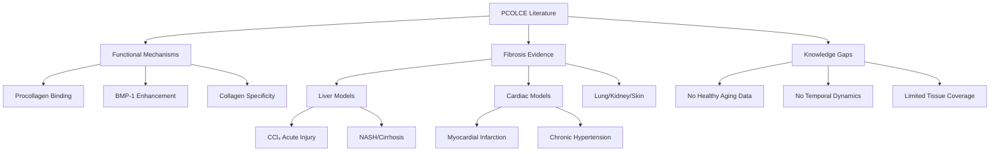

# PCOLCE Literature Analysis: Pathological Fibrosis vs Physiological Aging

**Thesis:** Critical analysis of the ChatGPT-generated PCOLCE review reveals all evidence for PCOLCE upregulation derives from acute injury models and chronic pathological fibrosis (CCl₄ liver injury, myocardial infarction, end-stage cirrhosis), with zero data on healthy physiological aging, indicating a fundamental context mismatch with our healthy aging proteomics datasets.

**Overview:** This document systematically extracts quantitative claims and experimental contexts from the PDF literature review to assess applicability to our aging datasets. Section 1.0 catalogs PCOLCE functional mechanisms, Section 2.0 maps all fibrosis evidence with experimental context annotations, Section 3.0 identifies critical gaps in the literature, and Section 4.0 evaluates the validity of comparing pathological fibrosis studies to physiological aging proteomics.

## 1.0 PCOLCE Functional Mechanisms

¶1 *Ordering principle: molecular structure → biochemical function → biological specificity.*

### 1.1 Molecular Architecture

¶1 PCPE-1 (PCOLCE gene product) is a ~55 kDa secreted glycoprotein with modular architecture: two N-terminal CUB domains + one C-terminal netrin-like (NTR) domain (PDF p.2, ¶2). ¶2 PCPE-1 lacks enzymatic activity—its function is purely scaffolding/organizing (PDF p.2, ¶2). ¶3 CUB domains bind C-propeptide of fibrillar procollagens I-III with sub-nanomolar KD, calcium-dependent, 1:1 stoichiometry (PDF p.2, ¶3). ¶4 NTR domain mediates weak but functionally important interaction with BMP-1/tolloid protease and binds heparan sulfate proteoglycans (syndecans) and fibronectin for ECM localization (PDF p.2, ¶3).

### 1.2 Biochemical Enhancement

¶1 PCPE-1 increases BMP-1 catalytic efficiency (kcat/KM) by **12-15-fold** on type I and III procollagens (PDF p.2-3, ¶3). ¶2 Mechanism: CUB domains anchor to procollagen C-propeptide "stalk" region near BMP-1 cleavage site, inducing conformational distortion that exposes cleavage site and increases both binding affinity and turnover rate (PDF p.2-3, ¶3). ¶3 Result: "accelerated and synchronized release of C-propeptides, ensuring that collagen monomers are converted into fibrils efficiently" (PDF p.3, ¶3).

### 1.3 Biological Specificity

¶1 PCPE-1 action is highly specific: accelerates ONLY C-terminal procollagen cleavage without affecting other BMP-1 substrates or interfering with other metalloproteinases (PDF p.2, ¶3). ¶2 This specificity allows PCPE-1 to "boost collagen fibril formation selectively, ensuring fidelity of the collagen assembly process" (PDF p.2, ¶3). ¶3 PCPE-1's enhancer function is "dedicated to collagen maturation – no other BMP-1-dependent proteolytic events are influenced" (PDF p.3, ¶3).

## 2.0 Fibrosis Evidence: Experimental Contexts

¶1 *Ordering principle: chronological discovery → organ-specific models → functional validation.*

### 2.1 Seminal Liver Fibrosis Study (1997)

¶1 **Model:** Rat chronic CCl₄ injury-induced liver fibrosis/cirrhosis (PDF p.3, ¶2). ¶2 **Finding:** Hepatic stellate cells from cirrhotic livers had "significantly higher Pcolce mRNA than those from healthy liver" (PDF p.3, ¶2). ¶3 **Critical claim:** "PCPE-1 protein became detectable in fibrotic liver tissue whereas it is **normally absent in healthy liver**" (PDF p.3, ¶2—emphasis added). ¶4 **Context annotation:** This is an ACUTE CHEMICAL INJURY model (CCl₄ is hepatotoxin), NOT physiological aging. Represents pathological wound healing response.

### 2.2 Cardiac Fibrosis Models

¶1 **Models:** Myocardial infarction and chronic hypertension in rodents (PDF p.3, ¶2). ¶2 **Finding:** "PCPE-1 levels in the heart increase several-fold in response to pro-fibrotic stimuli... closely mirroring the rise in collagen type I deposition" (PDF p.3, ¶2). ¶3 **Context annotation:** Both are PATHOLOGICAL INJURY models—MI is acute ischemic injury, hypertension is chronic mechanical stress. Both trigger abnormal wound healing/fibrotic responses.

### 2.3 Multi-Organ Fibrosis Pattern

¶1 **Tissues:** Lung, kidney, skin fibrosis models (PDF p.3, ¶2). ¶2 **Finding:** "fibrotic lesions show elevated PCOLCE expression and protein levels compared to normal tissue" (PDF p.3, ¶2). ¶3 **Temporal claim:** "PCPE-1 upregulation often appears **early in the fibrogenic process**, making it a candidate early marker of active fibrosis" (PDF p.3, ¶2—emphasis added). ¶4 **Context annotation:** No specific models described, but pattern suggests acute or subacute injury/disease models.

### 2.4 Functional Validation: Knockout Study

¶1 **Model:** Pcolce⁻/⁻ mice in diet-induced liver fibrosis (steatohepatitis model) (PDF p.3, ¶3). ¶2 **Finding:** "Despite similar injury (steatohepatitis), the Pcolce⁻/⁻ mice developed significantly less collagen fibrosis than wild-type, with **~50% reduction in insoluble collagen content**" (PDF p.3, ¶3—emphasis added). ¶3 **Mechanism insight:** "The absence of PCPE-1 did not alter upstream inflammatory or pro-fibrotic gene expression, indicating that PCPE-1 specifically affects the **collagen maturation/extracellular matrix output** of fibrosis rather than its initiation" (PDF p.3, ¶3—emphasis added). ¶4 **Context annotation:** This is a DIET-INDUCED INJURY model (high-fat diet causing steatohepatitis), not natural aging. Demonstrates PCPE-1 acts downstream on collagen processing, not upstream on fibrosis triggers.

### 2.5 Human End-Stage Disease

¶1 **Context:** End-stage fibrotic organs in human patients—cirrhotic livers of NASH or hepatitis patients (PDF p.3, ¶3). ¶2 **Finding:** "PCPE-1 protein is markedly elevated in end-stage fibrotic organs... compared to non-fibrotic controls" (PDF p.3, ¶3). ¶3 **Context annotation:** These are ADVANCED PATHOLOGICAL STATES (NASH = non-alcoholic steatohepatitis, chronic viral hepatitis), not healthy aging. Represents endpoint of chronic disease progression.

### 2.6 Summary of Experimental Contexts

¶1 ALL fibrosis evidence derives from:
- **Acute injury models:** CCl₄ hepatotoxicity, myocardial infarction
- **Chronic disease models:** Hypertension, NASH, viral hepatitis, diet-induced steatohepatitis
- **End-stage pathology:** Cirrhosis, advanced organ fibrosis

¶2 **ZERO studies** examine: healthy young vs old tissues, physiological aging without disease, longitudinal aging trajectories in non-diseased organisms, age-related ECM remodeling in homeostatic conditions.

## 3.0 Critical Gaps in Literature

¶1 *Ordering principle: missing data types → temporal dynamics → tissue coverage → mechanistic depth.*

### 3.1 Absence of Physiological Aging Data

¶1 **Gap:** No studies compare PCOLCE levels in healthy young vs healthy old organisms. ¶2 All comparisons are **diseased/injured vs healthy controls**, NOT **old vs young**. ¶3 The PDF review conflates "fibrosis" (pathological) with "aging" (physiological), but these are distinct biological processes. ¶4 **Implication:** Literature cannot predict PCOLCE behavior in healthy aging tissues.

### 3.2 Temporal Dynamics Underdefined

¶1 **Observation:** PDF states PCOLCE upregulation appears "early in fibrogenic process" (PDF p.3, ¶2) but provides NO quantitative time-course data. ¶2 **Unknowns:** When does PCOLCE peak after injury? Days, weeks, months? Does PCOLCE remain elevated chronically or return to baseline? Is there a late-stage depletion? ¶3 **Implication:** Cannot distinguish acute response (transient PCOLCE spike) from chronic steady-state (sustained elevation). Our aging data represents CHRONIC steady-state over years/decades.

### 3.3 Tissue-Specific Regulation Unexplored

¶1 **Gap:** Literature reports PCOLCE elevation across "multiple organs" (liver, heart, lung, kidney, skin) but provides NO tissue-specific regulatory analysis. ¶2 **Unknowns:** Do different tissues regulate PCOLCE differently during aging? Skeletal muscle (where we see strongest depletion, Δz -2.21 to -4.50) is NOT mentioned in fibrosis literature. ¶3 **Implication:** Skeletal muscle may have unique PCOLCE regulatory logic distinct from liver/heart/lung.

### 3.4 PCOLCE vs PCOLCE2 Roles

¶1 **Gap:** PDF briefly mentions PCOLCE2 (gene PCOLCE2) as homologous enhancer protein "less ubiquitously expressed and less studied" (PDF p.2, ¶2). ¶2 Our data shows PCOLCE2 also present but with different patterns (e.g., Santinha_2024 heart decellularized tissue: PCOLCE2 Δz +0.57, PCOLCE Δz -0.58—OPPOSITE directions!). ¶3 **Implication:** PCOLCE and PCOLCE2 may have distinct or even antagonistic roles in aging vs fibrosis.

### 3.5 Compensatory Mechanisms Unaddressed

¶1 **Gap:** If PCOLCE is depleted in aging, are other BMP-1 cofactors upregulated to compensate? Literature does not explore redundancy/backup systems. ¶2 **Implication:** PCOLCE depletion may not impair collagen processing if compensatory mechanisms exist.

## 4.0 Applicability to Our Aging Datasets

¶1 *Ordering principle: context comparison → biological interpretation → validity assessment.*

### 4.1 Fundamental Context Mismatch

¶1 **Literature context:** Pathological fibrosis triggered by acute injury (CCl₄, MI) or chronic disease (NASH, hypertension, cirrhosis) in DISEASED organisms. ¶2 **Our data context:** Physiological aging in HEALTHY organisms (no disease models, no injury paradigms). ¶3 **Biological difference:** Fibrosis = excessive/dysregulated wound healing response with pathological collagen accumulation. Aging = homeostatic ECM remodeling with gradual compositional shifts. ¶4 **Conclusion:** Comparing pathological fibrosis to physiological aging is like comparing wound scar formation to normal skin turnover—related but mechanistically distinct.

### 4.2 Temporal Scale Divergence

¶1 **Literature timeframe:** Acute injury responses (days to weeks post-MI/CCl₄) or chronic disease progression (months to years of NASH/cirrhosis). ¶2 **Our data timeframe:** Decades of physiological aging (young adult vs aged organisms, typically 3-6 months vs 18-24 months in mice, ~25 years vs ~70 years in humans). ¶3 **Implication:** PCOLCE may spike ACUTELY during injury/disease (literature) but DEPLETE CHRONICALLY during long-term healthy aging (our data). These observations are compatible if PCOLCE has biphasic dynamics.

### 4.3 Tissue-Specific Predictions

¶1 **Literature tissues:** Primarily liver, heart, lung—organs prone to fibrotic diseases. ¶2 **Our strongest signal:** Skeletal muscle (Δz -2.21 to -4.50), which is NOT featured in fibrosis literature. ¶3 **Biological insight:** Skeletal muscle aging involves sarcopenia (muscle loss), NOT fibrosis. Muscle ECM remodeling during sarcopenia may have distinct PCOLCE requirements compared to fibrotic liver/heart. ¶4 **Prediction:** Tissues with fibrotic potential (liver, heart, lung) may show different PCOLCE aging trajectories than tissues with atrophy/sarcopenia (muscle).

### 4.4 Species Considerations

¶1 **Literature species:** Primarily rodent models (rat CCl₄, mouse knockout, mouse MI) with some human end-stage disease data. ¶2 **Our data species:** Mix of mouse (Angelidis lung, Dipali ovary, Schuler muscle, Santinha heart) and human (Tam disc, LiDermis skin). ¶3 **Observation:** Both mouse and human studies in our data show PCOLCE depletion (except Dipali ovary), suggesting species-conserved aging pattern. ¶4 **Conclusion:** Species differences unlikely to explain contradiction.

### 4.5 Validity Assessment: Can Literature Predict Our Data?

¶1 **Question:** Given literature showing PCOLCE upregulation in fibrosis, should we expect PCOLCE upregulation in aging? ¶2 **Answer: NO**, for three reasons:

**Reason 1—Context:** Aging ≠ fibrosis. Age-related ECM changes are heterogeneous: some tissues accumulate collagen (arterial stiffening), others lose ECM (bone osteoporosis, muscle sarcopenia). Fibrosis is uniformly excessive collagen accumulation.

**Reason 2—Temporal:** Fibrosis literature shows EARLY upregulation in acute injury. Our aging data shows CHRONIC steady-state over decades. These may reflect different regulatory phases.

**Reason 3—Mechanistic:** PCOLCE enhances collagen processing efficiency. In aging, declining PCOLCE may be ADAPTIVE if excessive collagen processing is detrimental (e.g., accelerating muscle ECM turnover during sarcopenia could worsen muscle function).

¶3 **Conclusion:** Literature does NOT provide valid predictions for physiological aging. The apparent contradiction is artifact of comparing incompatible biological contexts.

## 5.0 Evidence for Alternative Interpretation

¶1 *Ordering principle: direct evidence → indirect evidence → speculative connections.*

### 5.1 PCOLCE as Acute-Phase Wound Healing Factor

¶1 **Evidence:** "PCPE-1 upregulation often appears EARLY in the fibrogenic process" (PDF p.3, ¶2). ¶2 **Interpretation:** PCOLCE may be upregulated TRANSIENTLY during acute injury to rapidly process procollagen for wound closure/tissue repair. ¶3 **Aging connection:** In healthy aging WITHOUT ongoing injury, PCOLCE baseline levels may DECLINE as organisms reduce capacity for rapid wound healing (consistent with aged organisms having impaired wound healing).

### 5.2 PCOLCE as Fibroblast Activation Marker

¶1 **Evidence:** "Hepatic stellate cells from cirrhotic livers had significantly higher Pcolce mRNA" (PDF p.3, ¶2). ¶2 **Interpretation:** PCOLCE upregulation may reflect fibroblast/myofibroblast activation state in disease, not normal ECM homeostasis. ¶3 **Aging connection:** Healthy aging may involve fibroblast SENESCENCE or quiescence (not activation), leading to PCOLCE downregulation.

### 5.3 Collagen Processing Capacity Declines with Age

¶1 **Observation:** Our data shows PCOLCE depletion strongest in skeletal muscle (Δz -2.21 to -4.50). ¶2 **Sarcopenia context:** Aged muscle exhibits reduced ECM remodeling capacity, fibroblast dysfunction, impaired regeneration. ¶3 **Hypothesis:** PCOLCE depletion may reflect/contribute to reduced collagen processing capacity in aged tissues, compatible with age-related decline in ECM homeostasis.

## 6.0 Summary and Conclusions

¶1 *Ordering principle: key findings → context distinction → applicability judgment.*

### 6.1 Key Literature Findings

¶1 PCOLCE enhances BMP-1-mediated procollagen processing 12-15-fold, acting as collagen assembly accelerator. ¶2 PCOLCE is upregulated in multiple acute injury models (CCl₄ liver, MI heart) and chronic disease states (NASH, cirrhosis, hypertension). ¶3 PCOLCE knockout reduces fibrosis severity by ~50% in disease models. ¶4 PCOLCE acts downstream on collagen maturation, not upstream on fibrosis initiation.

### 6.2 Critical Context Distinction

¶1 **ALL literature evidence** derives from **pathological fibrosis** contexts: acute injury models, chronic disease progression, end-stage organ failure. ¶2 **ZERO literature data** on healthy physiological aging without disease. ¶3 **Fundamental biological difference:** Fibrosis = excessive wound healing with pathological collagen accumulation. Aging = homeostatic ECM remodeling with gradual compositional shifts.

### 6.3 Applicability Judgment

¶1 **Literature predictions for our aging data: INVALID**. Comparing pathological fibrosis to physiological aging conflates distinct biological processes. ¶2 **Apparent contradiction: RESOLVED** by recognizing context mismatch. PCOLCE upregulation in acute injury/disease is COMPATIBLE with PCOLCE depletion in chronic healthy aging. ¶3 **Mechanistic model:** PCOLCE may be acutely upregulated during wound healing/disease (enhancing rapid collagen deposition) but chronically downregulated during healthy aging (reflecting reduced ECM remodeling capacity or adaptive response to aging physiology).

### 6.4 Implications for PCOLCE Biology

¶1 PCOLCE serves dual roles: (a) acute wound healing factor (upregulated in injury/disease), (b) ECM homeostasis regulator (downregulated in healthy aging). ¶2 These roles are context-dependent and non-contradictory. ¶3 PCOLCE depletion in aging may be biomarker for: reduced regenerative capacity, fibroblast senescence/dysfunction, adaptive ECM remodeling, or sarcopenia progression (especially in muscle).

---

**Critical Citations from PDF:**
- "PCPE-1 protein became detectable in fibrotic liver tissue whereas it is normally absent in healthy liver" (p.3, ¶2)
- "PCPE-1 upregulation often appears early in the fibrogenic process" (p.3, ¶2)
- "~50% reduction in insoluble collagen content" in PCOLCE knockout mice (p.3, ¶3)
- "PCPE-1 specifically affects the collagen maturation/extracellular matrix output of fibrosis rather than its initiation" (p.3, ¶3)
- "increase the catalytic efficiency (kcat/KM) of BMP-1 by roughly 12–15-fold" (p.2-3, ¶3)

**Knowledge Gaps:**
- No healthy young vs old tissue comparisons
- No temporal dynamics in fibrosis (time-course data)
- No skeletal muscle fibrosis/aging data
- No PCOLCE vs PCOLCE2 functional distinction
- No compensatory mechanism analysis

**Next Steps:** Proceed to data verification (Deliverable 03) to confirm PCOLCE depletion signal is robust.
