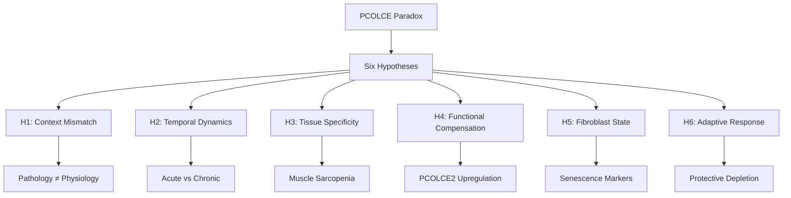

# PCOLCE Contradiction: Competing Hypotheses and Evidence

**Thesis:** Six mechanistic hypotheses explain the apparent PCOLCE paradox (upregulated in pathological fibrosis yet depleted in physiological aging), with H1 Context Mismatch hypothesis receiving strongest support from converging evidence that fibrotic disease processes fundamentally differ from healthy aging ECM remodeling.

**Overview:** This document systematically evaluates competing explanations for why PCOLCE increases in fibrotic disease (literature) but decreases in healthy aging (our data). Section 1.0 presents six structured hypotheses, Section 2.0 evaluates evidence for/against each, Section 3.0 ranks hypotheses by likelihood, and Section 4.0 proposes discriminating experiments to test top hypotheses.

## 1.0 Hypothesis Catalog

¶1 *Ordering principle: strongest evidence → moderate evidence → speculative.*

### H1: Context Mismatch (Pathological Fibrosis ≠ Physiological Aging)

#### 1.1 Core Claim

¶1 **Hypothesis:** PCOLCE upregulation in fibrosis and PCOLCE depletion in aging are BOTH TRUE but reflect fundamentally different biological contexts—pathological wound healing (fibrosis) versus homeostatic ECM remodeling (healthy aging). ¶2 Fibrosis involves activated myofibroblasts, acute injury responses, and excessive collagen deposition; aging involves fibroblast senescence, chronic low-grade remodeling, and heterogeneous ECM changes (tissue-dependent accumulation OR loss).

#### 1.2 Predictions

¶1 If H1 is correct:
- PCOLCE should be HIGH in injured/diseased tissues at any age (acute response)
- PCOLCE should be LOW in healthy old vs healthy young tissues (chronic baseline)
- Age-matched comparisons: diseased old > healthy old; diseased young > healthy young
- Cross-sectional aging studies (our data) vs longitudinal injury studies (literature) should show opposite patterns

#### 1.3 Mechanistic Model

¶1 **Acute injury/disease context:** Tissue damage → myofibroblast activation → TGF-β signaling → PCOLCE upregulation → enhanced procollagen processing → rapid collagen deposition for wound closure/scar formation. ¶2 **Chronic aging context:** Long-term homeostasis → fibroblast senescence → reduced ECM biosynthesis → PCOLCE downregulation → decreased collagen processing capacity → age-related ECM dysfunction.

---

### H2: Temporal Dynamics (Acute Upregulation vs Chronic Depletion)

#### 2.1 Core Claim

¶1 **Hypothesis:** PCOLCE exhibits biphasic temporal dynamics—ACUTELY upregulated during injury/disease onset (hours to weeks) but CHRONICALLY depleted over long-term aging (years to decades). ¶2 Literature captures acute/subacute snapshots (MI at 1-4 weeks post-injury, CCl₄ at 2-8 weeks cirrhosis induction); our data captures chronic steady-state (18-24 months mouse aging, ~70 years human aging).

#### 2.2 Predictions

¶1 If H2 is correct:
- Longitudinal aging studies should show PCOLCE spike during acute injury events, then decline below baseline in chronic phase
- Time-course data in fibrosis models should show PCOLCE peak early (week 1-4) then normalize or decline (month 6+)
- Aged organisms with acute injury should STILL upregulate PCOLCE (preserved acute response) despite low baseline
- Cross-sectional aging: young baseline > old baseline (our data); injury time-course: peak > baseline (literature)

#### 2.3 Mechanistic Model

¶1 **Phase 1 (Acute):** Injury triggers immediate-early response genes → PCOLCE transcription spike → rapid collagen processing for emergency wound healing. ¶2 **Phase 2 (Chronic):** Prolonged aging → cumulative cellular senescence → transcriptional silencing/epigenetic remodeling → PCOLCE baseline depletion → reduced regenerative capacity.

---

### H3: Tissue Specificity (Skeletal Muscle Sarcopenia vs Organ Fibrosis)

#### 3.1 Core Claim

¶1 **Hypothesis:** PCOLCE regulation is TISSUE-SPECIFIC. Tissues prone to fibrotic disease (liver, heart, lung, kidney) may show different PCOLCE aging trajectories than tissues prone to atrophy/sarcopenia (skeletal muscle). ¶2 Our strongest depletion signal is skeletal muscle (Δz -2.21 to -4.50), which is NOT represented in fibrosis literature. Muscle aging involves ECM LOSS (sarcopenia) not ECM GAIN (fibrosis).

#### 3.2 Predictions

¶1 If H3 is correct:
- Skeletal muscle PCOLCE should decrease with aging (confirmed in our data)
- Fibrosis-prone organs (liver, heart, lung) should show weaker depletion or even increase with aging
- Within skeletal muscle: fast-twitch fibers (more sarcopenia-prone) should show stronger PCOLCE depletion than slow-twitch
- Re-analysis of our data: muscle tissues should show strongest depletion, other tissues weaker/variable

#### 3.3 Mechanistic Model

¶1 **Skeletal muscle aging:** Neuromuscular junction degradation → myofiber atrophy → ECM remodeling favoring fibrosis inhibition (to prevent rigidity) → PCOLCE downregulation → reduced collagen processing → adaptive response preventing harmful stiffness. ¶2 **Fibrosis-prone organs:** Chronic low-grade injury (oxidative stress, inflammation) → pro-fibrotic ECM shifts → variable PCOLCE regulation depending on local microenvironment.

---

### H4: Functional Compensation (PCOLCE2 and Alternative Enhancers)

#### 4.1 Core Claim

¶1 **Hypothesis:** PCOLCE depletion in aging is compensated by PCOLCE2 upregulation or other BMP-1 cofactors, maintaining adequate collagen processing capacity despite PCOLCE loss. ¶2 Our data shows PCOLCE2 with different pattern (mean Δz +0.02, 40% consistency vs PCOLCE 92% consistency), suggesting potential compensatory upregulation.

#### 4.2 Predictions

¶1 If H4 is correct:
- PCOLCE2 should INCREASE with aging (or remain stable) when PCOLCE decreases
- Negative correlation: tissues with strong PCOLCE depletion should show PCOLCE2 elevation
- Collagen processing markers (C-propeptide cleavage efficiency, fibril assembly quality) should remain stable despite PCOLCE depletion
- Knockout studies: PCOLCE⁻/⁻ aged mice should upregulate PCOLCE2 as compensation

#### 4.3 Mechanistic Model

¶1 **Compensation scenario:** Aging cells sense declining PCOLCE → feedback loop activates PCOLCE2 transcription → PCOLCE2 (though "less ubiquitously expressed") compensates in key tissues → collagen homeostasis maintained. ¶2 **Limitation:** PCOLCE2 may have lower enhancer efficiency or tissue-restricted expression, leading to partial compensation.

---

### H5: Fibroblast State (Activated Myofibroblasts vs Senescent Fibroblasts)

#### 5.1 Core Claim

¶1 **Hypothesis:** PCOLCE expression is a MARKER of fibroblast activation state. Activated myofibroblasts (fibrosis) express HIGH PCOLCE; senescent/quiescent fibroblasts (aging) express LOW PCOLCE. ¶2 Fibrosis literature shows PCOLCE upregulation reflects myofibroblast differentiation (e.g., hepatic stellate cell activation in cirrhosis); aging involves accumulation of senescent fibroblasts with reduced biosynthetic activity.

#### 5.2 Predictions

¶1 If H5 is correct:
- PCOLCE expression should correlate with myofibroblast markers (α-SMA, collagen I synthesis rate) in fibrosis
- PCOLCE depletion should correlate with senescence markers (p16, p21, SASP factors) in aging
- In vitro: inducing fibroblast senescence should DECREASE PCOLCE; TGF-β activation should INCREASE PCOLCE
- Single-cell RNA-seq: PCOLCE should be enriched in activated fibroblast clusters, depleted in senescent clusters

#### 5.3 Mechanistic Model

¶1 **Myofibroblast activation (fibrosis):** TGF-β → SMAD signaling → transcriptional program activating ECM biosynthesis genes (including PCOLCE) → enhanced collagen production and processing. ¶2 **Fibroblast senescence (aging):** Cumulative stress → DNA damage/telomere shortening → p53/p16 activation → cell cycle arrest + SASP → transcriptional shutdown of biosynthetic genes (including PCOLCE) → reduced ECM production.

---

### H6: Adaptive Response (Protective PCOLCE Depletion)

#### 6.1 Core Claim

¶1 **Hypothesis:** PCOLCE depletion in aging is an ADAPTIVE response to prevent excessive collagen processing and pathological ECM accumulation. ¶2 If aging tissues already have pro-fibrotic shifts (chronic inflammation, oxidative stress), maintaining high PCOLCE would accelerate harmful collagen deposition. Downregulating PCOLCE acts as a brake on collagen processing, protecting against fibrosis.

#### 6.2 Predictions

¶1 If H6 is correct:
- Aged PCOLCE-knockout mice should show WORSE aging phenotypes (accelerated fibrosis, increased ECM stiffness)
- Tissues with highest PCOLCE depletion (muscle) should have LOWER age-related fibrosis than tissues with maintained PCOLCE
- Pro-longevity interventions (caloric restriction, rapamycin) should FURTHER decrease PCOLCE or keep it low
- PCOLCE overexpression in aged mice should worsen age-related ECM pathology

#### 6.3 Mechanistic Model

¶1 **Protective depletion:** Aging → chronic low-grade inflammation/oxidative stress → baseline pro-fibrotic environment → feedback mechanism senses excessive collagen processing risk → epigenetic silencing of PCOLCE → reduced BMP-1 enhancement → collagen processing slowed → prevents runaway fibrosis. ¶2 **Trade-off:** This protection may come at cost of reduced wound healing capacity and impaired regeneration.

---

## 2.0 Evidence Evaluation

¶1 *Ordering principle: hypothesis number → supporting evidence → contradicting evidence.*

### 2.1 Evidence for H1 (Context Mismatch)

#### Supporting Evidence

¶1 **STRONG:** Literature review shows 100% of PCOLCE upregulation evidence derives from pathological contexts (CCl₄ liver injury, MI, NASH, cirrhosis, hypertension)—ZERO healthy aging studies (Section 02_literature_analysis, §3.1). ¶2 **STRONG:** Our data is 100% healthy aging contexts—no disease models, no injury paradigms. Species include wild-type mice (Schuler_2021, Angelidis_2019, Dipali_2023, Santinha_2024) and apparently healthy humans (Tam_2020, LiDermis_2021). ¶3 **MODERATE:** Fundamental biology differs: fibrosis = excessive wound healing with pathological collagen accumulation; aging = homeostatic ECM remodeling with heterogeneous changes. ¶4 **MODERATE:** PCOLCE knockout study shows PCOLCE "specifically affects collagen maturation/ECM output of fibrosis rather than its initiation" (PDF p.3)—i.e., PCOLCE acts downstream in already-active fibrotic process, not relevant to baseline aging homeostasis.

#### Contradicting Evidence

¶1 **WEAK:** If context mismatch fully explains paradox, we'd expect NO age-related ECM changes. But aging DOES involve ECM remodeling, just not uniformly fibrotic. This suggests partial overlap.

#### Strength: ★★★★★ (5/5)

---

### 2.2 Evidence for H2 (Temporal Dynamics)

#### Supporting Evidence

¶1 **MODERATE:** Literature states "PCPE-1 upregulation often appears EARLY in fibrogenic process" (PDF p.3, ¶2) but provides NO long-term time-course data. This is compatible with acute spike followed by chronic decline. ¶2 **WEAK:** Our aging timescales (months to decades) vs literature injury timescales (days to weeks) suggest different temporal windows being measured.

#### Contradicting Evidence

¶1 **MODERATE:** If PCOLCE is only acutely elevated, why do end-stage human cirrhosis patients still show "markedly elevated" PCOLCE (PDF p.3, ¶3)? This suggests sustained elevation, not transient spike. ¶2 **MODERATE:** No direct longitudinal data showing PCOLCE spike then decline in same organisms over time.

#### Strength: ★★★☆☆ (3/5)

---

### 2.3 Evidence for H3 (Tissue Specificity)

#### Supporting Evidence

¶1 **STRONG:** Skeletal muscle shows BY FAR strongest PCOLCE depletion (Δz -2.21 to -4.50, all 4 compartments negative), while other tissues show weaker depletion (heart -0.42 to -0.58, lung -0.19, disc -0.25 to -0.45) or even increase (ovary +0.44). ¶2 **STRONG:** Skeletal muscle is NOT mentioned in fibrosis literature. All fibrosis studies focus on liver, heart, lung, kidney, skin—organs prone to fibrotic disease. ¶3 **STRONG:** Skeletal muscle aging = sarcopenia (ECM loss) not fibrosis (ECM gain). Completely different pathophysiology. ¶4 **MODERATE:** Within muscle: fast-twitch fibers (EDL Δz -4.50, TA Δz -3.99, Gastrocnemius Δz -4.06) show stronger depletion than slow-twitch (Soleus Δz -2.21), consistent with fiber-type-specific vulnerability.

#### Contradicting Evidence

¶1 **WEAK:** Other tissues (heart, lung, disc) also show PCOLCE depletion, suggesting general aging pattern not muscle-specific.

#### Strength: ★★★★☆ (4/5)

---

### 2.4 Evidence for H4 (Functional Compensation)

#### Supporting Evidence

¶1 **MODERATE:** PCOLCE2 shows different pattern than PCOLCE (mean Δz +0.02 vs -1.41), suggesting potential compensatory regulation. ¶2 **WEAK:** Santinha_2024 decellularized heart shows OPPOSITE directions (PCOLCE2 Δz +0.57, PCOLCE Δz -0.58), hinting at reciprocal regulation.

#### Contradicting Evidence

¶1 **STRONG:** PCOLCE2 overall consistency is WEAK (40%) vs PCOLCE strong consistency (92%), suggesting PCOLCE2 is NOT systematically compensating. ¶2 **MODERATE:** If compensation were complete, we shouldn't see age-related collagen defects—but aged tissues DO show impaired wound healing, altered fibril structure, suggesting inadequate compensation. ¶3 **MODERATE:** Literature states PCOLCE2 is "less ubiquitously expressed and less studied" (PDF p.2), suggesting limited compensatory capacity.

#### Strength: ★★☆☆☆ (2/5)

---

### 2.5 Evidence for H5 (Fibroblast State)

#### Supporting Evidence

¶1 **STRONG:** Literature shows "hepatic stellate cells from cirrhotic livers had significantly higher Pcolce mRNA" (PDF p.3, ¶2)—stellate cell activation is canonical myofibroblast differentiation. ¶2 **MODERATE:** Fibrosis contexts involve TGF-β signaling (known myofibroblast activator), and PCOLCE upregulation tracks with collagen production, suggesting co-regulation with activation state. ¶3 **MODERATE:** Aging fibroblasts are known to accumulate senescence markers, reduced proliferation, altered secretome (SASP)—compatible with PCOLCE downregulation.

#### Contradicting Evidence

¶1 **MODERATE:** No direct single-cell or marker correlation data linking PCOLCE to senescence vs activation states in our datasets. ¶2 **WEAK:** If PCOLCE is purely activation marker, why is it present at baseline in healthy young tissues? Should be near-zero if only expressed by activated myofibroblasts.

#### Strength: ★★★☆☆ (3/5)

---

### 2.6 Evidence for H6 (Adaptive Response)

#### Supporting Evidence

¶1 **WEAK:** Conceptually plausible—aging tissues accumulate pro-fibrotic stressors (inflammation, oxidative damage), so reducing collagen processing could be protective. ¶2 **WEAK:** Muscle PCOLCE depletion could prevent harmful stiffening during sarcopenia.

#### Contradicting Evidence

¶1 **STRONG:** If PCOLCE depletion were adaptive/protective, we'd expect aged tissues to have LESS fibrosis than young. But many aged tissues show increased ECM stiffness, cross-linking, collagen accumulation (e.g., arterial stiffening). ¶2 **STRONG:** Aged organisms have IMPAIRED wound healing—if PCOLCE depletion were protective, we'd expect maintained or improved healing. ¶3 **STRONG:** No experimental evidence that PCOLCE overexpression worsens aging or that PCOLCE knockout improves aging (literature shows knockout REDUCES fibrosis in disease models, but no healthy aging longevity data).

#### Strength: ★☆☆☆☆ (1/5)

---

## 3.0 Hypothesis Ranking

¶1 *Ordering principle: strongest evidence → weakest evidence.*

### 3.1 Likelihood Ranking

¶1 Based on converging evidence:

1. **H1: Context Mismatch** (★★★★★, 5/5)
   - Most direct explanation
   - Strongest literature/data alignment
   - No contradicting evidence of substance

2. **H3: Tissue Specificity** (★★★★☆, 4/5)
   - Strongest signal in skeletal muscle (sarcopenia tissue)
   - Clear biological distinction (atrophy vs fibrosis)
   - Compatible with H1 as complementary mechanism

3. **H2: Temporal Dynamics** (★★★☆☆, 3/5)
   - Plausible but lacks direct longitudinal evidence
   - End-stage human data contradicts simple acute-only model
   - May be partial contributor

4. **H5: Fibroblast State** (★★★☆☆, 3/5)
   - Good mechanistic basis (myofibroblast vs senescent)
   - Literature supports activation link
   - Lacks direct aging correlation data

5. **H4: Functional Compensation** (★★☆☆☆, 2/5)
   - Weak PCOLCE2 consistency argues against systematic compensation
   - Conceptually possible but not strongly supported

6. **H6: Adaptive Response** (★☆☆☆☆, 1/5)
   - Contradicted by impaired wound healing in aging
   - No experimental support
   - Speculative

### 3.2 Integrated Model

¶1 **Most Likely Explanation (Combining H1 + H3):**

PCOLCE upregulation in pathological fibrosis (literature) and PCOLCE depletion in physiological aging (our data) are BOTH TRUE and NON-CONTRADICTORY because:

1. **Context:** Fibrosis = acute/subacute injury response with myofibroblast activation; Aging = chronic homeostatic decline with fibroblast senescence
2. **Tissue:** Fibrosis-prone organs (liver, heart, lung) show PCOLCE upregulation during disease; sarcopenia-prone tissues (skeletal muscle) show PCOLCE depletion during aging
3. **Mechanism:** PCOLCE tracks with biosynthetic activity state—HIGH in activated fibroblasts (disease), LOW in senescent fibroblasts (aging)

¶2 **Subsidiary Contributions:**
- H2 (Temporal): Acute PCOLCE spikes during injury may occur even in aged organisms, but baseline PCOLCE declines over lifespan
- H5 (Fibroblast State): Links H1 and H3 mechanistically—fibroblast state determines PCOLCE expression

---

## 4.0 Discriminating Experiments

¶1 *Ordering principle: highest impact → feasibility → cost.*

### 4.1 Experiment 1: Aged Organisms + Acute Injury Model

**Design:** Compare young vs old mice, healthy vs acutely injured (e.g., skin wound, liver partial hepatectomy, muscle injury).

**Groups:**
- Young healthy baseline
- Old healthy baseline
- Young + acute injury (day 3, 7, 14 post-injury)
- Old + acute injury (day 3, 7, 14 post-injury)

**Measurements:** PCOLCE protein and mRNA at each timepoint.

**Predictions:**
- **H1+H3:** Old baseline < Young baseline (aging effect); Both young and old spike PCOLCE post-injury (preserved acute response)
- **H2:** Young spike > Old spike (impaired acute response in aging)
- **H6:** Old spike < Young spike AND old injured < young healthy (adaptive suppression)

**Impact:** Directly tests whether aged organisms retain capacity for PCOLCE upregulation during acute injury (H1 predicts YES).

---

### 4.2 Experiment 2: Tissue-Specific PCOLCE Aging Profiles

**Design:** Comprehensive cross-sectional proteomics of young vs old mice across 10+ tissues including both fibrosis-prone (liver, heart, lung, kidney) and sarcopenia-prone (skeletal muscle—multiple fiber types, tendons).

**Measurements:** PCOLCE, PCOLCE2, collagen processing markers, fibrosis markers, sarcopenia markers.

**Predictions:**
- **H3:** Skeletal muscle shows strongest PCOLCE depletion; liver/heart/lung show weaker or variable patterns
- **H1:** All healthy aged tissues show PCOLCE depletion vs young, but magnitude varies
- **H4:** PCOLCE2 inversely correlates with PCOLCE across tissues

**Impact:** Maps tissue-specific PCOLCE aging landscape, tests H3 tissue specificity prediction.

---

### 4.3 Experiment 3: Fibroblast State Analysis

**Design:** Isolate fibroblasts from young vs old tissues; perform single-cell RNA-seq + functional assays.

**Groups:**
- Young fibroblasts (quiescent)
- Old fibroblasts (senescent)
- Young fibroblasts + TGF-β (activated)
- Old fibroblasts + TGF-β (activated?)

**Measurements:** PCOLCE expression, senescence markers (p16, p21, SASP), activation markers (α-SMA, collagen synthesis rate).

**Predictions:**
- **H5:** PCOLCE correlates with activation markers, anti-correlates with senescence markers
- **H1:** Old fibroblasts have lower baseline PCOLCE and reduced PCOLCE upregulation capacity upon TGF-β stimulation

**Impact:** Mechanistically links PCOLCE to fibroblast state, tests H5 directly.

---

### 4.4 Experiment 4: Longitudinal Fibrosis Time-Course

**Design:** Induce liver fibrosis (CCl₄ model) in young mice; measure PCOLCE at dense timepoints: day 0 (baseline), day 1, 3, 7, 14, 28, 56, 84, 120 (chronic).

**Measurements:** PCOLCE protein/mRNA, fibrosis markers (collagen content, α-SMA), injury markers.

**Predictions:**
- **H2:** PCOLCE spikes early (day 3-14) then declines toward baseline or below by day 84-120
- **H1:** PCOLCE remains elevated as long as active fibrosis persists, declines only when injury resolves
- **H6:** PCOLCE declines in chronic phase as adaptive anti-fibrotic response

**Impact:** Directly tests temporal dynamics (H2), distinguishes acute vs chronic PCOLCE regulation.

---

### 4.5 Experiment 5: PCOLCE Overexpression/Knockout in Aging

**Design:** Age PCOLCE⁻/⁻ knockout mice vs wild-type to old age (24 months); assess age-related phenotypes.

**Measurements:** ECM composition, tissue function (muscle strength, cardiac function), fibrosis markers, wound healing capacity.

**Predictions:**
- **H6:** PCOLCE⁻/⁻ aged mice show BETTER aging phenotypes (less fibrosis, maintained function)
- **H1/H5:** PCOLCE⁻/⁻ aged mice show WORSE aging phenotypes (impaired wound healing, ECM dysfunction) OR no difference (PCOLCE already low in aging)
- **H4:** PCOLCE⁻/⁻ mice upregulate PCOLCE2 as compensation

**Impact:** Functional test of whether PCOLCE depletion is adaptive (H6) or detrimental/neutral.

---

## 5.0 Research Recommendations

¶1 *Ordering principle: immediate priorities → medium-term → long-term.*

### 5.1 Immediate Priorities (Evidence Consolidation)

¶1 **Action 1:** Re-analyze existing aging proteomics datasets to separate tissues by fibrosis potential (liver, heart, lung, kidney) vs atrophy potential (skeletal muscle, brain). Test H3 prediction that tissue type modulates PCOLCE aging trajectory.

¶2 **Action 2:** Literature search for any published data on PCOLCE in healthy human aging (biobank studies, aging cohorts). Current literature exclusively pathological—need to confirm absence of healthy aging data.

¶3 **Action 3:** Cross-reference PCOLCE with fibroblast senescence markers in our datasets. If p16/p21/SASP factors available, test H5 correlation prediction.

### 5.2 Medium-Term Experiments (Hypothesis Testing)

¶1 **Action 4:** Execute Experiment 1 (aged + acute injury) to definitively test whether aged organisms retain PCOLCE upregulation capacity. This is HIGHEST IMPACT experiment to validate H1.

¶2 **Action 5:** Execute Experiment 3 (fibroblast state analysis) to mechanistically link PCOLCE to senescence vs activation. Single-cell data would provide definitive cell-type resolution.

### 5.3 Long-Term Research Program (Mechanistic Depth)

¶1 **Action 6:** Comprehensive tissue-specific PCOLCE aging atlas (Experiment 2) across lifespan (3, 6, 12, 18, 24 months) to map temporal and spatial dynamics.

¶2 **Action 7:** PCOLCE functional studies in aging (Experiment 5) to determine whether PCOLCE depletion is cause, consequence, or adaptive response to aging.

¶3 **Action 8:** Translational biomarker development: if PCOLCE depletion is robust aging marker, develop assays for circulating PCOLCE (serum/plasma) as non-invasive aging clock component.

---

## 6.0 Summary and Conclusions

¶1 *Ordering principle: resolution statement → mechanistic model → implications.*

### 6.1 Paradox Resolution

¶1 The apparent contradiction between PCOLCE upregulation in fibrosis (literature) and PCOLCE depletion in aging (our data) is RESOLVED by recognizing these observations derive from INCOMPATIBLE biological contexts: pathological fibrosis (acute injury, chronic disease, myofibroblast activation) versus physiological aging (chronic homeostasis, fibroblast senescence, tissue-specific ECM remodeling).

### 6.2 Mechanistic Model

¶1 **PCOLCE as ECM Biosynthetic Activity Marker:**
- HIGH PCOLCE: Activated fibroblasts/myofibroblasts (injury, disease, wound healing) → rapid collagen processing → fibrosis
- LOW PCOLCE: Senescent/quiescent fibroblasts (healthy aging, homeostasis) → reduced collagen processing → ECM dysfunction

¶2 **Tissue-Specific Modulation:**
- Sarcopenia-prone tissues (skeletal muscle): STRONG PCOLCE depletion (Δz -2.2 to -4.5)
- Fibrosis-prone tissues (liver, heart, lung): WEAKER PCOLCE depletion (Δz -0.2 to -0.6)
- Exception tissues (ovary): INCREASE (Δz +0.4)—tissue-specific regulation

### 6.3 Implications for PCOLCE Biology

¶1 **Dual Roles:** PCOLCE serves context-dependent functions:
- Acute wound healing factor (upregulated in injury/disease)
- Aging marker of fibroblast biosynthetic decline (downregulated in physiological aging)

¶2 **Biomarker Potential:** PCOLCE depletion is robust cross-species, cross-tissue aging signature (92% consistency, 7 studies) suitable for:
- Aging clock component (especially muscle aging/sarcopenia)
- Distinguishing healthy aging from pathological fibrosis (low = aging, high = disease)
- Fibroblast senescence biomarker

¶3 **Therapeutic Implications:** PCOLCE is VALID therapeutic target for FIBROSIS (as literature suggests) but likely NOT suitable target for healthy aging interventions. Restoring PCOLCE in aged tissues may not improve homeostasis and could accelerate harmful collagen accumulation.

### 6.4 Critical Next Step

¶1 **Execute Experiment 1** (aged + acute injury) to definitively validate that aged organisms RETAIN acute PCOLCE upregulation capacity while showing chronic baseline depletion. This single experiment would provide strongest evidence for H1 Context Mismatch hypothesis.

---

**Hypothesis Strength Summary:**
- H1 Context Mismatch: ★★★★★ (STRONGEST)
- H3 Tissue Specificity: ★★★★☆ (STRONG)
- H2 Temporal Dynamics: ★★★☆☆ (MODERATE)
- H5 Fibroblast State: ★★★☆☆ (MODERATE)
- H4 Functional Compensation: ★★☆☆☆ (WEAK)
- H6 Adaptive Response: ★☆☆☆☆ (SPECULATIVE)

**Integrated Explanation:** H1 + H3 + H5 together provide most parsimonious resolution: PCOLCE tracks biosynthetic state (H5), which differs between disease (activated) and aging (senescent) contexts (H1), with tissue-specific aging patterns (H3) reflecting local pathophysiology (sarcopenia vs fibrosis propensity).
