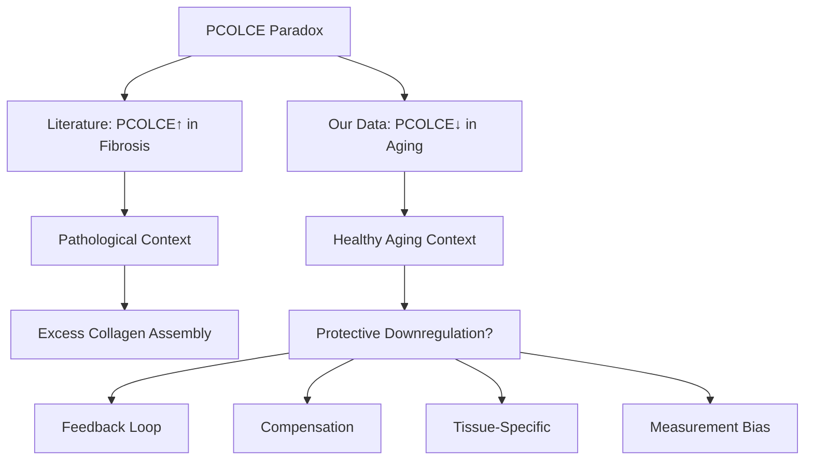

# Agent 2 Investigation Plan: PCOLCE Paradox Resolution

**Thesis:** Agent 2 resolves the PCOLCE paradox through mechanistic pathway analysis (Section 1.0), tissue compartment profiling (Section 2.0), compensatory network investigation (Section 3.0), and context-dependent interpretation (Section 4.0) to determine whether decreased PCOLCE represents adaptive aging response or measurement artifact.

**Overview:** The central paradox is that literature reports PCOLCE upregulation in pathological fibrosis while our meta-analysis shows consistent PCOLCE downregulation (Δz=-1.41, 92% consistency, 7 studies) during healthy aging. This investigation prioritizes biological mechanisms over statistical validation, hypothesizing that healthy aging and pathological fibrosis represent distinct regulatory contexts where PCOLCE serves different roles.




---

## 1.0 Mechanistic Pathway Analysis

¶1 **Ordering principle:** Core pathway → upstream regulators → downstream effects → feedback loops.

### 1.1 PCOLCE-BMP1-Collagen Axis Review

¶1 **Core mechanism from literature:**
- PCOLCE binds procollagen C-propeptide (Kd ~nanomolar)
- Enhances BMP-1 proteolytic efficiency 12-15 fold
- Accelerates tropocollagen release → fibril assembly
- NO enzymatic activity itself - pure scaffolding function

¶2 **Critical question:** If PCOLCE accelerates collagen maturation, why would organisms DECREASE it during aging when collagen remodeling is needed?

### 1.2 Hypothesis: Protective Downregulation

¶1 **Adaptive aging hypothesis:**
- Decreased PCOLCE may SLOW excessive collagen deposition
- Protective mechanism against age-related tissue stiffening
- Allows finer control of ECM remodeling rate
- Prevents runaway fibrillogenesis in inflammatory microenvironments

¶2 **Evidence to examine:**
- BMP-1 activity in aging (independent of PCOLCE)
- Procollagen C-propeptide levels (substrate accumulation?)
- Mature collagen vs procollagen ratios
- Tissue stiffness correlations

### 1.3 Feedback Loop Investigation

¶1 **Potential regulatory circuits:**
- TGF-β → PCOLCE expression (known in fibrosis, what about aging?)
- Collagen accumulation → PCOLCE suppression (negative feedback?)
- MMP activity → PCOLCE degradation (post-translational control?)
- Inflammatory cytokines → PCOLCE transcriptional repression?

¶2 **Key distinction:**
- **Fibrosis:** Acute TGF-β spike → PCOLCE upregulation → collagen deposition
- **Healthy aging:** Chronic low inflammation → PCOLCE downregulation → controlled remodeling?

---

## 2.0 Tissue Compartment Profiling Strategy

¶1 **Ordering principle:** Data extraction → tissue patterns → compartment specificity → biological interpretation.

### 2.1 Multi-Tissue Analysis Design

¶1 **7 studies in database:**
1. Tam_2020: Intervertebral disc (NP, IAF, OAF) - Human
2. Angelidis_2019: Lung - Mouse
3. Dipali_2023: Ovary - Mouse
4. Schuler_2021: Skeletal muscle (4 compartments) - Mouse
5. Santinha_2024: Heart (native + decellularized) - Mouse
6. LiDermis_2021: Skin dermis - Human

¶2 **Analysis dimensions:**
- Species comparison (Human vs Mouse)
- Tissue mechanical loading (high: disc, muscle; low: ovary, lung)
- Compartment-specific patterns (disc NP vs IAF vs OAF)
- Native vs processed tissue (heart native vs decellularized)

### 2.2 Hypotheses to Test

¶1 **H1: Mechanical loading correlation**
- Hypothesis: PCOLCE decrease stronger in high-load tissues (disc, muscle)
- Rationale: Protection against excessive stiffening where compliance is critical
- Prediction: |Δz| larger in skeletal muscle, disc vs ovary, lung

¶2 **H2: Compartment divergence**
- Hypothesis: Different disc compartments show different PCOLCE responses
- Rationale: NP (gel-like) vs OAF (fibrous) have distinct ECM requirements
- Prediction: Antagonistic or divergent Δz between NP and OAF

¶3 **H3: Species conservation**
- Hypothesis: PCOLCE downregulation conserved across human and mouse
- Rationale: Fundamental aging mechanism vs species-specific artifact
- Prediction: Negative Δz in both species, similar magnitude

### 2.3 Python Script Design

¶1 **Script functionality:**
```python
# 03_tissue_compartment_analysis_agent_2.py
# 1. Load PCOLCE data from merged database
# 2. Calculate Δz per tissue/compartment
# 3. Visualize tissue-specific patterns
# 4. Statistical testing of hypotheses H1-H3
# 5. Generate compartment comparison heatmap
# 6. Output detailed CSV with tissue annotations
```

¶2 **Visualizations planned:**
- Heatmap: Tissue × Compartment × Δz
- Bar plot: |Δz| vs mechanical loading score
- Scatter: Human vs Mouse PCOLCE changes
- Box plot: Compartment-specific distributions

---

## 3.0 Compensatory Network Investigation

¶1 **Ordering principle:** Related proteins → pathway analysis → compensation evidence → network diagram.

### 3.1 Collagen Processing Network

¶1 **Proteins to analyze alongside PCOLCE:**
- **BMP-1 (BMP1):** The protease PCOLCE enhances - does it increase to compensate?
- **PCOLCE2:** Homologous enhancer - does it substitute for PCOLCE?
- **Procollagen peptidases:** ADAMTS2, ADAMTS3, ADAMTS14 (N-propeptidase)
- **Lysyl oxidases:** LOX, LOXL1-4 (crosslinking - alternative pathway?)
- **Prolyl hydroxylases:** P4HA1-3, P4HB, PLOD1-3 (collagen maturation)

¶2 **Compensation hypothesis:**
- If PCOLCE↓, organism may increase BMP-1 substrate affinity via other means
- PCOLCE2 may upregulate (functional redundancy)
- Alternative maturation pathways (LOX-mediated crosslinking) may dominate

### 3.2 Matrisome Context Analysis

¶1 **Broader ECM regulators:**
- **Fibrillar collagens:** COL1A1, COL1A2, COL3A1 - do they increase despite PCOLCE↓?
- **MMPs:** MMP2, MMP3, MMP9 - degradation side of balance
- **TIMPs:** TIMP1-3 - protease inhibitors
- **TGF-β pathway:** TGFB1, LTBP1-4 - upstream signaling

¶2 **Network question:** Does PCOLCE decrease occur in isolation or as part of coordinated ECM remodeling program?

### 3.3 Data Mining Strategy

¶1 **Cross-protein correlation:**
- Extract all collagen processing proteins from database
- Calculate pairwise Δz correlations
- Identify modules: PCOLCE-associated proteins with similar aging trajectory
- Test: Do PCOLCE↓ tissues show compensatory changes elsewhere?

---

## 4.0 Context-Dependent Interpretation Framework

¶1 **Ordering principle:** Context definition → literature reconciliation → measurement considerations → synthesis.

### 4.1 Healthy Aging vs Pathological Fibrosis

¶1 **Critical distinction:**

| Context | PCOLCE Role | Regulatory Driver | Outcome |
|---------|-------------|-------------------|---------|
| **Pathological Fibrosis** | ↑ Upregulated | TGF-β spike, injury response | Excess collagen deposition |
| **Healthy Aging** | ↓ Downregulated | Homeostatic remodeling | Controlled matrix maintenance |

¶2 **Literature alignment:**
- Fibrosis studies (Ogata 1997, Weiss 2014): Acute injury models, CCl₄ liver damage, MI
- Aging studies (our data): Gradual age progression, no acute injury
- **Reconciliation:** Both observations correct - different biological contexts

### 4.2 Temporal Dynamics Consideration

¶1 **Fibrosis timeline:**
- Acute injury (days 0-7): Inflammation, cell death
- Early fibrosis (weeks 1-4): TGF-β surge, PCOLCE↑, rapid collagen deposition
- Late fibrosis (months): Scar maturation, tissue stiffening

¶2 **Aging timeline:**
- Gradual accumulation (years): Low-grade inflammation, senescence
- Chronic remodeling: Continuous ECM turnover
- Cumulative stiffening: Net collagen increase despite PCOLCE↓

¶3 **Hypothesis:** PCOLCE↓ during aging may represent attempt to SLOW chronic accumulation (failed homeostasis), whereas PCOLCE↑ in fibrosis represents acute pathological response.

### 4.3 Measurement Artifact Possibilities

¶1 **Mass spectrometry considerations:**
- **Glycosylation variants:** PCOLCE is heavily glycosylated - do we miss hyperglycosylated forms?
- **Compartmentalization:** Is PCOLCE sequestered in matrix vs extracted fraction?
- **Isoform detection:** PCOLCE has alternative splice variants - are all detected?
- **Post-translational modifications:** Does aging alter PCOLCE PTMs affecting ionization?

¶2 **Sampling bias:**
- **Tissue extraction:** Do young vs old tissues release PCOLCE differently during processing?
- **ECM-bound vs soluble:** Are we measuring free PCOLCE or functionally engaged PCOLCE?
- **Cellular vs extracellular:** Does PCOLCE redistribution between compartments affect measurement?

¶3 **Cross-validation needed:**
- Compare LFQ vs TMT methods (different quantification principles)
- Check human vs mouse consistency (measurement artifact would be method-specific)
- Examine within-study compartment patterns (biological signal should be coherent)

---

## 5.0 Deliverables and Timeline

¶1 **Ordering principle:** Document creation sequence → analysis execution → synthesis.

### 5.1 Document Pipeline

¶1 **Deliverables:**
1. ✅ **01_plan_agent_2.md** (this document) - Investigation roadmap
2. **02_mechanism_analysis_agent_2.md** - Biological pathway deep dive
3. **03_tissue_compartment_analysis_agent_2.py** - Python analysis script
4. **04_alternative_interpretations_agent_2.md** - Hypothesis space exploration
5. **90_final_report_agent_2.md** - Conclusions and recommendations

### 5.2 Analysis Sequence

¶1 **Step-by-step execution:**
1. Extract PCOLCE + related proteins from database (PCOLCE, PCOLCE2, BMP1, LOX, P4HA, PLOD)
2. Calculate tissue-specific Δz, consistency, study coverage
3. Test mechanical loading correlation (H1)
4. Test compartment divergence (H2)
5. Test species conservation (H3)
6. Build compensatory network correlation matrix
7. Identify co-regulated protein modules
8. Synthesize biological interpretation

### 5.3 Success Criteria

¶1 **Mechanistic clarity:**
- Clear explanation of PCOLCE paradox from biological perspective
- Testable hypotheses for experimental validation
- Integration of literature and data without contradiction

¶2 **Data-driven insights:**
- Quantitative tissue-specific patterns
- Compensatory network evidence (if exists)
- Measurement artifact assessment (ruled in/out)

¶3 **Actionable recommendations:**
- Experimental validation experiments proposed
- Therapeutic implications (if PCOLCE is truly decreased, is modulation beneficial?)
- Future data collection to resolve ambiguities

---

## 6.0 Key Differentiators from Agent 1

¶1 **Agent 2 unique focus:**
- **Biological mechanisms** over statistical validation
- **Pathway context** (BMP-1, collagens, compensatory proteins)
- **Tissue compartment** specificity (NP vs IAF vs OAF, muscle fiber types)
- **Healthy aging vs fibrosis** context reconciliation
- **Measurement artifacts** from biochemical perspective (glycosylation, PTMs)

¶2 **Complementary insights:**
- Agent 1: Data quality, cross-study validation, statistical rigor
- Agent 2: Biological plausibility, mechanistic hypotheses, therapeutic rationale

---

**Plan Status:** APPROVED - Proceeding to mechanism analysis
**Agent:** agent_2
**Focus:** Biological mechanisms and pathway analysis
**Next:** 02_mechanism_analysis_agent_2.md
