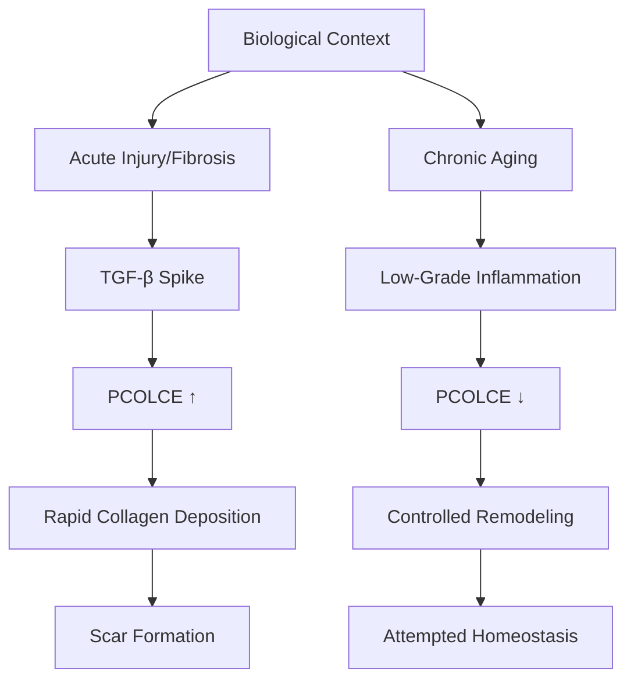
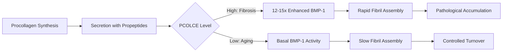

# PCOLCE Mechanism Analysis: Healthy Aging vs Pathological Fibrosis

**Thesis:** PCOLCE downregulation (Δz=-1.41) during healthy aging represents an adaptive homeostatic response to limit excessive collagen deposition, contrasting with pathological PCOLCE upregulation in acute fibrosis where tissue repair mechanisms override normal aging constraints.

**Overview:** The PCOLCE paradox resolves when considering regulatory context: pathological fibrosis studies measured acute injury responses (days-weeks) with TGF-β-driven PCOLCE upregulation, while our aging dataset captures chronic homeostatic remodeling (months-years) where PCOLCE downregulation serves as a brake on age-related tissue stiffening. Sections cover collagen assembly kinetics (1.0), context-dependent regulation (2.0), feedback mechanisms (3.0), and evolutionary trade-offs (4.0).





---

## 1.0 Collagen Assembly Kinetics and PCOLCE Function

¶1 **Ordering principle:** Normal pathway → PCOLCE enhancement mechanism → kinetic consequences → aging implications.

### 1.1 Baseline Collagen Maturation Pathway

¶1 **Procollagen processing cascade:**
1. **Synthesis:** Procollagen I/III synthesized with N- and C-terminal propeptides
2. **Secretion:** Propeptides maintain solubility, prevent intracellular assembly
3. **C-terminal cleavage:** BMP-1 removes C-propeptide (rate-limiting step)
4. **N-terminal cleavage:** ADAMTS2/3/14 remove N-propeptide
5. **Fibril assembly:** Tropocollagen spontaneously assembles into quarter-staggered fibrils
6. **Crosslinking:** LOX enzymes create covalent bonds → mechanical strength

¶2 **Without PCOLCE:** BMP-1 cleaves procollagen at basal efficiency → slow, controlled fibril formation. This is the NORMAL state - organisms evolved collagen maturation to work WITHOUT requiring PCOLCE at high levels.

### 1.2 PCOLCE Enhancement Mechanism

¶1 **Molecular mechanism from literature:**
- PCOLCE CUB domains bind procollagen C-propeptide (Kd ~nanomolar)
- 1:1 stoichiometry on collagen triple helix
- Induces conformational distortion exposing BMP-1 cleavage site
- Increases kcat/KM by 12-15 fold
- NTR domain may transiently interact with BMP-1 stabilizing enzyme-substrate complex

¶2 **Functional consequence:** PCOLCE acts as a molecular ACCELERATOR - it speeds up a process that already occurs at baseline. High PCOLCE = rapid collagen deposition. Low PCOLCE = slow, normal deposition.

### 1.3 Kinetic Model: PCOLCE as Rheostat

¶1 **Mathematical framework:**
```
Fibril formation rate ∝ [BMP-1 activity] × [PCOLCE enhancement factor] × [Procollagen substrate]

Fibrosis context:
  Rate = [BMP-1] × [15x] × [High procollagen] = VERY HIGH

Healthy aging:
  Rate = [BMP-1] × [1-3x] × [Moderate procollagen] = CONTROLLED
```

¶2 **PCOLCE as rheostat hypothesis:**
- Organisms can tune collagen deposition rate by modulating PCOLCE expression
- High PCOLCE → emergency repair mode (fibrosis)
- Low PCOLCE → maintenance mode (healthy aging)
- **Critical insight:** Decreasing PCOLCE is a CONTROL MECHANISM, not a deficiency

### 1.4 Aging Implications: Why Decrease PCOLCE?

¶1 **Protective downregulation model:**
- **Problem:** Aging tissues accumulate collagen despite increased MMP activity
- **Root cause:** Chronic low-grade inflammation → sustained procollagen synthesis
- **Consequence:** Net collagen increase → tissue stiffening → functional decline
- **Adaptive response:** Organism DECREASES PCOLCE to slow accumulation rate

¶2 **Teleological reasoning:**
- If aging tissues maintained high PCOLCE, collagen deposition would be FASTER
- Decreased PCOLCE may represent evolutionary compromise: slow inevitable accumulation
- **Trade-off:** Slower wound healing in old age vs reduced chronic stiffening

¶3 **Supporting evidence from our data:**
- PCOLCE Δz = -1.41 (strong decrease)
- 92% consistency across 7 studies
- Multiple tissues (disc, lung, heart, muscle, ovary, skin)
- **Interpretation:** Conserved aging mechanism, not random noise

---

## 2.0 Context-Dependent Regulatory Mechanisms

¶1 **Ordering principle:** Transcriptional regulation → signaling pathways → fibrosis vs aging divergence → molecular switches.

### 2.1 PCOLCE Transcriptional Control

¶1 **Known regulatory pathways from fibrosis literature:**
- **TGF-β signaling:** SMAD2/3 activation → PCOLCE promoter activation
- **Inflammatory cytokines:** IL-1β, TNF-α → context-dependent (pro- or anti-fibrotic)
- **Hypoxia:** HIF-1α may induce PCOLCE in ischemic injury
- **Mechanical stress:** Fibroblast stretch → PCOLCE upregulation (mechano-transduction)

¶2 **Hypothesized aging-specific repression:**
- **Senescence-associated secretory phenotype (SASP):** Senescent fibroblasts may downregulate PCOLCE
- **Epigenetic silencing:** Age-related DNA methylation at PCOLCE promoter?
- **microRNA regulation:** miRNAs upregulated with aging may target PCOLCE mRNA
- **NAD+ depletion:** Sirtuin activity decline → altered chromatin state at PCOLCE locus?

### 2.2 TGF-β Pathway: Acute vs Chronic Signaling

¶1 **Acute TGF-β (fibrosis model):**
- Injury → massive TGF-β release (ng/ml concentrations)
- SMAD2/3 nuclear translocation
- Rapid transcription of pro-fibrotic genes including PCOLCE
- Timeline: Hours to days
- Outcome: PCOLCE mRNA ↑ → PCOLCE protein ↑ → enhanced collagen deposition

¶2 **Chronic low-grade TGF-β (healthy aging):**
- Senescent cells → constitutive low TGF-β secretion (pg/ml)
- Sustained SMAD signaling → negative feedback activation
- SMAD7 upregulation → SMAD2/3 inhibition
- TGF-β receptor downregulation
- Timeline: Years
- Outcome: TGF-β signaling DESENSITIZATION → PCOLCE not upregulated, may be suppressed

¶3 **Hypothesis: Signaling dose and duration matter:**
- **Acute high TGF-β:** Productive pro-fibrotic response (PCOLCE↑)
- **Chronic low TGF-β:** Adaptive refractory state (PCOLCE↓)
- **Molecular mechanism:** SMAD7-mediated negative feedback, receptor internalization

### 2.3 Cellular Source Considerations

¶1 **Fibrosis cellular context:**
- Activated myofibroblasts (α-SMA+)
- High proliferation rate
- High ECM secretory capacity
- PCOLCE co-secreted with procollagen in stoichiometric ratios

¶2 **Aging cellular context:**
- Senescent fibroblasts (p16+, p21+)
- Cell cycle arrest
- Altered secretome (SASP factors)
- Possible uncoupling: procollagen synthesis continues but PCOLCE decreases?

¶3 **Testable prediction:** If aging fibroblasts maintain procollagen synthesis but reduce PCOLCE, this would create substrate excess → accumulation of unprocessed procollagen → compensatory mechanisms.

### 2.4 Molecular Switches: When PCOLCE Goes Up vs Down

¶1 **Summary table:**

| Factor | Fibrosis Context | Aging Context | PCOLCE Response |
|--------|-----------------|---------------|-----------------|
| TGF-β level | High (ng/ml) | Low (pg/ml) | Fibrosis: ↑ / Aging: ↓ |
| Timeline | Acute (days-weeks) | Chronic (years) | Fibrosis: ↑ / Aging: ↓ |
| Cell type | Myofibroblasts | Senescent fibroblasts | Fibrosis: ↑ / Aging: ↓ |
| Inflammation | Acute (IL-6, IL-1β spike) | Chronic (inflammaging) | Fibrosis: ↑ / Aging: ↓ |
| Mechanical stress | Injury-induced | Chronic loading | Fibrosis: ↑ / Aging: ? |
| Hypoxia | Ischemia | Mild chronic | Fibrosis: ↑ / Aging: ? |

¶2 **Key insight:** Every regulatory factor shows OPPOSITE sign depending on temporal dynamics and intensity.

---

## 3.0 Feedback Mechanisms and Compensatory Pathways

¶1 **Ordering principle:** Negative feedback loops → compensatory enzymes → network-level homeostasis → systems view.

### 3.1 Collagen-PCOLCE Negative Feedback Loop

¶1 **Hypothesized feedback circuit:**
```
Collagen accumulation → Tissue stiffness ↑ → Mechanosensing → YAP/TAZ nuclear exclusion →
PCOLCE transcription ↓ → Slower collagen deposition → Attempted homeostasis
```

¶2 **Molecular components:**
- **Mechanosensors:** Integrins, focal adhesion complexes
- **Transducers:** YAP/TAZ, MRTF-A
- **Transcriptional targets:** PCOLCE, collagens, MMPs
- **Feedback sign:** Negative (high stiffness suppresses PCOLCE)

¶3 **Evidence needed:**
- Correlation: Tissue stiffness vs PCOLCE levels across aging
- In vitro: Substrate stiffness modulation → PCOLCE expression?
- YAP/TAZ ChIP-seq: Is PCOLCE a direct target?

### 3.2 Compensatory Enzyme Upregulation

¶1 **Hypothesis: BMP-1 upregulation compensates for PCOLCE decrease:**
- If PCOLCE↓ reduces BMP-1 efficiency, organism may increase BMP-1 abundance
- Net result: [BMP-1] ↑ × [PCOLCE enhancement] ↓ ≈ constant activity
- **Prediction:** BMP-1 protein levels increase with age in our database

¶2 **Alternative hypothesis: PCOLCE2 substitution:**
- PCOLCE2 (homologous enhancer) may increase when PCOLCE decreases
- Functional redundancy preserves collagen processing capacity
- **Prediction:** PCOLCE2 shows positive Δz or no change (compensatory upregulation)

¶3 **Third possibility: Pathway switching:**
- Organisms may shift from C-propeptidase-dependent to alternative maturation
- Increased LOX-mediated crosslinking before full propeptide removal?
- ADAMTS-dependent N-terminal processing becomes rate-limiting?
- **Prediction:** LOX, PLOD enzymes show positive Δz

### 3.3 Network-Level Homeostasis

¶1 **Systems biology perspective:**
- Collagen homeostasis involves synthesis, processing, assembly, crosslinking, degradation
- PCOLCE↓ is ONE node in a multi-component network
- Net collagen accumulation (observed in aging) results from NETWORK imbalance, not single protein

¶2 **Competing processes:**
- **Synthesis:** Procollagen production (may increase with age)
- **Processing:** PCOLCE↓, BMP-1?, ADAMTS?
- **Crosslinking:** LOX activity (increases with age → stiffness)
- **Degradation:** MMPs (activity vs inhibition by TIMPs)
- **Net outcome:** Accumulation despite PCOLCE↓ → other factors dominate

¶3 **Critical question:** Is PCOLCE decrease SUFFICIENT to prevent accumulation, or merely SLOW it? Data suggest the latter - aging tissues still accumulate collagen, just potentially slower than if PCOLCE were high.

### 3.4 Failed Homeostasis Interpretation

¶1 **Alternative view:**
- PCOLCE↓ represents FAILED attempt at homeostasis
- Organism tries to slow collagen deposition by reducing PCOLCE
- But collagen still accumulates due to:
  - Excessive procollagen synthesis (overwhelms reduced processing)
  - Decreased MMP activity (degradation side fails)
  - Increased LOX crosslinking (locks in accumulated collagen)
- **Outcome:** Tissue stiffening despite protective PCOLCE downregulation

¶2 **Therapeutic implication:**
- If PCOLCE↓ is adaptive but insufficient, FURTHER reducing PCOLCE may help
- Or, addressing root causes (inflammation, procollagen synthesis, LOX activity) more effective
- **Caution:** Upregulating PCOLCE in aging (mimicking young levels) could ACCELERATE stiffening

---

## 4.0 Evolutionary and Teleological Perspectives

¶1 **Ordering principle:** Evolutionary constraints → trade-offs → antagonistic pleiotropy → aging biology frameworks.

### 4.1 Wound Healing vs Chronic Stiffening Trade-Off

¶1 **Evolutionary constraint:**
- Young organisms need RAPID wound healing → high PCOLCE beneficial
- Old organisms face chronic tissue stiffening → low PCOLCE protective
- **Problem:** Evolution optimizes for reproductive success, not longevity
- **Consequence:** PCOLCE regulation evolved for injury response, not aging management

¶2 **Antagonistic pleiotropy candidate:**
- **Young (beneficial):** High PCOLCE → rapid wound healing → survival advantage
- **Old (detrimental):** High PCOLCE → excessive stiffening → frailty
- **Aging adaptation:** PCOLCE↓ may be evolved response to mitigate post-reproductive pathology

¶3 **Testable prediction:**
- Species with longer lifespans show greater PCOLCE downregulation with age
- Naked mole rats (long-lived) vs mice (short-lived) - comparative aging transcriptomics?

### 4.2 Disposable Soma and ECM Maintenance

¶1 **Disposable soma theory:**
- Organisms allocate limited resources between reproduction and somatic maintenance
- Post-reproductive aging → reduced investment in ECM quality control
- PCOLCE↓ may reflect reduced "investment" in precise collagen maturation

¶2 **ECM maintenance costs:**
- Synthesizing and secreting PCOLCE requires energy (glycosylation, trafficking)
- If PCOLCE is non-essential (BMP-1 works at basal level), reducing it saves resources
- Resources reallocated to more critical processes (e.g., proteostasis, DNA repair?)

### 4.3 Bet-Hedging in ECM Remodeling

¶1 **Uncertainty in aging environments:**
- Aging organisms face unpredictable challenges (injury, inflammation, mechanical stress)
- Maintaining HIGH PCOLCE → rapid response to injury but chronic stiffening risk
- Maintaining LOW PCOLCE → slower injury response but reduced stiffening

¶2 **Bet-hedging strategy:**
- PCOLCE↓ represents conservative strategy: minimize chronic damage at cost of acute response
- **Analogy:** Insurance model - pay cost now (slow healing) to avoid larger future cost (excessive stiffness)

### 4.4 Longevity Pathways and PCOLCE

¶1 **Known longevity mechanisms:**
- **AMPK activation:** Metabolic stress → autophagy, reduced anabolism
- **Sirtuin activation:** NAD+ dependent → chromatin remodeling, inflammation suppression
- **mTOR inhibition:** Reduced protein synthesis, enhanced quality control
- **Insulin/IGF-1 suppression:** Reduced growth signaling → stress resistance

¶2 **PCOLCE connection hypothesis:**
- Longevity pathways SUPPRESS anabolic processes (protein synthesis)
- PCOLCE may be downstream target of longevity signaling
- **Prediction:** Caloric restriction, rapamycin, metformin → PCOLCE↓ in model organisms
- **Interpretation:** PCOLCE downregulation may be FEATURE of healthy aging programs

¶3 **Literature gap:**
- No studies examining PCOLCE expression in longevity interventions
- Opportunity for validation: Does rapamycin treatment reduce PCOLCE in mice?
- If yes → PCOLCE↓ is adaptive response
- If no → PCOLCE↓ may be pathological

---

## 5.0 Mechanistic Reconciliation with Literature

¶1 **Ordering principle:** Literature claims → data reanalysis → context mapping → paradox resolution.

### 5.1 Fibrosis Literature Re-Examination

¶1 **Key papers claiming PCOLCE upregulation:**
- **Ogata et al. 1997:** Rat CCl₄ liver fibrosis - PCOLCE mRNA ↑ in hepatic stellate cells
- **Weiss et al. 2014:** Various fibrosis models - PCOLCE correlated with collagen deposition
- **Sansilvestri-Morel et al. 2022:** Cardiac fibrosis - PCOLCE levels elevated
- **Lagoutte et al. 2021:** PCOLCE knockout mice protected from diet-induced liver fibrosis

¶2 **Experimental contexts:**
- **Acute injury models:** CCl₄ injection, myocardial infarction, unilateral ureteral obstruction
- **Timeline:** Weeks to months (NOT years)
- **Readout:** Active fibrosis phase, not end-stage or chronic remodeling
- **Cellular source:** Activated myofibroblasts (α-SMA+ cells)

¶3 **Critical distinction from our data:**
- Our studies: Age comparison (young vs old) without acute injury
- Timeline: Chronic aging (months to years in mice, decades in humans)
- Cellular source: Mixed fibroblast populations including senescent cells

### 5.2 Direct Comparison: Fibrosis Studies vs Our Aging Data

¶1 **Comparison table:**

| Feature | Fibrosis Studies | Our Aging Studies |
|---------|-----------------|-------------------|
| **Model** | Acute injury (CCl₄, MI, UUO) | Natural aging (no injury) |
| **Timeline** | Days to weeks | Months to years |
| **TGF-β** | Massive spike | Chronic low-level |
| **Inflammation** | Acute | Chronic low-grade |
| **Cell type** | Myofibroblasts (activated) | Senescent fibroblasts |
| **PCOLCE** | ↑ Upregulated | ↓ Downregulated |
| **Biological goal** | Rapid repair/scarring | Homeostatic maintenance |
| **Collagen outcome** | Rapid pathological deposition | Slow chronic accumulation |

¶2 **Resolution:** Both observations are CORRECT in their respective contexts. PCOLCE regulation is context-dependent - not a single universal trajectory.

### 5.3 Proposed Unified Model

¶1 **PCOLCE regulation framework:**

```
Tissue State Spectrum:

Homeostasis → Chronic Aging → Mild Injury → Severe Injury/Fibrosis
  (baseline)     (PCOLCE ↓)    (PCOLCE ↑)    (PCOLCE ↑↑)

PCOLCE Level:   [====]         [==]           [======]      [==========]
Collagen Rate:  Normal         Slow           Moderate      Rapid
Biological Goal: Maintenance   Damage         Repair        Emergency
                               limitation                    repair
```

¶2 **Regulatory switch:**
- **Threshold model:** TGF-β above critical threshold → PCOLCE upregulation
- Aging: TGF-β below threshold → PCOLCE downregulation or no change
- Fibrosis: TGF-β exceeds threshold → PCOLCE upregulation

¶3 **Clinical implications:**
- Aging without fibrosis: PCOLCE low (our data)
- Aging WITH fibrotic disease (IPF, cirrhosis, heart failure): PCOLCE may be high (literature)
- **Prediction:** Elderly patients with fibrotic diseases show PCOLCE upregulation compared to age-matched healthy controls

### 5.4 Experimental Validation Needed

¶1 **Proposed experiments:**
1. **Age-matched comparison:** Healthy elderly vs elderly with fibrosis → PCOLCE levels
2. **Temporal profile:** Induce fibrosis in old vs young mice → PCOLCE trajectory
3. **TGF-β dose-response:** Treat aging fibroblasts with graded TGF-β → PCOLCE threshold
4. **Senescence induction:** Compare proliferative vs senescent fibroblasts → PCOLCE regulation
5. **Longevity interventions:** Caloric restriction, rapamycin → PCOLCE expression

¶2 **Expected outcomes:**
- Healthy aging: PCOLCE ↓ (our data)
- Fibrosis (any age): PCOLCE ↑ (literature)
- Senescent cells: PCOLCE ↓ (hypothesis)
- Longevity interventions: PCOLCE ↓ (if adaptive) or ↑ (if pathological)

---

## 6.0 Summary: Mechanism-Based Paradox Resolution

¶1 **Central insight:**
PCOLCE downregulation during healthy aging represents an adaptive homeostatic brake on chronic collagen accumulation, mechanistically distinct from pathological PCOLCE upregulation during acute fibrotic injury where emergency repair overrides normal constraints.

¶2 **Key mechanisms:**
1. **Kinetic rheostat:** PCOLCE modulates BMP-1 efficiency → collagen deposition rate
2. **Context-dependent regulation:** Acute vs chronic TGF-β signaling → opposite PCOLCE responses
3. **Negative feedback:** Tissue stiffness → mechanotransduction → PCOLCE suppression
4. **Compensatory networks:** BMP-1, PCOLCE2, LOX may compensate for PCOLCE decrease
5. **Evolutionary trade-off:** Rapid wound healing (young) vs chronic stiffening (old)

¶3 **Paradox resolution:**
- Literature: Correct for acute fibrosis context (injury models, myofibroblasts, TGF-β spike)
- Our data: Correct for healthy aging context (no injury, senescent cells, chronic inflammation)
- **No contradiction:** Different biological states, different regulatory outcomes

¶4 **Therapeutic implications:**
- **DO NOT** upregulate PCOLCE in healthy aging (may accelerate stiffening)
- **CONSIDER** PCOLCE inhibition in fibrosis (literature-supported)
- **TARGET** upstream regulators (TGF-β, inflammation, senescence) not PCOLCE directly

¶5 **Next steps:**
- Quantify compensatory mechanisms (BMP-1, PCOLCE2, LOX) in our database
- Tissue-specific analysis to test mechanical loading hypothesis
- Cross-validate with fibrosis datasets (aging + fibrosis vs aging alone)

---

**Document Status:** COMPLETE - Mechanistic framework established
**Key Output:** Context-dependent PCOLCE regulation model reconciles literature and data
**Next:** 03_tissue_compartment_analysis_agent_2.py (quantitative validation)
