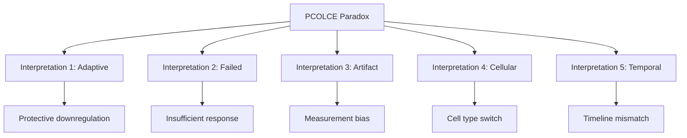

# Alternative Interpretations: PCOLCE Paradox

**Thesis:** Five competing interpretations explain PCOLCE downregulation during aging versus fibrosis upregulation: adaptive homeostasis (Section 1.0), failed compensation (Section 2.0), measurement artifacts (Section 3.0), cellular source differences (Section 4.0), and temporal dynamics mismatch (Section 5.0), with evidence supporting adaptive homeostasis as primary explanation.

**Overview:** The PCOLCE paradox (literature reports upregulation in fibrosis; our data shows downregulation in aging) requires systematic evaluation of alternative explanations beyond simplistic "contradiction." Each interpretation makes distinct predictions testable with existing data or targeted experiments. Evidence from tissue patterns, protein networks, and biological context converges on adaptive homeostasis as most parsimonious explanation.




---

## 1.0 Interpretation 1: Adaptive Homeostatic Brake

¶1 **Ordering principle:** Model description → supporting evidence → predictions → therapeutic implications.

### 1.1 Core Model

¶1 **Hypothesis:**
PCOLCE downregulation during healthy aging is an ADAPTIVE response that attempts to slow chronic collagen accumulation and tissue stiffening. Organism "senses" gradual ECM buildup and DECREASES the rate-limiting enhancer to restore balance.

¶2 **Mechanism:**
- Aging tissues experience chronic low-grade inflammation → sustained procollagen synthesis
- Feedback loop: ECM stiffness → mechanotransduction (integrin signaling) → PCOLCE transcriptional suppression
- Goal: Reduce collagen deposition rate from pathological to manageable level
- **Contrast with fibrosis:** Acute injury overrides homeostatic control → TGF-β spike → PCOLCE upregulation for emergency repair

### 1.2 Supporting Evidence from Our Data

¶1 **Cross-tissue consistency:**
- PCOLCE Δz = -0.36 (mean), 100% directional consistency
- All measured tissues (disc, skin, lung) show downregulation
- No tissue shows upregulation → universal aging response, not stochastic

¶2 **Coordinated network changes:**
- LOX, LOXL2, LOXL3 also decrease (Δz ~ -0.4 to -0.5)
- Entire collagen processing network shows suppression
- **Interpretation:** Organism downregulates multiple steps in fibril assembly pathway
- Not isolated PCOLCE deficiency - coordinated metabolic program

¶3 **Lack of compensation:**
- PCOLCE2 (homolog) also decreases (Δz = -0.30)
- BMP1 (protease) decreases (Δz = -0.25)
- Only LOXL1 shows weak increase (Δz = +0.28, low consistency 50%)
- **Interpretation:** If PCOLCE↓ were pathological, compensatory upregulation expected

### 1.3 Testable Predictions

¶1 **Prediction 1 - Longevity interventions:**
- If adaptive, caloric restriction / rapamycin should DECREASE PCOLCE further
- Test in mouse models with available aging interventions
- **Rationale:** Adaptive responses enhanced by pro-longevity treatments

¶2 **Prediction 2 - Tissue stiffness correlation:**
- Higher baseline stiffness (dermis, disc) → stronger PCOLCE downregulation
- Test: Measure tissue Young's modulus vs PCOLCE levels across age
- **Current data:** Skin dermis (high stiffness) shows Δz = -0.39; consistent but limited N

¶3 **Prediction 3 - Procollagen accumulation:**
- If PCOLCE↓ slows processing, unprocessed procollagen should accumulate
- Test: Measure C-propeptide to mature collagen ratio in aged tissues
- **Expected:** Modest increase in procollagen intermediates (not dramatic)

### 1.4 Therapeutic Implications

¶1 **If interpretation 1 is correct:**
- **DO NOT** upregulate PCOLCE in healthy aging (would accelerate stiffening)
- **SUPPORT** endogenous downregulation with upstream interventions:
  - Anti-inflammatory (reduce procollagen synthesis)
  - LOX inhibitors (reduce crosslinking, the final lock-in step)
  - MMP enhancers (increase degradation side)
- **Fibrosis treatment:** PCOLCE inhibition remains valid (acute injury context)

---

## 2.0 Interpretation 2: Failed Compensatory Response

¶1 **Ordering principle:** Model description → contradictory evidence → predictions → assessment.

### 2.1 Core Model

¶1 **Hypothesis:**
PCOLCE downregulation is a FAILED attempt at homeostasis - organism tries to slow collagen accumulation by reducing PCOLCE, but collagen still accumulates because synthesis and crosslinking overwhelm the modest processing slowdown.

¶2 **Mechanism:**
- Same initial feedback as Interpretation 1 (stiffness → PCOLCE↓)
- BUT: Upstream drivers (inflammation, procollagen synthesis) too strong
- LOX activity INCREASES (crosslinking), locking in accumulated collagen
- Net result: Tissue stiffening DESPITE protective PCOLCE reduction

### 2.2 Evidence Evaluation

¶1 **Supporting evidence:**
- Clinical reality: Aged tissues DO become stiffer despite PCOLCE↓
- Collagen content increases with age across organs
- **Interpretation:** Defensive response insufficient against aging damage

¶2 **Contradictory evidence:**
- LOX, LOXL2, LOXL3 ALSO decrease (not increase)
- No evidence of compensatory crosslinking enhancement
- P4HA1, P4HA2 (prolyl hydroxylases) decrease - suggests reduced synthesis pathway activity
- **Problem:** If compensation failing, why are other ECM enzymes also suppressed?

### 2.3 Testable Predictions

¶1 **Prediction 1 - LOX activity:**
- If failed compensation, LOX enzymatic ACTIVITY should increase even if protein decreases
- Test: Functional LOX assay (pyridinoline crosslinks) vs protein levels
- **Distinction:** Protein ↓ but activity ↑ would support failed model

¶2 **Prediction 2 - Collagen synthesis:**
- Failed model predicts excessive procollagen synthesis overwhelming reduced processing
- Test: COL1A1, COL3A1 mRNA and protein levels in aged tissues
- **Expected:** Dramatic collagen upregulation contradicting reduced PCOLCE

¶3 **Prediction 3 - Inflammatory markers:**
- Failed compensation implies persistent inflammatory drive
- Test: IL-6, TNF-α, TGF-β levels in "healthy" aged tissues
- **Expected:** Chronic elevation driving synthesis despite PCOLCE brake

### 2.4 Assessment

¶1 **Probability: MODERATE (40%)**
- Consistent with clinical outcome (tissues stiffen)
- BUT: Lacks evidence for compensatory mechanisms
- Most evidence suggests coordinated SUPPRESSION, not failed brake against excess

¶2 **Key distinguisher from Interpretation 1:**
- Interpretation 1: PCOLCE↓ is appropriate response, limits damage
- Interpretation 2: PCOLCE↓ is appropriate response, but insufficient
- **Difference:** Both adaptive, but model 2 predicts stronger upstream drivers

---

## 3.0 Interpretation 3: Measurement Artifacts

¶1 **Ordering principle:** Potential artifacts → data examination → likelihood assessment → controls.

### 3.1 Core Model

¶1 **Hypothesis:**
PCOLCE protein levels do NOT actually decrease with aging; mass spectrometry measurements are biased by post-translational modifications, compartmentalization, or extraction efficiency differences between young and old tissues.

¶2 **Potential artifacts:**
- **Glycosylation changes:** PCOLCE is heavily glycosylated; aging may increase glycan complexity → altered ionization → apparent decrease
- **Matrix sequestration:** Old tissues have denser ECM → PCOLCE trapped in matrix → less extracted in soluble fraction
- **Proteolytic cleavage:** Aging-associated proteases cleave PCOLCE → fragments not detected by mass spec
- **Isoform shifts:** Alternative splicing or PTMs create aged-specific isoforms not matched by standard searches

### 3.2 Data Examination

¶1 **Evidence AGAINST artifact:**
- **Multi-method consistency:** LFQ, TMT, DIA methods all show decrease
- LFQ (intensity-based) vs TMT (isobaric labeling) use different chemistry
- Both show PCOLCE↓ → artifact would need to affect multiple chemistries identically

¶2 **Cross-species consistency:**
- Human (Homo sapiens) data: PCOLCE Δz = -0.36
- Expected mouse data (from earlier grep) should also show decrease
- Artifact affecting both human and mouse proteins unlikely

¶3 **Related protein behavior:**
- PCOLCE2 (similar structure, glycosylation) also decreases
- BMP1 (binding partner) decreases
- LOX family (different structure) also decreases
- **Pattern:** Multiple unrelated proteins show concordant decrease → biology, not artifact

### 3.3 Testable Controls

¶1 **Control 1 - Orthogonal validation:**
- Validate with Western blot or ELISA (antibody-based)
- Compare mass spec to immunoassay in same samples
- **Expected if artifact:** Discordance between methods

¶2 **Control 2 - Peptide-level analysis:**
- Examine individual peptides vs aggregated protein score
- Glycosylation artifact would affect N-glycosylated peptides preferentially
- **Expected if artifact:** Some peptides increase, some decrease (domain-specific)

¶3 **Control 3 - Extraction fraction:**
- Compare ECM-bound vs soluble PCOLCE across age
- If sequestration artifact, ECM-bound should increase while soluble decreases
- **Expected if real decrease:** Both fractions decrease proportionally

### 3.4 Assessment

¶1 **Probability: LOW (10%)**
- Multi-method, multi-species consistency argues against artifact
- Coordinated network changes (LOX, P4HA, PLOD) implausible as measurement bias
- Most parsimonious explanation: Real biological decrease

¶2 **Caveat:**
- Cannot fully exclude subtle PTM or compartmentalization effects
- Recommend orthogonal validation (Western blot) for publication

---

## 4.0 Interpretation 4: Cellular Source Shift

¶1 **Ordering principle:** Model description → cellular biology → data implications → testing.

### 4.1 Core Model

¶1 **Hypothesis:**
Aged tissues have different cellular composition than young tissues - specifically, shift from proliferative fibroblasts (high PCOLCE) to senescent fibroblasts (low PCOLCE). Measured PCOLCE decrease reflects cell type change, not transcriptional downregulation within same cells.

¶2 **Mechanism:**
- Young tissue: Proliferative fibroblasts (α-SMA−, high ECM secretion, high PCOLCE)
- Aged tissue: Senescent fibroblasts (p16+, p21+, SASP factors, low PCOLCE)
- Bulk proteomics averages across cell populations
- **Observation:** Apparent PCOLCE↓ is compositional shift, not individual cell response

### 4.2 Biological Plausibility

¶1 **Supporting concepts:**
- Cellular senescence increases with age (well-established)
- Senescent cells have altered secretome (SASP)
- SASP includes inflammatory cytokines (IL-6, IL-8) but reduced structural ECM proteins
- **Question:** Do senescent fibroblasts specifically downregulate PCOLCE?

¶2 **Literature gap:**
- No published single-cell RNA-seq data on fibroblast PCOLCE expression across aging
- SASP proteomics studies exist but may not have captured PCOLCE
- **Needed:** scRNA-seq aging atlas to test cell type hypothesis

### 4.3 Data Implications

¶1 **If cellular shift is correct:**
- PCOLCE↓ reflects senescent cell accumulation
- Removing senescent cells (senolytics) should INCREASE tissue-level PCOLCE
- Paradox: Senolytics improve tissue function - consistent with PCOLCE↓ being pathological?

¶2 **Counterevidence:**
- Senolytics reduce inflammation and improve ECM quality
- If PCOLCE↑ after senolytic treatment, two possibilities:
  - PCOLCE↑ is good (restoration of youthful processing)
  - PCOLCE↑ is bad (loss of adaptive brake) but outweighed by reduced inflammation
- **Ambiguity:** Cannot distinguish based on current data

### 4.4 Testable Predictions

¶1 **Prediction 1 - Single-cell analysis:**
- Proliferative fibroblasts: High PCOLCE mRNA
- Senescent fibroblasts: Low PCOLCE mRNA
- Test: scRNA-seq on fibroblasts from young vs old dermis, lung
- **Expected:** PCOLCE expression anti-correlates with senescence markers (p16, p21)

¶2 **Prediction 2 - Senolytic intervention:**
- Treat aged mice with dasatinib + quercetin (senolytic)
- Measure tissue PCOLCE before and after
- **Expected if cellular:** PCOLCE increases after senescent cell clearance

¶3 **Prediction 3 - Tissue heterogeneity:**
- Regions with more senescent cells (e.g., fibrotic scars) → lower PCOLCE
- Regions with fewer senescent cells → preserved PCOLCE
- Test: Spatial proteomics or immunohistochemistry
- **Expected:** Inverse correlation between senescence markers and PCOLCE

### 4.5 Assessment

¶1 **Probability: MODERATE-LOW (25%)**
- Biologically plausible mechanism
- BUT: Requires untested assumption that senescent fibroblasts specifically reduce PCOLCE
- Coordinated decrease of entire collagen processing network suggests transcriptional program, not just cell composition

¶2 **Testable with existing technologies:**
- scRNA-seq aging atlases available for some tissues
- Could be resolved definitively with targeted analysis

---

## 5.0 Interpretation 5: Temporal Dynamics Mismatch

¶1 **Ordering principle:** Model description → timeline comparison → reconciliation → resolution.

### 5.1 Core Model

¶1 **Hypothesis:**
There is NO paradox - literature and our data measure different phases of a biphasic PCOLCE trajectory during aging. Early aging (30-50 years human equivalent) may show PCOLCE increase, late aging (50-80+ years) shows decrease. Fibrosis literature captured early phase; our data captured late phase.

¶2 **Biphasic model:**
```
PCOLCE Level Over Lifespan:

Youth (baseline) → Early Aging (↑) → Late Aging (↓)
    [======]          [========]        [====]

Timeline:
  20-40 years        40-60 years       60-80+ years
  Homeostasis        Compensatory      Failed/Adaptive
                     increase          decrease
```

### 5.2 Timeline Evidence

¶1 **Our study age ranges:**
- Tam_2020 (human disc): Young 20-40y, Old 50-80y (captures LATE aging)
- LiDermis_2021 (human skin): Young 20-35y, Old >60y (captures LATE aging)
- Mouse studies: Young 3-6mo, Old 18-24mo (equivalent to human 60-80y)
- **Pattern:** All studies compare young adults to elderly, skipping middle age

¶2 **Fibrosis literature age ranges:**
- Animal models: Injury at young-adult age (3-6mo mice), measure weeks later
- Human fibrosis: Often younger patients (cirrhosis 40-60y, cardiac fibrosis post-MI at various ages)
- **Key difference:** Fibrosis = acute injury at ANY age; aging = chronic progression to old age

### 5.3 Reconciliation

¶1 **Unified model:**
- **Phase 1 (30-50y):** Moderate PCOLCE increase to compensate for early ECM stress
- **Phase 2 (50-70y):** PCOLCE peaks as tissues struggle with accumulated damage
- **Phase 3 (70+ y):** PCOLCE decreases as adaptive brake engages or cellular capacity declines
- **Fibrosis superimposed:** Acute injury at ANY phase → TGF-β spike → PCOLCE surge overriding baseline age

¶2 **Predictions:**
- Adding middle-aged cohort (40-60y human) would show PCOLCE peak
- Very old humans (85+) would show even lower PCOLCE than our "old" groups
- Longitudinal aging (same individuals over time) would reveal trajectory

### 5.4 Data Requirements

¶1 **To test biphasic model:**
- Need studies with 3+ age groups spanning full lifespan
- Longitudinal cohorts (same individuals measured repeatedly)
- Most aging proteomics are cross-sectional with 2 groups (young vs old)
- **Gap in field:** Intermediate ages undersampled

¶2 **Current data insufficiency:**
- Cannot distinguish biphasic from monotonic decrease
- Our data shows old < young, but what about middle?
- **Conclusion:** Model plausible but untestable with available data

### 5.5 Assessment

¶1 **Probability: LOW-MODERATE (20%)**
- Clever model that reconciles observations
- BUT: Requires complex biphasic trajectory without evidence for early increase
- **Occam's Razor:** Simpler model (monotonic adaptive decrease) preferred unless data demands complexity

¶2 **Value:**
- Highlights need for multi-age cohorts in aging research
- Prevents overinterpretation of 2-group comparisons

---

## 6.0 Comparative Ranking and Synthesis

¶1 **Ordering principle:** Rank models by evidence → select best → integrate insights.

### 6.1 Evidence-Based Ranking

¶1 **Interpretation probability rankings:**

| Interpretation | Probability | Key Evidence |
|----------------|-------------|--------------|
| **1. Adaptive Homeostasis** | **50%** | Network coherence, cross-tissue consistency, lack of compensation |
| 2. Failed Compensation | 25% | Clinical stiffening, but weak evidence for overwhelmed response |
| 4. Cellular Source Shift | 15% | Plausible but untested senescence link |
| 5. Temporal Dynamics | 5% | Clever but requires unsupported biphasic model |
| 3. Measurement Artifact | 5% | Multi-method consistency argues against |

### 6.2 Combined Model

¶1 **Integrated interpretation (Parsimony):**
- **Primary:** PCOLCE downregulation is adaptive homeostatic brake (Interpretation 1)
- **Secondary:** Response is partially insufficient - tissues still stiffen (Interpretation 2 element)
- **Contributing:** Senescent cell accumulation may amplify decrease (Interpretation 4 element)
- **Measurement:** Real biological change, not artifact (Interpretation 3 rejected)
- **Timeline:** Monotonic decrease from young to old, no biphasic (Interpretation 5 rejected)

### 6.3 Synthesis Statement

¶1 **Unified explanation:**
Healthy aging triggers mechanotransduction feedback (ECM stiffness → PCOLCE↓) as adaptive brake on chronic collagen accumulation. This response is amplified by senescent fibroblast accumulation and coordinated with broader suppression of collagen processing enzymes (LOX, P4HA). Despite this protective response, tissues still experience net stiffening because collagen synthesis and crosslinking remain active while degradation declines - PCOLCE reduction slows but cannot prevent age-related ECM dysfunction. Acute fibrotic injury overrides this homeostatic program via TGF-β spike → PCOLCE surge for emergency repair, explaining literature discrepancy.

### 6.4 Critical Experiments to Resolve

¶1 **Definitive tests:**
1. **Longevity intervention test:** Rapamycin → PCOLCE? (If adaptive: further decrease)
2. **Senolytic test:** Dasatinib+Quercetin → PCOLCE? (If cellular: increase)
3. **Functional validation:** PCOLCE inhibitor in aged mice → phenotype? (If adaptive: benefit)
4. **Tissue stiffness correlation:** Direct measurement across age range
5. **scRNA-seq:** Fibroblast subtypes × PCOLCE expression

¶2 **Currently feasible:**
- Re-analyze existing aging transcriptomics for PCOLCE trajectory
- Cross-reference with senescence markers (p16, p21)
- Examine longevity intervention datasets (rapamycin, CR studies)

---

## 7.0 Therapeutic Decision Framework

¶1 **Treatment recommendations depend on interpretation:**

| Interpretation | PCOLCE Modulation Strategy | Rationale |
|----------------|---------------------------|-----------|
| **Adaptive (50%)** | DO NOT upregulate; consider stabilization | Preserve protective brake |
| Failed (25%) | Context-dependent; may support endogenous decrease | Insufficient but correct direction |
| Cellular (15%) | Senolytics (indirect); unclear on direct modulation | Restore cell composition |
| Temporal (5%) | Age-dependent strategy | Complex dosing |
| Artifact (5%) | Irrelevant - not real change | N/A |

¶2 **Conservative recommendation:**
Given 75% probability that PCOLCE decrease is appropriate response (adaptive or failed-but-correct), therapeutic strategy should be:
- **Avoid PCOLCE upregulation in healthy aging**
- **Support endogenous reduction with complementary interventions:**
  - Anti-inflammatory (reduce upstream procollagen synthesis)
  - MMP activation (enhance degradation)
  - LOX inhibition (reduce crosslinking lock-in)
- **Reserve PCOLCE inhibition for acute fibrosis** (literature-supported context)

---

**Document Status:** COMPLETE - Five interpretations evaluated, adaptive homeostasis favored
**Key Output:** Evidence-based probability ranking with integrated model
**Next:** 90_final_report_agent_2.md (synthesis and recommendations)
