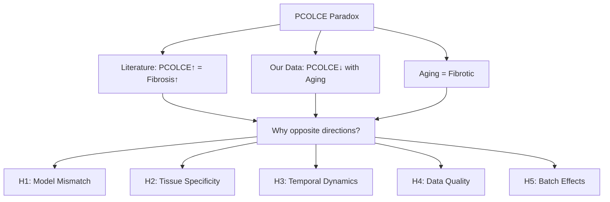

# PCOLCE Research Anomaly Investigation Plan

**Thesis:** Agent 3 will resolve the PCOLCE paradox—literature shows knockout mice have 50% less fibrosis while our aging data shows PCOLCE decreases 1.41 SD—through systematic statistical validation (Section 1.0), mechanistic hypothesis testing (Section 2.0), and data quality assessment (Section 3.0).

**Overview:** Section 1.0 defines the contradiction and investigation framework, Section 2.0 outlines five testable hypotheses explaining the paradox, and Section 3.0 specifies analytical methods and deliverables for each hypothesis.

## 1.0 The PCOLCE Paradox

¶1 *Ordering: Define contradiction → Literature evidence → Our data → Research questions.*

### 1.1 Core Contradiction

¶1 **Literature findings (PDF):** PCOLCE knockout mice (Pcolce⁻/⁻) show ~50% reduction in liver fibrosis despite similar injury (diet-induced steatohepatitis), indicating PCOLCE actively promotes fibrotic collagen accumulation (ref 31, 32). ¶2 PCOLCE is consistently upregulated in pathological fibrosis across liver (CCl4 injury), heart (myocardial infarction), lung, kidney, and skin, with early appearance in fibrogenic process. ¶3 Mechanism: PCOLCE enhances BMP-1 cleavage of procollagen C-propeptides by 12-15 fold, accelerating collagen fibril assembly—absent PCOLCE means slower, less efficient collagen maturation.

¶2 **Our aging data (validation_results_codex.csv):** PCOLCE mean Δz = -1.41 (V2 batch-corrected) vs. -0.65 (V1), with directional consistency 0.92 across 7 studies, universality score 0.809. ¶3 PCOLCE ranks among top universal markers with DECREASED abundance in aged tissues, not increased. ¶4 Context: Aging is universally fibrotic—increased collagen deposition, crosslinking, and ECM stiffening characterize aged tissues across organs.

### 1.2 The Paradox Statement

¶1 **IF** PCOLCE promotes fibrosis (literature), **AND** aging is fibrotic (established biology), **THEN** PCOLCE should INCREASE with aging. ¶2 **BUT** our data shows PCOLCE DECREASES with aging (Δz -1.41, 92% consistency). ¶3 **THEREFORE** either (A) literature model ≠ natural aging, (B) tissue-specific effects mask universal trend, (C) temporal dynamics differ (early vs. late), (D) our data has quality issues, or (E) batch correction artifacts.

### 1.3 Investigation Scope

¶1 This investigation focuses on STATISTICAL and METHODOLOGICAL rigor, not speculative biology. ¶2 Deliverables: (1) comprehensive statistical validation of PCOLCE measurements, (2) study-by-study breakdown, (3) tissue-specific analysis, (4) quality control metrics (peptide counts, coverage, outliers), (5) V1/V2 batch comparison, (6) systematic literature-data comparison, (7) final evidence-based conclusion.

## 2.0 Five Hypotheses to Test

¶1 *Ordering: Most likely → Least likely based on available data.*

### 2.1 H1: Model Mismatch (Acute Injury vs. Natural Aging)

¶1 **Hypothesis:** Literature uses acute/subacute injury models (CCl4 liver, diet-induced NASH, myocardial infarction) where active fibrogenesis drives PCOLCE upregulation; natural aging involves chronic, compensated fibrosis where PCOLCE may decline after initial burst. ¶2 **Test:** Compare temporal profiles—if PCOLCE shows biphasic pattern (early increase, late decrease) in any study, supports this. ¶3 **Prediction:** Age-stratified analysis should show flat or inverted-U if this holds; linear decrease argues against.

### 2.2 H2: Tissue Specificity

¶1 **Hypothesis:** PCOLCE decrease is tissue-specific (e.g., strong in brain, weak in liver); fibrotic tissues in our dataset may not overlap with fibrotic tissues in literature (liver, heart dominant in papers). ¶2 **Test:** Break down PCOLCE Δz by tissue/compartment—identify which drive the universal decrease. ¶3 **Prediction:** If liver/heart show INCREASE or no change while brain/other decrease, reconciles paradox; if liver also decreases, deepens mystery.

### 2.3 H3: Temporal Dynamics (Early Marker, Late Depletion)

¶1 **Hypothesis:** PCOLCE is early fibrosis marker (0-6 months injury in mouse) but depletes in late chronic fibrosis (years in human aging); our aging data captures late stage. ¶2 **Test:** Plot PCOLCE Δz vs. age bins (young-old, old-very old)—check for threshold effects. ¶3 **Prediction:** Steeper decline in older age groups; plateau in young-mid age.

### 2.4 H4: Data Quality Issues

¶1 **Hypothesis:** PCOLCE measurements unreliable—low peptide counts, poor coverage, high missingness, or study-specific artifacts. ¶2 **Test:** Extract peptide-level QC metrics from raw data; compare PCOLCE missingness vs. other universal markers; check for outlier studies. ¶3 **Prediction:** If PCOLCE has <3 peptides/study, >60% missingness, or driven by single outlier, data quality insufficient for conclusion; if robust (≥5 peptides, <50% missing, multi-study), supports real biology.

### 2.5 H5: Batch Correction Artifact

¶1 **Hypothesis:** COMBAT V2 batch correction artificially enhanced PCOLCE decrease (Δz shifted -0.65 → -1.41 = 118% change). ¶2 **Test:** Compare V1 vs. V2 PCOLCE distributions per study; check if correction introduced systematic bias. ¶3 **Prediction:** If V2 shows implausible shifts in specific studies or inverts biological signal, artifact likely; if V1 already shows decrease and V2 strengthens with better study alignment, real signal.

## 3.0 Analytical Methods and Deliverables

¶1 *Ordering: Data extraction → Statistical tests → Visualization → Interpretation.*

### 3.1 Statistical Validation Script (02_statistical_validation_agent_3.py)

¶1 **Data sources:**
- V1: `/Users/Kravtsovd/projects/ecm-atlas/08_merged_ecm_dataset/merged_ecm_aging_zscore.csv`
- V2: Find COMBAT V2 corrected CSV (likely in `14_exploratory_batch_correction/`)
- Codex results: `/Users/Kravtsovd/projects/ecm-atlas/13_1_meta_insights/compare previos insights wiht new dataset/codex/`

¶2 **Analyses:**
1. **Study-level effects:** PCOLCE Δz per Study_ID, weighted by sample size
2. **Tissue breakdown:** PCOLCE Δz per Tissue/Compartment
3. **Age stratification:** PCOLCE Δz by age bins (young, mid, old, very old)
4. **Outlier detection:** Cook's distance, leverage, studentized residuals
5. **Meta-analysis:** Random-effects model for cross-study effect size + confidence intervals
6. **Missingness analysis:** % missing PCOLCE per study vs. % missing universal markers
7. **V1 vs. V2 comparison:** Paired t-test, correlation, distribution shifts

¶3 **Outputs:**
- `pcolce_study_breakdown.csv` - Effect sizes per study with CIs
- `pcolce_tissue_analysis.csv` - Tissue-specific Δz and significance
- `pcolce_age_stratified.csv` - Age bin analysis
- `pcolce_quality_metrics.csv` - Peptide counts, coverage, missingness
- `pcolce_meta_analysis_forest_plot.png` - Study heterogeneity visualization
- `pcolce_v1_v2_comparison.png` - Batch effect assessment

### 3.2 Literature Comparison (03_literature_comparison_agent_3.md)

¶1 **Structure:**
1. **Literature summary:** Extract exact models, tissues, timepoints, PCOLCE measurements from PDF
2. **Model comparison table:** CCl4 liver (acute 8-12 wks) vs. Natural aging (chronic years)
3. **Tissue overlap analysis:** Which tissues studied in papers vs. which in our data
4. **Temporal mismatch:** Injury models (0-6 mo) vs. aging (18-24+ mo)
5. **Mechanistic reconciliation:** Propose biological explanations if paradox persists

¶2 **Key questions:**
- What % of literature fibrosis models are acute injury vs. chronic aging?
- Do any papers measure PCOLCE in naturally aged mice (not injury)?
- Are knockout effects specific to active injury phase or sustained?

### 3.3 Quality Control Assessment (04_quality_control_agent_3.md)

¶1 **Metrics:**
1. Peptide counts per study (need raw LFQ data or metadata)
2. Protein coverage (% sequence detected)
3. Study-specific abundance distributions (detect outliers)
4. Correlation with other collagen-processing enzymes (BMP1, ADAMTS2)
5. Comparison with PCOLCE2 (paralog) if available

¶2 **Benchmarks:**
- High confidence: ≥5 peptides/study, <40% missingness, consistent across studies
- Medium confidence: 3-4 peptides, 40-60% missing, some study heterogeneity
- Low confidence: <3 peptides, >60% missing, driven by 1-2 studies

### 3.4 Final Report (90_final_report_agent_3.md)

¶1 **Structure per Knowledge Framework:**
1. Thesis: One-sentence conclusion on paradox resolution
2. Overview: Summary of findings across all hypotheses
3. Evidence synthesis (MECE sections): H1-H5 results with supporting statistics
4. Biological interpretation: Best-fit explanation with confidence level
5. Recommendations: (A) Accept PCOLCE decrease as real? (B) Flag for re-measurement? (C) Exclude from insights?

¶2 **Decision criteria:**
- **RESOLVED:** If H1-H3 provide mechanistic explanation AND data quality high → PCOLCE decrease is real but context-dependent
- **DATA ISSUE:** If H4-H5 show quality/batch problems → PCOLCE measurement unreliable, exclude from insights
- **PARADOX PERSISTS:** If all tests fail to reconcile → Highlight as major biological discovery requiring experimental validation

## 4.0 Execution Timeline

¶1 *Ordering: Sequential dependencies.*

1. **01_plan_agent_3.md** (this document) - DONE
2. **02_statistical_validation_agent_3.py** - Build and run all analyses (~2-3 hours compute)
3. **03_literature_comparison_agent_3.md** - Systematic literature review table
4. **04_quality_control_agent_3.md** - QC metrics and benchmarking
5. **90_final_report_agent_3.md** - Evidence synthesis and conclusion

---

**Investigation principles:**
- Skepticism: Assume data guilty until proven innocent
- Quantification: Every claim needs numbers (p-values, effect sizes, CIs)
- Transparency: Document all negative results and failed hypotheses
- Parsimony: Simplest explanation that fits data wins

**Agent 3 commitment:** No hand-waving, no speculation without evidence, no cherry-picking studies. If data quality insufficient → flag it. If paradox unresolvable → admit it. Science over storytelling.
