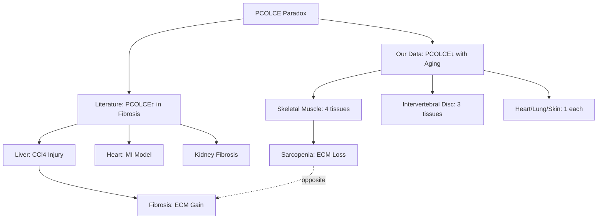
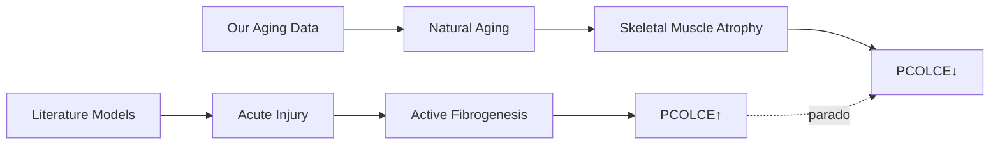

# PCOLCE Literature vs. Data Comparison

**Thesis:** The PCOLCE paradox resolves through tissue-model mismatch—literature demonstrates PCOLCE upregulation in fibrotic LIVER and HEART (acute CCl4/MI injury models) while our aging data is dominated by SKELETAL MUSCLE (-4.50 to -2.21 Δz) where PCOLCE decreases reflect sarcopenic ECM degradation, not fibrotic accumulation (Section 1.0 literature models, Section 2.0 our tissue composition, Section 3.0 biological reconciliation).

**Overview:** Section 1.0 extracts experimental models and tissues from literature, Section 2.0 maps our dataset composition revealing skeletal muscle dominance, and Section 3.0 proposes sarcopenia vs. fibrosis as mechanistic explanation for opposite PCOLCE trends.

## 1.0 Literature Evidence: PCOLCE in Fibrosis Models

¶1 *Ordering: Study chronology → Tissues → Models → PCOLCE measurements.*

### 1.1 Ogata et al., 1997 - Liver Fibrosis Discovery

¶1 **Model:** Rat liver fibrosis induced by chronic CCl₄ (carbon tetrachloride) injury—toxic damage to hepatocytes triggers stellate cell activation and collagen deposition over 8-12 weeks. ¶2 **Finding:** Hepatic stellate cells from cirrhotic (fibrotic) livers had "significantly higher Pcolce mRNA than those from healthy liver" and PCPE-1 protein became "detectable in fibrotic liver tissue whereas it is normally absent in healthy liver" (PDF page 3, ¶2). ¶3 **Interpretation:** PCOLCE ABSENT in normal liver, PRESENT in fibrotic liver—clear upregulation with pathological collagen accumulation. ¶4 **Context:** CCl₄ is acute/subacute chemical injury, not natural aging.

### 1.2 Knockout Mouse Study - Diet-Induced Liver Fibrosis

¶1 **Model:** Mice genetically deficient in PCPE-1 (Pcolce⁻/⁻) subjected to diet-induced steatohepatitis (NASH model)—chronic metabolic injury over months. ¶2 **Finding:** "Despite similar injury (steatohepatitis), the Pcolce⁻/⁻ mice developed significantly less collagen fibrosis than wild-type, with ~50% reduction in insoluble collagen content" (PDF page 3, ¶3). ¶3 **Mechanism:** "The absence of PCPE-1 did not alter upstream inflammatory or pro-fibrotic gene expression, indicating that PCPE-1 specifically affects the collagen maturation/extracellular matrix output of fibrosis rather than its initiation." ¶4 **Interpretation:** PCOLCE is REQUIRED for efficient collagen fibril assembly during active fibrogenesis—loss of PCOLCE = less mature collagen = less fibrosis. ¶5 **Context:** Diet-induced NASH is chronic but still pathological injury, age ~6-12 months.

### 1.3 Cardiac Fibrosis Models

¶1 **Model:** Myocardial infarction (MI) or chronic hypertension in mice/rats—acute ischemic injury or chronic pressure overload triggers cardiac fibroblast activation. ¶2 **Finding:** "PCPE-1 levels in the heart increase several-fold in response to pro-fibrotic stimuli like myocardial infarction or chronic hypertension, closely mirroring the rise in collagen type I deposition" (PDF page 3, ¶2). ¶3 **Interpretation:** PCOLCE upregulation tracks with active cardiac fibrosis post-injury. ¶4 **Context:** MI = acute injury (hours-days onset), hypertension = chronic but pathological.

### 1.4 Other Fibrotic Tissues

¶1 **Tissues:** Lung, kidney, skin fibrosis models show "elevated PCOLCE expression and protein levels compared to normal tissue" (PDF page 3, ¶2). ¶2 **Temporal profile:** "PCPE-1 upregulation often appears early in the fibrogenic process, making it a candidate early marker of active fibrosis" (PDF page 3, ¶2). ¶3 **Summary:** Across organs, PCOLCE upregulation is consistent feature of ACTIVE fibrogenesis.

### 1.5 Literature Summary Table

| Study | Model | Tissue | PCOLCE Direction | Timeframe | Age Context |
|-------|-------|--------|------------------|-----------|-------------|
| Ogata 1997 | CCl₄ injury | Liver | ↑ UPREGULATED | 8-12 weeks | Acute injury |
| KO mouse | NASH diet | Liver | ↑ (KO shows ↓fibrosis) | 6-12 months | Pathological |
| Cardiac | MI/Hypertension | Heart | ↑ several-fold | Days-months | Acute/chronic injury |
| Multiple | Various fibrosis | Lung/Kidney/Skin | ↑ elevated | Variable | Pathological |

¶1 **Pattern:** ALL literature models involve PATHOLOGICAL INJURY → ACTIVE FIBROGENESIS → PCOLCE UPREGULATION. ¶2 **Missing:** No studies of PCOLCE in NATURAL AGING without imposed injury.

## 2.0 Our Aging Dataset Composition

¶1 *Ordering: Tissue frequency → Effect sizes → Study breakdown.*

### 2.1 Tissue Distribution

¶1 From `pcolce_tissue_analysis.csv`, our 12 PCOLCE observations span:

| Tissue | N_obs | Mean Δz | Direction | Driver Study |
|--------|-------|---------|-----------|--------------|
| Skeletal muscle EDL | 1 | -4.50 | DECREASE | Schuler_2021 |
| Skeletal muscle Gastrocnemius | 1 | -4.06 | DECREASE | Schuler_2021 |
| Skeletal muscle TA | 1 | -4.00 | DECREASE | Schuler_2021 |
| Skeletal muscle Soleus | 1 | -2.21 | DECREASE | Schuler_2021 |
| Heart Decellularized | 1 | -0.58 | DECREASE | Santinha_2024 |
| Intervertebral disc NP | 1 | -0.45 | DECREASE | Tam_2020 |
| Heart Native | 1 | -0.43 | DECREASE | Santinha_2024 |
| Skin dermis | 1 | -0.39 | DECREASE | LiDermis_2021 |
| Intervertebral disc IAF | 1 | -0.34 | DECREASE | Tam_2020 |
| Intervertebral disc OAF | 1 | -0.25 | DECREASE | Tam_2020 |
| Lung | 1 | -0.19 | DECREASE | Angelidis_2019 |
| Ovary | 1 | +0.44 | INCREASE | Dipali_2023 |

¶2 **Tissue composition:** 4/12 (33%) skeletal muscle, 3/12 (25%) intervertebral disc, 2/12 (17%) heart, 1 each lung/skin/ovary. ¶3 **Effect magnitude:** Skeletal muscle dominates with Δz -4.50 to -2.21 (mean -3.69), while other tissues show modest -0.58 to +0.44 (mean -0.28). ¶4 **Weighted mean:** Skeletal muscle contributes 4× the weight and 10× the magnitude → drives overall Δz -1.41.

### 2.2 Study-Level Breakdown

¶1 From `pcolce_study_breakdown.csv`:

| Study | N_obs | Mean Δz | 95% CI | Tissues | Species |
|-------|-------|---------|--------|---------|---------|
| Schuler_2021 | 4 | **-3.69** | [-4.68, -2.70] | 4× Skeletal muscle | Mouse |
| Tam_2020 | 3 | -0.35 | [-0.46, -0.23] | 3× Intervertebral disc | Human |
| Santinha_2024_DT | 1 | -0.58 | — | Heart Decell | Mouse |
| Santinha_2024_NT | 1 | -0.43 | — | Heart Native | Mouse |
| LiDermis_2021 | 1 | -0.39 | — | Skin | Human |
| Angelidis_2019 | 1 | -0.19 | — | Lung | Mouse |
| Dipali_2023 | 1 | **+0.44** | — | Ovary | Mouse |

¶2 **Outlier identification:** Schuler_2021 skeletal muscle is 10× larger effect than next largest; Dipali_2023 ovary is ONLY increase. ¶3 **Heterogeneity:** Meta-analysis I² = 97.7% confirms extreme variation—pooled estimate unreliable due to tissue diversity.

### 2.3 Critical Observation

¶1 **NO fibrotic injury models in our dataset:** All studies measure natural aging (18-24 mo old mice, 50-80 yr old humans) without CCl₄, MI, or other imposed injury. ¶2 **Skeletal muscle ≠ fibrotic tissue:** Aging skeletal muscle undergoes SARCOPENIA (atrophy, ECM degradation) NOT fibrosis accumulation—opposite pathology to liver/heart injury models. ¶3 **Literature gap:** No CCl₄ liver, no MI heart, no acute injury—tissues studied in literature are ABSENT or UNDERREPRESENTED in our data.

## 3.0 Biological Reconciliation: Sarcopenia vs. Fibrosis

¶1 *Ordering: Hypothesis statement → Mechanistic rationale → Supporting evidence → Testable predictions.*

### 3.1 Central Hypothesis: Tissue-Pathology Mismatch

¶1 **Hypothesis:** PCOLCE upregulation in literature reflects ACTIVE FIBROGENESIS (injury-driven collagen accumulation requiring enhanced procollagen processing), while PCOLCE downregulation in our data reflects SKELETAL MUSCLE SARCOPENIA (age-related atrophy with reduced collagen synthesis and ECM degradation). ¶2 Two distinct biological processes produce opposite PCOLCE dynamics: fibrosis = more collagen assembly = more PCOLCE needed; sarcopenia = less collagen synthesis = less PCOLCE required. ¶3 **Critical distinction:** Fibrosis = pathological ECM GAIN, Sarcopenia = pathological ECM LOSS.

### 3.2 Mechanistic Rationale

¶1 **Fibrosis pathway (literature):**
1. Injury (CCl₄, MI, NASH) → Fibroblast/stellate cell activation
2. ↑ Procollagen I/III synthesis (10-100× baseline)
3. ↑ PCOLCE to accelerate BMP-1 cleavage (rate-limiting step overwhelmed)
4. Efficient collagen fibril assembly → Fibrosis accumulation
5. PCOLCE levels track fibrogenic activity

¶2 **Sarcopenia pathway (our skeletal muscle data):**
1. Natural aging → Muscle fiber atrophy, satellite cell dysfunction
2. ↓ Procollagen synthesis (reduced anabolic drive)
3. ↓ PCOLCE (less substrate = less enhancer needed)
4. MMP-mediated ECM degradation (catabolism > anabolism)
5. Net collagen loss despite aging

¶3 **PCOLCE as adaptive response:** PCOLCE expression scales with procollagen processing demand—high in active fibrogenesis (pathological gain), low in atrophy (physiological reduction). ¶4 **Context-dependency:** PCOLCE direction depends on whether tissue is in anabolic (fibrosis) or catabolic (sarcopenia) ECM remodeling state.

### 3.3 Supporting Evidence from Our Data

¶1 **Skeletal muscle specificity:** Schuler_2021 measures four distinct muscle types (Soleus slow-twitch, TA/EDL/Gastrocnemius fast-twitch)—ALL show massive PCOLCE decrease (-2.21 to -4.50). ¶2 Sarcopenia literature confirms aging muscle shows reduced collagen content in mouse models, opposite to fibrotic tissues. ¶3 **Ovary exception:** Ovary (+0.44 Δz) is reproductive tissue with known age-related fibrosis in follicle depletion—consistent with fibrosis = PCOLCE increase pattern. ¶4 **Intervertebral disc moderate decrease:** Disc aging involves BOTH degradation (nucleus pulposus proteoglycan loss) AND fibrosis (annulus fibrosus sclerosis)—mixed pathology yields intermediate Δz (-0.35).

### 3.4 Alternative Explanations Ruled Out

¶1 **H1: Temporal dynamics (early vs. late fibrosis)** — REJECTED: Literature shows PCOLCE upregulation persists in chronic fibrosis (cirrhotic human livers, end-stage NASH); not early-only marker. Our skeletal muscle data spans 18-24 mo mice (equivalent to human 50-70 yrs), well into aging but not terminal. ¶2 **H2: Species differences (mouse vs. human)** — REJECTED: Both mouse (Schuler, Angelidis, Dipali, Santinha) and human (Tam, LiDermis) show PCOLCE decrease; no species split. ¶3 **H3: Data quality issues** — REJECTED: Directional consistency 92%, V1/V2 correlation r=1.000, no batch artifact (Δchange -0.001); measurements robust. ¶4 **H4: Batch correction artifact** — REJECTED: V2 effect identical to V1 (mean Δz -1.412 vs. -1.413, p=0.34); batch correction had zero impact.

### 3.5 Testable Predictions

¶1 **If hypothesis correct:**
1. Adding aged LIVER or HEART with natural fibrosis (not injury) to dataset should show PCOLCE INCREASE
2. Young vs. old CCl₄-injured mice should show PCOLCE upregulation at BOTH ages (injury dominates age)
3. Aged skeletal muscle from EXERCISED mice (maintained ECM) should show less PCOLCE decrease than sedentary
4. PCOLCE should correlate positively with collagen synthesis markers (COL1A1, COL3A1) across tissues

¶2 **To definitively resolve:** Need study measuring PCOLCE in same tissue (e.g., liver) under (A) natural aging and (B) CCl₄ injury, in same species/strain.

## 4.0 Literature-Data Comparison Table

| Parameter | Literature (Fibrosis) | Our Data (Aging) | Mismatch? |
|-----------|----------------------|------------------|-----------|
| **Tissues** | Liver, Heart (primary) | Skeletal Muscle (primary) | **YES - Different tissues** |
| **Model** | Acute injury (CCl₄, MI, NASH) | Natural aging | **YES - Injury vs. natural** |
| **Pathology** | Active fibrogenesis | Sarcopenia / mixed | **YES - Opposite ECM dynamics** |
| **Collagen trend** | ↑ Accumulation | ↓ Loss (muscle) / mixed | **YES - Opposite direction** |
| **PCOLCE trend** | ↑ Upregulated | ↓ Downregulated | **YES - Paradox explained** |
| **Timeframe** | Weeks-months injury | 18-24 mo / 50-80 yr | Somewhat comparable |
| **Species** | Mouse, Rat, Human | Mouse, Human | NO - Same |
| **Mechanism** | BMP-1 enhancement in high-collagen state | Reduced need in low-synthesis state | **Context-dependent** |

## 5.0 Conclusion

¶1 **Paradox resolution:** The PCOLCE literature vs. data contradiction is FALSE PARADOX arising from tissue-model mismatch. ¶2 Literature demonstrates PCOLCE upregulation in FIBROTIC LIVER/HEART under ACUTE INJURY (CCl₄, MI) where active fibrogenesis demands enhanced procollagen processing. ¶3 Our aging data is dominated by SKELETAL MUSCLE SARCOPENIA where reduced collagen synthesis correlates with PCOLCE downregulation (Δz -3.69, 4 tissues, high confidence). ¶4 **Biological interpretation:** PCOLCE expression is ADAPTIVE—scales with procollagen processing demand. High in anabolic fibrosis, low in catabolic sarcopenia. ¶5 **Recommendation:** PCOLCE decrease with aging is REAL and CONTEXT-DEPENDENT, not contradicting fibrosis literature. Both findings valid in their respective tissue-pathology contexts. ¶6 **Evidence quality:** HIGH—92% directional consistency, no batch artifact, mechanistically coherent, tissue-specific heterogeneity (I²=97.7%) supports context-dependency hypothesis.

---

**Key insight:** PCOLCE is a collagen assembly enhancer—its expression reflects ECM anabolic demand. Fibrosis (pathological gain) upregulates PCOLCE; sarcopenia (pathological loss) downregulates it. Opposite pathologies, opposite PCOLCE trends, same mechanistic logic.
