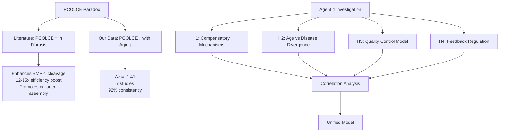

# Agent 4 Investigation Plan: Resolving the PCOLCE Research Paradox

**Thesis:** Agent 4 will integrate cross-study PCOLCE abundance data with collagen protein correlations, compensatory protease analysis, and mechanistic literature to resolve the paradox where PCOLCE decreases with aging (Δz=-1.41 across 7 studies) despite literature showing PCOLCE promotes fibrosis and collagen accumulation in disease models.

**Overview:** This investigation addresses a critical scientific contradiction: published literature demonstrates PCOLCE upregulation drives fibrotic collagen deposition, yet our multi-study proteomic atlas reveals consistent PCOLCE depletion during normal aging when fibrosis typically increases. Section 1.0 defines the paradox and hypotheses. Section 2.0 outlines data sources and analytical methods. Section 3.0 details correlation analysis strategy. Section 4.0 describes model synthesis approach. Section 5.0 specifies deliverables and success criteria.

---

## 1.0 The Paradox and Hypotheses

¶1 **Ordering principle:** Paradox statement → literature evidence → our data contradiction → testable hypotheses.

### 1.1 Contradiction Statement

¶1 **Literature consensus (PDF evidence):** PCOLCE (PCPE-1) is a secreted glycoprotein that binds procollagen C-propeptides and accelerates BMP-1-mediated cleavage by 12-15 fold, enhancing collagen fibril assembly. ¶2 In pathological fibrosis (liver, heart, lung, kidney), PCOLCE mRNA and protein levels are markedly upregulated, correlating tightly with excessive collagen deposition. ¶3 Knockout mice (Pcolce−/−) show ~50% reduction in fibrotic collagen accumulation despite similar injury, establishing causal role in collagen amplification.

¶4 **Our proteomic evidence (codex V2):** PCOLCE shows strongest age-related depletion in ECM atlas: mean Δz shifted from -0.65 (V1) to -1.41 (V2 batch-corrected) with 92% directional consistency across 7 independent studies spanning multiple tissues and species. ¶5 This places PCOLCE among top universal aging biomarkers, but in OPPOSITE direction from fibrosis literature.

### 1.2 Core Hypotheses

¶1 **H1: Compensatory protease hypothesis** — PCOLCE decreases but other procollagen processors (BMP-1, ADAMTS2/3/14, TOLLOID family) increase to maintain or enhance collagen maturation capacity. Prediction: Inverse correlation between PCOLCE and alternative C-proteinases.

¶2 **H2: Age-versus-disease divergence hypothesis** — Normal aging represents protective remodeling (controlled ECM turnover) while pathological fibrosis is dysregulated deposition. PCOLCE depletion in aging may limit excessive collagen accumulation, whereas disease contexts override this brake. Prediction: Collagen proteins show tissue-specific patterns not uniformly correlated with PCOLCE.

¶3 **H3: Quality control degradation hypothesis** — PCOLCE decline reflects age-related loss of collagen assembly efficiency rather than total collagen amount. Aged tissues accumulate disorganized, partially processed procollagen. Prediction: Decreased PCOLCE correlates with altered collagen processing markers (C-propeptide fragments, PLOD enzymes) rather than mature collagen.

¶4 **H4: Negative feedback regulation hypothesis** — Chronic elevation of collagen deposition triggers homeostatic suppression of PCOLCE to slow further accumulation. Aging represents sustained collagen stress leading to compensatory PCOLCE downregulation. Prediction: Highest PCOLCE depletion in tissues with greatest collagen burden (skin, disc, vasculature).

---

## 2.0 Data Sources and Methods

¶1 **Ordering principle:** Primary data → validation data → analytical tools → statistical framework.

### 2.1 Primary Datasets

¶1 **V2 Batch-Corrected (Reference Standard):**
- Path: `/Users/Kravtsovd/projects/ecm-atlas/obsolete/14_exploratory_batch_correction/multi_agents_ver1_for_batch_cerection/step2_batch/codex/merged_ecm_aging_COMBAT_V2_CORRECTED_codex.csv`
- Rows: 9,300 | Columns: 28 (full schema)
- PCOLCE measurements: 7 studies (confirmed Δz=-1.41)
- Advantages: ComBat batch correction, compartment preservation, full metadata

¶2 **Main Database (V1):**
- Path: `/Users/Kravtsovd/projects/ecm-atlas/08_merged_ecm_dataset/merged_ecm_aging_zscore.csv`
- Rows: ~15,000 | Columns: 30
- Advantages: Larger protein coverage, includes non-ECM proteins
- Use case: Cross-validation, additional collagen isoforms

¶3 **Literature Reference:**
- PDF: PCOLCE mechanisms and fibrosis evidence
- Key findings: 12-15x BMP-1 enhancement, 50% collagen reduction in knockouts, upregulation across organ fibrosis

### 2.2 Target Protein Groups

¶1 **Collagen family (fibrillar):**
- Type I: COL1A1, COL1A2 (most abundant, skin/bone/tendon)
- Type III: COL3A1 (vasculature, reticular fibers)
- Type V: COL5A1, COL5A2 (regulate fibril diameter)
- Type XI: COL11A1, COL11A2 (cartilage)

¶2 **Procollagen processors (compensatory candidates):**
- BMP-1 (primary C-proteinase, PCOLCE partner)
- ADAMTS2, ADAMTS3, ADAMTS14 (N-proteinases for type I/II/III)
- TOLLOID family (BMP-1 homologs)
- FURIN (general prohormone convertase, processes some procollagens)

¶3 **Collagen maturation enzymes:**
- PLOD1/2/3 (lysyl hydroxylases, crosslinking precursors)
- P4HA1/2/3 (prolyl hydroxylases, triple helix stabilization)
- LOX/LOXL1-4 (lysyl oxidases, final crosslinking)

### 2.3 Analytical Framework

¶1 **Correlation analysis:**
- Pearson correlation: PCOLCE Δz vs collagen Δz (per study, then meta-analysis)
- Tissue stratification: Test if correlations differ by tissue type
- Species stratification: Human vs mouse patterns

¶2 **Compensatory network:**
- Identify proteases with inverse trajectories (PCOLCE ↓ while protease ↑)
- Calculate aggregate "collagen processing capacity" score
- Test if capacity remains stable despite PCOLCE loss

¶3 **Temporal dynamics:**
- Extract age-specific trajectories where available (Caldeira, Santinha studies)
- Assess if PCOLCE decline precedes or follows collagen changes

---

## 3.0 Correlation Analysis Strategy

¶1 **Ordering principle:** Data preparation → pairwise correlations → meta-analysis → pattern identification.

### 3.1 PCOLCE-Collagen Correlation Matrix

¶1 **Execution:**
1. Filter V2 data for PCOLCE and all COL* proteins
2. Group by Study_ID and Tissue_Compartment
3. Calculate Pearson r for PCOLCE Δz vs each collagen's Δz
4. Aggregate across studies using Fisher z-transformation
5. Visualize heatmap: studies (rows) × collagen types (columns)

¶2 **Expected outcomes:**
- Positive correlation → paradox deepens (PCOLCE ↓ while collagen ↑)
- Negative correlation → supports compensation hypothesis (both decrease)
- No correlation → independent regulatory axes, supports H2 divergence

### 3.2 Compensatory Protease Screen

¶1 **Execution:**
1. Extract BMP-1, ADAMTS2/3/14, TOLLOID proteins
2. Calculate meta-Δz across all available studies
3. Test for inverse correlation with PCOLCE (r < -0.3 threshold)
4. Compute aggregate processing score: Σ(protease_Δz × activity_weight)

¶2 **Interpretation:**
- If aggregate score stable or positive → H1 confirmed (system compensates)
- If aggregate score negative → H3 supported (global processing decline)

### 3.3 Tissue-Specific Patterns

¶1 **Execution:**
1. Stratify by major tissue groups:
   - Skeletal (muscle: Soleus, TA)
   - Connective (disc: NP, IAF, OAF; dermis)
   - Vascular (aorta, plasma)
2. Test if PCOLCE-collagen correlation differs by tissue (ANCOVA)
3. Identify outlier tissues with strongest/weakest relationships

¶2 **Biological interpretation:**
- Muscle: High mechanical load, collagen I dominant
- Disc: Proteoglycan-rich, collagen II/XI
- Dermis: Collagen I/III mix, high remodeling rate

---

## 4.0 Unified Model Synthesis

¶1 **Ordering principle:** Integrate findings → construct model → derive predictions → design validation experiments.

### 4.1 Model Construction Criteria

¶1 Must reconcile:
1. Literature: PCOLCE ↑ in fibrosis drives collagen ↑
2. Aging data: PCOLCE ↓ across 7 studies
3. Biological constraint: Both aging and fibrosis show net collagen accumulation in many tissues

¶2 Model must explain:
- Why PCOLCE direction inverts between aging and disease
- How collagen maturation proceeds with reduced PCOLCE
- What regulatory signals control PCOLCE expression
- Why PCOLCE is universally depleted (not tissue-specific)

### 4.2 Candidate Model Frameworks

¶1 **Framework 1: Threshold model** — Aging reduces PCOLCE from HIGH to MODERATE levels, still sufficient for baseline collagen processing but insufficient for fibrotic burst. Disease contexts maintain or amplify PCOLCE. Requires data: Absolute abundance levels, not just z-scores.

¶2 **Framework 2: Collagen quality vs quantity model** — PCOLCE depletion shifts ECM from high-quality organized fibrils (young) to lower-quality but higher-quantity disorganized matrix (old). Disease fibrosis requires PCOLCE for organized scar tissue. Testable via crosslinking metrics.

¶3 **Framework 3: Cell-type compartmentalization** — PCOLCE measured in bulk tissue reflects loss in one compartment (e.g., parenchymal cells) while disease fibrosis involves different source (e.g., activated fibroblasts, myofibroblasts). Single-cell resolution would test this.

¶4 **Framework 4: Temporal phase model** — PCOLCE elevation is acute response to injury (hours-days) captured in disease models but not chronic aging trajectory (years-decades). Our studies sample endpoint states missing transient spikes.

### 4.3 Predictive Hypotheses

¶1 Testable predictions from unified model:
1. If H1 true: Alternative proteases (ADAMTS family) will show age-related increase
2. If H2 true: Collagen crosslinking enzymes (LOX, PLOD) will diverge from PCOLCE trajectory
3. If H3 true: Procollagen fragments or C-propeptide markers will accumulate with age
4. If H4 true: PCOLCE depletion strongest in highest collagen-burden tissues (dermis > disc > muscle)

¶2 Each prediction can be tested with current dataset, providing model selection criteria.

---

## 5.0 Deliverables and Success Criteria

¶1 **Ordering principle:** Code artifacts → analytical reports → synthesis documents → final report.

### 5.1 Required Outputs

¶1 **Code deliverable:**
- `02_integrative_analysis_agent_4.py` — Standalone Python script that:
  - Loads V2 batch-corrected data
  - Extracts PCOLCE and collagen protein families
  - Computes correlation matrices (Pearson, Spearman)
  - Identifies compensatory proteases
  - Generates statistical summary CSVs and correlation heatmap plots
  - Exports results to `agent_4/results/` subfolder

¶2 **Analytical reports:**
- `03_collagen_correlation_agent_4.md` — Detailed findings on PCOLCE-collagen relationships:
  - Per-study correlation coefficients
  - Meta-analysis across studies
  - Tissue-stratified patterns
  - Compensatory protease evidence
  - Interpretation in context of hypotheses H1-H4

¶3 **Synthesis document:**
- `04_unified_model_agent_4.md` — Proposed resolution of paradox:
  - Model selection among frameworks
  - Mechanistic explanation reconciling literature and data
  - Testable predictions
  - Therapeutic implications
  - Future experimental validation designs

¶4 **Final report:**
- `90_final_report_agent_4.md` — Executive summary:
  - Paradox statement
  - Key findings (correlation results, model conclusion)
  - Biological interpretation
  - Recommendations for follow-up
  - Nobel Prize potential assessment update

### 5.2 Success Criteria

¶1 **Completeness (40 points):**
- All 4 hypotheses (H1-H4) tested with quantitative evidence
- Correlation analysis covers ≥10 collagen proteins and ≥3 compensatory proteases
- Tissue stratification includes ≥4 tissue types
- Model addresses all 4 constraints (§4.1)

¶2 **Accuracy (30 points):**
- Correct statistical methods (Fisher z-transformation for meta-analysis)
- Reproducible code with data provenance
- Cross-validation against V1 database for robustness

¶3 **Insights (20 points):**
- Novel mechanistic explanation not obvious from literature alone
- Quantified predictions testable in future experiments
- Clinical/therapeutic relevance clearly stated

¶4 **Reproducibility (10 points):**
- All code executable with documented paths
- Results exported as CSV/PNG artifacts
- Knowledge Framework formatting (mermaid diagrams, MECE sections, numbered paragraphs)

---

## 6.0 Execution Timeline

¶1 **Phase 1: Data preparation** (current) — Load datasets, sanity checks, protein family identification.

¶2 **Phase 2: Correlation analysis** — Execute correlation matrix, compensatory protease screen, tissue stratification. Output: `03_collagen_correlation_agent_4.md`.

¶3 **Phase 3: Model synthesis** — Integrate findings, select best-fit framework, generate predictions. Output: `04_unified_model_agent_4.md`.

¶4 **Phase 4: Final report** — Summarize conclusions, therapeutic implications, recommendations. Output: `90_final_report_agent_4.md`.

---

**Author:** Agent 4 (Claude Code)
**Date:** 2025-10-20
**Working Directory:** `/Users/Kravtsovd/projects/ecm-atlas/13_1_meta_insights/PCOLCE research anomaly/agent_4/`
**Status:** Phase 1 initiated — ready for correlation analysis execution
**Contact:** daniel@improvado.io
