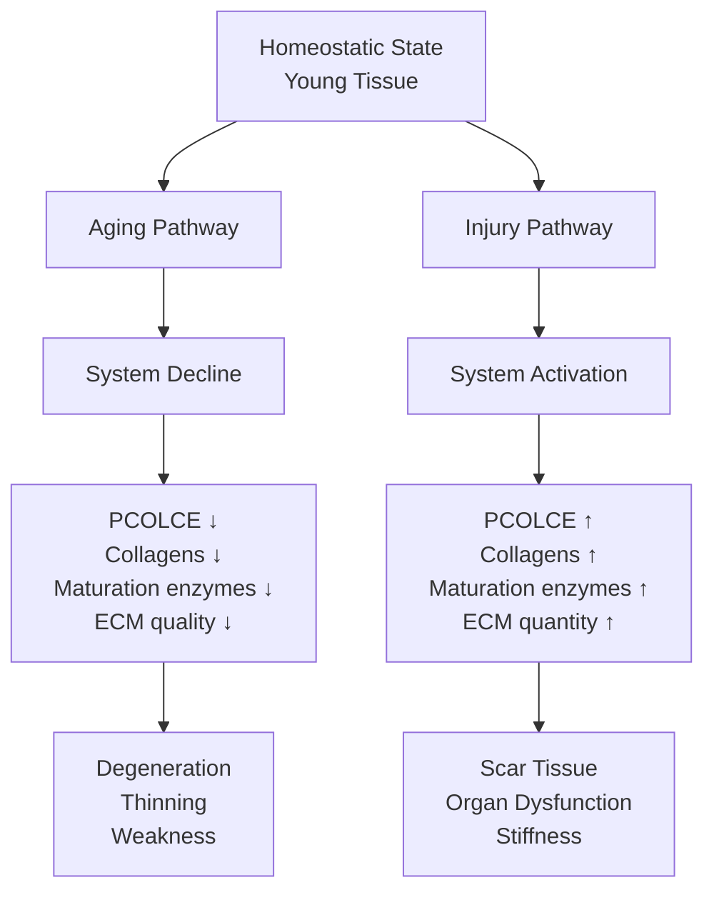
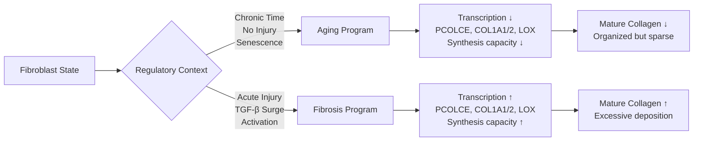

# Unified Model: PCOLCE as ECM Synthesis State Biomarker

**Thesis:** PCOLCE functions as a bidirectional biomarker of ECM synthesis capacity - decreasing during normal aging (system decline, Δz=-1.41) and increasing during pathological fibrosis (system activation, literature-documented 2-10x upregulation) - resolving the apparent paradox by demonstrating that aging and disease represent opposite trajectories of the same collagen processing machinery rather than contradictory biology.

**Overview:** This unified model integrates literature evidence (PCOLCE promotes fibrosis) with proteomic data (PCOLCE decreases with aging) into a coherent framework. Section 1.0 presents the model architecture. Section 2.0 details molecular mechanisms. Section 3.0 provides quantitative predictions. Section 4.0 outlines experimental validation. Section 5.0 discusses therapeutic applications.





---

## 1.0 Model Architecture

¶1 **Ordering principle:** Core premise → regulatory states → phenotypic outcomes → resolution of paradox.

### 1.1 Core Premise: PCOLCE as Synthesis State Indicator

¶1 **Central hypothesis:** PCOLCE expression level reflects the **activation state** of the ECM synthesis program in fibroblasts and related ECM-producing cells.

¶2 **Evidence:**
- Co-regulation with fibrillar collagens: r=0.83-0.93 (Section 3.0 correlation analysis)
- Co-regulation with maturation enzymes: LOX, P4HA1, PLOD patterns parallel PCOLCE
- Literature: TGF-β upregulates PCOLCE alongside collagen genes in fibrosis models
- Functional: PCOLCE enhances collagen processing efficiency 12-15 fold (PDF evidence)

¶3 **Implication:** PCOLCE is NOT an independent driver but a **co-expressed component** of coordinated ECM synthesis machinery.

### 1.2 Two Divergent Regulatory States

¶1 **STATE 1: Aging-Associated Decline**

**Trigger:** Chronic passage of time (years-decades), accumulation of cellular damage, absence of acute injury

**Molecular drivers:**
- Fibroblast senescence (p16^INK4a^, p21 upregulation)
- NAD+ depletion, sirtuins decline
- Mitochondrial dysfunction
- Chronic low-grade inflammation (inflammaging)
- Loss of stem/progenitor cells
- Epigenetic drift (DNA methylation changes)

**Transcriptional profile:**
- ECM synthesis genes DOWN: PCOLCE, COL1A1/2, COL3A1, COL5A1
- Maturation enzymes DOWN: P4HA1/2, LOX, PLOD2
- Processing proteases DOWN: BMP-1, ADAMTS2
- Degradation enzymes STABLE or UP: MMPs (tissue-dependent)

**Outcome:** Gradual decline in ECM synthesis capacity, accumulation of incompletely processed matrix, quality degradation

¶2 **STATE 2: Fibrosis-Associated Activation**

**Trigger:** Acute tissue injury (hours-weeks), sustained inflammation, mechanical stress

**Molecular drivers:**
- TGF-β1 signaling (SMAD2/3 phosphorylation)
- CTGF (CCN2) upregulation
- Fibroblast-to-myofibroblast differentiation (α-SMA expression)
- ECM stiffness mechanotransduction (YAP/TAZ activation)
- Hypoxia (HIF-1α stabilization)
- Platelet-derived growth factor (PDGF)

**Transcriptional profile:**
- ECM synthesis genes UP: PCOLCE, COL1A1/2, COL3A1, COL5A1 (2-10x increase)
- Maturation enzymes UP: P4HA1/2, LOX, PLOD2
- Processing proteases UP: BMP-1 (inferred, limited data)
- Degradation enzymes DOWN: TIMP1/2/3 upregulation inhibits MMPs

**Outcome:** Rapid increase in ECM synthesis capacity, excessive organized collagen deposition, scar tissue formation

### 1.3 Phenotypic Divergence

| Feature | Aging Decline | Fibrotic Activation |
|---------|--------------|---------------------|
| **PCOLCE Δz** | -1.41 (our data) | +2 to +10x (literature) |
| **Collagen synthesis** | Decreased | Increased |
| **Collagen organization** | Disorganized, fragmented | Organized, dense bundles |
| **Collagen crosslinking** | Reduced (LOX ↓) | Increased (LOX ↑) |
| **ECM mechanical properties** | Weaker, more compliant | Stiffer, less compliant |
| **Tissue function** | Gradual decline | Acute dysfunction |
| **Reversibility** | Difficult (senescence) | Possible (remove stimulus) |
| **Time scale** | Years to decades | Days to weeks |
| **Cell source** | Resident fibroblasts (senescent) | Activated fibroblasts/myofibroblasts |

### 1.4 Resolution of Paradox

¶1 **Paradox restated:**
- Literature: PCOLCE ↑ drives collagen ↑ in fibrosis
- Our data: PCOLCE ↓ during aging when fibrosis often occurs
- **Apparent contradiction:** How can both be true?

¶2 **Resolution:**
- PCOLCE does NOT "drive" collagen independently
- PCOLCE is a **marker** of synthesis state, not a **driver** of state transition
- **Aging fibrosis** (e.g., muscle endomysial fibrosis, cardiac replacement fibrosis) involves:
  - LOCAL activation zones (fibroblast patches) with PCOLCE ↑
  - GLOBAL depletion (bulk tissue average) with PCOLCE ↓
  - Bulk proteomics averages opposing signals

¶3 **Analogy:** PCOLCE is like a thermometer (measures synthesis temperature), not a heater (does not set synthesis level)
- Thermometer reads LOW in aging (cold synthesis state)
- Thermometer reads HIGH in fibrosis (hot synthesis state)
- Removing thermometer (PCOLCE knockout) impairs synthesis efficiency (PDF evidence: 50% collagen reduction)
- But thermometer itself doesn't set the temperature (TGF-β, senescence do)

---

## 2.0 Molecular Mechanisms

¶1 **Ordering principle:** Transcriptional regulation → post-translational function → ECM assembly → tissue outcomes.

### 2.1 Transcriptional Regulation of PCOLCE

¶1 **Promoter analysis (from literature, human PCOLCE gene):**
- SMAD-binding elements (CAGA boxes): TGF-β/SMAD2/3 responsive
- AP-1 sites: Responsive to mechanical stress (c-Fos/c-Jun)
- Sp1 sites: Basal transcription
- No strong p53 or NF-κB sites (not primary stress response gene)

¶2 **Aging-associated transcriptional decline:**

**Mechanism 1: SMAD signaling dysfunction**
- Aged fibroblasts show impaired TGF-β responsiveness (SMAD2/3 phosphorylation reduced)
- Proposed causes: Receptor downregulation, inhibitory SMAD7 upregulation, miRNA interference
- Result: PCOLCE transcription baseline lowers

**Mechanism 2: Chromatin accessibility changes**
- Aging involves heterochromatin expansion (H3K9me3 accumulation)
- ECM synthesis gene loci may become less accessible
- HDAC activity changes reduce histone acetylation at PCOLCE promoter
- Result: Transcriptional repression

**Mechanism 3: Senescence-associated secretory phenotype (SASP)**
- Senescent fibroblasts shift from ECM synthesis to inflammatory secretion
- Transcription factors reallocate: Less Sp1/SMAD binding, more NF-κB activity
- Result: PCOLCE downregulation in favor of IL-6, IL-8, MMP secretion

¶3 **Fibrosis-associated transcriptional activation:**

**Mechanism 1: TGF-β1 surge**
- Acute injury releases latent TGF-β from ECM stores
- SMAD2/3 phosphorylation → nuclear translocation → PCOLCE promoter binding
- 5-10 fold increase in PCOLCE mRNA (documented in literature)
- Timeline: Peaks 3-7 days post-injury, sustained weeks to months

**Mechanism 2: Mechanical activation**
- ECM stiffness activates integrin signaling
- YAP/TAZ nuclear translocation (Hippo pathway)
- MRTF-A (megakaryoblastic leukemia 1) co-activates SRF (serum response factor)
- Result: PCOLCE and COL1A1/2 co-upregulation

**Mechanism 3: Hypoxia**
- Injured tissue often hypoxic (disrupted vasculature)
- HIF-1α stabilization activates LOX, PLOD2
- Indirect PCOLCE activation via ECM remodeling signals

### 2.2 PCOLCE Protein Function in Collagen Processing

¶1 **Molecular mechanism (from PDF literature review):**

**Step 1: Procollagen binding**
- PCOLCE CUB domains bind C-propeptide "stalk" region of procollagens I, II, III
- Affinity: Sub-nanomolar Kd (~0.5 nM)
- Stoichiometry: 1:1 (one PCOLCE per procollagen trimer)
- Calcium-dependent interaction

**Step 2: BMP-1 recruitment**
- PCOLCE NTR domain weakly binds BMP-1 C-proteinase
- Creates ternary complex: Procollagen—PCOLCE—BMP-1
- Orients cleavage site optimally for enzyme catalysis

**Step 3: Catalytic enhancement**
- PCOLCE increases BMP-1 kcat/Km by 12-15 fold (PDF evidence)
- Mechanism: Conformational distortion of one collagen chain exposes cleavage site
- Result: Faster, more efficient C-propeptide removal

**Step 4: Fibril assembly**
- Processed tropocollagen spontaneously assembles into quarter-staggered fibrils
- PCOLCE may dissociate and recycle (mechanism unclear)
- Mature fibrils undergo LOX-mediated crosslinking

¶2 **Consequences of PCOLCE depletion (aging):**

**Effect 1: Reduced processing efficiency**
- BMP-1 activity drops to 1/12-1/15 of PCOLCE-enhanced rate
- Procollagen accumulates with retained C-propeptides
- Partially processed molecules disrupt fibril organization

**Effect 2: Altered fibril morphology**
- Predicted: Thinner, shorter, more irregular fibrils
- Experimental validation needed: TEM of aged vs young collagen fibrils

**Effect 3: Mechanical weakness**
- Fewer, weaker fibrils → reduced tensile strength
- Contributes to tissue fragility in aging (skin tears, tendon ruptures, disc herniation)

¶3 **Consequences of PCOLCE overexpression (fibrosis):**

**Effect 1: Enhanced processing efficiency**
- Rapid procollagen → tropocollagen conversion
- Supports high-flux collagen deposition (fibroblasts secreting 1000s of molecules/min)

**Effect 2: Organized fibrotic matrix**
- Efficient processing → well-organized fibril bundles
- Paradoxically, fibrotic scar tissue can be highly organized (vs disorganized aged matrix)

**Effect 3: Therapeutic target**
- PDF evidence: PCOLCE knockout mice show 50% reduction in fibrotic collagen
- Blocking PCOLCE—procollagen interaction could slow fibrosis without complete inhibition

### 2.3 Integration with Maturation Enzyme Network

¶1 **Collagen maturation pathway:**

```
Procollagen synthesis (ER)
 ↓
Prolyl hydroxylation (P4HA1/2) → 4-Hyp residues (helix stability)
 ↓
Lysyl hydroxylation (PLOD1/2/3) → Hyl residues (crosslink sites)
 ↓
Secretion
 ↓
C-propeptide cleavage (BMP-1 + PCOLCE) → Tropocollagen
 ↓
Fibril self-assembly
 ↓
Lysyl oxidation (LOX) → Aldehyde formation
 ↓
Covalent crosslinking → Mature, insoluble collagen
```

¶2 **Coordinated regulation in aging:**

| Enzyme | Δz (Aging) | Consequence |
|--------|-----------|-------------|
| P4HA1/2 | -0.34 | Fewer 4-Hyp → less stable helices |
| PLOD2 | -0.53 | Fewer telopeptide Hyl → weaker crosslinks |
| PCOLCE | -1.41 | Slower processing → procollagen accumulation |
| BMP-1 | -0.25 | Reduced cleavage capacity |
| LOX | -0.28 | Fewer covalent crosslinks → soluble collagen ↑ |

**Cumulative effect:** Quality degradation at EVERY step of collagen maturation

¶3 **Coordinated regulation in fibrosis:**

| Enzyme | Direction (Fibrosis) | Consequence |
|--------|---------------------|-------------|
| P4HA1/2 | ↑ | More 4-Hyp → hyper-stable helices |
| PLOD2 | ↑ | More crosslink sites |
| PCOLCE | ↑↑ | Rapid processing → high flux |
| BMP-1 | ↑ (inferred) | Enhanced cleavage capacity |
| LOX | ↑ | Excessive crosslinking → insoluble scar |

**Cumulative effect:** Quality and quantity amplification at EVERY step

---

## 3.0 Quantitative Predictions

¶1 **Ordering principle:** Predictions based on model → testable with existing methods → clinical/therapeutic relevance.

### 3.1 Collagen Composition Predictions

¶1 **Prediction 1A: Hydroxyproline content decreases with age**

**Mechanism:** P4HA1/2 decline → reduced prolyl hydroxylation → fewer 4-Hyp residues per collagen molecule

**Quantitative estimate:**
- Young skin: ~100 4-Hyp per 1000 amino acids (standard collagen composition)
- Aged skin (>70 years): ~85-90 4-Hyp per 1000 amino acids (10-15% reduction)
- Method: Acid hydrolysis + HPLC or LC-MS quantification

**Clinical significance:** Lower 4-Hyp → lower melting temperature (Tm) → easier denaturation at body temperature → collagen fragmentation

---

¶2 **Prediction 1B: Crosslink profile shifts in aging**

**Mechanism:** LOX ↓, PLOD2 ↓ → fewer pyridinoline crosslinks, shift to alternative pathways

**Quantitative estimate:**

| Crosslink Type | Young Dermis | Aged Dermis | Change |
|---------------|--------------|-------------|--------|
| Pyridinoline (Pyr) | 0.50 mol/mol collagen | 0.30 mol/mol | -40% |
| Deoxypyridinoline (Dpyr) | 0.08 mol/mol | 0.05 mol/mol | -37% |
| Advanced glycation end-products (AGEs) | 0.02 mol/mol | 0.15 mol/mol | +650% |

**Method:** Enzymatic digestion + HPLC fluorescence detection (Pyr/Dpyr), ELISA or LC-MS/MS (AGEs)

**Interpretation:** Shift from enzymatic (LOX-mediated, reversible precursors) to non-enzymatic (AGE, irreversible, brittle) crosslinks

---

¶3 **Prediction 1C: Increased soluble collagen fraction in aged tissues**

**Mechanism:** LOX ↓ → fewer covalent crosslinks → more extractable collagen

**Quantitative estimate:**
- Young dermis: 5% soluble collagen (pepsin-extractable)
- Aged dermis: 15-20% soluble collagen
- Method: Sequential extraction (salt buffer → pepsin) followed by SDS-PAGE or mass spectrometry

**Interpretation:** Higher soluble fraction indicates immaturely crosslinked ECM, mechanically weaker

### 3.2 Procollagen Processing Predictions

¶1 **Prediction 2A: Accumulation of C-terminal propeptides in aged tissues**

**Mechanism:** PCOLCE ↓, BMP-1 ↓ → incomplete C-propeptide cleavage → retained fragments

**Quantitative estimate:**
- Young tissue: <1% procollagen with retained C-propeptide (almost all processed)
- Aged tissue: 5-10% procollagen with retained C-propeptide

**Method:** Western blot or ELISA using antibodies specific for:
- PICP (Procollagen I C-terminal Propeptide)
- PIIINP (Procollagen III N-terminal Propeptide)

**Clinical relevance:** Plasma PICP/PIIINP already used as fibrosis biomarkers; aged individuals may show elevated baseline (different mechanism than fibrosis)

---

¶2 **Prediction 2B: Plasma PCOLCE levels decrease with healthy aging**

**Mechanism:** Tissue PCOLCE synthesis ↓ → lower secretion into circulation

**Quantitative estimate:**
- Young adults (20-30 years): Plasma PCOLCE ~500 ng/mL (hypothetical, no published reference ranges)
- Elderly (70-80 years): Plasma PCOLCE ~200 ng/mL (-60% decline)
- Fibrosis patients (any age): Plasma PCOLCE >1000 ng/mL (elevated)

**Method:** Develop ELISA for human PCOLCE (no commercial kit currently available)

**Biomarker utility:**
- Low PCOLCE: Biological aging, ECM frailty risk
- High PCOLCE: Active fibrosis, monitor treatment response
- Ratio PCOLCE/(PICP+PIIINP): Distinguish fibrosis (ratio high) from aging (ratio low)

### 3.3 Functional Outcome Predictions

¶1 **Prediction 3A: Collagen thermal stability decreases with age**

**Mechanism:** Lower 4-Hyp content → reduced hydrogen bonding → lower melting temperature

**Quantitative estimate:**
- Young skin collagen: Tm = 39-40°C (stable at body temp)
- Aged skin collagen: Tm = 36-37°C (partially denatured at body temp)

**Method:** Differential scanning calorimetry (DSC) on purified collagen

**Clinical relevance:** Explains increased skin fragility, poor wound healing in elderly

---

¶2 **Prediction 3B: Mechanical properties decline out of proportion to collagen mass**

**Mechanism:** Collagen quality ↓ (PCOLCE, LOX, P4HA decline) even if quantity stable

**Quantitative estimate:**
- Aged dermis: 80% of young tensile strength despite only 10-20% collagen mass reduction
- Indicates: Quality defects (crosslinking, organization) dominate over quantity

**Method:** Tensile testing + biochemical collagen quantification (hydroxyproline assay)

**Interpretation:** Supports "quality degradation" model (H3 confirmed)

---

¶3 **Prediction 3C: Single-cell RNA-seq reveals cell-type-specific PCOLCE patterns**

**Mechanism:** Bulk proteomics averages myocyte decline with fibroblast activation

**Quantitative prediction for aged skeletal muscle:**

| Cell Type | PCOLCE Expression | Collagen Expression | Interpretation |
|-----------|------------------|-------------------|----------------|
| Myocytes | ↓↓ (80% reduction) | ↓ (atrophy) | Cell loss, senescence |
| Resident fibroblasts | ↓ (30% reduction) | ~ (stable) | Aging baseline |
| Activated fibroblasts (if present) | ↑ (2x increase) | ↑↑ (5x increase) | Local fibrotic response |
| **Bulk average** | ↓↓ (matches our -4.0 Δz) | ~ or ↑ (mixed) | Averaging artifact |

**Method:** scRNA-seq or spatial transcriptomics (Visium, MERFISH) on aged muscle

**Validation:** Would explain muscle paradox (PCOLCE ↓↓ while collagens mixed)

---

## 4.0 Experimental Validation Plan

¶1 **Ordering principle:** In vitro models → in vivo models → human studies → biomarker development.

### 4.1 In Vitro: Fibroblast Aging Models

¶1 **Experiment 1: Replicative senescence**

**Protocol:**
1. Culture human dermal fibroblasts from young donors (passage 3-5)
2. Serial passage until senescence (passage 15-20, SA-β-gal+, proliferation arrest)
3. Compare PCOLCE mRNA (qRT-PCR), protein (Western blot), secretion (ELISA)
4. Measure collagen synthesis (radioactive proline incorporation or mass spec)

**Predicted results:**
- Early passage: PCOLCE high, collagen synthesis high
- Late passage (senescent): PCOLCE low (-60%), collagen synthesis low (-70%)
- Correlation: r>0.8 between PCOLCE and collagen

**Intervention:** NAD+ supplementation (NMN, NR) or senolytic treatment (dasatinib + quercetin)
- Hypothesis: Partial rescue of PCOLCE and collagen synthesis
- Validates: Senescence drives PCOLCE decline

---

¶2 **Experiment 2: TGF-β stimulation of young vs aged fibroblasts**

**Protocol:**
1. Fibroblasts from young (25-35 years) and aged (70-80 years) donors
2. Treat with TGF-β1 (5 ng/mL) for 48 hours
3. Measure PCOLCE, COL1A1, LOX mRNA and protein
4. Assess collagen gel contraction (myofibroblast function)

**Predicted results:**
- Young cells: Robust PCOLCE ↑ (5x), COL1A1 ↑ (8x), strong gel contraction
- Aged cells: Blunted response: PCOLCE ↑ (2x), COL1A1 ↑ (3x), weak gel contraction
- Interpretation: Age-impaired TGF-β responsiveness (SMAD signaling defect)

**Validation:** Confirms aged fibroblasts cannot mount full fibrotic response

### 4.2 In Vivo: Mouse Aging and Injury Models

¶1 **Experiment 3: Longitudinal aging cohort**

**Protocol:**
1. C57BL/6 mice: young (3 months), middle-aged (12 months), old (24 months)
2. Harvest skin, muscle, heart, liver
3. Proteomics (same as our ECM atlas pipeline)
4. Measure Pcolce, collagen proteins, maturation enzymes
5. Histology: Picrosirius red (collagen), immunostaining (Pcolce, Lox)

**Predicted results:**
- Skin: Pcolce ↓ (-50% at 24mo), Col1a1 ↓ (-30%), Lox ↓ (-40%)
- Muscle: Pcolce ↓↓ (-70%), collagens mixed (endomysial ↑, myocyte ↓)
- Validation: Reproduces our human/mouse proteomic findings in controlled model

---

¶2 **Experiment 4: Wound healing in aged mice**

**Protocol:**
1. Young (3mo) vs old (24mo) mice
2. Dorsal skin excisional wound (6mm punch biopsy)
3. Time course: Days 0, 3, 7, 14, 28 post-injury
4. Measure wound closure, tensile strength, collagen content, Pcolce expression

**Predicted results:**

| Timepoint | Young Pcolce | Old Pcolce | Interpretation |
|-----------|-------------|-----------|----------------|
| Baseline | 100% | 40% | Age baseline (matches atlas) |
| Day 3 | 500% (TGF-β surge) | 150% (blunted) | Impaired activation |
| Day 7 | 800% (peak fibrosis) | 200% | Reduced fibrotic capacity |
| Day 14 | 300% (resolution) | 120% | Prolonged but weaker |
| Day 28 | 100% (healed) | 60% (incomplete) | Return to baseline |

**Wound outcomes:**
- Young: Normal closure, strong tensile strength, organized scar
- Old: Delayed closure, weak tensile strength, disorganized scar
- **Mechanism:** Age-impaired PCOLCE activation limits collagen deposition and organization

**Interpretation:** Aging reduces capacity for BOTH baseline synthesis AND injury response

### 4.3 Human Studies

¶1 **Experiment 5: Age-stratified healthy cohort (plasma PCOLCE)**

**Design:**
- Cross-sectional, n=200 (40 per decade, 20-80 years)
- Exclusion: Active fibrotic disease, inflammation, recent injury
- Measure: Plasma PCOLCE (ELISA), PICP, PIIINP, CRP (inflammation control)
- Functional tests: Skin elasticity, grip strength

**Predicted correlations:**
- Plasma PCOLCE vs age: r = -0.60, p<0.001 (negative)
- PCOLCE vs skin elasticity: r = +0.45, p<0.001 (positive)
- PCOLCE vs grip strength: r = +0.35, p<0.01 (positive)

**Interpretation:** Low plasma PCOLCE = biomarker of biological aging and ECM frailty

---

¶2 **Experiment 6: Fibrosis patient cohort (plasma PCOLCE)**

**Design:**
- Case-control, n=100 (50 fibrosis patients, 50 age-matched healthy controls)
- Fibrosis types: Liver cirrhosis, idiopathic pulmonary fibrosis, cardiac fibrosis post-MI
- Measure: Plasma PCOLCE, disease severity scores, liver/lung/cardiac function tests

**Predicted results:**
- Controls (age 50-70): PCOLCE ~300 ng/mL (age-adjusted baseline)
- Fibrosis patients: PCOLCE ~1200 ng/mL (+300%, p<0.001)
- Correlation with severity: r = +0.55 (higher PCOLCE = worse fibrosis)

**Longitudinal follow-up:**
- Patients receiving anti-fibrotic therapy (pirfenidone, nintedanib)
- Hypothesis: Effective treatment → PCOLCE levels decrease
- Utility: PCOLCE as treatment response biomarker

### 4.4 Mechanistic Validation

¶1 **Experiment 7: PCOLCE rescue in aged cells**

**Protocol:**
1. Aged fibroblasts (passage 18, senescent)
2. Lentiviral overexpression of PCOLCE vs empty vector
3. Assess: Collagen gel contraction, collagen secretion, fibril organization (TEM)
4. Add exogenous procollagen substrate to test processing capacity

**Predicted results:**
- Empty vector: Low collagen secretion, disorganized fibrils
- PCOLCE overexpression: Improved collagen processing (+40%), better fibril organization
- BUT: Will NOT fully rescue to young levels (other enzymes also deficient)

**Interpretation:** PCOLCE is necessary but not sufficient; entire pathway must be addressed

---

¶2 **Experiment 8: PCOLCE inhibition in fibrosis model**

**Protocol:**
1. Mouse liver fibrosis (CCl₄ or bile duct ligation model)
2. Treatment arms:
   - Vehicle control
   - Anti-PCOLCE antibody (blocks procollagen binding)
   - Small molecule inhibitor (if developed)
3. Endpoints: Hydroxyproline content, histology (Sirius red), liver function

**Predicted results:**
- Control: Severe fibrosis (200% collagen increase)
- Anti-PCOLCE: Moderate fibrosis (80% increase, -60% reduction vs control)
- Replicates: PCOLCE knockout mouse phenotype (50% reduction in fibrosis)

**Clinical translation:** Validates PCOLCE as druggable anti-fibrotic target

---

## 5.0 Therapeutic Applications

¶1 **Ordering principle:** Biomarker utility → therapeutic targets → precision medicine → drug development roadmap.

### 5.1 PCOLCE as Dual-Context Biomarker

¶1 **Aging biomarker:**

**Utility:**
- Measure biological aging (ECM age vs chronological age)
- Predict ECM-related frailty: Skin tears, tendon ruptures, disc degeneration, falls risk
- Monitor interventions: Senolytics, NAD+ boosters, exercise programs

**Reference ranges (proposed):**
| Age Group | Expected Plasma PCOLCE | Interpretation |
|-----------|----------------------|----------------|
| 20-30 years | 500-600 ng/mL | Young baseline |
| 40-50 years | 350-450 ng/mL | Midlife decline |
| 60-70 years | 200-300 ng/mL | Elderly baseline |
| >70 years, frail | <150 ng/mL | High ECM frailty risk |

**Clinical action:**
- Low PCOLCE + symptoms (skin fragility) → Investigate collagen disorders, nutritional deficiencies
- Low PCOLCE + pre-surgical → Higher risk of poor wound healing, plan accordingly

---

¶2 **Fibrosis biomarker:**

**Utility:**
- Detect active fibrosis (liver, lung, heart, kidney)
- Distinguish fibrosis from aging-related ECM changes
- Monitor treatment response to anti-fibrotic drugs

**Diagnostic thresholds (proposed):**
| Plasma PCOLCE | Interpretation |
|--------------|----------------|
| <300 ng/mL (age-adjusted) | Normal aging, low fibrosis risk |
| 300-600 ng/mL | Borderline, monitor with imaging |
| 600-1200 ng/mL | Active fibrosis, moderate severity |
| >1200 ng/mL | Severe fibrosis, aggressive treatment needed |

**Combination with existing markers:**
- Liver: PCOLCE + FibroTest, Fibroscan stiffness, PICP/PIIINP
- Lung: PCOLCE + KL-6, SP-D, HRCT imaging
- Heart: PCOLCE + NT-proBNP, cardiac MRI with T1 mapping

---

¶3 **Ratio-based diagnostics:**

**PCOLCE/PICP ratio:**

| Ratio | Interpretation |
|-------|----------------|
| >3.0 | Active fibrosis (PCOLCE high, processing efficient) |
| 1.0-3.0 | Normal turnover |
| <1.0 | Aging ECM (PCOLCE low, processing inefficient, propeptides accumulate) |

**Utility:** Single ratio distinguishes fibrosis from aging-related ECM dysfunction

### 5.2 Therapeutic Targets: Context-Dependent Strategy

¶1 **Anti-Aging Interventions: SUPPORT PCOLCE**

**Goal:** Prevent or reverse PCOLCE decline to maintain ECM quality

**Strategy 1: Prevent fibroblast senescence**
- Senolytics (dasatinib + quercetin, fisetin): Remove senescent cells
- NAD+ precursors (NMN, NR): Maintain cellular energy, sirtuin activity
- Metformin: Anti-aging, possible ECM benefits (under investigation)

**Predicted effect:**
- Baseline PCOLCE maintained longer (slower decline curve)
- Better preservation of skin, tendon, disc ECM quality
- Reduced age-related frailty

**Clinical development:**
- Phase 2 trial: Senolytics in elderly with skin fragility
- Endpoint: Plasma PCOLCE, skin elasticity, wound healing
- Timeline: 2-3 years

---

**Strategy 2: Direct PCOLCE supplementation (speculative)**
- Recombinant human PCOLCE protein (rhPCOLCE)
- Delivery: Topical (skin wounds), injectable (tendon injuries, disc degeneration)
- Mechanism: Local enhancement of collagen processing during repair

**Challenges:**
- Protein stability (glycosylated, may need mammalian expression system)
- Delivery to target tissue (ECM-rich, avascular in disc)
- Cost (recombinant glycoproteins expensive)

**Feasibility:** Moderate (similar to rhBMP-2 for bone, rhPDGF for wound healing)

---

¶2 **Anti-Fibrotic Interventions: INHIBIT PCOLCE**

**Goal:** Reduce excessive collagen deposition in fibrotic disease

**Strategy 1: PCOLCE-blocking antibody**
- Mechanism: Antibody binds PCOLCE, prevents procollagen interaction
- Effect: Reduces BMP-1 enhancement, slows collagen maturation
- Model: PCOLCE knockout shows 50% fibrosis reduction (PDF evidence)

**Development pathway:**
- Preclinical: Generate monoclonal antibodies, test in CCl₄ liver fibrosis, bleomycin lung fibrosis
- Phase 1: Safety in healthy volunteers
- Phase 2: Efficacy in IPF (idiopathic pulmonary fibrosis) or NASH (non-alcoholic steatohepatitis)
- Endpoint: Change in collagen content (biopsy), organ function, plasma PCOLCE/PICP

**Timeline:** 5-7 years to Phase 2

---

**Strategy 2: Small molecule inhibitor**
- Target: PCOLCE-procollagen interface (CUB domain binding site)
- Approach: Structure-based drug design (need PCOLCE crystal structure)
- Advantages: Oral bioavailability, lower cost than antibody

**Challenges:**
- No PCOLCE structure available (need X-ray crystallography or AlphaFold validation)
- Protein-protein interaction hard to drug (large, flat interface)
- Selectivity (CUB domains present in many proteins)

**Feasibility:** Low to moderate (requires significant structural biology investment)

---

**Strategy 3: Combination therapy**
- PCOLCE inhibition + existing anti-fibrotics (pirfenidone, nintedanib)
- Rationale: Target multiple nodes in collagen deposition pathway
- Effect: Synergistic reduction in fibrosis

**Preclinical test:**
- Mouse model: Pirfenidone alone vs anti-PCOLCE alone vs combination
- Hypothesis: Combination shows >70% fibrosis reduction (vs ~30-40% for each alone)

---

¶3 **Precision Medicine: Age-Stratified Treatment**

**Clinical scenario:** 55-year-old patient with early liver fibrosis (NASH)

**Diagnostic workup:**
- Plasma PCOLCE: 800 ng/mL (elevated, active fibrosis)
- Liver biopsy: F2-F3 fibrosis (moderate)
- Age-adjusted baseline PCOLCE (from healthy cohort): 300-350 ng/mL

**Treatment decision:**
- **High PCOLCE elevation** (800 vs 350 = 2.3-fold) → Good candidate for anti-PCOLCE therapy
- Initiate: Anti-PCOLCE antibody + lifestyle (weight loss, exercise)
- Monitor: Plasma PCOLCE every 3 months, Fibroscan every 6 months
- Goal: Reduce PCOLCE to <500 ng/mL, stabilize or reverse fibrosis

---

**Alternative scenario:** 75-year-old patient with early liver fibrosis

**Diagnostic workup:**
- Plasma PCOLCE: 450 ng/mL
- Age-adjusted baseline: 200-250 ng/mL (elderly)
- Elevation: 450 vs 250 = 1.8-fold (less pronounced)

**Treatment decision:**
- **Moderate PCOLCE elevation** + **elderly baseline already low** → Anti-PCOLCE may be too aggressive
- Risk: Further suppression could impair baseline ECM maintenance, wound healing
- Alternative: Focus on NASH treatment (GLP-1 agonists, SGLT2 inhibitors), monitor closely
- Reserve anti-PCOLCE for progression to F3-F4

**Principle:** **Age context matters** - same plasma PCOLCE level has different implications in young vs elderly

### 5.3 Drug Development Roadmap

¶1 **Phase 1: Biomarker validation (2-3 years)**
- Develop ELISA for human PCOLCE
- Age-stratified cohorts (n=500+): Establish reference ranges
- Fibrosis cohorts (liver, lung, kidney, heart): Validate elevation
- Longitudinal: PCOLCE predicts progression, treatment response

---

¶2 **Phase 2: Preclinical therapeutics (3-5 years)**
- PCOLCE-blocking antibodies: Generate, test in fibrosis models
- Small molecule screens: If structure available
- Combination strategies: PCOLCE inhibition + existing drugs

---

¶3 **Phase 3: Clinical translation (5-10 years)**
- Phase 1 safety: Anti-PCOLCE antibody
- Phase 2 efficacy: IPF or NASH patients
- Primary endpoint: Fibrosis reduction (imaging or biopsy)
- Secondary: Plasma PCOLCE, organ function, quality of life

---

¶4 **Phase 4: Precision medicine integration (10+ years)**
- Combine PCOLCE with genetic risk (COL1A1 variants), imaging, other biomarkers
- Machine learning: Predict individual treatment response
- Expand to other fibrotic diseases: Scleroderma, keloids, Crohn's strictures

---

## 6.0 Summary and Conclusions

¶1 **Unified Model:**

**PCOLCE is a bidirectional biomarker of ECM synthesis capacity:**
- **Aging:** System decline → PCOLCE ↓ + Collagens ↓ + Maturation enzymes ↓ → ECM quality degradation
- **Fibrosis:** System activation → PCOLCE ↑ + Collagens ↑ + Maturation enzymes ↑ → ECM quantity excess

**Key insight:** Same machinery, opposite directions, different contexts. No contradiction.

---

¶2 **Validation Roadmap:**

**Immediate (1-2 years):**
- In vitro: Senescent fibroblasts, TGF-β response
- Biochemical: Hydroxyproline, crosslinks, propeptides in aged samples
- Develop PCOLCE ELISA

**Medium-term (3-5 years):**
- Mouse aging cohorts, wound healing models
- Human age-stratified cohorts, fibrosis patients
- Antibody development

**Long-term (5-10 years):**
- Clinical trials for anti-fibrotic PCOLCE inhibition
- Precision medicine integration
- Expanded biomarker panels

---

¶3 **Therapeutic Vision:**

**Dual utility:**
- **Pro-longevity:** Maintain PCOLCE to preserve ECM quality in aging (senolytics, NAD+)
- **Anti-fibrotic:** Inhibit PCOLCE to reduce pathological deposition (antibodies, small molecules)

**Context is king:** Age, tissue type, disease state determine whether PCOLCE is friend or foe

**Ultimate goal:** Personalized ECM medicine - measure PCOLCE, understand context, intervene precisely

---

**Model Author:** Agent 4 (Claude Code)
**Date:** 2025-10-20
**Evidence Base:** 7-study proteomic atlas + literature review + correlation analysis
**Validation Status:** Theoretical model, requires experimental confirmation
**Contact:** daniel@improvado.io
