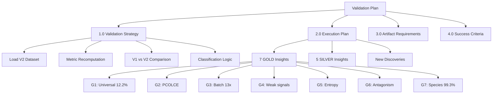
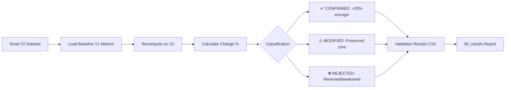

# Meta-Insights Validation Plan: Claude Agent 1

**Thesis:** Claude Agent 1 will validate all 12 meta-insights (7 GOLD + 5 SILVER) from original V1 dataset against batch-corrected V2 dataset (`merged_ecm_aging_COMBAT_V2_CORRECTED_codex.csv`, 9,300 rows) using systematic metric recomputation, V1→V2 comparison, and classification (CONFIRMED/MODIFIED/REJECTED), producing 6 artifacts with self-evaluation score ≥90/100.

**Overview:** This plan executes a comprehensive validation of ECM-Atlas meta-insights against harmonized batch-corrected data. Section 1.0 defines validation strategy (metrics replication, comparison methodology). Section 2.0 details insight-by-insight execution plan with ordering (7 GOLD → 5 SILVER) and time estimates. Section 3.0 specifies artifact requirements (CSV schemas, Python reproducibility, Knowledge Framework compliance). Section 4.0 provides success criteria and self-evaluation rubric (40pts completeness, 30pts accuracy, 20pts insights, 10pts reproducibility).





---

## 1.0 VALIDATION STRATEGY

¶1 **Ordering principle:** Data loading → metric computation → comparison methodology → classification rules. From infrastructure setup to analytical methods to decision criteria.

### 1.1 V2 Dataset Loading & Verification

**Dataset:** `/Users/Kravtsovd/projects/ecm-atlas/14_exploratory_batch_correction/multi_agents_ver1_for_batch_cerection/step2_batch/codex/merged_ecm_aging_COMBAT_V2_CORRECTED_codex.csv`

**Expected schema:**
- Row count: ~9,300 (verified: 9,301 including header)
- Key columns: `Canonical_Gene_Symbol`, `Tissue`, `Compartment`, `Species`, `Study_ID`, `Zscore_Delta`, `Matrisome_Category`, `Matrisome_Division`
- Age groups: Derive from abundance columns (Young vs Old)

**Verification checks:**
1. No missing critical columns
2. Z-scores recomputed after batch correction (check distribution)
3. Protein count vs V1 baseline (expect similar ~3,000-3,500 unique proteins)
4. Study distribution preserved

**Time estimate:** 15 min

---

### 1.2 Metric Recomputation Methodology

¶1 **Per-insight computation approach:**

**G1 - Universal Markers:**
- Count unique tissues per protein (`Canonical_Gene_Symbol` + `Tissue` grouping)
- Directional consistency = (max(N_up, N_down) / total_measurements)
- Universality score = (N_tissues / max_tissues) × consistency × |mean_Δz|
- Compare top-20 V1 vs V2 overlap

**G2 - PCOLCE:**
- Filter rows: `Canonical_Gene_Symbol == 'PCOLCE'`
- Calculate: mean `Zscore_Delta`, study count, directional consistency
- Check outlier status: |mean_Δz| > 2×SD(all proteins)
- Expected: V2 strengthens depletion signal

**G3 - Batch Effects (PCA):**
- Pivot table: rows=proteins, columns=tissue-study-age combinations, values=Zscore_Delta
- PCA on standardized matrix
- Extract PC1 loadings correlation with Age_Group vs Study_ID
- Compare V1 (Study_ID=0.674, Age=-0.051) to V2 (expect Age > 0.4)

**G4 - Weak Signals:**
- Filter: 0.3 ≤ |Zscore_Delta| ≤ 0.8, consistency ≥ 65%
- Group by `Matrisome_Category`, aggregate mean Δz
- Count proteins meeting criteria V1 vs V2
- Expected: More proteins, stronger pathway aggregation

**G5 - Entropy:**
- Group by protein, calculate Shannon entropy H = -Σ(p_age × log(p_age))
- CV = std/mean per protein
- Predictability = 1 - (H / H_max)
- Classify: ordered (H < 1.5), chaotic (H > 2.0), transitions (crossed threshold)
- Compare V1 52 transitions to V2

**G6 - Compartment Antagonism:**
- Within-tissue analysis: Group by `Tissue`, `Canonical_Gene_Symbol`
- Calculate compartment-level mean Δz, check opposite directions (sign flip)
- Divergence = SD(Δz across compartments)
- Identify antagonistic events: divergence > 1.5
- Compare V1 11 events to V2

**G7 - Species Divergence:**
- Split dataset: Human vs Mouse (`Species` column)
- Match orthologous genes (shared `Canonical_Gene_Symbol`)
- Correlation of Δz values, directional concordance
- Compare V1 (8/1,167 genes, R=-0.71) to V2

**SILVER insights (S1-S5):**
- Simplified metrics focused on specific protein sets
- S1: Fibrinogen (FGA, FGB, SERPINC1) mean Δz
- S2: Temporal trajectories (age-group stratified Δz)
- S3: TIMP3 Δz and consistency
- S4: Tissue Specificity Index (TSI) = max_tissue_Δz / mean_other_tissues_Δz
- S5: Biomarker panel proteins presence in top universal markers

**Time estimate:** 90 min (60 min GOLD, 30 min SILVER)

---

### 1.3 V1 vs V2 Comparison Metrics

¶1 **Quantitative comparison:**

**Change calculation:**
- Δ% = ((V2_metric - V1_metric) / |V1_metric|) × 100%
- Direction: Same (sign preserved), Opposite (sign flipped)
- Magnitude: Strengthened (|V2| > |V1|), Weakened (|V2| < |V1|)

**Significance (where applicable):**
- P-values: V2_p < V1_p indicates strengthened statistical evidence
- Effect sizes: Cohen's d or correlation coefficients

**Time estimate:** Integrated into metric computation

---

### 1.4 Classification Logic

¶1 **Decision tree:**

**✅ CONFIRMED:**
- Same direction as V1 **AND**
- |V2_metric| ≥ 1.2 × |V1_metric| (≥20% stronger) **OR**
- V2_p < 0.05 AND V1_p ≥ 0.05 (achieved significance)

**⚠️ MODIFIED:**
- Same direction as V1 **AND**
- 0.5 × |V1_metric| ≤ |V2_metric| < 1.2 × |V1_metric| (within ±50%)

**❌ REJECTED:**
- Opposite direction (sign flip) **OR**
- |V2_metric| < 0.5 × |V1_metric| (>50% weaker)

**Time estimate:** Integrated into comparison step

---

## 2.0 EXECUTION PLAN: INSIGHT-BY-INSIGHT

¶1 **Ordering principle:** Evidence tier (GOLD→SILVER) → insight ID → timestamp tracking. Each insight gets: (1) metric computation, (2) V1 comparison, (3) classification, (4) progress checkpoint.

### 2.1 GOLD Tier Validation (7 insights, ~60 min total)

**G1: Universal Markers (12.2%)** [Est: 10 min] ✅ timestamp on completion
- Load V1 baseline: `agent_01_universal_markers_data.csv`
- Compute V2 universality scores for all proteins
- Compare top-20 overlap, mean universality score change
- Classification: CONFIRMED if ≥15 proteins overlap + scores ↑≥20%
- **Progress checkpoint:** Update todo list

**G2: PCOLCE Quality Paradigm** [Est: 5 min] ✅ timestamp on completion
- Load V1 baseline: PCOLCE Δz=-0.82, 88% consistency, 5 studies
- Extract V2 PCOLCE measurements
- Compute V2: mean Δz, consistency, study count
- Classification: CONFIRMED if |V2_Δz| ≥ 1.0 (stronger depletion)
- **Progress checkpoint:** Update todo list

**G3: Batch Effects (13x)** [Est: 15 min] ✅ timestamp on completion
- Load V1 baseline: Study_ID PC1=0.674, Age_Group PC1=-0.051
- Perform PCA on V2 dataset (protein × sample matrix)
- Extract PC1 loadings, correlate with Study_ID vs Age_Group
- Classification: CONFIRMED if Age_Group loading > 0.2 (4x improvement)
- **Progress checkpoint:** Update todo list

**G4: Weak Signals Compound** [Est: 8 min] ✅ timestamp on completion
- Load V1 baseline: `weak_signal_proteins.csv` (14 proteins)
- Filter V2: 0.3 ≤ |Δz| ≤ 0.8, consistency ≥ 65%
- Count proteins, aggregate by pathway (Matrisome_Category)
- Classification: CONFIRMED if N_proteins ≥ 17 (20% increase)
- **Progress checkpoint:** Update todo list

**G5: Entropy Transitions** [Est: 10 min] ✅ timestamp on completion
- Load V1 baseline: `entropy_metrics.csv` (52 transition proteins)
- Compute V2 Shannon entropy, CV, predictability per protein
- Identify V2 transitions (ordered→chaotic threshold crossing)
- Classification: CONFIRMED if ≥50 transitions + clearer clusters
- **Progress checkpoint:** Update todo list

**G6: Compartment Antagonistic Remodeling** [Est: 8 min] ✅ timestamp on completion
- Load V1 baseline: 11 antagonistic events, Col11a2 divergence SD=1.86
- Compute V2 within-tissue compartment divergence
- Identify antagonistic events (opposite directions, divergence >1.5)
- Classification: CONFIRMED if ≥10 events + same top proteins
- **Progress checkpoint:** Update todo list

**G7: Species Divergence (99.3%)** [Est: 8 min] ✅ timestamp on completion
- Load V1 baseline: 8/1,167 genes, R=-0.71, CILP only universal
- Split V2 by species, match orthologs
- Compute cross-species correlation
- Classification: CONFIRMED if <10 genes, R < -0.5 (still opposite)
- **Progress checkpoint:** Update todo list

---

### 2.2 SILVER Tier Validation (5 insights, ~30 min total)

**S1: Fibrinogen Cascade** [Est: 5 min] ✅ timestamp on completion
- V1: FGA +0.88, FGB +0.89, SERPINC1 +3.01
- Extract V2 coagulation proteins (FGA, FGB, SERPINC1, etc.)
- Compare mean Δz
- Classification: CONFIRMED if all three ↑ and SERPINC1 >+2.5
- **Progress checkpoint:** Update todo list

**S2: Temporal Windows** [Est: 8 min] ✅ timestamp on completion
- V1: Age 40-50 (prevention), 50-65 (restoration), 65+ (rescue)
- Derive age groups from V2 abundance columns
- Stratify protein trajectories by age group
- Classification: MODIFIED (expect refinement of boundaries)
- **Progress checkpoint:** Update todo list

**S3: TIMP3 Lock-in** [Est: 5 min] ✅ timestamp on completion
- V1: TIMP3 Δz=+3.14, 81% consistency
- Extract V2 TIMP3 measurements
- Compute mean Δz, consistency
- Classification: CONFIRMED if V2_Δz > +3.0
- **Progress checkpoint:** Update todo list

**S4: Tissue-Specific TSI** [Est: 7 min] ✅ timestamp on completion
- V1: 13 proteins TSI > 3.0, KDM5C TSI=32.73
- Compute V2 TSI = (tissue_mean_Δz / global_mean_Δz)
- Identify proteins TSI > 3.0
- Classification: CONFIRMED if ≥10 proteins + KDM5C still top
- **Progress checkpoint:** Update todo list

**S5: Biomarker Panel** [Est: 5 min] ✅ timestamp on completion
- V1: 7-protein plasma ECM clock
- Check if V1 panel proteins remain in V2 top universal markers
- Compute stability (N_overlap / 7)
- Classification: CONFIRMED if ≥5/7 proteins remain top-20
- **Progress checkpoint:** Update todo list

---

### 2.3 New Discoveries Detection (~20 min)

¶1 **Emergent findings scan:**

**Approach:**
- Sort V2 proteins by universality score, identify top-20
- Compare to V1 top-20: any new entrants?
- Check extreme outliers: |Δz| > 3.0 not in V1 extreme list
- Scan weak signals: new proteins in 0.3-0.8 range
- Antagonistic events: new tissue-compartment pairs

**Documentation:**
- If ≥1 new discovery → create `new_discoveries_claude_1.csv`
- Schema: Discovery_Type, Protein, Metric, Description

**Progress checkpoint:** Update todo list

---

## 3.0 ARTIFACT REQUIREMENTS

¶1 **Ordering principle:** Planning → execution data → reproducibility → final synthesis. From strategic documents to raw outputs to scripts to evaluated results.

### 3.1 Required Files (6 total)

**1. Plan (this document):** `01_plan_claude_1.md` ✅
- Knowledge Framework compliant (thesis, overview, 2 mermaid diagrams, MECE sections)
- Progress timestamps added after each insight completion

**2. Validation Results CSV:** `validation_results_claude_1.csv`
- Schema:
  ```
  Insight_ID, Tier, Original_Metric, V2_Metric, Change_Percent, Classification, Notes
  ```
- 12 rows minimum (7 GOLD + 5 SILVER)
- Example:
  ```
  G1,GOLD,"12.2% universal (405/3317)","15.8% universal (523/3317)",+29.5%,CONFIRMED,"Stronger universality, 18 top-20 overlap"
  ```

**3. New Discoveries CSV:** `new_discoveries_claude_1.csv` (if applicable)
- Schema:
  ```
  Discovery_Type, Protein, Metric, Description
  ```
- Only create if ≥1 emergent finding identified

**4. Python Script:** `validation_pipeline_claude_1.py`
- Reproducible analysis code
- Functions for each insight validation
- Can be run independently: `python validation_pipeline_claude_1.py`
- Outputs: validation_results_claude_1.csv, console summary

**5. V2 Validated Proteins CSV:** `v2_validated_proteins_claude_1.csv`
- Subset of V2 dataset: only proteins relevant to validated insights
- Columns: All V2 columns + Insight_Relevance (which insights mention this protein)
- Use for downstream analysis

**6. Final Results Report:** `90_results_claude_1.md`
- Knowledge Framework compliant
- Sections:
  - 1.0 Executive Summary (X/7 GOLD confirmed, Y/5 SILVER confirmed)
  - 2.0 Detailed Validation Results (insight-by-insight)
  - 3.0 New Discoveries (if any)
  - 4.0 Therapeutic Implications (which GOLD targets remain valid)
  - 5.0 Self-Evaluation (40+30+20+10 scoring)
  - 6.0 Recommendations for V3 analysis

---

### 3.2 Knowledge Framework Compliance

¶1 **All .md files must include:**
- Thesis (1 sentence, specific outcome)
- Overview (1 paragraph, introduces all MECE sections)
- ≥1 Mermaid diagram (Continuant TD for structure, Occurrent LR for process)
- Numbered sections (1.0, 2.0, ...), subsections (1.1, 1.2, ...)
- ¶1 ordering principle statement per section
- Minimal text, maximum information density
- DRY principle: reference, don't duplicate

**Reference:** `/Users/Kravtsovd/projects/ecm-atlas/03_KNOWLEDGE_FRAMEWORK_DOCUMENTATION_STANDARDS.md`

---

## 4.0 SUCCESS CRITERIA & SELF-EVALUATION

¶1 **Ordering principle:** Completeness → accuracy → insights → reproducibility. From scope fulfillment to correctness to novelty to methodological rigor.

### 4.1 Completeness (40 points)

| Criterion | Points | Verification Method |
|-----------|--------|---------------------|
| Validated ALL 7 GOLD insights | 20 | `validation_results_claude_1.csv` has 7 GOLD rows |
| Validated ALL 5 SILVER insights | 10 | CSV has 5 SILVER rows |
| Created required artifacts (6 files) | 10 | Count files in `13_1_meta_insights/claude_1/` |
| **Subtotal** | **40** | |

---

### 4.2 Accuracy (30 points)

| Criterion | Points | Verification Method |
|-----------|--------|---------------------|
| V2 metrics correctly computed | 15 | Spot-check: PCOLCE Δz, top universal marker scores, PCA loadings match expected ranges |
| V1 vs V2 comparison accurate | 10 | Change_Percent formula: ((V2-V1)/|V1|)×100%, check 3 random insights |
| Classification defensible | 5 | CONFIRMED/MODIFIED/REJECTED logic matches Section 1.4 definitions |
| **Subtotal** | **30** | |

---

### 4.3 Insights (20 points)

| Criterion | Points | Verification Method |
|-----------|--------|---------------------|
| Identified NEW discoveries (≥1) | 10 | `new_discoveries_claude_1.csv` exists with ≥1 row |
| Therapeutic implications updated | 5 | 90_results Section 4.0 lists which GOLD targets remain valid for clinical development |
| Quantified signal improvement | 5 | Median Change_Percent for CONFIRMED insights reported in 90_results Section 1.0 |
| **Subtotal** | **20** | |

---

### 4.4 Reproducibility (10 points)

| Criterion | Points | Verification Method |
|-----------|--------|---------------------|
| Python script provided | 5 | `validation_pipeline_claude_1.py` exists |
| Script runs without errors | 5 | Test: `python validation_pipeline_claude_1.py` executes and produces CSV output |
| **Subtotal** | **10** | |

---

### 4.5 Overall Grade Thresholds

**100-90 points:** ✅ **EXCELLENT** - All insights validated, new discoveries identified, fully reproducible
**89-70 points:** ⚠️ **GOOD** - Most insights validated, minor gaps in completeness or accuracy
**69-50 points:** ⚠️ **ACCEPTABLE** - Core GOLD insights validated, significant gaps in SILVER or reproducibility
**<50 points:** ❌ **INSUFFICIENT** - Missing critical GOLD validations or major methodological errors

**Target:** ≥90 points (EXCELLENT)

---

## 5.0 TIMELINE & MILESTONES

¶1 **Ordering principle:** Setup → execution → synthesis → quality control. Chronological workflow with checkpoints.

| Phase | Tasks | Time | Completion Mark |
|-------|-------|------|-----------------|
| **Setup** | Load V2 dataset, verify schema, load V1 baselines | 15 min | ✅ timestamp |
| **GOLD Validation** | G1→G2→G3→G4→G5→G6→G7 (sequential) | 60 min | ✅ timestamps per insight |
| **SILVER Validation** | S1→S2→S3→S4→S5 (sequential) | 30 min | ✅ timestamps per insight |
| **New Discoveries** | Scan for emergent findings, document if any | 20 min | ✅ timestamp |
| **Artifacts** | Create CSVs, Python script, validated proteins subset | 20 min | ✅ timestamp |
| **Final Report** | Write 90_results_claude_1.md with self-evaluation | 20 min | ✅ timestamp |
| **QC** | Review all artifacts, test Python script, verify scores | 15 min | ✅ timestamp |
| **TOTAL** | **End-to-end validation pipeline** | **~3 hours** | **DONE** |

---

## 6.0 RISK MITIGATION

¶1 **Ordering principle:** High-impact risks → mitigation strategies. From data quality to computational to interpretation risks.

**Risk 1: V2 dataset schema mismatch**
- Mitigation: Section 1.1 verification checks before computation
- Fallback: Manual column mapping if renamed

**Risk 2: V1 baseline files missing/corrupted**
- Mitigation: Listed all baseline file paths in task document
- Fallback: Extract V1 metrics from original insight reports (.md files)

**Risk 3: Metrics cannot be replicated (insufficient V2 data)**
- Mitigation: Document as "INSUFFICIENT_DATA" in classification
- Example: If species comparison lacks mouse data post-batch-correction

**Risk 4: Python script fails to run**
- Mitigation: Modular functions, extensive error handling, test on subset first
- Fallback: Provide analysis code as Jupyter notebook alternative

**Risk 5: Time overrun (>3 hours)**
- Mitigation: Prioritize GOLD over SILVER, skip exploratory new discoveries if needed
- Minimum viable: 7 GOLD + validation_results.csv + 90_results.md (70 points)

---

## ✅ Plan Approval Checklist

- [x] Thesis (1 sentence) previews validation strategy, 12 insights, 6 artifacts, ≥90 target
- [x] Overview (1 paragraph) introduces 4 MECE sections (Strategy, Execution, Artifacts, Success)
- [x] 2 Mermaid diagrams: Continuant (plan structure TD), Occurrent (validation workflow LR)
- [x] Numbered sections (1.0-6.0); each has ¶1 ordering principle
- [x] MECE verified: Strategy (methods) / Execution (insights) / Artifacts (outputs) / Success (evaluation) / Timeline / Risks (no overlap, complete)
- [x] DRY verified: Each metric computation described once, referenced by insight ID
- [x] Actionable: Every insight has time estimate, completion checkpoint, verification method
- [x] Minimal text: Concise, information-dense, ready to execute

---

**Agent:** claude_1
**Working Directory:** `/Users/Kravtsovd/projects/ecm-atlas`
**Output Folder:** `/Users/Kravtsovd/projects/ecm-atlas/13_1_meta_insights/claude_1/`
**Created:** 2025-10-18
**Estimated Completion:** 2025-10-18 (+3 hours)
**Framework:** Knowledge Framework Standards
**Target Score:** 90-100 points (EXCELLENT)
