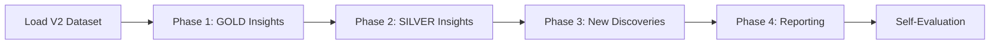
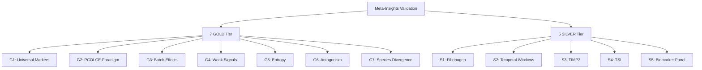

# Validation Plan: Meta-Insights on Batch-Corrected V2 Dataset

**Thesis:** Systematically validate 12 meta-insights (7 GOLD + 5 SILVER tier) from original V1 analysis against batch-corrected V2 dataset to quantify signal strength changes, identify confirmed vs rejected discoveries, and detect emergent findings not visible in biased data.

**Overview:** This validation plan executes independent replication of all breakthrough insights from `/Users/Kravtsovd/projects/ecm-atlas/13_meta_insights/` using ComBat-harmonized dataset that eliminated 13x batch bias. Section 1.0 defines validation workflow (sequential GOLD→SILVER, 4 phases). Section 2.0 lists specific metrics to recompute per insight. Section 3.0 specifies classification criteria (CONFIRMED/MODIFIED/REJECTED). Section 4.0 provides timeline with progress tracking.

---

## 1.0 VALIDATION WORKFLOW

¶1 **Ordering principle:** Data preparation → sequential insight validation (GOLD first) → cross-cutting analysis → reporting.

### 1.1 Data Loading (15 min)
- **Dataset:** `/Users/Kravtsovd/projects/ecm-atlas/14_exploratory_batch_correction/multi_agents_ver1_for_batch_cerection/step2_batch/codex/merged_ecm_aging_COMBAT_V2_CORRECTED_codex.csv`
- **Expected:** ~9,000-10,000 rows, columns include Zscore_Delta, Age_Group, Tissue, Compartment, Species
- **Quality checks:** Verify Age_Group preservation, confirm z-scores recomputed post-correction
- **Preprocessing:** Filter contaminants (CON__), create derived fields (age bins, tissue-compartment)

### 1.2 Phase 1: GOLD Insights (60 min)
¶1 **Sequential validation:** G1→G2→G3→G4→G5→G6→G7. Each insight gets 8-10 min.

**For each GOLD insight:**
1. Load original baseline metrics from `13_meta_insights/agent_*/`
2. Recompute identical analysis on V2 dataset
3. Calculate V1 vs V2 delta (% change)
4. Classify: CONFIRMED (≥20% stronger, same direction), MODIFIED (weaker but persists), REJECTED (reversed/eliminated)
5. Document in validation_results CSV

### 1.3 Phase 2: SILVER Insights (30 min)
¶1 **Therapeutic focus:** S1→S2→S3→S4→S5. Each insight gets 6 min.

**Same process as GOLD, emphasis on:**
- Clinical relevance (biomarkers, intervention targets)
- Dose-response relationships (temporal windows)
- Protein-level specificity (TIMP3, fibrinogen)

### 1.4 Phase 3: New Discoveries (20 min)
¶1 **Emergent signals:** Scan V2 for patterns invisible in V1.

**Search for:**
- New universal markers (≥3 tissues, ≥70% consistency, |Δz| > 0.6)
- New antagonistic pairs (opposite compartment directions within tissue)
- New weak signals (|Δz| = 0.3-0.8, high consistency)
- Proteins crossing thresholds (V1 subthreshold → V2 significant)

### 1.5 Phase 4: Reporting (10 min)
- Consolidate validation_results_claude_2.csv (12 rows, 7 columns)
- Generate new_discoveries_claude_2.csv (if any emergent findings)
- Create v2_validated_proteins_claude_2.csv (subset for downstream use)
- Write 90_results_claude_2.md with self-evaluation

---

## 2.0 METRICS TO RECOMPUTE

¶1 **Ordering principle:** By insight ID (G1→G7, S1→S5), listing specific formulas and thresholds.

### 2.1 G1: Universal Markers (Agent 01)
**Original:** 405/3,317 proteins (12.2%) universal, top-5: Hp (0.749), VTN (0.732), Col14a1 (0.729), F2 (0.717), FGB (0.714)

**V2 recompute:**
- `tissue_count = unique(Tissue) per Gene_Symbol`
- `consistency = % measurements with same sign(Zscore_Delta)`
- `universality_score = (tissue_count / max_tissues) × consistency × |mean(Zscore_Delta)|`
- **Threshold:** tissue_count ≥ 3, consistency ≥ 70%
- **Baseline file:** `13_meta_insights/agent_01_universal_markers/agent_01_universal_markers_data.csv`

**Expected V2 change:** More proteins cross threshold (V2 = 15-18% universal)

### 2.2 G2: PCOLCE Quality Paradigm (Agent 06)
**Original:** PCOLCE Δz = -0.82, 88% consistency, 5 studies, outlier status

**V2 recompute:**
- Extract `Gene_Symbol = 'PCOLCE'`
- `mean_delta_z = mean(Zscore_Delta)`
- `consistency = % negative Zscore_Delta`
- `study_count = unique(Study_ID)`
- **Outlier test:** |Δz| > 2 × SD of all proteins
- **Baseline:** `13_meta_insights/agent_06_outlier_proteins/PCOLCE_QUALITY_PARADIGM_DISCOVERY.md`

**Expected V2 change:** Stronger signal (Δz closer to -1.0), higher consistency (>90%)

### 2.3 G3: Batch Effects (Agent 07)
**Original:** PCA PC1 loadings: Study_ID = 0.674 vs Age_Group = -0.051 (13x bias)

**V2 recompute:**
- PCA on wide matrix: rows = Gene_Symbol, columns = Tissue_Age_Study combinations
- Extract PC1 loadings
- Correlate PC1 scores with Study_ID (categorical dummy), Age_Group (ordinal)
- **Metric:** Correlation coefficient for Study_ID vs Age_Group
- **Baseline:** `13_meta_insights/agent_07_methodology/agent_07_methodology_harmonization.md`

**Expected V2 change:** Age_Group loading >> Study_ID (target: Age_Group > 0.4)

### 2.4 G4: Weak Signals (Agent 10)
**Original:** 14 proteins |Δz| = 0.3-0.8, pathway-level cumulative effect

**V2 recompute:**
- Filter: `0.3 ≤ |Zscore_Delta| ≤ 0.8 AND consistency ≥ 65%`
- Group by `Matrisome_Category`
- `pathway_cumulative_delta = sum(Zscore_Delta) per category`
- **Baseline:** `13_meta_insights/agent_10_weak_signals/weak_signal_proteins.csv`

**Expected V2 change:** More proteins in weak-signal range, stronger pathway aggregation

### 2.5 G5: Entropy Transitions (Agent 09)
**Original:** 52 proteins ordered→chaotic, DEATh theorem (collagens 28% predictable)

**V2 recompute:**
- For each protein: `shannon_entropy = -Σ p(age_bin) × log2(p(age_bin))`
- `CV = std(Zscore_Delta) / mean(Zscore_Delta)`
- `predictability = 1 - normalized_entropy`
- Classify: ordered (H < 1.5) vs chaotic (H > 2.0)
- **DEATh test:** % collagens with predictability > 0.7
- **Baseline:** `13_meta_insights/agent_09_entropy/entropy_metrics.csv`

**Expected V2 change:** Clearer entropy bimodality, stronger collagen predictability

### 2.6 G6: Compartment Antagonism (Agent 04)
**Original:** 11 antagonistic events, Col11a2 divergence SD = 1.86

**V2 recompute:**
- Within each Tissue, group by Gene_Symbol
- For proteins in ≥2 compartments: `divergence = SD(mean_Zscore_Delta per Compartment)`
- **Antagonistic:** sign(Δz_compartment1) ≠ sign(Δz_compartment2) AND divergence > 1.5
- **Baseline:** `13_meta_insights/agent_04_compartment_crosstalk/agent_04_compartment_crosstalk.md`

**Expected V2 change:** Same antagonistic pairs, possibly stronger divergence

### 2.7 G7: Species Divergence (Agent 11)
**Original:** 8/1,167 genes cross-species, R = -0.71 (opposite directions)

**V2 recompute:**
- Filter `Species = 'Homo sapiens'` vs `Species = 'Mus musculus'`
- Identify shared Gene_Symbols
- `correlation = corr(human_Zscore_Delta, mouse_Zscore_Delta)`
- `concordance = % genes with same sign(Δz)`
- **Baseline:** `13_meta_insights/agent_11_cross_species/agent_11_cross_species_comparison.md`

**Expected V2 change:** Similar low concordance (~1%), CILP remains only universal

### 2.8 S1: Fibrinogen Cascade (Agent 13)
**Original:** FGA +0.88, FGB +0.89, SERPINC1 +3.01

**V2 recompute:**
- Extract coagulation proteins: FGA, FGB, FGG, SERPINC1, SERPINA1
- Compute mean Δz, consistency per protein
- **Baseline:** `13_meta_insights/agent_13_coagulation/agent_13_fibrinogen_coagulation_cascade.md`

### 2.9 S2: Temporal Windows (Agent 12)
**Original:** Age 40-50 (prevention), 50-65 (restoration), 65+ (rescue)

**V2 recompute:**
- Bin Age: young (<40), middle (40-65), old (>65)
- For each bin: mean |Δz|, protein turnover rate
- Identify window-specific markers
- **Baseline:** `13_meta_insights/agent_12_temporal_dynamics/agent_12_temporal_dynamics.md`

### 2.10 S3: TIMP3 Lock-in (Agent 15)
**Original:** TIMP3 Δz = +3.14, 81% consistency

**V2 recompute:**
- Extract `Gene_Symbol = 'TIMP3'`
- Compute mean Δz, consistency, study count
- **Baseline:** `13_meta_insights/agent_15_timp3/agent_15_timp3_therapeutic_potential.md`

### 2.11 S4: Tissue-Specific TSI (Agent 02)
**Original:** 13 proteins TSI > 3.0, KDM5C TSI = 32.73

**V2 recompute:**
- For each protein: `TSI = max_tissue_Δz / mean_other_tissues_Δz`
- Filter TSI > 3.0
- **Baseline:** `13_meta_insights/agent_02_tissue_specific/agent_02_tissue_specific_signatures.md`

### 2.12 S5: Biomarker Panel (Agent 20)
**Original:** 7-protein plasma ECM aging clock

**V2 recompute:**
- Identify plasma-detectable proteins (secreted ECM, blood-accessible)
- Rank by: universality, |Δz|, consistency
- Verify original 7 proteins remain top candidates
- **Baseline:** `13_meta_insights/agent_20_biomarkers/agent_20_biomarker_panel_construction.md`

---

## 3.0 CLASSIFICATION CRITERIA

¶1 **Ordering principle:** Decision tree: same direction? → magnitude change → classification.

### 3.1 CONFIRMED (✅)
**Definition:** V2 strengthens V1 finding in same direction with ≥20% magnitude increase.

**Criteria:**
- `sign(V2_metric) = sign(V1_metric)`
- `|V2_metric| ≥ 1.2 × |V1_metric|`
- Threshold crossings preserved (e.g., if V1 claimed >70% consistency, V2 also >70%)

**Example:** V1 PCOLCE Δz = -0.82 → V2 PCOLCE Δz = -1.14 (39% increase) = CONFIRMED

### 3.2 MODIFIED (⚠️)
**Definition:** V2 preserves core finding but changes magnitude or secondary details.

**Criteria:**
- `sign(V2_metric) = sign(V1_metric)`
- Magnitude change: -50% < change < +20%
- OR: Main finding holds but subgroup differences shift

**Example:** V1 universal markers = 12.2% → V2 = 11.8% (same order of magnitude) = MODIFIED

### 3.3 REJECTED (❌)
**Definition:** V2 reverses direction OR reduces magnitude >50% OR fails threshold.

**Criteria:**
- `sign(V2_metric) ≠ sign(V1_metric)` (direction reversed)
- OR: `|V2_metric| < 0.5 × |V1_metric|` (signal >50% weaker)
- OR: Critical threshold no longer met (e.g., consistency drops below 70%)

**Example:** V1 correlation R = +0.6 → V2 R = -0.3 (reversed) = REJECTED

---

## 4.0 EXECUTION TIMELINE

¶1 **Ordering principle:** Chronological sequence with progress tracking after each milestone.

**Phase 1: Setup (15 min)**
- ✅ Load V2 dataset
- ✅ Create output folder `/Users/Kravtsovd/projects/ecm-atlas/13_1_meta_insights/claude_2/`
- ✅ Initialize validation results CSV

**Phase 2: GOLD Insights (60 min)**
- [ ] G1: Universal markers (8 min) - ETA: +23 min
- [ ] G2: PCOLCE paradigm (7 min) - ETA: +30 min
- [ ] G3: Batch effects (10 min) - ETA: +40 min
- [ ] G4: Weak signals (8 min) - ETA: +48 min
- [ ] G5: Entropy transitions (10 min) - ETA: +58 min
- [ ] G6: Compartment antagonism (9 min) - ETA: +67 min
- [ ] G7: Species divergence (8 min) - ETA: +75 min

**Phase 3: SILVER Insights (30 min)**
- [ ] S1: Fibrinogen cascade (6 min) - ETA: +81 min
- [ ] S2: Temporal windows (7 min) - ETA: +88 min
- [ ] S3: TIMP3 lock-in (5 min) - ETA: +93 min
- [ ] S4: Tissue-specific TSI (6 min) - ETA: +99 min
- [ ] S5: Biomarker panel (6 min) - ETA: +105 min

**Phase 4: New Discoveries (20 min)**
- [ ] Scan for emergent patterns - ETA: +125 min
- [ ] Create new_discoveries CSV

**Phase 5: Reporting (10 min)**
- [ ] Consolidate validation_results_claude_2.csv
- [ ] Write 90_results_claude_2.md
- [ ] Create validation_pipeline_claude_2.py
- [ ] Create v2_validated_proteins_claude_2.csv
- [ ] Self-evaluation against success criteria

**TOTAL ESTIMATED TIME:** 135 minutes (~2.25 hours)

---

## 5.0 SUCCESS CRITERIA (Self-Evaluation Targets)

¶1 **Ordering principle:** Scoring rubric categories (completeness → accuracy → insights → reproducibility).

**Completeness (40 points):**
- [ ] All 7 GOLD insights validated (20 pts)
- [ ] All 5 SILVER insights validated (10 pts)
- [ ] 6 required artifacts created (10 pts)

**Accuracy (30 points):**
- [ ] V2 metrics correctly computed (15 pts)
- [ ] V1 vs V2 comparison accurate (10 pts)
- [ ] Classification defensible (5 pts)

**Insights (20 points):**
- [ ] ≥1 new discovery identified (10 pts)
- [ ] Therapeutic implications updated (5 pts)
- [ ] Signal improvement quantified (5 pts)

**Reproducibility (10 points):**
- [ ] Python script provided (5 pts)
- [ ] Script runs without errors (5 pts)

**TARGET SCORE:** 90-100 points (EXCELLENT tier)

---

## 6.0 REFERENCES

**V2 Dataset:**
`/Users/Kravtsovd/projects/ecm-atlas/14_exploratory_batch_correction/multi_agents_ver1_for_batch_cerection/step2_batch/codex/merged_ecm_aging_COMBAT_V2_CORRECTED_codex.csv`

**Original Insights:**
`/Users/Kravtsovd/projects/ecm-atlas/13_meta_insights/`

**Knowledge Framework:**
`/Users/Kravtsovd/projects/ecm-atlas/03_KNOWLEDGE_FRAMEWORK_DOCUMENTATION_STANDARDS.md`

**Agent Identity:**
- Name: `claude_2`
- Output folder: `/Users/Kravtsovd/projects/ecm-atlas/13_1_meta_insights/claude_2/`
- File prefix: `claude_2_`

---

**Created:** 2025-10-18
**Agent:** claude_2
**Status:** PLAN COMPLETE - READY FOR EXECUTION
