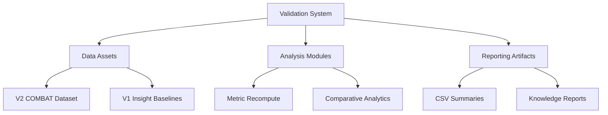
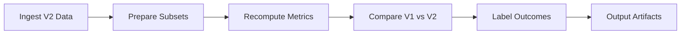

# codex Meta-Insights V2 Validation Plan

**Thesis:** Validate 7 GOLD and 5 SILVER insights on COMBAT V2 data by orchestrating data preparation, metric recomputation, and evidence synthesis to produce reproducible artifacts.

**Overview:** Plan enumerates required data assets, defines validation workstreams for GOLD and SILVER insights, and maps deliverables plus QA controls to guarantee reproducibility. Section 1.0 inventories inputs; Section 2.0 sequences validation tactics; Section 3.0 covers outputs, checkpoints, and toolchain alignment.

## 1.0 Data Assets

¶1 *Ordering principle: availability → dependency → derivation.*
¶2 V2 source: `14_exploratory_batch_correction/multi_agents_ver1_for_batch_cerection/step2_batch/codex/merged_ecm_aging_COMBAT_V2_CORRECTED_codex.csv` provides harmonized measurements across tissues, ages, and species.
¶3 Baseline catalogs in `13_meta_insights/` folders supply V1 universality tables, entropy metrics, PCA loadings, and narrative evidence to anchor comparisons.
¶4 Auxiliary references: `00_MASTER_META_INSIGHTS_CATALOG.md` for IDs and success labels; documentation standards in `03_KNOWLEDGE_FRAMEWORK_DOCUMENTATION_STANDARDS.md` guide report structure.

## 2.0 Validation Workstreams

¶1 *Ordering principle: tier priority → analytic pattern → classification protocol.*

### 2.1 GOLD Insights

¶1 Recompute universality matrix for G1 using tissue coverage and consistency thresholds identical to V1; capture top marker deltas.
¶2 Quantify PCOLCE effect size (Δz, consistency, z-distribution) for G2, flag deviations beyond ±0.1.
¶3 Execute PCA (features scaled) for G3, extract Age_Group vs Study_ID loadings, target ≥0.4 Age_Group loading.
¶4 For G4, aggregate weak-signal proteins by |Δz| bracket (0.3–0.8), compute pathway z-sum change.
¶5 For G5, calculate Shannon entropy and coefficient of variation per protein to detect ordered→chaotic transitions.
¶6 For G6, evaluate compartment pairs for antagonistic sign flips with divergence statistics.
¶7 For G7, align human vs mouse homologs, compute correlation and concordance counts.

### 2.2 SILVER Insights

¶1 For S1, evaluate fibrinogen cascade z-scores and confidence intervals against V1 ranks.
¶2 For S2, profile age-window trajectories (40–50, 50–65, 65+) with slope metrics.
¶3 For S3, inspect TIMP3 expression lock-in via longitudinal variance and threshold shifts.
¶4 For S4, recompute tissue-specific intensity (TSI) indices to confirm localization pattern.
¶5 For S5, regenerate biomarker panel ROC-style separability metrics or z-gap summary.

### 2.3 Classification & Discovery

¶1 Map each insight to CONFIRMED/MODIFIED/REJECTED using quantitative thresholds defined per insight; track rationales.
¶2 Scan residual analyses for emergent signals (≥0.4 Δz or novel co-regulation) to populate new discoveries file.

## 3.0 Deliverables & QA

¶1 *Ordering principle: execution sequence → verification → dissemination.*
¶2 Implement `validation_pipeline_codex.py` to automate ingestion, metric recompute, comparisons, and CSV exports.
¶3 Generate `validation_results_codex.csv` summarizing V1 vs V2 metrics, classification, and change percentages for all 12 insights.
¶4 Derive `v2_validated_proteins_codex.csv` capturing protein-level metrics supporting confirmed insights.
¶5 Document `new_discoveries_codex.csv` for emergent findings meeting discovery criteria.
¶6 Author `90_results_codex.md` with Knowledge Framework structure, include self-evaluation vs scoring rubric, median change statistics, and validation status overview.
¶7 QA steps: dry-run script end-to-end, cross-check spot metrics (PCOLCE Δz, Age_Group loading), ensure CSV schemas align with requirements, version control statuses reviewed prior to handoff.

---
- [ ] Ingest V2 dataset
- [ ] Compile V1 baselines
- [ ] Implement validation pipeline
- [ ] Validate GOLD insights
- [ ] Validate SILVER insights
- [ ] Produce discovery scan
- [ ] Export required artifacts
- [ ] Draft final report & self-review
