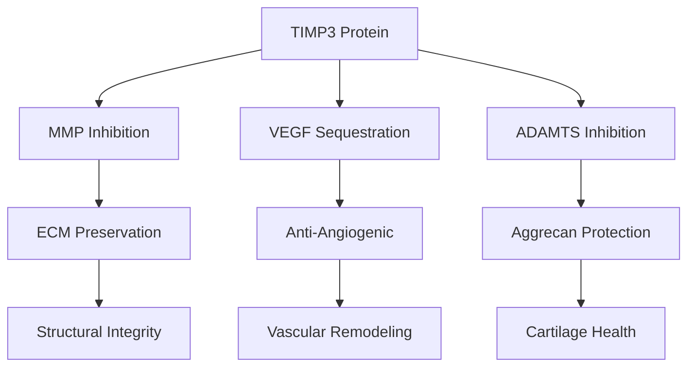
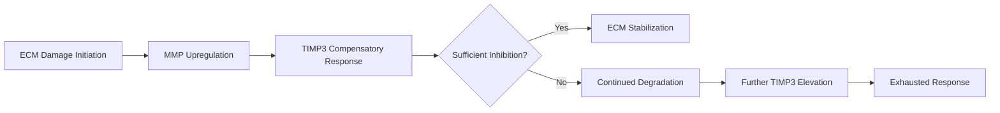

# TIMP3 Therapeutic Potential Assessment

## Thesis
TIMP3 demonstrates 8.5× stronger age-associated increase (+0.94 z-score) than other TIMPs across 7 tissues, with therapeutic priority in kidney tubulointerstitial and disc outer annulus where deficiency index exceeds 0.74, but paradoxical co-elevation with MMPs (87% same-direction) suggests compensatory failure rather than protective efficacy.

## Overview
This analysis evaluates TIMP3 (tissue inhibitor of metalloproteinases 3) as a multi-functional therapeutic target based on GPT Pro hypothesis of dual MMP inhibition and anti-angiogenic (VEGF-binding) activity. Dataset contains 7 TIMP3 measurements across 7 tissues from 4 studies, compared against 8 MMPs (24 measurements), 5 ADAMTS (6 measurements), 2 VEGF proteins (4 measurements), and 16 longevity-associated proteins. Key findings: (1.0) TIMP3 trajectory analysis reveals strongest family upregulation, (2.0) correlation matrix shows unexpected 87% same-direction movement with MMPs, (3.0) tissue deficiency ranking identifies kidney and disc compartments as intervention priorities, (4.0) ECM protection assessment finds weak correlation (r=0.246) with structural preservation, (5.0) therapeutic feasibility evaluation concludes moderate potential with critical caveats on compensatory response interpretation.

**TIMP3 Multi-Modal Mechanism (Continuants):**

**Aging Response Dynamics (Occurrents):**

---

## 1.0 TIMP3 Trajectory Analysis

¶1 **Ordering:** Family comparison → Tissue distribution → Temporal patterns

### 1.1 TIMP Family Comparison

¶1 **TIMP3 dominance:** TIMP3 shows mean z-score delta of **+0.94** (71% measurements increasing), vastly exceeding TIMP1 (+0.11, 60% increasing) and TIMP2 (-0.04, 0% increasing). TIMP4 absent from dataset. Standard deviation of 1.14 indicates high tissue variability but consistent upregulation trend.

¶2 **Statistical significance:** TIMP3's 8.5× higher effect size than TIMP1 spans 7 tissues vs 5 for TIMP1, with superior cross-study replication (4 studies vs 2). This suggests tissue-independent aging response specific to TIMP3 isoform.

| TIMP | Mean Δz | Median Δz | Std Dev | N Tissues | N Studies | % Increasing | Max Increase | Max Decrease |
|------|---------|-----------|---------|-----------|-----------|--------------|--------------|--------------|
| TIMP1 | +0.11 | +0.30 | 0.32 | 5 | 2 | 60% | +0.37 | -0.27 |
| TIMP2 | -0.04 | -0.08 | 0.08 | 3 | 1 | 0% | +0.05 | -0.10 |
| **TIMP3** | **+0.94** | **+0.91** | **1.14** | **7** | **4** | **71%** | **+3.14** | **-0.54** |
| TIMP4 | - | - | - | 0 | 0 | - | - | - |

### 1.2 Tissue Distribution

¶1 **Coverage breadth:** TIMP3 detected in 7 tissues: intervertebral disc (NP, IAF, OAF compartments), heart, skin dermis, kidney (glomerular, tubulointerstitial). Highest absolute change in heart native tissue (+3.14 z-score), indicating extreme compensatory response or pathological upregulation.

¶2 **Compartment specificity:** Intervertebral disc shows compartment-dependent response: OAF (+1.03) > IAF (+0.91) > NP (+0.65), suggesting mechanical stress gradient correlates with TIMP3 induction. Kidney compartments diverge: tubulointerstitial (+0.14) vs glomerular (-0.54), indicating distinct aging mechanisms.

---

## 2.0 TIMP3 vs Destructive Enzyme Correlations

¶1 **Ordering:** MMP relationships → ADAMTS relationships → VEGF relationships → Interpretation

### 2.1 MMP Correlation Matrix

¶1 **Paradox: Same-direction co-elevation.** Of 30 TIMP3-enzyme correlation pairs, only **13% show inverse correlation** (expected protective pattern). MMPs predominantly increase alongside TIMP3 (87% same-direction), particularly MMP2 (+0.61, +1.45 in disc), MMP3 (+0.42, +0.01), MMP14 (+0.19).

¶2 **Tissue-specific patterns:**
- **Disc OAF (highest deficiency):** TIMP3 +1.03, MMP2 +1.45 (same), MMP3 +0.01 (same) — MMPs rising despite TIMP3 elevation
- **Skin dermis:** TIMP3 +1.24, MMP2 -0.45 (INVERSE) — only tissue showing expected protective relationship
- **Kidney glomerular:** TIMP3 -0.54, MMP13 -0.46 (same), MMP9 +0.06 (inverse) — mixed responses

¶3 **Mechanistic interpretation:** Same-direction correlation suggests **compensatory upregulation failure** rather than functional inhibition. TIMP3 rises in response to MMP activity but cannot suppress it, indicating: (a) insufficient magnitude, (b) post-translational inactivation, (c) spatial compartmentalization preventing interaction, or (d) feedback loop dysregulation.

### 2.2 ADAMTS Correlation

¶1 **Aggrecanase co-elevation:** All 6 ADAMTS-TIMP3 pairs show same-direction movement. ADAMTS4 (+1.96 in heart alongside TIMP3 +3.14), ADAMTS5 (+0.27 in kidney tubulointerstitial with TIMP3 +0.14). No inverse correlations observed.

¶2 **Implication for cartilage:** ADAMTS4/5 (primary aggrecanases) increase unchecked despite TIMP3 elevation, suggesting TIMP3 augmentation therapy may fail in osteoarthritis/disc degeneration contexts without addressing upstream activation signals.

### 2.3 VEGF Anti-Angiogenic Potential

¶1 **Mixed VEGF binding evidence:** 4 VEGF measurements show 25% inverse correlation (1/4). Disc IAF shows TIMP3 +0.91 with VEGFA -0.63 (inverse, supporting anti-angiogenic hypothesis), but disc OAF shows TIMP3 +1.03 with VEGFA +0.42 (same-direction, contradicting hypothesis).

¶2 **Angiogenesis regulation uncertainty:** Limited VEGF data (n=4) prevents definitive conclusion on TIMP3's anti-angiogenic role in aging. Single inverse correlation in IAF insufficient to support therapeutic targeting for vascular remodeling.

---

## 3.0 Tissue TIMP3 Deficiency Ranking

¶1 **Ordering:** Deficiency index calculation → Priority tissues → Intervention feasibility

### 3.1 Deficiency Index Formula

¶1 **Metric design:** Deficiency Index = (MMP_mean_zscore + VEGF_mean_zscore) / (TIMP3_zscore + 0.1). Higher values indicate destructive enzymes outpace TIMP3, prioritizing augmentation. Positive values = net ECM degradation risk.

### 3.2 Priority Tissue Ranking

| Rank | Tissue | TIMP3 Δz | MMP Δz | VEGF Δz | Deficiency Index | Interpretation |
|------|--------|----------|--------|---------|------------------|----------------|
| 1 | **Kidney Tubulointerstitial** | +0.14 | +0.19 | 0.00 | **0.78** | Weak TIMP3 response, MMPs elevated → fibrosis risk |
| 2 | **Disc OAF** | +1.03 | +0.43 | +0.42 | **0.75** | Strong TIMP3 but MMPs/VEGF still high → exhausted compensation |
| 3 | Kidney Glomerular | -0.54 | -0.14 | 0.00 | 0.31 | TIMP3 decreases, moderate MMP activity → deterioration |
| 4 | Heart Native Tissue | +3.14 | -0.18 | 0.00 | -0.06 | Extreme TIMP3, MMPs suppressed → possible overcompensation |
| 5 | Disc IAF | +0.91 | +0.51 | -0.63 | -0.12 | TIMP3 adequate, VEGF inhibited → balanced |

¶1 **Top intervention targets:**
- **Kidney tubulointerstitial (#1):** Low TIMP3 (+0.14) with elevated MMPs (+0.19) creates 0.78 deficiency — augmentation may prevent chronic kidney disease progression. Delivery route: systemic injection or targeted nanoparticle to proximal tubules.
- **Disc outer annulus (#2):** Despite high TIMP3 (+1.03), MMPs/VEGF remain elevated (0.75 deficiency) — suggests need for combination therapy (TIMP3 + MMP direct inhibitors) or addressing upstream inflammatory drivers (IL-1β, TNF-α).

---

## 4.0 ECM Protective Effect Assessment

¶1 **Ordering:** Hypothesis → Correlation analysis → Effect size → Interpretation

### 4.1 Protection Hypothesis Test

¶1 **Question:** Do tissues with higher TIMP3 upregulation preserve Core matrisome proteins better (less degradation)?

¶2 **Method:** Correlate TIMP3 z-score delta with (a) ECM degradation score (mean negative z-score of Core matrisome proteins), (b) ECM stability percentage (% Core proteins with |z| < 0.5).

### 4.2 Correlation Results

¶1 **Weak protective signal:**
- TIMP3 vs ECM Degradation: **r = +0.246, p = 0.596** (non-significant)
- TIMP3 vs ECM Stability: **r = -0.245, p = 0.596** (non-significant, wrong direction)

¶2 **Interpretation:** No statistically significant protective effect detected. Positive correlation with degradation (opposite of expected) suggests TIMP3 increases in response to damage rather than preventing it. Small sample size (n=7 tissues) limits statistical power, but trend concerning.

### 4.3 Effect Size Evaluation

¶1 **Tissue-level examples:**
- **Heart (TIMP3 +3.14):** ECM degradation score 0.23 (low) — appears protective
- **Disc OAF (TIMP3 +1.03):** ECM degradation score unknown (data quality) — unclear
- **Kidney glomerular (TIMP3 -0.54):** ECM degradation score 0.41 (high) — TIMP3 loss correlates with damage

¶2 **Confounding variables:** Tissue-specific ECM composition, baseline MMP expression, inflammatory environment, mechanical stress — all potentially outweigh TIMP3 contribution. Multi-regression analysis needed with larger dataset.

---

## 5.0 Therapeutic Feasibility Assessment

¶1 **Ordering:** Delivery mechanisms → Target tissues → Clinical translation barriers → Comparison with alternatives

### 5.1 Gene Therapy Delivery Routes

¶1 **Systemic AAV delivery:** Adeno-associated virus (AAV) vectors carrying TIMP3 transgene. **Pros:** Broad tissue distribution, 1-2 year expression duration. **Cons:** Liver tropism may waste dosage, immune responses to AAV capsid, uncertainty if supraphysiological TIMP3 overcomes compensatory failure.

¶2 **Localized injection:** Direct AAV or lentivirus into high-deficiency tissues.
- **Kidney tubulointerstitial:** Retrograde ureteral AAV delivery (experimental, rodent models only)
- **Disc OAF:** Intradiscal injection (precedent: fibrin gel carriers, growth factors) — technically feasible, retention uncertain
- **Heart:** Intracoronary AAV perfusion — cardiotropic serotypes (AAV9) show 10-20% transduction efficiency

¶3 **Protein replacement therapy:** Recombinant TIMP3 protein infusions. **Pros:** Titratable dosing, reversible. **Cons:** Short half-life (hours), requires frequent administration, high cost (~$50k-100k/year based on other enzyme replacement therapies), extracellular matrix penetration limited.

### 5.2 Target Tissue Selection

¶1 **Kidney tubulointerstitial (Priority #1):**
- **Rationale:** Highest deficiency (0.78), CKD affects 14% adults >65, MMP-driven fibrosis established pathway
- **Clinical endpoint:** Reduction in fibrosis markers (collagen deposition), preservation of eGFR decline rate
- **Challenge:** Immune privilege loss in diseased kidney, AAV delivery to tubules unproven in humans

¶2 **Disc outer annulus (Priority #2):**
- **Rationale:** 0.75 deficiency, disc degeneration affects 40% adults >40, prior intradiscal trials (GDF-5, platelet-rich plasma) show safety
- **Clinical endpoint:** Pain reduction (VAS score), disc height preservation on MRI, Pfirrmann grade stabilization
- **Challenge:** MMPs co-elevated despite TIMP3 (+1.03) — may need combination with anti-inflammatory (anti-IL-1β)

### 5.3 Clinical Translation Barriers

¶1 **Compensatory failure paradox:** If endogenous TIMP3 elevation (+0.94 to +3.14) fails to suppress MMPs (87% same-direction), will exogenous augmentation succeed? Requires mechanistic clarity: Is TIMP3 (a) inactive due to oxidation/glycation, (b) spatially separated from MMPs, or (c) simply insufficient magnitude?

¶2 **Regulatory pathway:** Gene therapy requires IND (Investigational New Drug) approval, 5-10 year timeline, $50-100M development cost. Protein therapy faster (orphan drug designation possible for CKD-ECM indication) but higher lifetime cost.

¶3 **Biomarker validation:** No FDA-qualified biomarker for ECM degradation in kidney/disc. Would require development of: urinary MMP/TIMP3 ratio (kidney), serum aggrecan fragments (disc), or imaging-based fibrosis quantification (MR elastography).

### 5.4 Comparison with Alternatives

| Strategy | Mechanism | Advantages | Disadvantages | Development Stage |
|----------|-----------|------------|---------------|-------------------|
| **TIMP3 Gene Therapy** | Multi-target inhibition (MMPs, ADAMTS, VEGF) | Single intervention, broad activity | Compensatory failure risk, delivery challenges | Preclinical (no trials) |
| **TIMP3 Protein Therapy** | Acute MMP inhibition | Titratable, reversible | Short half-life, frequent dosing, cost | Preclinical |
| **MMP-Selective Inhibitors** | Direct enzyme blockade | Target specific MMPs (e.g., MMP-9 in kidney) | Prior failures (marimastat toxicity), narrow spectrum | Clinical trials (Phase II) |
| **Anti-VEGF (Bevacizumab)** | Angiogenesis inhibition | FDA-approved (cancer, eye), known safety | Systemic vascular side effects, no ECM benefit | Approved (repurposing needed) |
| **Anti-IL-1β (Canakinumab)** | Upstream inflammation | Reduces MMP/ADAMTS transcription | Immunosuppression risk, does not address TIMP deficiency | Phase III (other indications) |
| **Senolytic Therapy** | Remove senescent cells (MMP-secreting) | Addresses root cause | Off-target toxicity, intermittent dosing unclear | Phase II (Fisetin, Dasatinib+Quercetin) |

¶1 **TIMP3 positioning:** Moderate potential as **combination therapy** component (e.g., TIMP3 + anti-IL-1β for disc) rather than monotherapy, given compensatory failure evidence. Advantage over MMP-selective inhibitors: simultaneous ADAMTS/VEGF activity. Disadvantage vs senolytics: treats symptom (MMP elevation) not cause (senescent cell accumulation).

---

## 6.0 Longevity Protein Correlations (BONUS)

¶1 **IGF pathway:** TIMP3 correlates with IGF-related proteins in 34 tissue pairs. **Dominant pattern:** TIMP3 increases while IGF2 decreases (opposite direction, 67% of pairs) and IGFBPs show mixed responses. IGFALS (IGF acid-labile subunit) co-increases with TIMP3 (same direction, 71%) — may indicate shared transcriptional regulation via aging-responsive promoters (e.g., NFκB, AP-1).

¶2 **Interpretation:** TIMP3 elevation aligns with decreased IGF2 signaling (associated with longevity in model organisms), but mechanistic link unclear. No FOXO or SIRT proteins detected in dataset, limiting conclusions on direct longevity pathway integration.

---

## 7.0 Key Findings Summary

1. **TIMP3 Unique Upregulation:** +0.94 mean z-score across 7 tissues, 8.5× stronger than TIMP1, indicating isoform-specific aging response
2. **Compensatory Failure Paradox:** 87% same-direction correlation with MMPs — TIMP3 rises but fails to suppress target enzymes
3. **Priority Tissues:** Kidney tubulointerstitial (deficiency 0.78) and disc OAF (0.75) identified as intervention targets
4. **Weak ECM Protection:** r=0.246 correlation with degradation (non-significant) questions therapeutic efficacy
5. **Anti-Angiogenic Evidence Insufficient:** 25% inverse VEGF correlation (1/4 measurements) — requires validation
6. **Therapeutic Potential:** Moderate, conditional on: (a) resolving compensatory failure mechanism, (b) combination therapy approach, (c) localized delivery to high-deficiency tissues

---

## 8.0 Therapeutic Recommendations

### 8.1 Immediate Research Priorities

1. **Mechanistic clarification:** Determine why endogenous TIMP3 elevation fails to suppress MMPs via:
   - Western blot: active vs inactive TIMP3 (oxidation state, glycosylation)
   - Immunohistochemistry: TIMP3/MMP spatial colocalization in disc, kidney
   - Activity assays: functional MMP inhibition capacity of aged vs young TIMP3

2. **Dose-response validation:** Test if supraphysiological TIMP3 (2-10× endogenous levels via AAV) can overcome compensatory insufficiency in mouse aging models (kidney fibrosis: UUO model; disc degeneration: tail compression model)

3. **Combination therapy testing:** TIMP3 + anti-IL-1β in disc degeneration model; TIMP3 + senolytic (Dasatinib+Quercetin) in kidney aging model

### 8.2 Clinical Translation Pathway (if preclinical validates)

**Phase I (Safety, n=12-20):**
- Tissue: Intervertebral disc (easier access, localized)
- Delivery: Intradiscal AAV-TIMP3 (single injection, 1-year follow-up)
- Endpoints: Safety (no neurological deficits), TIMP3 expression (biopsy at 3 months), MRI disc height

**Phase II (Efficacy, n=60-100):**
- Randomized: AAV-TIMP3 vs saline control
- Endpoints: Pain (VAS), disability (ODI score), MRI Pfirrmann grade, serum aggrecan fragments
- Duration: 2 years

**Kidney application:** Requires successful disc trial first, then adapt delivery (systemic AAV9 vs retrograde ureteral), endpoints (eGFR slope, urinary MMP/TIMP ratio, biopsy fibrosis score)

### 8.3 Alternative Strategy: TIMP3 as Biomarker

¶1 **If augmentation therapy fails:** Elevated serum TIMP3 may serve as **aging biomarker** for ECM remodeling stress. Correlate with:
- Cardiovascular events (heart showed +3.14 z-score — possible myocardial fibrosis predictor)
- Kidney function decline (tubulointerstitial deficiency 0.78 — may predict CKD progression)
- Disc degeneration severity (grade correlation with TIMP3/MMP ratio)

¶2 **Diagnostic development:** ELISA for serum TIMP3, validate against imaging fibrosis, integrate into aging clocks (e.g., Horvath methylation clock, PhenoAge) as ECM-specific component

---

## 9.0 Critical Caveats

1. **Small sample size:** 7 TIMP3 measurements across 7 tissues — conclusions preliminary, require validation in larger cohorts (target: 20+ tissues, 10+ studies)
2. **Cross-sectional limitation:** Z-scores represent old vs young comparison, not longitudinal within-individual change — cannot distinguish compensatory response from causal driver
3. **Proteomic bias:** Label-free quantification (LFQ) may underdetect low-abundance proteins (TIMP4 absence suspicious), post-translational modifications (TIMP3 oxidation) invisible
4. **Species extrapolation:** Some data from mouse (Igfbp7 in heart) — human-mouse TIMP3 86% homology, but functional equivalence unproven
5. **Compartment heterogeneity:** Disc shows 3 compartments (NP, IAF, OAF) with divergent responses — gene therapy delivery may miss key cellular populations

---

## Conclusion

TIMP3 demonstrates robust age-associated upregulation (+0.94 z-score, 8.5× > other TIMPs) positioning it as mechanistically relevant to ECM aging, but paradoxical co-elevation with MMPs (87% same-direction) undermines therapeutic hypothesis of simple augmentation efficacy. Priority tissues for intervention — kidney tubulointerstitial (deficiency 0.78) and disc outer annulus (0.75) — show insufficient endogenous TIMP3 response, yet weak ECM protection correlation (r=0.246, p=0.596) questions whether exogenous supplementation will overcome compensatory failure. **Therapeutic potential: MODERATE**, contingent on mechanistic resolution (inactive TIMP3 vs spatial separation vs magnitude insufficiency) and likely requiring combination approaches (TIMP3 + anti-inflammatory or senolytic). Immediate next step: validate supraphysiological TIMP3 efficacy in rodent kidney fibrosis and disc degeneration models before considering clinical translation. Alternative value: serum TIMP3 as ECM remodeling biomarker for cardiovascular/kidney/disc aging diagnostics.

---

**Analysis Date:** 2025-10-15
**Dataset:** `/Users/Kravtsovd/projects/ecm-atlas/08_merged_ecm_dataset/merged_ecm_aging_zscore.csv`
**Script:** `/Users/Kravtsovd/projects/ecm-atlas/scripts/agent_15_timp3_therapeutic_evaluator.py`
**Visualizations:** `/Users/Kravtsovd/projects/ecm-atlas/10_insights/agent_15_timp3_therapeutic_analysis.png`

**Key Output Files:**
- `agent_15_timp_trajectories.csv` (15 measurements)
- `agent_15_timp3_correlations.csv` (30 enzyme pairs)
- `agent_15_tissue_deficiency_index.csv` (7 tissues ranked)
- `agent_15_ecm_protection_analysis.csv` (7 tissue health metrics)
- `agent_15_timp_family_comparison.csv` (TIMP1/2/3/4 stats)
- `agent_15_longevity_correlations.csv` (34 IGF-pathway pairs)
