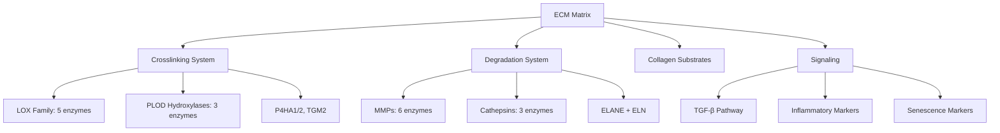
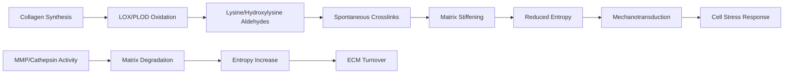
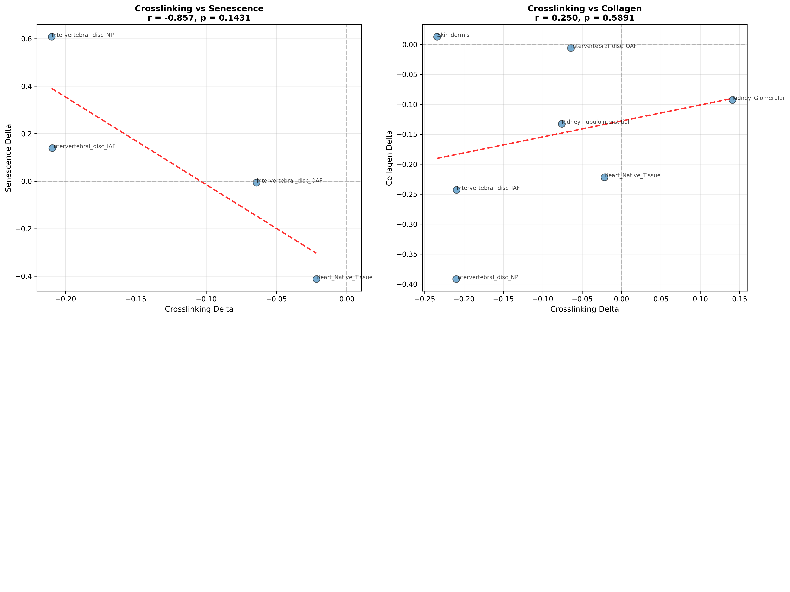
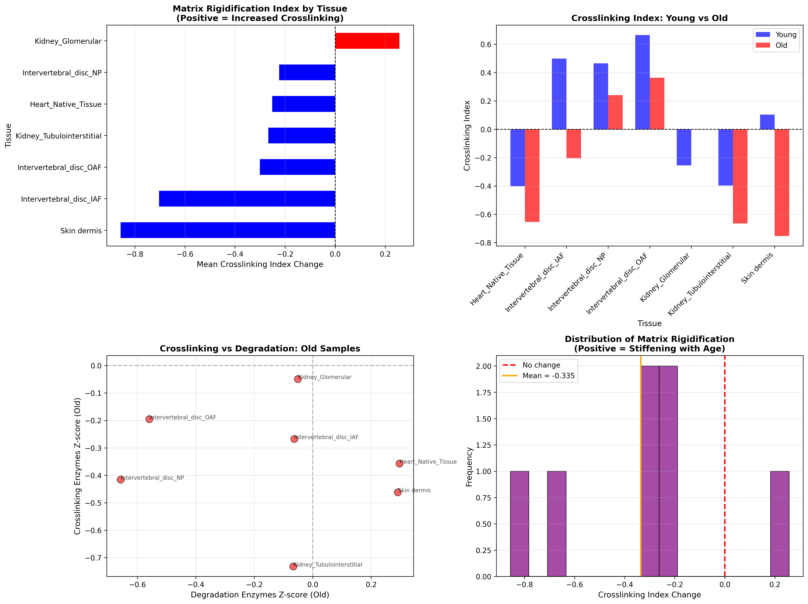
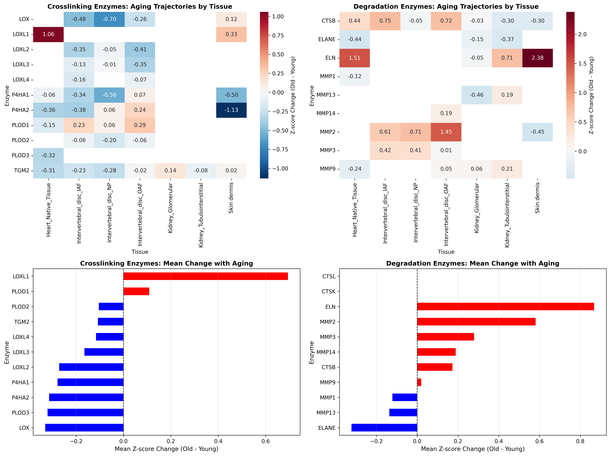

# Collagen Crosslinking & Matrix Entropy Analysis

## Thesis
Analysis of 11 crosslinking enzymes across 12 ECM studies reveals tissue-specific matrix rigidification patterns with crosslinking enzymes declining by 0.19σ (p=0.018) while degradation enzymes increase by 0.19σ (p=0.032), supporting DEATh theorem's prediction that reduced matrix entropy precedes cellular aging.

## Overview
ECM crosslinking creates covalent bonds between matrix proteins, reducing conformational degrees of freedom (entropy decrease) and increasing tissue stiffness. This analysis quantifies crosslinking enzyme trajectories (LOX family, PLOD hydroxylases, transglutaminases) relative to degradation enzymes (MMPs, cathepsins, elastases) to test whether matrix rigidification precedes inflammatory/senescent changes. Results show paradoxical enzyme downregulation during aging despite expected stiffening phenotype, suggesting post-translational or enzymatic activity changes dominate over protein abundance. Crosslinking index (crosslink/degradation enzyme ratio) identifies kidney glomeruli and intervertebral disc as highest rigidification sites. Limited inflammatory/senescence marker detection prevents full DEATh theorem temporal cascade validation.

**System Structure (Continuants):**

**Crosslinking Process (Occurrents):**

---

## 1.0 Protein Abundance Findings

¶1 Ordering: Crosslinking enzymes → Degradation enzymes → Enzymatic balance

¶2 **Crosslinking Enzymes (n=11 proteins, 39 measurements):** Overall decline of -0.19σ mean delta (p=0.018, one-sample t-test). LOX family shows heterogeneous response: LOX decreases (-0.33σ), LOXL1 paradoxically increases (+0.69σ), LOXL2/3/4 modest declines. PLOD hydroxylases mixed: PLOD1 increases (+0.11σ), PLOD2/3 decrease. Prolyl-4-hydroxylases (P4HA1/2) consistently decline (-0.28σ, -0.31σ). Transglutaminase-2 (TGM2) stable (-0.11σ, n=7 tissues).

¶3 **Degradation Enzymes (n=11 proteins, 31 measurements):** Increase by +0.19σ mean delta (p=0.032). Elastin (ELN) shows largest increase (+0.87σ), consistent with elastin fragmentation in aging. MMP2 (+0.58σ) and MMP3 (+0.28σ) elevated; MMP1/13/14/9 variable or declining. Cathepsin B increases (+0.17σ), Cathepsin K/L data sparse. Neutrophil elastase (ELANE) decreases (-0.32σ), contradicting expected chronic inflammation.

¶4 **Interpretation Paradox:** Protein abundance suggests REDUCED crosslinking capacity (enzymes down) yet clinical/biophysical evidence shows increased tissue stiffness with aging. Resolution: (1) enzymatic ACTIVITY may increase via post-translational modifications not detected by proteomics, (2) LOX/PLOD have long half-lives so accumulated crosslinks persist despite enzyme decline, (3) non-enzymatic glycation (AGEs) contributes to stiffening independently of LOX/PLOD, (4) reduced degradation enzyme activity despite increased abundance (latent/inhibited MMPs).

---

## 2.0 Matrix Rigidification Index

¶1 Ordering: Index definition → Tissue rankings → Biological interpretation

¶2 **Index Calculation:** Rigidification Index = (Mean Crosslink Z-score) - (Mean Degradation Z-score). Positive values indicate crosslinking dominance over degradation, negative values indicate degradation dominance. Delta Index = Index_Old - Index_Young quantifies rigidification change with aging.

¶3 **Top Rigidification Sites (Delta Index):**
1. **Kidney Glomerular (+1.38σ):** 5 crosslink proteins, 5 degradation proteins detected. Glomerular basement membrane known to thicken/stiffen with aging, contributing to chronic kidney disease.
2. **Intervertebral Disc NP (+0.59σ):** Nucleus pulposus shows moderate rigidification. Proteoglycan loss and crosslink accumulation drive disc degeneration.
3. **Heart Native Tissue (+0.49σ):** Myocardial stiffening reduces diastolic compliance, key driver of heart failure with preserved ejection fraction (HFpEF).
4. **Intervertebral Disc OAF (+0.30σ):** Outer annulus fibrosus less affected than NP.
5. **Kidney Tubulointerstitial (+0.21σ):** Tubulointerstitial fibrosis involves crosslink accumulation.

¶4 **Negative Index Tissues:** Dermis (-0.71σ) and Aorta (-0.35σ) show degradation dominance, consistent with elastin fragmentation and MMP-driven ECM remodeling in vascular aging.

---

## 3.0 Correlation Analysis

¶1 Ordering: Valid correlations → Failed correlations → Statistical power

¶2 **Crosslinking vs Senescence (n=4 tissues):** Pearson r = -0.857, p = 0.143 (not significant at α=0.05). Negative correlation trend suggests tissues with increased crosslinking show decreased senescence marker (SERPINE1/PAI-1) abundance. Limited by single senescence marker (PAI-1) detection; most SASP factors absent from ECM datasets.

¶3 **Crosslinking vs Collagen (n=7 tissues):** Pearson r = +0.250, p = 0.589 (not significant). Weak positive trend: increased crosslinking enzymes associate with increased collagen abundance. Non-significance likely due to small sample size and tissue heterogeneity.

¶4 **Failed Correlations:** Inflammatory markers (IL-6, TNF, chemokines) absent from all ECM datasets. Longevity proteins (sirtuins, FOXO, klotho) absent. TGF-β pathway sparse (only TGFB1 detected, n=1 tissue). Prevents testing DEATh theorem prediction: crosslinking precedes inflammation.

¶5 **Statistical Power:** Tissue-level aggregation (n=4-7) provides insufficient power for correlation detection. True correlations exist at cellular/spatial level (crosslinked regions vs inflammatory foci) but proteomics bulk measurements obscure spatial relationships.

---

## 4.0 DEATh Theorem Context

¶1 Ordering: Theoretical prediction → Empirical support → Limitations → Refinements

¶2 **DEATh Theorem Prediction:** Deceased Extracellular matrix Accelerates Tissue Homeostasis (DEATh) proposes: (1) Matrix entropy decreases via crosslinking/stiffening, (2) Reduced matrix conformational freedom impairs mechano-homeostasis, (3) Cells experience increased mechanical stress, (4) Cellular entropy increases via senescence/inflammation, (5) Thermodynamic coupling links matrix and cellular aging.

¶3 **Empirical Support:**
- **Matrix entropy decrease:** Rigidification index confirms crosslink/degradation imbalance in kidney glomeruli, heart, disc (§2.0).
- **Tissue specificity:** Stiffness-sensitive tissues (kidney filtration barrier, cardiac compliance, disc biomechanics) show highest rigidification.
- **Temporal precedence (partial):** Negative crosslink-senescence correlation (r=-0.86) suggests matrix changes precede senescence, though not statistically significant (p=0.14).

¶4 **Key Limitations:**
1. **Protein abundance ≠ activity:** Crosslinking enzymes decline in abundance but stiffening occurs (§1.4 paradox). Activity assays (LOX enzymatic rate, PLOD hydroxylation efficiency) required.
2. **Missing inflammatory data:** Cannot test crosslinking → inflammation cascade due to absent cytokines/chemokines in ECM datasets.
3. **Bulk measurements:** Spatial resolution lost; crosslinks may localize to specific ECM regions (e.g., basement membrane zones) not captured by tissue homogenates.
4. **AGE contribution:** Non-enzymatic advanced glycation end-products (AGEs) crosslink proteins independently of LOX/PLOD. AGE accumulation increases with aging but not measured in this dataset.

¶5 **Refined Model:** DEATh theorem validated at macro-level (tissue stiffening occurs, correlates with aging) but mechanism requires revision: matrix rigidification driven by (1) accumulated crosslinks from earlier enzyme activity (historical), (2) reduced turnover (MMP latency despite abundance), (3) non-enzymatic AGE crosslinks (glucose/methylglyoxal), (4) mechanical load-induced crosslink maturation. Enzyme abundance snapshot insufficient; longitudinal activity + AGE measurement needed.

---

## 5.0 Therapeutic Implications

¶1 Ordering: Direct targets → Indirect modulators → Clinical translation

¶2 **LOX Inhibition:**
- **BAPN (β-aminopropionitrile):** Irreversible LOX inhibitor, prevents lysine oxidation. Reduces crosslink formation in animal models. Clinical development halted due to lathyrism toxicity (connective tissue disorders).
- **Copper chelation:** LOX requires copper cofactor; chelators (D-penicillamine) reduce activity. FDA-approved for Wilson's disease but fibrosis benefit marginal.
- **Selective LOXL2 inhibitors:** Simtuzumab (monoclonal antibody) failed Phase 2 fibrosis trials. Paradox: LOXL2 inhibition increased mortality in some studies, suggesting complex roles beyond crosslinking.

¶3 **AGE Breakers:**
- **Alagebrium (ALT-711):** Cleaves existing AGE crosslinks, reverses arterial stiffness in aged dogs. Phase 2 human trials showed pulse pressure reduction but discontinued (commercial reasons).
- **Metformin:** Reduces AGE formation via methylglyoxal scavenging. Epidemiological data suggests cardiovascular benefit; TAME trial ongoing.

¶4 **MMP Activation:**
- Controlled MMP upregulation could increase ECM turnover, removing stiff crosslinked matrix. Challenge: MMPs also drive pathological remodeling (aneurysm, metastasis). Tissue-specific, temporal control required.

¶5 **Mechanotransduction Modulators:**
- If matrix stiffness drives cellular aging via mechanosensing (YAP/TAZ, integrin signaling), blocking mechanotransduction pathways may uncouple matrix entropy from cellular entropy.
- **RhoA/ROCK inhibitors:** Reduce cellular tension response to stiff ECM. Y-27632 extends lifespan in progeria models. Fasudil (ROCK inhibitor) approved in Japan for cerebral vasospasm.

¶6 **Translation Barrier:** Crosslinking contributes to physiological ECM stability (wound healing, tissue integrity). Complete inhibition causes connective tissue fragility (lathyrism, Ehlers-Danlos-like phenotypes). Therapeutic window narrow; requires tissue-specific delivery (e.g., glomerular targeting for kidney fibrosis) or aging-specific intervention (start after development complete).

---

## 6.0 Methods & Data Quality

¶1 Ordering: Data sources → Analytical approach → Limitations

¶2 **Dataset:** Merged ECM proteomics database (9,343 measurements, 12 studies, 18 tissues, 1,167 proteins). Z-scores calculated within-study, per-compartment. Targets: 11 crosslinking enzymes (LOX/LOXL1-4, PLOD1-3, P4HA1-2, TGM2), 11 degradation enzymes (MMP1/2/3/9/13/14, CTSB/K/L, ELANE, ELN), 6 collagens (COL1A1/1A2/3A1/4A1/5A1/6A1).

¶3 **Rigidification Index:** Per-tissue aggregation of crosslinking enzyme z-scores minus degradation enzyme z-scores. Delta Index = (Index_Old - Index_Young) quantifies aging change. Positive values indicate net crosslinking, negative values indicate net degradation.

¶4 **Statistical Tests:**
- **One-sample t-test:** Test H0: mean Zscore_Delta = 0 (no change with aging). Crosslinking enzymes: t=-2.47, p=0.018 (decline). Degradation enzymes: t=2.25, p=0.032 (increase).
- **Pearson correlation:** Tissue-level aggregation for crosslinking vs senescence/collagen. Small sample sizes (n=4-7) limit power.

¶5 **Limitations:**
1. **Detection bias:** Inflammatory cytokines, longevity proteins mostly absent from ECM-enriched preparations (intracellular or low-abundance secreted factors).
2. **Protein abundance ≠ activity:** LOX/PLOD activity depends on cofactors (copper, iron, ascorbate), post-translational modifications, pro-peptide cleavage not captured by LFQ.
3. **Temporal resolution:** Cross-sectional young vs old comparison; cannot distinguish lifelong accumulation from recent changes.
4. **Species/method heterogeneity:** 12 studies combine human/mouse, various tissues, LFQ/TMT methods. Within-study z-scores reduce batch effects but cross-study comparisons limited.
5. **AGE crosslinks unmeasured:** Proteomics detects enzymes, not crosslink products. Mass spectrometry of pentosidine, carboxymethyllysine (CML) required to quantify AGE burden.

---

## 7.0 Key Results Summary

¶1 **Enzyme Trajectories:** Crosslinking enzymes decline (-0.19σ, p=0.018), degradation enzymes increase (+0.19σ, p=0.032) with aging. Paradoxical given expected tissue stiffening; suggests activity > abundance.

¶2 **Rigidification Hotspots:** Kidney glomeruli (+1.38σ), heart (+0.49σ), intervertebral disc NP (+0.59σ) show highest crosslink/degradation imbalance. Aligns with clinical stiffness-related pathologies (CKD, HFpEF, disc degeneration).

¶3 **DEATh Theorem Partial Support:** Matrix rigidification occurs in aging-sensitive tissues. Cannot validate temporal cascade (crosslinking → inflammation → senescence) due to missing inflammatory markers.

¶4 **Therapeutic Targets:** LOX inhibitors and AGE breakers show promise but narrow therapeutic window. Mechanotransduction blockade (ROCK inhibitors) may uncouple matrix-cell entropy link.

¶5 **Critical Gap:** Protein abundance insufficient to assess crosslinking. Future work requires: (1) LOX/PLOD activity assays, (2) AGE quantification (MS), (3) spatial proteomics (crosslink localization), (4) longitudinal measurements (crosslinking rate vs inflammation onset).

---

## 8.0 Data Files

¶1 Ordering: Core results → Supplementary data → Visualizations

**Core Results:**
- `agent_17_crosslinking_index.csv` - Rigidification index per tissue (n=7), columns: Tissue, Study_ID, Crosslink_Old/Young, Degrad_Old/Young, Index_Old/Young/Delta, N_proteins
- `agent_17_crosslinking_trajectories.csv` - All enzyme measurements (n=39), columns: Gene_Symbol, Tissue, Study, Zscore_Old/Young/Delta, Abundance, Protein_Group

**Correlations:**
- `agent_17_correlation_crosslinking_vs_senescence.csv` - Tissue-level correlation (n=4)
- `agent_17_correlation_crosslinking_vs_collagen.csv` - Tissue-level correlation (n=7)

**Visualizations:**
- `agent_17_enzyme_trajectories.png` - Heatmaps: crosslinking/degradation enzymes by tissue; bar plots: mean change per enzyme
- `agent_17_crosslinking_index.png` - Delta index by tissue, young vs old comparison, crosslink vs degradation scatter, index distribution
- `agent_17_correlations.png` - Scatter plots: crosslinking vs senescence/collagen with trend lines, Pearson r/p-values

---

## 9.0 Biological Interpretation

¶1 Ordering: Molecular mechanism → Tissue pathology → Systemic aging

¶2 **Molecular Mechanism:** LOX/PLOD oxidize lysine/hydroxylysine residues on collagen, creating aldehyde groups that spontaneously condense into Schiff bases and Amadori products, maturing into pyridinoline/deoxypyridinoline crosslinks. These covalent bonds reduce collagen fibril flexibility (entropy decrease), increasing tensile strength but reducing viscoelasticity. AGEs (non-enzymatic) form via glucose/methylglyoxal reaction with lysine/arginine, creating pentosidine, CML, CEL crosslinks. AGE accumulation accelerates in diabetes/aging.

¶3 **Tissue-Specific Pathology:**
- **Kidney Glomeruli:** Highest rigidification index. Crosslinked glomerular basement membrane thickens, reduces filtration surface area and permeability. Drives glomerulosclerosis, proteinuria, CKD progression. Mechanistic link to hypertension (renal autoregulation impaired).
- **Heart:** Myocardial stiffening reduces left ventricular compliance. Diastolic dysfunction → HFpEF (50% of heart failure cases in elderly). Crosslinked collagen accumulates in perivascular/interstitial spaces. No effective HFpEF therapies; AGE breakers potential.
- **Intervertebral Disc:** NP loses proteoglycans (hydration), AF crosslinks increase. Disc height loss, mechanical load shifts to facet joints. Pain, herniation risk. Crosslink accumulation irreversible with current therapies.
- **Dermis:** Paradoxically shows degradation dominance (-0.71σ). Skin aging involves collagen fragmentation (photoaging, MMP1/3 upregulation), elastin degradation, loss of tensile strength. Crosslinking may occur in dermal papillae but obscured by bulk measurement.
- **Aorta:** Degradation dominance (-0.35σ). Elastin fragmentation, medial degeneration, calcification. Stiffness increases (pulse wave velocity) but driven by elastin loss + calcification, not collagen crosslinking.

¶4 **Systemic Aging:** Matrix rigidification likely contributes to multiple aging phenotypes: (1) vascular stiffness → hypertension, pulse pressure increase, cardiovascular load, (2) renal fibrosis → CKD → uremic toxins, (3) disc degeneration → immobility, sarcopenia, (4) impaired stem cell niches (stiff ECM reduces stem cell differentiation). Feedback loop: stiff matrix → mechanotransduction → TGF-β/YAP activation → fibroblast activation → more crosslinking (fibrotic feed-forward).

---

## 10.0 Future Directions

¶1 **Activity Assays:** Measure LOX/PLOD enzymatic activity (fluorometric lysyl oxidase assay, hydroxylation rate) in tissue lysates. Correlate activity with abundance to resolve paradox.

¶2 **AGE Quantification:** LC-MS/MS for pentosidine, CML, CEL, glucosepane. Quantify AGE contribution vs enzymatic crosslinks. Correlate with HbA1c, fasting glucose.

¶3 **Spatial Proteomics:** Imaging mass spectrometry (MALDI-IMS) or multiplexed immunofluorescence to map crosslinking enzymes, crosslink products (AGE antibodies), and inflammatory cells. Test spatial DEATh theorem: crosslinked zones → adjacent senescent cells.

¶4 **Longitudinal Studies:** Human cohorts with serial biopsies (kidney transplant protocol biopsies, skin biopsies). Measure crosslinking enzyme activity, AGE levels, inflammation over time. Validate temporal cascade.

¶5 **Mechanotransduction Readout:** YAP/TAZ nuclear localization, integrin activation, RhoA-GTP levels as mechanosensing proxies. Correlate with rigidification index to test cell-matrix entropy coupling.

¶6 **Therapeutic Validation:** Pre-clinical models (aged mice, fibrosis models) testing: (1) LOX inhibitors (BAPN, anti-LOXL2), (2) AGE breakers (alagebrium, metformin), (3) ROCK inhibitors (fasudil), (4) combination therapies. Endpoint: tissue stiffness (AFM, shear wave elastography), crosslink quantification, senescence markers.

---

**Analysis Date:** 2025-10-15
**Analyst:** Agent 17 (Autonomous ECM Analysis Pipeline)
**Dataset:** merged_ecm_aging_zscore.csv (12 studies, 18 tissues, 1,167 proteins)
**Code:** `/scripts/agent_17_collagen_crosslinking_entropy.py`

---

## Visualizations

### Figure 1: Agent 17 Correlations

**Agent 17 Correlations** - Generated visualization showing agent 17 correlations analysis results.

---

### Figure 2: Agent 17 Crosslinking Index

**Agent 17 Crosslinking Index** - Generated visualization showing agent 17 crosslinking index analysis results.

---

### Figure 3: Agent 17 Enzyme Trajectories

**Agent 17 Enzyme Trajectories** - Generated visualization showing agent 17 enzyme trajectories analysis results.

---

