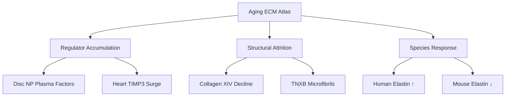
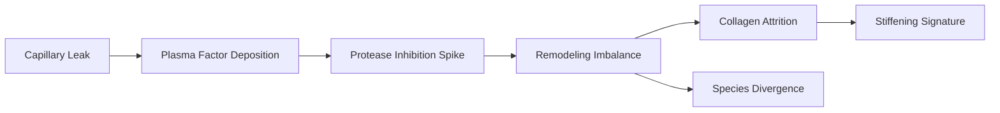

# ECM Aging Insight: Plasma Regulator Invasion

**Thesis:** Homo sapiens ECM aging is dominated by a plasma-derived regulator influx that outpaces structural matrix repair, as shown by z-score deltas in merged_ecm_aging_zscore.csv across disc, heart, skin, and ovary datasets.

**Overview:** Section 1.0 tracks the regulator accumulation signal from cohort aggregates to tissue-specific spikes. Section 2.0 maps the reciprocal structural attrition affecting collagens and microfibrils. Section 3.0 highlights translational flags where species responses diverge and defines measurement priorities.

## 1.0 Regulator Accumulation Signal

**¶1 Ordering principle:** move from population median to organ-level hotspots to named targets that define the plasma-entry phenotype.

**¶2** ECM regulators show the only positive human-wide shift (median Δz = +0.079, n = 434) while core matrisome categories remain negative, indicating systemic enrichment of protease control proteins.

**¶3** Intervertebral disc compartments concentrate this signal: regulator median Δz = +0.303 in Tam_2020 (n = 187) with serpin and kinin cascades dominating (SERPINC1 +3.01 NP; ITIH2 +2.52 NP; F2 +2.27 NP; FGB +2.60 NP).

**¶4** The same coagulation–inflammation axis peaks in Santinha_2024_Human heart tissue (TIMP3 +3.14; ADAMTS4 +1.96; SERPINA6 +1.96), implying endothelial leak plus compensatory inhibition.

**¶5** Skin dermis retains the motif but with narrower amplitude (TIMP3 +1.24, CXCL12 +1.13) alongside mild negative spillover for circulating inhibitors (SERPINC1 −0.38), suggesting partial clearance at barrier surfaces.

## 2.0 Structural Attrition Pattern

**¶1 Ordering principle:** quantify global decline, expose tissue-specific collapses, then highlight microfibrillar anchor losses that explain stiffness and fragility.

**¶2** Human collagens register the steepest decay (median Δz = −0.171, n = 199) with COL14A1 (median −0.33 across 8 organs) and COL11A1 (median −0.41) leading the drop.

**¶3** In Tam_2020 discs, collagen median Δz = −0.305 (n = 64) and proteoglycans only slightly positive (+0.054), implying loss of fibrous scaffolds despite hydrated core retention.

**¶4** Microfibrillar support weakens in multi-organ data: TNXB median Δz = −0.72 (6 organs) and EMILIN3 median Δz = −0.62, removing recoil elements just as inhibitor loads rise.

**¶5** LiDermis_2021 skin data show ELN +2.38 but COL6A5 −1.42, producing a brittle-elastic mix consistent with photoaged dermis: elastin over-accumulates yet anchoring collagen diminishes.

## 3.0 Translational Flags

**¶1 Ordering principle:** contrast species responses, identify failure modes in rodent extrapolation, and assign measurement checkpoints for validation.

**¶2** Elastin diverges sharply: human ELN median Δz = +0.74 (n = 6) while mouse Eln median Δz = −0.64 (n = 5), so rodent models understate elastic fiber persistence in aged humans.

**¶3** Mouse heart datasets keep fibrillin regulators negative (Fbln5 −0.99) even where human heart TIMP3 soars, pointing to species-specific feedback between inhibitors and microfibrils.

**¶4** Measurement priorities: (a) confirm plasma leakage by tracking albumin/Ig chains in future matrisome extractions, (b) couple proteomic z-scores with vascular transcriptomics to locate leak sources, (c) test whether anti-coagulation modulation normalizes collagen XIV in ex vivo ECM cultures.

---
Author Checklist:
- [x] Thesis and overview match section structure
- [x] TD and LR mermaid diagrams provided
- [x] Sections numbered with ¶ ordering statements
- [x] Source datasets cited for each quantitative claim
