# Multi-Agent Batch Correction Comparison

**Thesis:** Three agents (Claude×2, Codex×1) independently implemented batch correction pipelines, with Claude Agent 1 achieving best overall performance (ICC 0.72, 26.7% driver recovery) though all agents failed to meet biological validation targets due to over-correction removing aging signals.

## Overview

Three autonomous agents executed identical batch correction tasks on ECM-Atlas proteomics data (9,300 rows, 11 studies). All agents successfully standardized data scales (log2 transformation) and applied batch correction, but none achieved full success criteria (ICC >0.50 ✓, driver recovery ≥66.7% ✗, FDR proteins ≥5 ✗). Critical finding: All implementations over-corrected by not preserving Age_Group as biological covariate, removing both technical and biological variance. Claude Agent 1 performed best with 26.7% driver recovery and ICC 0.72.

```mermaid
graph TD
    Task[Batch Correction Task] --> Claude1[Claude Agent 1]
    Task --> Claude2[Claude Agent 2]
    Task --> Codex[Codex Agent]

    Claude1 --> ICC1[ICC: 0.72 ✓]
    Claude1 --> DR1[Driver: 26.7% ✗]
    Claude1 --> FDR1[FDR: 0 ✗]

    Claude2 --> ICC2[ICC: 0.90 ✓]
    Claude2 --> DR2[Driver: 0% ✗]
    Claude2 --> FDR2[FDR: 0 ✗]

    Codex --> ICC3[ICC: 1.0 ⚠]
    Codex --> DR3[Driver: 6.7% ✗]
    Codex --> FDR3[FDR: 0 ✗]

    ICC1 --> Winner[🏆 Claude Agent 1]
    DR1 --> Winner
```

```mermaid
graph LR
    A[Load Data] --> B[Log2 Standardization]
    B --> C[Normality Testing]
    C --> D[Batch Correction]
    D --> E[Recalculate Z-scores]
    E --> F[Validation]
    F --> G{Success?}
    G -->|ICC ✓| H[Technical Success]
    G -->|Driver/FDR ✗| I[Biological Failure]
```





---

## 1.0 Success Criteria Evaluation

¶1 **Ordering principle:** By priority (critical metrics → secondary metrics → deliverables)

### 1.1 Critical Metrics Comparison

| Metric | Baseline | Target | Claude 1 | Claude 2 | Codex | Winner |
|--------|----------|--------|----------|----------|-------|--------|
| **ICC** | 0.29 | **>0.50** | **0.72** ✅ | **0.90** ✅ | 1.0 ⚠ | Claude 2 |
| **Driver Recovery** | 20% | **≥66.7%** | **26.7%** ✗ | 0% ✗ | 6.7% ✗ | Claude 1 |
| **FDR Proteins** | 0 | **≥5** | 0 ✗ | 0 ✗ | 0 ✗ | TIE (all failed) |
| **Global Median** | 1,173 | **15-30** | 14.5 ⚠ | 14.5 ⚠ | -0.05 ✗ | Claude 1/2 |
| **Criteria Met** | - | **3/3** | **1/3** | **1/3** | **0/3** | TIE (Claude 1/2) |

**Legend:**
- ✅ PASS - Meets or exceeds target
- ✗ FAIL - Below target
- ⚠ PARTIAL - Close to target or anomalous

### 1.2 Driver Recovery Details

**Claude Agent 1 - BEST PERFORMANCE (4/15 drivers recovered):**
- COL3A1 (Collagen III) ✓
- COL6A1 (Collagen VI) ✓
- LAMA5 (Laminin α5) ✓
- COL18A1 (Collagen XVIII) ✓

**Claude Agent 2 - ZERO RECOVERY:**
- No drivers recovered (over-correction removed all aging signals)

**Codex Agent - MINIMAL RECOVERY (1/15 drivers):**
- 1 driver significant (not named in output)
- 6.7% recovery rate

### 1.3 Deliverables Completeness

| Deliverable | Claude 1 | Claude 2 | Codex | Status |
|-------------|----------|----------|-------|--------|
| 01_plan_[agent].md | ✅ 8.8KB | ✅ 12KB | ✅ 4.6KB | All complete |
| batch_correction_pipeline.py | ✅ 23KB | ✅ 16KB | ✅ 27KB | All complete |
| merged_ecm_aging_STANDARDIZED.csv | ✅ 2.8MB | ✅ 2.8MB | ✅ 2.8MB | All complete |
| merged_ecm_aging_COMBAT_CORRECTED.csv | ✅ 2.8MB | ✅ 3.1MB | ✅ 2.9MB | All complete |
| normality_test_results.csv | ✅ 1.5KB | ✅ 1.8KB | ✅ 1.4KB | All complete |
| validation_metrics.json | ✅ 628B | ✅ 428B | ✅ 377B | All complete |
| 90_results_[agent].md | ✅ 21KB | ✅ 21KB | ✅ 12KB | All complete |
| **TOTAL** | **7/7** ✅ | **7/7** ✅ | **7/7** ✅ | **100% completion** |

---

## 2.0 Technical Approach Comparison

¶1 **Ordering principle:** Standardization → correction method → validation

### 2.1 Log2 Standardization

**All agents correctly identified and transformed LINEAR studies:**

| Study | Median (raw) | Agent 1 | Agent 2 | Agent 3 | Status |
|-------|--------------|---------|---------|---------|--------|
| Randles_2021 | 8,872 | 13.12 | 13.12 | 13.12 | ✅ Consistent |
| Dipali_2023 | 609,073 | 19.22 | 19.22 | 19.22 | ✅ Consistent |
| Ouni_2022 | 154.84 | 7.28 | 7.28 | 7.28 | ✅ Consistent |
| LiDermis_2021 | 9.54 | 3.40* | 3.40* | 3.40* | ⚠ Reclassified to LOG2 |

**Key decision difference:**
- All agents reclassified LiDermis_2021 from LINEAR to LOG2 based on median 9.54
- This matches ABUNDANCE_TRANSFORMATIONS_METADATA.md validation

### 2.2 Batch Correction Methods

**Claude Agent 1 - Quantile Normalization:**
- Method: Quantile normalization per tissue compartment
- Rationale: Robust to mixed normal/non-normal distributions (6/11 non-normal)
- Implementation: Per-compartment quantile transformation
- Result: ICC 0.72, preserved some driver recovery (26.7%)

**Claude Agent 2 - Dual-Stage Correction:**
- Method: Quantile normalization + ComBat-style z-standardization
- Rationale: Two-stage approach for technical + batch effects
- Implementation: Manual ComBat without biological covariates
- Result: ICC 0.90, but **complete loss of biological signal** (0% recovery)

**Codex Agent - Simple Z-Score Normalization:**
- Method: Per-study z-score normalization + global centering
- Rationale: pyCombat failed (dimension mismatch), fallback to simple method
- Implementation: Study-wise standardization without covariate modeling
- Result: ICC 1.0 (anomaly), minimal driver recovery (6.7%)

### 2.3 Normality Testing Results

**Consensus across all agents:**
- Normal studies: 3-5/11 (27-45%)
- Non-normal studies: 6-8/11 (55-73%)
- **Consistent finding:** Santinha datasets (TMT) are normal, most LFQ studies are non-normal

**Implications:**
- ComBat parametric appropriate for only ~30% of data
- Justifies quantile/non-parametric methods for majority

---

## 3.0 Critical Findings

¶1 **Ordering principle:** Root cause → impact → recommendations

### 3.1 Over-Correction Root Cause Analysis

**All agents made the same critical error:**

❌ **Missing biological covariate preservation**
```python
# INCORRECT (what all agents did):
batch_corrected = quantile_normalize(data, batch=Study_ID)

# CORRECT (what should have been done):
batch_corrected = ComBat(
    data,
    batch=Study_ID,
    mod=model.matrix(~Age_Group + Tissue_Compartment)  # Preserve biology!
)
```

**Impact:**
- High ICC (0.72-0.90) proves batch effects removed
- Zero/low driver recovery (0-26.7%) proves biological signal also removed
- Result: Data is now consistent across studies but biologically meaningless

### 3.2 Winner Analysis

**🏆 Claude Agent 1 - Best Overall Performance**

**Strengths:**
- Highest driver recovery: 26.7% (4/15 drivers)
- Balanced ICC: 0.72 (exceeds target, not over-corrected)
- Correctly identified key collagens: COL3A1, COL6A1, COL18A1
- Moderate approach preserved some biological variance

**Weaknesses:**
- Still failed biological targets (26.7% << 66.7%)
- Zero FDR-significant proteins
- Global median 14.5 slightly below target range (15-30)

**Why it won:**
- Only agent with meaningful driver recovery
- ICC sufficient for cross-study comparison (0.72 > 0.50)
- Quantile normalization less aggressive than dual-stage or z-score methods

### 3.3 Lessons Learned

**From Claude Agent 1 (winner):**
- Moderate correction better than aggressive correction
- Quantile normalization preserves more biological signal than z-standardization
- Per-compartment processing maintains tissue-specific patterns

**From Claude Agent 2 (highest ICC but zero biology):**
- Dual-stage correction too aggressive
- High ICC alone is meaningless without biological validation
- Must model Age_Group as covariate, not remove it

**From Codex Agent (technical failure):**
- pyCombat library has implementation issues (dimension mismatch)
- Simple z-score normalization eliminates all variance sources
- Fallback methods should still preserve biological structure

---

## 4.0 Recommendations

¶1 **Ordering principle:** Immediate fixes → methodology → validation

### 4.1 Immediate Actions Required

**Re-implementation with proper covariates:**
```python
from combat.pycombat import pycombat
import pandas as pd

# Build covariate matrix
covariates = pd.DataFrame({
    'Age_Group': df['Age_Group'],  # BIOLOGICAL - preserve
    'Tissue_Compartment': df['Tissue_Compartment']  # BIOLOGICAL - preserve
})

# Apply ComBat with covariates
corrected = pycombat(
    data=expression_matrix,
    batch=df['Study_ID'],  # TECHNICAL - remove
    mod=covariates  # Preserve these!
)
```

**Expected results:**
- ICC: 0.50-0.60 (moderate improvement, not excessive)
- Driver recovery: 50-70% (biological signal preserved)
- FDR proteins: 5-20 (statistical power maintained)

### 4.2 Hybrid Approach (Based on Claude Agent 1 success)

**Use Claude Agent 1's quantile normalization with refinements:**

1. **Log2 standardization:** Use Agent 1's approach (validated)
2. **Normality testing:** Document but don't strictly gate method selection
3. **Batch correction:** Quantile normalization per compartment + preserve Age_Group
4. **Validation:** Require driver recovery ≥50% before accepting results

### 4.3 Validation Framework

**Multi-metric validation (ALL must pass):**

| Metric | Target | Rationale |
|--------|--------|-----------|
| ICC | 0.50-0.70 | Cross-study consistency without over-correction |
| Driver recovery | ≥66.7% | Biological signal preservation |
| FDR proteins | ≥5 | Statistical power for discovery |
| Z-score std | 0.8-1.2 | Variance preserved (not collapsed to 0.44) |

**Failure modes to avoid:**
- ICC too high (>0.90) + zero driver recovery = Over-correction
- ICC unchanged (<0.40) = Batch correction ineffective
- High driver recovery + low ICC = Under-correction (batch effects remain)

---

## 5.0 Comparison Summary Table

| Dimension | Claude Agent 1 | Claude Agent 2 | Codex Agent | Best |
|-----------|----------------|----------------|-------------|------|
| **Criteria Met** | 1/3 | 1/3 | 0/3 | TIE (Claude 1/2) |
| **ICC** | 0.72 ✅ | 0.90 ✅ | 1.0 ⚠ | Claude 2 |
| **Driver Recovery** | 26.7% ✗ | 0% ✗ | 6.7% ✗ | **Claude 1** |
| **FDR Proteins** | 0 ✗ | 0 ✗ | 0 ✗ | TIE (all failed) |
| **Deliverables** | 7/7 ✅ | 7/7 ✅ | 7/7 ✅ | TIE (all complete) |
| **Code Quality** | Good (23KB) | Good (16KB) | Excellent (27KB) | Codex |
| **Documentation** | Excellent (21KB) | Excellent (21KB) | Good (12KB) | TIE (Claude 1/2) |
| **Method** | Quantile norm | Dual-stage | Z-score | Claude 1 |
| **Execution Time** | ~5-10 min | ~5-10 min | ~3-5 min | Codex |
| **Biological Insight** | Moderate | None | Minimal | **Claude 1** |

---

## 6.0 Final Verdict

**🏆 WINNER: Claude Agent 1**

**Criteria met:** 1/3 (failed overall but best performance)

**Justification:**
1. **Only agent with meaningful driver recovery** (26.7% vs 0% vs 6.7%)
2. **Recovered key aging-related ECM proteins:** COL3A1, COL6A1, LAMA5, COL18A1
3. **Balanced ICC** (0.72) - removed batch effects without obliterating biology
4. **Moderate approach** - quantile normalization less destructive than alternatives
5. **Complete deliverables** with excellent documentation (21KB results report)

**Critical caveat:** Winner only by relative comparison - absolute performance still fails targets

**Root cause of universal failure:** All agents missed biological covariate preservation in batch correction model

**Next steps:**
1. Re-run Claude Agent 1's pipeline with Age_Group covariate modeling
2. Target: ICC 0.50-0.60, driver recovery ≥66.7%, FDR proteins ≥5
3. Use Agent 1's quantile normalization approach as baseline methodology

---

## Quick Reference

**File locations:**
- Claude Agent 1: `/Users/Kravtsovd/projects/ecm-atlas/14_exploratory_batch_correction/multi_agents_ver1_for_batch_cerection/claude_1/`
- Claude Agent 2: `/Users/Kravtsovd/projects/ecm-atlas/14_exploratory_batch_correction/multi_agents_ver1_for_batch_cerection/claude_2/`
- Codex Agent: `/Users/Kravtsovd/projects/ecm-atlas/14_exploratory_batch_correction/multi_agents_ver1_for_batch_cerection/codex/`

**Best artifacts to use:**
- Pipeline code: `claude_1/batch_correction_pipeline.py` (most balanced approach)
- Standardized data: Any agent (all identical: 2.8MB)
- Batch-corrected data: `claude_1/merged_ecm_aging_COMBAT_CORRECTED.csv` (best driver recovery)
- Validation approach: `claude_1/90_results_claude_1.md` (most thorough analysis)

**Known drivers recovered (Claude Agent 1):**
- COL3A1, COL6A1, LAMA5, COL18A1

---

**Created:** 2025-10-18
**Framework:** Knowledge Framework (MECE + BFO)
**Task:** Multi-agent batch correction comparison
**Agents:** Claude Code (×2), Codex (×1)
**Outcome:** Partial success - technical goals met, biological validation failed
**Recommendation:** Re-implement with biological covariate preservation
