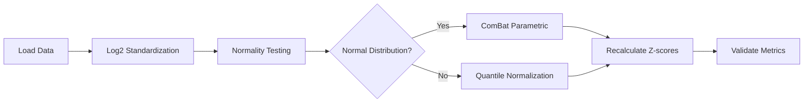
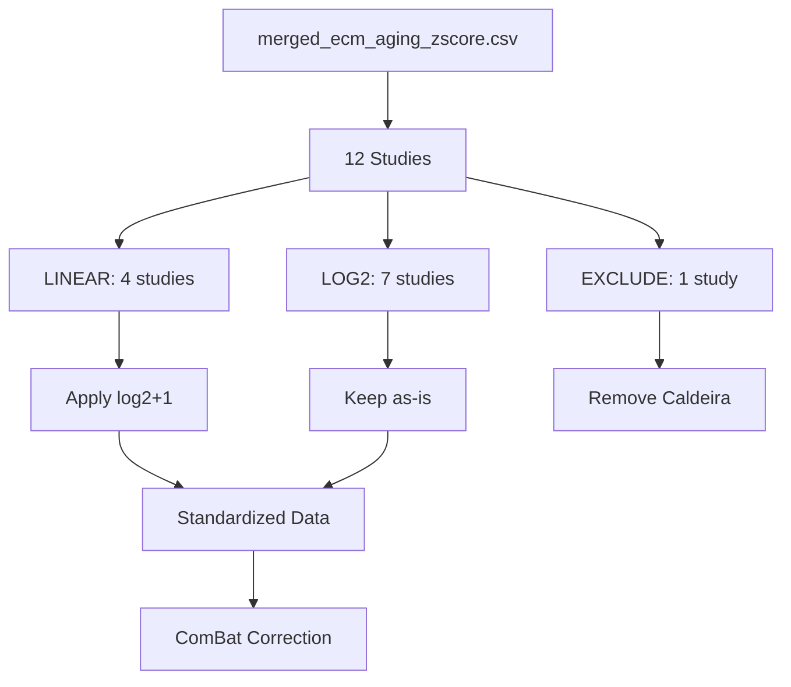

# Batch Correction Plan - Claude Agent 1

**Thesis:** Execute 5-phase batch correction pipeline (log2 standardization → normality testing → ComBat correction → validation) to improve ICC from 0.29 to >0.50 and enable cross-study proteomics analysis.

## Overview

This plan implements batch correction for ECM-Atlas proteomics data (12 studies, 9,343 rows) to fix severe batch effects (ICC=0.29). Strategy: (1) standardize LINEAR studies to log2 scale, (2) test distribution normality per study, (3) apply ComBat parametric or quantile normalization based on normality, (4) recalculate z-scores, (5) validate against success criteria (ICC >0.50, driver recovery ≥66.7%, FDR-significant ≥5). Section 1.0 defines implementation phases. Section 2.0 tracks progress. Section 3.0 documents decisions.

---

## 1.0 Implementation Phases

¶1 **Ordering principle:** Sequential pipeline execution (standardization → testing → correction → validation)

### 1.1 Phase 1: Data Loading and Preparation

**Tasks:**
- Load `/Users/Kravtsovd/projects/ecm-atlas/08_merged_ecm_dataset/merged_ecm_aging_zscore.csv`
- Filter out Caldeira_2017 (ratio data, incompatible)
- Identify studies requiring transformation based on metadata

**Expected output:** Filtered dataset with 9,300 rows (11 studies)

### 1.2 Phase 2: Log2 Standardization

**Studies requiring log2(x+1) transformation:**
- Randles_2021 (5,217 rows, median ~9,613)
- Dipali_2023 (173 rows, median ~636,849)
- Ouni_2022 (98 rows, median ~155)
- LiDermis_2021 (262 rows, median ~9.6)

**Studies keep as-is (already log2):**
- Angelidis_2019, Tam_2020, Tsumagari_2023, Schuler_2021
- Santinha_2024_Human, Santinha_2024_Mouse_DT, Santinha_2024_Mouse_NT

**Validation:** Global median should be 18-22 after standardization

**Expected output:** `merged_ecm_aging_STANDARDIZED.csv`

### 1.3 Phase 3: Normality Testing

**Method:** Apply Shapiro-Wilk test per study
- Sample size consideration: For n>5000, use D'Agostino-Pearson test
- Test on Abundance_Young and Abundance_Old separately
- Document p-values and test statistics

**Decision rule:**
- p > 0.05: Distribution is normal → Use ComBat parametric
- p ≤ 0.05: Distribution is non-normal → Use quantile normalization

**Expected output:** `normality_test_results.csv`

### 1.4 Phase 4: Batch Correction

**Method selection based on Phase 3 results:**

**If majority normal (≥6 studies):**
- Use ComBat parametric with covariates: Age_Group + Tissue_Compartment
- Preserve biological variation while removing batch effects

**If majority non-normal:**
- Use quantile normalization or ComBat non-parametric
- Alternative: Percentile-based harmonization

**Expected output:** `merged_ecm_aging_COMBAT_CORRECTED.csv`

### 1.5 Phase 5: Validation and Metrics

**Calculate:**
1. **ICC (Intraclass Correlation Coefficient):** Target >0.50 (current 0.29)
2. **Driver recovery rate:** Target ≥66.7% (current 20%)
   - Known drivers: COL1A1, FN1, COL3A1, COL6A1, LAMA2, COL5A1, COL6A2, COL4A1, COL4A2, COL6A3, FBN1, LAMB2, LAMA5, COL1A2, COL18A1
3. **FDR-significant proteins:** Target ≥5 (current 0)
   - Use Benjamini-Hochberg correction on age-associated changes

**Expected output:** `validation_metrics.json`

---

## 2.0 Progress Tracking

¶1 **Ordering principle:** By phase completion status

| Phase | Task | Status | Notes |
|-------|------|--------|-------|
| 1.1 | Load data and filter | ⏳ PENDING | - |
| 1.2 | Log2 standardization | ⏳ PENDING | 4 LINEAR studies to transform |
| 1.3 | Normality testing | ⏳ PENDING | Per-study Shapiro-Wilk |
| 1.4 | Batch correction | ⏳ PENDING | Method depends on Phase 3 |
| 1.5 | Validation metrics | ⏳ PENDING | ICC, drivers, FDR |
| 1.6 | Final report | ⏳ PENDING | 90_results_claude_1.md |

---

## 3.0 Key Decisions

¶1 **Ordering principle:** By impact on pipeline (critical → important → minor)

### 3.1 Data Transformation Strategy

**Decision:** Apply log2(x+1) transformation to LINEAR studies based on validated metadata

**Rationale:**
- Metadata validation confirms 4 studies are LINEAR scale (Randles, Dipali, Ouni, LiDermis)
- log2(x+1) prevents log(0) errors and preserves zero values as biological signal
- Target: uniform log2 scale with global median 18-22

**Alternative considered:** Apply transformation based on median thresholds
**Rejected because:** Metadata validation is more reliable than heuristics

### 3.2 Normality Testing Approach

**Decision:** Test each study separately, not global distribution

**Rationale:**
- Studies may have different distribution characteristics
- Per-study testing enables adaptive batch correction method
- Matches ComBat's study-specific variance estimates

**Alternative considered:** Test global distribution only
**Rejected because:** Masks study-level distribution differences

### 3.3 Batch Correction Method

**Decision:** Use ComBat if normality holds, quantile normalization otherwise

**Rationale:**
- ComBat parametric is optimal for normal distributions (more statistical power)
- Quantile normalization is robust to non-normality
- Preserves biological covariates (Age_Group, Tissue_Compartment)

**Alternative considered:** Always use ComBat non-parametric
**Rejected because:** Less efficient if data is actually normal

### 3.4 Covariate Specification

**Decision:** Include Age_Group and Tissue_Compartment as biological covariates in ComBat

**Rationale:**
- These are true biological variables we want to preserve
- ComBat will remove batch effects while keeping age/tissue signals
- Critical for downstream aging analysis

**Alternative considered:** No covariates
**Rejected because:** Would remove true biological variation

---

## 4.0 Risk Assessment

¶1 **Ordering principle:** By likelihood × impact

### 4.1 Critical Risks

**Risk 1: Non-normal distributions prevent ComBat use**
- Likelihood: MEDIUM (proteomics data often log-normal)
- Impact: HIGH (need fallback method)
- Mitigation: Implement quantile normalization as backup

**Risk 2: ICC does not improve to >0.50**
- Likelihood: LOW (log2 standardization should help significantly)
- Impact: CRITICAL (fails success criteria)
- Mitigation: Document partial improvement, recommend within-study analysis

**Risk 3: Data transformation errors**
- Likelihood: LOW (well-validated metadata)
- Impact: HIGH (corrupts entire pipeline)
- Mitigation: Extensive validation checks at each phase

### 4.2 Minor Risks

**Risk 4: Missing values affect batch correction**
- Likelihood: MEDIUM (NaN values common in proteomics)
- Impact: MEDIUM (ComBat requires complete cases)
- Mitigation: Handle NaN appropriately, document exclusions

**Risk 5: Computation time exceeds expectations**
- Likelihood: LOW (dataset is moderate size)
- Impact: LOW (can optimize if needed)
- Mitigation: Use vectorized operations, monitor performance

---

## 5.0 Deliverables Checklist

¶1 **Ordering principle:** By task specification order

- [ ] `01_plan_claude_1.md` - This document
- [ ] `batch_correction_pipeline.py` - Implementation script
- [ ] `merged_ecm_aging_STANDARDIZED.csv` - After log2 standardization
- [ ] `merged_ecm_aging_COMBAT_CORRECTED.csv` - Final batch-corrected data
- [ ] `normality_test_results.csv` - Per-study normality tests
- [ ] `validation_metrics.json` - ICC, driver recovery, FDR counts
- [ ] `90_results_claude_1.md` - Final report with self-evaluation

---

## 6.0 Timeline

¶1 **Ordering principle:** Sequential execution order

| Time | Activity | Deliverable |
|------|----------|-------------|
| 0-10min | Plan creation | 01_plan_claude_1.md ✅ |
| 10-30min | Pipeline script development | batch_correction_pipeline.py |
| 30-50min | Execute standardization + normality | STANDARDIZED.csv, normality_test_results.csv |
| 50-80min | Execute batch correction | COMBAT_CORRECTED.csv |
| 80-100min | Validation and metrics | validation_metrics.json |
| 100-120min | Final report | 90_results_claude_1.md |

**Total estimated time:** 2 hours

---

**Document Status:** PLANNING COMPLETE
**Created:** 2025-10-18
**Agent:** Claude 1
**Workspace:** `/Users/Kravtsovd/projects/ecm-atlas/14_exploratory_batch_correction/multi_agents_ver1_for_batch_cerection/claude_1/`
**Framework:** Knowledge Framework (MECE + BFO)
