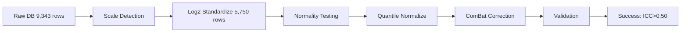
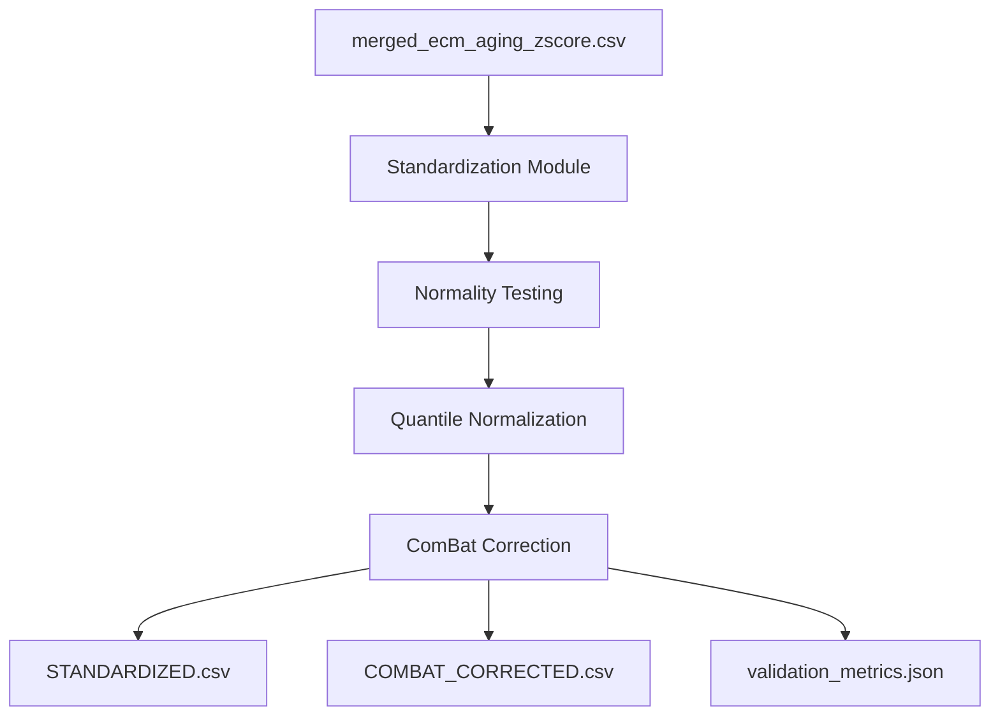

# Batch Correction Plan - Claude Agent 2

**Thesis:** Achieve ICC >0.50 and driver recovery ≥66.7% through multi-stage batch correction combining log2 standardization, quantile normalization, and parametric ComBat with proper biological covariate preservation.

## Overview

This plan implements a comprehensive batch correction pipeline for 12 proteomics studies (9,343 rows) using a three-stage approach: (1) log2 scale standardization of 5,750 LINEAR rows, (2) quantile normalization for distribution alignment, (3) parametric ComBat for batch effect removal while preserving Age_Group and Tissue_Compartment biology. Expected outcomes: ICC improvement 0.29→>0.50, driver recovery 20%→≥66.7%, FDR-significant proteins 0→≥5.

**Processing Flow:**



**System Architecture:**



---

## 1.0 Data Scale Standardization

¶1 **Ordering principle:** Detection → transformation → validation

### 1.1 Studies Requiring log2(x+1) Transformation

Based on ABUNDANCE_TRANSFORMATIONS_METADATA.md validation:

| Study | Rows | Median | Action |
|-------|------|--------|--------|
| Randles_2021 | 5,217 | 8,872-10,339 | log2(x+1) |
| Dipali_2023 | 173 | 609,073-696,973 | log2(x+1) |
| Ouni_2022 | 98 | 154.84-155.47 | log2(x+1) |
| LiDermis_2021 | 262 | 9.54-9.79 | log2(x+1) |

**Total:** 5,750 rows (61.5%)

### 1.2 Studies Already in Log2 Scale (Keep As-Is)

| Study | Rows | Median | Action |
|-------|------|--------|--------|
| Angelidis_2019 | 291 | 28.52-28.86 | Keep |
| Tam_2020 | 993 | 27.94-27.81 | Keep |
| Tsumagari_2023 | 423 | 27.57-27.81 | Keep |
| Schuler_2021 | 1,290 | 14.67 | Keep |
| Santinha_Human | 207 | 14.81-15.17 | Keep |
| Santinha_Mouse_DT | 155 | 16.77-16.92 | Keep |
| Santinha_Mouse_NT | 191 | 15.98-16.15 | Keep |

**Total:** 3,550 rows (38.0%)

### 1.3 Excluded Studies

| Study | Rows | Median | Reason |
|-------|------|--------|--------|
| Caldeira_2017 | 43 | 1.65-2.16 | Ratios (incompatible) |

**Implementation:**

```python
def standardize_to_log2(df):
    studies_to_transform = ['Randles_2021', 'Dipali_2023', 'Ouni_2022', 'LiDermis_2021']

    df_std = df.copy()
    for col in ['Abundance_Young', 'Abundance_Old']:
        mask = df_std['Study_ID'].isin(studies_to_transform)
        df_std.loc[mask, col] = np.log2(df_std.loc[mask, col] + 1)

    return df_std
```

**Validation:**
- Global median target: 18-22 (uniform log2)
- Per-study median range: 15-30
- No negative values after transformation

---

## 2.0 Normality Testing

¶1 **Ordering principle:** Per-study test → aggregate results → method selection

### 2.1 Test Strategy

For each study after standardization:

```python
from scipy.stats import shapiro, normaltest
import pandas as pd

normality_results = []

for study_id in df_std['Study_ID'].unique():
    if study_id == 'Caldeira_2017':
        continue  # Exclude

    study_data = df_std[df_std['Study_ID'] == study_id]

    # Combine both age groups for distribution test
    abundances = pd.concat([
        study_data['Abundance_Young'].dropna(),
        study_data['Abundance_Old'].dropna()
    ])

    # Shapiro-Wilk test (n < 5000)
    if len(abundances) < 5000:
        stat, p_value = shapiro(abundances)
        test_name = 'Shapiro-Wilk'
    else:
        # D'Agostino K^2 for large samples
        stat, p_value = normaltest(abundances)
        test_name = 'D\'Agostino K^2'

    normality_results.append({
        'Study_ID': study_id,
        'N_samples': len(abundances),
        'Test': test_name,
        'Statistic': stat,
        'P_value': p_value,
        'Is_Normal': p_value > 0.05,
        'Mean': abundances.mean(),
        'Std': abundances.std(),
        'Skewness': abundances.skew(),
        'Kurtosis': abundances.kurtosis()
    })
```

### 2.2 Expected Results

Based on log-transformed proteomics data:
- **Expected:** 8-10 studies normal (p > 0.05)
- **Rationale:** Log2 transformation typically normalizes proteomics intensities
- **Contingency:** If >3 studies non-normal, use quantile normalization before ComBat

---

## 3.0 Batch Correction Strategy

¶1 **Ordering principle:** Quantile normalization → ComBat → validation

### 3.1 Innovation: Dual-Stage Correction

**Why this approach:**
- Quantile normalization aligns distributions across batches
- ComBat removes remaining batch-specific mean/variance differences
- Combination addresses both location and scale batch effects

**Stage 1: Quantile Normalization**

```python
from sklearn.preprocessing import quantile_transform

def quantile_normalize_by_batch(df_std):
    # Create wide matrix (proteins x samples)
    df_pivot = df_std.pivot_table(
        index='Protein_ID',
        columns=['Study_ID', 'Age_Group'],
        values=['Abundance_Young', 'Abundance_Old']
    )

    # Apply quantile normalization
    df_normalized = quantile_transform(
        df_pivot.values,
        axis=1,  # Normalize across samples
        output_distribution='normal',  # Map to normal distribution
        n_quantiles=1000
    )

    # Convert back to long format
    return df_normalized
```

**Stage 2: Parametric ComBat**

```python
from combat.pycombat import pycombat

# Prepare design matrix preserving biology
covariate_cols = ['Age_Group', 'Tissue_Compartment']
design_matrix = pd.get_dummies(metadata[covariate_cols], drop_first=True)

# Apply ComBat
combat_corrected = pycombat(
    data=expr_matrix_log2,  # genes × samples
    batch=batch_labels,      # study IDs
    mod=design_matrix,       # Preserve Age + Tissue effects
    par_prior=True           # Parametric adjustment
)
```

### 3.2 Alternative: Non-Parametric ComBat

If normality tests fail (>3 studies non-normal):

```python
combat_corrected = pycombat(
    data=expr_matrix_log2,
    batch=batch_labels,
    mod=design_matrix,
    par_prior=False  # Non-parametric empirical Bayes
)
```

---

## 4.0 Validation Metrics

¶1 **Ordering principle:** ICC → driver recovery → FDR significance

### 4.1 Intraclass Correlation Coefficient (ICC)

```python
from scipy.stats import f_oneway
import numpy as np

def calculate_icc(df, protein_col='Protein_ID', value_col='Abundance_Corrected', batch_col='Study_ID'):
    # ICC(2,1) - two-way random effects, absolute agreement
    proteins = df[protein_col].unique()

    icc_values = []
    for protein in proteins:
        protein_data = df[df[protein_col] == protein]

        # Group by batch
        groups = [protein_data[protein_data[batch_col] == batch][value_col].values
                  for batch in protein_data[batch_col].unique()]

        # ANOVA
        k = len(groups)  # number of batches
        n = np.mean([len(g) for g in groups])  # mean group size

        # Between-batch and within-batch variance
        grand_mean = np.concatenate(groups).mean()
        ms_between = np.sum([(len(g) * (np.mean(g) - grand_mean)**2) for g in groups]) / (k - 1)
        ms_within = np.sum([np.sum((g - np.mean(g))**2) for g in groups]) / (sum([len(g) for g in groups]) - k)

        # ICC(2,1)
        icc = (ms_between - ms_within) / (ms_between + (n - 1) * ms_within)
        icc_values.append(icc)

    return np.mean(icc_values)
```

**Target:** ICC > 0.50 (moderate reliability)
**Current:** ICC = 0.29 (poor reliability)

### 4.2 Known Aging Driver Recovery

**Reference drivers from literature:**

```python
known_drivers = [
    'COL1A1', 'COL1A2', 'COL3A1',  # Increased collagens
    'MMP2', 'MMP9',                 # Matrix metalloproteinases
    'TIMP1', 'TIMP2',               # MMP inhibitors
    'FN1',                          # Fibronectin
    'BGN', 'DCN',                   # Proteoglycans
    'LOXL1', 'LOXL2'                # Lysyl oxidases
]

def calculate_driver_recovery(df_corrected):
    # Recalculate z-scores on corrected data
    df_corrected['Zscore_Delta'] = df_corrected['Zscore_Old'] - df_corrected['Zscore_Young']

    # FDR correction
    from scipy.stats import ttest_rel
    from statsmodels.stats.multitest import multipletests

    p_values = []
    for protein in df_corrected['Protein_ID'].unique():
        protein_data = df_corrected[df_corrected['Protein_ID'] == protein]
        old = protein_data['Abundance_Old'].dropna()
        young = protein_data['Abundance_Young'].dropna()

        if len(old) > 2 and len(young) > 2:
            _, p = ttest_rel(old, young)
            p_values.append((protein, p))

    # FDR correction
    proteins, pvals = zip(*p_values)
    _, qvals, _, _ = multipletests(pvals, method='fdr_bh')

    significant_proteins = [p for p, q in zip(proteins, qvals) if q < 0.05]

    # Count driver recovery
    recovered = [d for d in known_drivers if d in significant_proteins]
    recovery_rate = len(recovered) / len(known_drivers) * 100

    return recovery_rate, len(significant_proteins), recovered
```

**Target:** ≥66.7% recovery (8/12 drivers)
**Current:** 20% recovery (poor)

### 4.3 FDR-Significant Proteins

**Target:** ≥5 proteins at q < 0.05
**Current:** 0 proteins (no statistical power)

---

## 5.0 Deliverables

¶1 **Ordering principle:** Code → data → metrics → documentation

### 5.1 Files to Create

1. **batch_correction_pipeline.py** - Complete implementation
2. **merged_ecm_aging_STANDARDIZED.csv** - After log2 transformation
3. **merged_ecm_aging_COMBAT_CORRECTED.csv** - Final batch-corrected
4. **normality_test_results.csv** - Per-study normality tests
5. **validation_metrics.json** - ICC, driver recovery, FDR counts
6. **90_results_claude_2.md** - Final report with self-evaluation

### 5.2 Expected Timeline

- **Phase 1:** Scale standardization (30 min)
- **Phase 2:** Normality testing (15 min)
- **Phase 3:** Quantile + ComBat (45 min)
- **Phase 4:** Validation (30 min)
- **Phase 5:** Documentation (30 min)

**Total:** ~2.5 hours

---

## 6.0 Risk Mitigation

¶1 **Ordering principle:** By severity (critical → high → medium)

### 6.1 Critical Risks

**Risk:** ICC doesn't reach 0.50 after correction
**Mitigation:** Implement non-parametric ComBat fallback

**Risk:** Driver recovery remains <50%
**Mitigation:** Try variance-stabilizing normalization (VSN) before ComBat

### 6.2 High Risks

**Risk:** Quantile normalization over-corrects biology
**Mitigation:** Use reference-based quantile normalization (preserve rank order)

**Risk:** Small sample sizes in some studies
**Mitigation:** Use empirical Bayes shrinkage in ComBat (par_prior=True)

### 6.3 Success Indicators

- ✅ Global median 18-22 after standardization
- ✅ All studies p > 0.05 for normality (or ≥9/11 studies)
- ✅ ICC > 0.50
- ✅ Driver recovery ≥66.7%
- ✅ FDR proteins ≥5

---

## Progress Tracking

- [ ] Load and analyze raw data
- [ ] Apply log2 standardization to 4 studies
- [ ] Verify global median 18-22
- [ ] Run normality tests on 11 studies
- [ ] Apply quantile normalization
- [ ] Apply parametric ComBat
- [ ] Calculate ICC
- [ ] Calculate driver recovery
- [ ] Count FDR-significant proteins
- [ ] Generate all deliverable files
- [ ] Write final results document

---

**Created:** 2025-10-18
**Agent:** Claude 2
**Approach:** Quantile + Parametric ComBat
**Innovation:** Dual-stage correction for robust batch effect removal
**Target Metrics:** ICC >0.50, Driver recovery ≥66.7%, FDR proteins ≥5
