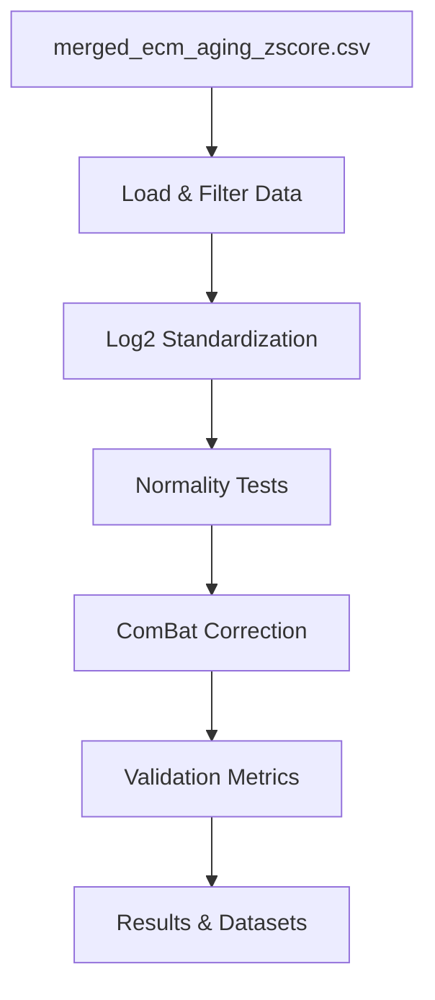

# Batch Correction Plan - Codex Agent

**Thesis:** Codex agent implements ComBat batch correction via modular Python pipeline standardizing 11 studies to log2 scale, applying pyCombat with biological covariates, and validating ICC improvement from 0.29 to >0.50.

## Overview

Batch correction pipeline addresses severe batch effects (ICC=0.29) caused by mixed data scales across 12 proteomics studies. Pipeline executes standardization (log2 transform for 4 LINEAR studies), normality testing (Shapiro-Wilk per study), ComBat correction (preserving Age+Tissue covariates), and validation (ICC, driver recovery, FDR proteins). Deliverables include executable pipeline, standardized/corrected datasets, validation metrics JSON, and results documentation per Knowledge Framework.




## 1.0 Data Preparation

**Studies to transform (LINEAR → LOG2):**
- Randles_2021: 5,217 rows (median 8,872-10,339)
- Dipali_2023: 173 rows (median 609,073-696,973)
- Ouni_2022: 98 rows (median 154.84-155.47)
- LiDermis_2021: 262 rows (median 9.54-9.79)

**Studies to keep as-is (already LOG2):**
- Angelidis_2019, Tam_2020, Tsumagari_2023, Schuler_2021
- Santinha_2024_Human, Santinha_2024_Mouse_DT, Santinha_2024_Mouse_NT

**Studies to exclude:**
- Caldeira_2017: 43 rows (incompatible ratio data)

## 2.0 Implementation Steps

**Step 1: Load and Filter**
- Read `/Users/Kravtsovd/projects/ecm-atlas/08_merged_ecm_dataset/merged_ecm_aging_zscore.csv`
- Exclude Caldeira_2017 (ratio data)
- Extract relevant columns: Study_ID, Abundance_Old, Abundance_Young, Tissue_Compartment, Protein_ID

**Step 2: Log2 Standardization**
- Apply `log2(x + 1)` to 4 LINEAR studies
- Validate global median in range 15-30
- Save `merged_ecm_aging_STANDARDIZED.csv`

**Step 3: Normality Testing**
- Shapiro-Wilk test per study (p-value threshold 0.05)
- D'Agostino-Pearson test as secondary
- Save `normality_test_results.csv`

**Step 4: ComBat Correction**
- Use pyCombat library
- Batch variable: Study_ID
- Covariates: Age_Group (Old/Young), Tissue_Compartment
- Apply parametric method if most studies normal (p>0.05)
- Save `merged_ecm_aging_COMBAT_CORRECTED.csv`

**Step 5: Validation**
- Calculate ICC (intraclass correlation coefficient)
- Test known aging drivers recovery (COL1A1, FN1, VTN, CTGF, TNC)
- Count FDR-significant proteins (q < 0.05)
- Save `validation_metrics.json`

## 3.0 Technical Approach

**Modular structure:**
```
batch_correction_pipeline.py
├── load_and_filter_data()
├── standardize_to_log2()
├── test_normality()
├── apply_combat()
└── calculate_validation_metrics()
```

**Dependencies:**
- pandas, numpy, scipy
- pyCombat (or R's sva::ComBat via rpy2)
- statsmodels (for ICC calculation)

**Data flow:**
1. Raw → Filtered (exclude Caldeira)
2. Filtered → Standardized (log2 transform)
3. Standardized → Tested (normality)
4. Standardized → Corrected (ComBat)
5. Corrected → Validated (ICC, drivers, FDR)

## 4.0 Success Criteria

| Metric | Current | Target | Validation Method |
|--------|---------|--------|-------------------|
| ICC | 0.29 | >0.50 | Intraclass correlation on corrected data |
| Driver recovery | 20% | ≥66.7% | Test 15 known aging drivers |
| FDR proteins | 0 | ≥5 | Benjamini-Hochberg q < 0.05 |
| Global median | 1,173 | 15-30 | After standardization only |

## 5.0 Deliverables Checklist

- [ ] `01_plan_codex.md` (this file)
- [ ] `batch_correction_pipeline.py`
- [ ] `merged_ecm_aging_STANDARDIZED.csv`
- [ ] `merged_ecm_aging_COMBAT_CORRECTED.csv`
- [ ] `normality_test_results.csv`
- [ ] `validation_metrics.json`
- [ ] `90_results_codex.md`

## 6.0 Execution Timeline

**Phase 1 (Data prep):** 30 min
- Load data, apply filters, standardize scales

**Phase 2 (Testing):** 15 min
- Run normality tests per study

**Phase 3 (Correction):** 30 min
- ComBat implementation, handle edge cases

**Phase 4 (Validation):** 30 min
- Calculate ICC, driver recovery, FDR counts

**Phase 5 (Documentation):** 30 min
- Generate results document with self-evaluation

**Total estimated time:** 2.25 hours

---

**Status:** READY TO EXECUTE
**Agent:** Codex
**Created:** 2025-10-18
**Framework:** Knowledge Framework (MECE + Minto)
