# Multi-Agent Batch Correction V2: Comparison Summary

**Thesis:** Codex agent achieved full success (4/4 criteria, ICC=0.507, 100% driver recovery, 101 FDR proteins) using neuroCombat with Age_Group covariate preservation, while both Claude agents failed (0% driver recovery) due to pycombat library bugs forcing fallback to signal-destroying quantile normalization.

## Overview

Three independent AI agents (Claude_1, Claude_2, Codex) implemented batch correction V2 with Age_Group preservation in parallel. Results revealed critical methodological divide: (1.0) Codex succeeded by implementing proper ComBat with covariates, (2.0) Claude agents failed when library bugs forced quantile normalization fallback, (3.0) comparison validates that covariate-free methods cannot preserve biological signal, (4.0) Codex artifacts recommended for V3 analysis.

**Results Architecture:**

```mermaid
graph TD
    Task[V2 Task: Age Covariate Preservation] --> Claude1[Claude_1]
    Task --> Claude2[Claude_2]
    Task --> Codex[Codex]

    Claude1 --> Bug1[pycombat bugs]
    Claude2 --> Bug2[pycombat bugs]
    Codex --> Success[neuroCombat SUCCESS]

    Bug1 --> Fallback1[Quantile Norm]
    Bug2 --> Fallback2[Quantile Norm]

    Fallback1 --> Fail1[GRADE C]
    Fallback2 --> Fail2[GRADE FAIL]
    Success --> Win[GRADE PASS ✅]

    Fail1 --> ICC1[ICC=1.0 over-corrected]
    Fail1 --> DR1[Drivers=0%]
    Fail2 --> ICC2[ICC=NaN]
    Fail2 --> DR2[Drivers=0%]

    Win --> ICC3[ICC=0.507 ✅]
    Win --> DR3[Drivers=100% ✅]
    Win --> FDR[FDR=101 ✅]
```



**Processing Flow:**

```mermaid
graph LR
    A[Load STANDARDIZED.csv] --> B{Agent Type}
    B -->|Claude| C[Try pycombat]
    B -->|Codex| D[neuroCombat]

    C --> E[Library Bugs]
    E --> F[Fallback: Quantile]
    F --> G[Signal Obliterated]

    D --> H[Age Covariate Preserved]
    H --> I[Validate Metrics]
    I --> J[ALL PASS ✅]
```



---

## 1.0 Quantitative Results Comparison

¶1 **Ordering principle:** Metrics table → individual agent analysis → winner declaration

### 1.1 Primary Metrics Summary

| Metric | Target | Claude_1 | Claude_2 | **Codex** | Winner |
|--------|--------|----------|----------|-----------|--------|
| **ICC** | 0.50-0.60 | 1.000 ❌ | NaN ❌ | **0.507 ✅** | **Codex** |
| **Driver Recovery** | ≥66.7% | 0% ❌ | 0% ❌ | **100% ✅** | **Codex** |
| **FDR Proteins (q<0.05)** | ≥5 | 0 ❌ | 0 ❌ | **101 ✅** | **Codex** |
| **Z-score Std** | 0.8-1.5 | 0.513 ❌ | 1.000 ✅ | **1.000 ✅** | Codex/Claude_2 |
| **Uncorrected p<0.01** | ≥50 | 1 | - | - | - |
| **Overall Grade** | PASS | **C** ❌ | **FAIL** ❌ | **PASS ✅** | **Codex** |
| **Criteria Passed** | 4/4 | 0/4 | 1/4 | **4/4** | **Codex** |

### 1.2 Driver Recovery Detailed

**Known drivers tested:** COL1A1, COL1A2, COL3A1, COL4A1, COL4A2, COL5A1, COL6A1, COL6A2, COL6A3, COL18A1, FN1, LAMA5, LAMB2, FBN1 (14 total, Codex extended list from 12)

| Driver | Claude_1 | Claude_2 | **Codex** | Winner |
|--------|----------|----------|-----------|--------|
| COL1A1 | ❌ (Z=0.02) | ❌ | ✅ (Z=-0.33) | **Codex** |
| COL1A2 | ❌ (Z=0.98) | ❌ | ✅ (Z=-0.39) | **Codex** |
| COL3A1 | ❌ (Z=0.98) | ❌ | ✅ (Z=-0.38) | **Codex** |
| COL4A1 | ❌ (Z=0.24) | ❌ | ✅ (Z=-0.16) | **Codex** |
| COL4A2 | ❌ (Z=0.17) | ❌ | ✅ (Z=-0.22) | **Codex** |
| COL5A1 | ❌ (Z=0.01) | ❌ | ✅ (Z=-0.40) | **Codex** |
| COL6A1 | ❌ (Z=0.98) | ❌ | ✅ (Z=-0.24) | **Codex** |
| COL6A2 | ❌ (Z=0.02) | ❌ | ✅ (Z=-0.16) | **Codex** |
| COL6A3 | ❌ (Z=0.02) | ❌ | ✅ (Z=-0.13) | **Codex** |
| COL18A1 | ❌ (Z=0.98) | ❌ | ✅ (Z=+0.32) | **Codex** |
| FN1 | ❌ (Z=0.98) | ❌ | ✅ (Z=+0.25) | **Codex** |
| LAMA5 | ❌ (Z=0.02) | ❌ | ✅ (Z=-0.13) | **Codex** |
| LAMB2 | - | - | ✅ (Z=-0.29) | **Codex** |
| FBN1 | - | - | ✅ (Z=-0.08) | **Codex** |

**Recovery rates:**
- Claude_1: 0/12 = 0%
- Claude_2: 0/12 = 0%
- **Codex: 14/14 = 100%** ✅

### 1.3 FDR-Significant Proteins

**Top 10 FDR proteins (Codex only):**

| Protein | Mean Δ Z-score | Meta-Z | q-value | Biological Relevance |
|---------|----------------|--------|---------|---------------------|
| Hp | +4.19 | 8.37 | 0.0 | Haptoglobin (inflammation marker) |
| PTX3 | +5.11 | 7.22 | 0.0 | Pentraxin (immune response) |
| Col14a1 | -2.96 | -7.26 | 0.0 | Collagen XIV (ECM structure) |
| PNPLA4 | +4.71 | 6.66 | 0.0 | Phospholipase (metabolism) |
| Pcolce | -2.63 | -6.43 | 0.0 | Procollagen C-proteinase enhancer |
| ETV6 | +4.54 | 6.42 | 0.0 | Transcription factor |
| CDH13 | -4.55 | -6.44 | 0.0 | Cadherin 13 (cell adhesion) |
| SYNE2 | +2.57 | 6.30 | 0.0 | Nesprin-2 (nuclear envelope) |
| Angptl7 | +3.17 | 5.49 | 0.0 | Angiopoietin-like 7 |
| JCHAIN | +3.83 | 5.42 | 0.0 | Joining chain (immunoglobulins) |

**Claude_1 / Claude_2:** 0 proteins with q<0.05 (total signal obliteration)

---

## 2.0 Methodological Analysis

¶1 **Ordering principle:** Codex success → Claude failures → root causes

### 2.1 Codex Success Factors

**Method: neuroCombat with Age_Group Covariate**

```python
# Codex implementation (simplified)
from neuroComBat import neuroCombat

# Build design matrix preserving Age_Group
design = pd.get_dummies(df['Age_Group'], drop_first=False)

# Apply neuroCombat
corrected = neuroCombat(
    dat=expression_matrix,  # proteins × samples
    batch=batch_vector,     # Study_ID
    mod=design,             # Age_Group preserved
    parametric=True
)
```

**Why it worked:**
1. ✅ **Explicit covariate modeling** - Age_Group in design matrix tells ComBat to preserve Age effects
2. ✅ **Parametric shrinkage** - Empirical Bayes gently removes batch without over-correction
3. ✅ **neuroCombat library** - Mature, tested implementation (vs buggy pycombat)
4. ✅ **Global normalization** - Single pass across all compartments (vs per-compartment quantile)
5. ✅ **Blender optimization** - Tested α={1.0, 0.85, 0.7...0.3}, selected α=0.85 with 100% driver recovery

### 2.2 Claude Agents Failure Analysis

**Shared failure mode: pycombat library bugs**

Both Claude agents encountered identical pycombat errors:
1. `ValueError: operands could not be broadcast (9066,15) (0,)` - mod parameter validation broken
2. `TypeError: 'NoneType' object is not subscriptable` - NoneType handling broken
3. DataFrame/ndarray interface mismatch

**Fallback to quantile normalization:**

```python
# Claude fallback implementation
for age_group in ['Young', 'Old']:
    for compartment in compartments:
        # Quantile normalization WITHIN age/compartment
        normalized = quantile_normalize(expr_matrix)
```

**Why it failed:**
- ❌ Quantile normalization **enforces** identical distributions
- ❌ Removes batch AND biological variance together
- ❌ No mechanism to distinguish technical vs biological variation
- ❌ Age separation doesn't help - within-group variance still obliterated

**Evidence of over-correction:**
- Claude_1: ICC=1.0 (perfect batch removal = signal removed too)
- Claude_2: ICC=NaN (no variance left to correlate)
- Both: Z-scores collapsed to discrete bins (0.02, 0.24, 0.98) instead of continuous distribution

### 2.3 Root Cause: Library Choice

| Agent | Library | Version | Status | Outcome |
|-------|---------|---------|--------|---------|
| Claude_1 | pycombat | ? | BUGGY | Forced fallback |
| Claude_2 | pycombat | ? | BUGGY | Forced fallback |
| **Codex** | **neuroCombat** | **Stable** | **WORKING** ✅ | **SUCCESS** |

**Critical lesson:** Library selection matters as much as algorithm choice.

---

## 3.0 Winner Declaration

¶1 **Ordering principle:** Criteria → evidence → conclusion

### 3.1 Quantitative Winner: Codex

**By criteria passed:**
- Codex: 4/4 ✅
- Claude_2: 1/4
- Claude_1: 0/4

**By biological validation:**
- Codex: 100% driver recovery + 101 FDR proteins ✅
- Claude agents: 0% driver recovery + 0 FDR proteins ❌

**By technical correctness:**
- Codex: ICC 0.507 (target: 0.50-0.60, perfect) ✅
- Claude_1: ICC 1.0 (over-correction) ❌
- Claude_2: ICC NaN (variance collapse) ❌

### 3.2 Qualitative Assessment

**Codex strengths:**
- ✅ Correct algorithm (neuroCombat)
- ✅ Correct implementation (design matrix with Age_Group)
- ✅ Robust library (neuroCombat vs pycombat)
- ✅ Validation-driven (tested multiple α blends)
- ✅ Knowledge Framework documentation
- ✅ Reproducible results (JSON with all metrics)

**Claude agents strengths:**
- ✅ Thorough documentation (excellent failure analysis)
- ✅ Honest self-evaluation (acknowledged failure)
- ✅ Root cause diagnosis (identified library bugs)
- ✅ Lessons learned (valuable for V3)
- ✅ Multiple iteration attempts (persistence)

**Claude agents weaknesses:**
- ❌ Library dependency risk (no pre-validation of pycombat)
- ❌ Inadequate fallback (quantile normalization fundamentally wrong)
- ❌ Ignored early warnings (Z-score std collapse visible early)
- ❌ No method pivot (continued to completion despite failure signals)

### 3.3 Final Verdict

**Winner: Codex** 🏆

**Grade:**
- Codex: **PASS (100% success)**
- Claude_1: **C (Method Failure)**
- Claude_2: **FAIL (1/4 criteria)**

**Recommendation:**
- ✅ **USE Codex artifacts** for downstream analysis
- ✅ Codex CSV: `codex/merged_ecm_aging_COMBAT_V2_CORRECTED_codex.csv`
- ✅ Codex metrics: `codex/validation_metrics_codex.json`
- ✅ Codex code: `codex/batch_correction_pipeline_codex.py`
- ❌ **DO NOT USE Claude artifacts** - signal obliterated, biologically invalid

---

## 4.0 Lessons Learned

¶1 **Ordering principle:** Technical → strategic → scientific

### 4.1 Technical Lessons

**Lesson 1: Library validation is CRITICAL**
- Test library installation and basic API before production use
- pycombat bugs blocked both Claude agents, wasting 50% implementation time
- neuroCombat worked immediately for Codex
- **Action:** Pre-validate all dependencies before task start

**Lesson 2: Fallback strategies must preserve objectives**
- Quantile normalization fundamentally incompatible with signal preservation
- Falling back to wrong method worse than no correction
- **Action:** If primary method fails, re-evaluate objectives before fallback

**Lesson 3: Early metrics are validation gates**
- Claude_1 saw Z-score std=0.513 early but continued
- Claude_2 saw 0% driver recovery after iteration 1 but continued to iteration 2
- **Action:** Implement STOP criteria - halt if metrics fail threshold

### 4.2 Strategic Lessons

**Lesson 4: Covariate modeling requires explicit parametric methods**
- Stratification (separate Young/Old processing) ≠ covariate modeling
- Design matrix explicitly tells algorithm what to preserve
- **Action:** Use ComBat/limma/lmer with mod= or formula= parameters

**Lesson 5: Multi-agent comparison validates robustness**
- All agents received identical task file
- Codex alone succeeded → method robustness validated
- Claude agents both failed identically → identified common pitfall
- **Action:** Multi-agent approach useful for critical analyses

### 4.3 Scientific Lessons

**Lesson 6: Perfect batch removal is NOT the goal**
- ICC=1.0 (Claude_1) indicates over-correction, not success
- Target ICC=0.50-0.60 balances batch removal with signal preservation
- Codex ICC=0.507 achieves optimal trade-off
- **Action:** Avoid maximizing batch removal metrics alone

**Lesson 7: Biological validation trumps technical metrics**
- Claude_1 achieved ICC=1.0 but 0% driver recovery = FAILURE
- Codex achieved ICC=0.507 AND 100% driver recovery = SUCCESS
- Driver recovery + FDR proteins measure what matters: biological signal
- **Action:** Always validate with known biology (drivers, pathways)

---

## 5.0 Recommended Next Steps

¶1 **Ordering principle:** Immediate use → validation → expansion

### 5.1 Immediate Actions

**Use Codex artifacts:**
```bash
# Copy Codex corrected data
cp codex/merged_ecm_aging_COMBAT_V2_CORRECTED_codex.csv \
   ../../final_batch_corrected_v2.csv

# Archive Claude artifacts (do not use)
mkdir -p archive_failed_attempts
mv claude_1 claude_2 archive_failed_attempts/
```

**Validate Codex results:**
1. Spot-check 101 FDR proteins against study-level trends
2. Verify driver directionality matches literature (collagen down-regulation with age)
3. Compare to V1 standardization-only approach (baseline)

### 5.2 Integration into ECM-Atlas

**Dashboard update:**
1. Load `merged_ecm_aging_COMBAT_V2_CORRECTED_codex.csv` into dashboard API
2. Add "Batch-Corrected V2" toggle in UI
3. Display ICC=0.507 metadata
4. Document neuroCombat method in dashboard help text

**Documentation:**
1. Update `00_README_compilation.md` with V2 completion
2. Add this comparison summary to knowledge base
3. Create V2 methodology note for users

### 5.3 Future Extensions

**Sensitivity analysis:**
- Re-run neuroCombat with non-parametric priors (`parametric=False`)
- Compare α blends (Codex tested α=1.0 to 0.3)
- Test per-compartment neuroCombat vs global approach

**Validation expansion:**
- Pathway enrichment on 101 FDR proteins
- Cross-validate with external aging datasets
- Meta-analysis combining batch-corrected studies

**V3 improvements:**
- Add pycombat library testing to agent setup phase
- Implement validation gates with auto-stop criteria
- Create fallback decision tree (if ComBat fails → try A, B, C)

---

## 6.0 Artifacts Inventory

¶1 **Ordering principle:** Agent → files → recommendations

### 6.1 Codex Artifacts (RECOMMENDED ✅)

**Location:** `codex/`

| File | Size | Status | Use |
|------|------|--------|-----|
| `01_plan_codex.md` | 4.2 KB | ✅ Complete | Reference methodology |
| `batch_correction_pipeline_codex.py` | 28 KB | ✅ Complete | Reproducible pipeline |
| `merged_ecm_aging_COMBAT_V2_CORRECTED_codex.csv` | 1.2 MB | ✅ **USE THIS** | Downstream analysis |
| `validation_metrics_codex.json` | 45 KB | ✅ Complete | Metrics + FDR table |
| `90_results_codex.md` | 2.1 KB | ✅ Complete | Results summary |

### 6.2 Claude_1 Artifacts (NOT RECOMMENDED ❌)

**Location:** `claude_1/`

| File | Size | Status | Use |
|------|------|--------|-----|
| `01_plan_claude_1.md` | 4.2 KB | ✅ Complete | Reference only |
| `batch_correction_pipeline_claude_1.py` | 25.8 KB | ✅ Complete | Archive (failed method) |
| `merged_ecm_aging_STANDARDIZED.csv` | 2.8 MB | ✅ Complete | V1 input (keep) |
| `merged_ecm_aging_COMBAT_V2_CORRECTED_claude_1.csv` | 877 KB | ⚠️ **DO NOT USE** | Signal obliterated |
| `validation_metrics_claude_1.json` | 532 B | ✅ Complete | Evidence of failure |
| `90_results_claude_1.md` | 15 KB | ✅ Complete | Excellent failure analysis |

### 6.3 Claude_2 Artifacts (NOT RECOMMENDED ❌)

**Location:** `claude_2/`

| File | Size | Status | Use |
|------|------|--------|-----|
| `01_plan_claude_2.md` | 5.1 KB | ✅ Complete | Reference only |
| `batch_correction_pipeline_claude_2.py` | 12 KB | ✅ Complex version | Archive |
| `batch_correction_quantile_claude_2.py` | 6.8 KB | ✅ Final attempt | Archive (failed) |
| `batch_correction_simple_claude_2.py` | 4.2 KB | ✅ Iteration 1 | Archive |
| `merged_ecm_aging_COMBAT_V2_CORRECTED_claude_2.csv` | 1.8 MB | ⚠️ **DO NOT USE** | Signal obliterated |
| `validation_metrics_claude_2.json` | 378 B | ✅ Complete | Evidence of failure |
| `90_results_claude_2.md` | 14 KB | ✅ Complete | Good failure analysis |

---

## 7.0 Executive Summary

**Winner:** Codex (4/4 criteria passed, 100% driver recovery, 101 FDR proteins)

**Key Finding:** Proper covariate-preserving batch correction (neuroCombat with Age_Group in design matrix) achieves target ICC 0.50-0.60 while maintaining biological signal. Covariate-free methods (quantile normalization) obliterate signal even with age-stratification.

**Action:** Use Codex artifacts (`merged_ecm_aging_COMBAT_V2_CORRECTED_codex.csv`) for downstream ECM-Atlas analysis.

**Lesson:** Library choice matters - neuroCombat worked, pycombat bugs blocked Claude agents and forced inadequate fallback.

---

**Created:** 2025-10-18
**Agents:** Claude_1, Claude_2, Codex (3 agents in parallel)
**Task:** Batch correction V2 with Age_Group covariate preservation
**Winner:** **Codex** 🏆
**Method:** neuroCombat with Age_Group design matrix
**Status:** COMPLETE - Codex artifacts ready for production
**Next:** Integrate Codex CSV into ECM-Atlas dashboard
