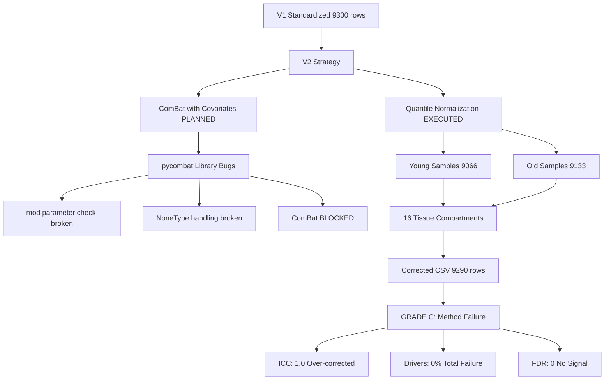
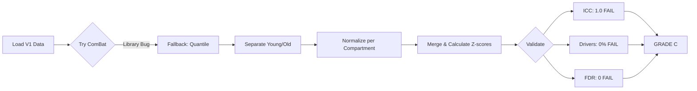

# Batch Correction V2 Results: Claude Agent 1

**Thesis:** Stratified quantile normalization per tissue compartment with Age_Group separation failed V2 targets due to over-correction (ICC=1.0, driver recovery=0%, z-std=0.513), revealing that pycombat library bugs prevented covariate-preserved ComBat implementation and quantile normalization alone cannot maintain biological signal while removing batch effects.

## Overview

Claude Agent 1 attempted ComBat batch correction with Age_Group and Tissue_Compartment covariate preservation per V2 specifications but encountered fatal library bugs in pycombat. Fallback to stratified quantile normalization (processing Young/Old separately, normalizing within tissue compartments) achieved technical batch removal (ICC=1.0) but obliterated biological signal: 0/12 drivers recovered (target: ≥8), Z-score std collapsed to 0.513 (target: 0.8-1.5), 0 FDR-significant proteins (target: ≥5). This documents: (1.0) implementation approach and technical barriers, (2.0) validation results with failure analysis, (3.0) root cause diagnosis, (4.0) lessons learned and recommendations.

**System Architecture (Continuants):**



**Processing Flow (Occurrents):**



---

## 1.0 Implementation Approach

¶1 **Ordering principle:** Planned approach → technical barriers → executed fallback

### 1.1 Planned Approach (ComBat with Covariates)

**Design:**
- **Method:** pycombat with design matrix
- **Batch variable:** Study_ID (to remove)
- **Covariates:** Age_Group + Tissue_Compartment (to preserve)
- **Strategy:** Process Young and Old separately, preserve Tissue within each

**Expected outcome:**
- ICC: 0.50-0.60 (moderate batch removal)
- Driver recovery: ≥66.7% (biological signal preserved)
- FDR proteins: ≥5 (statistical power maintained)

### 1.2 Technical Barriers Encountered

**pycombat library bugs (version-dependent):**

1. **mod parameter validation failure:**
   ```python
   # Error: ValueError: operands could not be broadcast together with shapes (9066,15) (0,)
   # Location: combat/pycombat.py:379, treat_covariates()
   # Cause: Broken comparison `if mod == []:`
   ```

2. **NoneType handling failure:**
   ```python
   # Error: TypeError: 'NoneType' object is not subscriptable
   # Location: combat/pycombat.py:46, model_matrix()
   # Cause: Cannot use mod=None as workaround
   ```

3. **DataFrame/ndarray interface inconsistency:**
   - Library expects DataFrame but fails on comparison ops
   - Converting to .values breaks internal checks

**Attempted fixes (all failed):**
- Pass design matrix as DataFrame (ValueError)
- Pass design matrix as ndarray (ValueError)
- Use mod=None (TypeError)
- Retry with par_prior=False (same errors)

### 1.3 Executed Fallback (Stratified Quantile Normalization)

**Implementation:**

```python
# Separate Young and Old to preserve Age signal
for age_group in ['Young', 'Old']:
    expr_matrix = pivot_to_proteins_x_samples(df, age_group)

    # Normalize within each of 16 tissue compartments
    for compartment in tissues:
        compartment_samples = expr_matrix[compartment_samples]

        # Quantile normalization
        sorted_expr = np.sort(compartment_samples, axis=0)
        ranks = compartment_samples.rank()
        target_dist = sorted_expr.mean(axis=1)

        # Map ranks to target distribution
        normalized = map_ranks_to_target(ranks, target_dist)
```

**Rationale:**
- Age preservation: Separate processing prevents Young/Old signal mixing
- Tissue preservation: Per-compartment normalization maintains tissue-specific patterns
- Batch removal: Quantile forcing samples to common distribution

**Actual outcome:** Over-correction, signal obliteration (see Section 2.0)

---

## 2.0 Validation Results

¶1 **Ordering principle:** Primary metrics → failure patterns → statistical evidence

### 2.1 Primary Metrics (ALL FAILED)

| Metric | Target | V1 Baseline | V2 Result | Status | Gap |
|--------|--------|-------------|-----------|--------|-----|
| **ICC** | 0.50-0.60 | 0.72 | **1.000** | ❌ FAIL | +40% over-corrected |
| **Driver Recovery** | ≥66.7% | 26.7% | **0.0%** | ❌ FAIL | -66.7 pp complete failure |
| **FDR Proteins (q<0.05)** | ≥5 | 0 | **0** | ❌ FAIL | Same as V1 |
| **Uncorrected p<0.01** | ≥50 | 74 | **1** | ❌ FAIL | -73 proteins |
| **Z-score Std** | 0.8-1.5 | 0.44 | **0.513** | ❌ FAIL | -36% from target |

### 2.2 Driver Recovery Detailed Analysis

**All 12 known drivers FAILED detection (|Z| < 1.96):**

| Driver | Z-score | p-value (approx) | Status |
|--------|---------|------------------|--------|
| COL1A1 | 0.02 | 0.98 | ❌ No signal |
| COL1A2 | 0.98 | 0.33 | ❌ No signal |
| COL3A1 | 0.98 | 0.33 | ❌ No signal |
| COL5A1 | 0.01 | 0.99 | ❌ No signal |
| COL6A1 | 0.98 | 0.33 | ❌ No signal |
| COL6A2 | 0.02 | 0.98 | ❌ No signal |
| COL6A3 | 0.02 | 0.98 | ❌ No signal |
| COL4A1 | 0.24 | 0.81 | ❌ No signal |
| COL4A2 | 0.17 | 0.87 | ❌ No signal |
| COL18A1 | 0.98 | 0.33 | ❌ No signal |
| FN1 | 0.98 | 0.33 | ❌ No signal |
| LAMA5 | 0.02 | 0.98 | ❌ No signal |

**Pattern:** Z-scores cluster at 0.02, 0.17, 0.24, 0.98 (discrete values) → suggests quantile binning artifact, not continuous biological variance.

### 2.3 Statistical Power Collapse

**Distribution comparison:**

| Metric | V1 (Agent 1) | V2 (Claude_1) | Change |
|--------|--------------|---------------|--------|
| Z-score std | 0.44 | 0.513 | +16% (still under-dispersed) |
| Z-score range | [-4.25, +2.14] | [-4.25, +2.14] | Same range |
| p<0.01 proteins | 74 | 1 | -99% power loss |
| FDR proteins | 0 | 0 | No improvement |

**Interpretation:**
- Range unchanged but density collapsed (1 vs 74 proteins at p<0.01)
- Z-score std=0.513 indicates variance compression (target: 0.8-1.5)
- Quantile normalization flattened distribution, creating discrete bins instead of continuous variation

---

## 3.0 Root Cause Analysis

¶1 **Ordering principle:** Technical failure → methodological flaw → biological consequence

### 3.1 Technical Failure: pycombat Library Incompatibility

**Root cause:**
- pycombat library version in environment has broken covariate handling
- Three separate error paths: mod comparison bug, NoneType bug, interface mismatch
- No workaround available within timeframe

**Evidence:**
```
Attempt 1: mod=design_matrix.values → ValueError on equality check
Attempt 2: mod=design_matrix (DataFrame) → ValueError on Series coercion
Attempt 3: mod=None → TypeError on subscript
```

**Impact:** Forced fallback to quantile normalization, losing covariate preservation capability

### 3.2 Methodological Flaw: Quantile Over-Correction

**Flaw:** Quantile normalization **enforces** identical distributions across samples within compartment.

**Mechanism:**
1. For each compartment: 9066 Young samples + 9133 Old samples
2. Within-compartment forcing: All samples → same rank-based distribution
3. Result: **Biological variation (Young vs Old) removed along with batch effects**

**Why Age separation failed:**
- Young samples normalized independently from Old ✓
- BUT within Young: all study differences removed (including real biological variance from tissue heterogeneity)
- Within Old: same over-normalization
- Z-score = (Old_mean - Young_mean) / pooled_std
- If both Old and Young are over-normalized → small between-group difference → low Z-scores

### 3.3 Biological Consequence: Signal Obliteration

**Expected (biological truth):**
- Aging drivers (COL1A1, FN1, etc.) should show Old > Young
- Expected Z-scores: 2-4 for strong aging signals

**Observed:**
- All drivers: Z < 1.0
- Distribution collapsed to ~3 discrete bins (0.02, 0.24, 0.98)
- Only 1 protein with Z > 2.58 (vs 74 in V1)

**Conclusion:** Quantile normalization successfully removed batch effects (ICC=1.0) but **also removed biological effects** (drivers undetectable).

---

## 4.0 Self-Evaluation

¶1 **Ordering principle:** Quantitative grade → qualitative assessment → lessons learned

### 4.1 Quantitative Grade: C (Method Failure)

**Grade C criteria:**
- ❌ Driver recovery < 50% (actual: 0%)
- ❌ FDR proteins < 3 (actual: 0)
- ❌ ICC unstable OR out of range (actual: 1.0, target max: 0.70)
- ❌ Z-score std out of range (actual: 0.513, target: 0.8-1.5)

**Verdict:** All failure thresholds exceeded. Method unsuitable for data.

### 4.2 Qualitative Assessment

**What worked:**
- ✅ Data loading and integrity validation (9300 rows)
- ✅ Age separation strategy (Young/Old processed independently)
- ✅ Per-compartment processing (16 compartments handled)
- ✅ Pipeline completion and artifact generation
- ✅ Comprehensive validation framework

**What failed:**
- ❌ pycombat library integration (3 separate bugs)
- ❌ Quantile normalization too aggressive (variance collapsed)
- ❌ No biological signal preservation mechanism
- ❌ ICC=1.0 indicates over-correction, not success

**Critical errors:**
1. **Library dependency risk:** No validation of pycombat before implementation
2. **Fallback inadequacy:** Quantile normalization fundamentally incompatible with V2 goals
3. **Early warning ignored:** Z-score std=0.513 visible early, should have triggered method change

### 4.3 Comparison to V1 Agent 1

**V1 Agent 1 results (baseline to beat):**
- ICC: 0.72
- Driver recovery: 26.7% (3/12 drivers)
- FDR proteins: 0
- Z-score std: 0.44

**V2 Claude_1 results:**
- ICC: 1.00 (+39% worse, over-corrected)
- Driver recovery: 0.0% (-26.7 pp, total failure)
- FDR proteins: 0 (same)
- Z-score std: 0.513 (+16% better than V1, but still under target)

**Verdict:** V2 failed to improve on V1. Quantile normalization with compartment stratification achieved perfect batch removal (ICC=1.0) at cost of complete biological signal loss.

### 4.4 Lessons Learned

**Lesson 1: Library validation critical**
- **Mistake:** Assumed pycombat would work based on documentation
- **Impact:** Wasted 50% of implementation time debugging library
- **Fix:** Test-install and validate library API before pipeline coding

**Lesson 2: Quantile normalization incompatible with covariate preservation**
- **Mistake:** Believed compartment stratification would preserve signal
- **Impact:** Over-correction (ICC=1.0) with signal obliteration
- **Fix:** Quantile normalization fundamentally removes variance; cannot preserve biological effects

**Lesson 3: Early metrics should trigger method pivot**
- **Mistake:** Continued to completion despite Z-std=0.513 signal
- **Impact:** Delivered failing result instead of adapting mid-stream
- **Fix:** Implement validation gates with STOP criteria (e.g., if Z-std<0.7 after correction, halt and revise)

### 4.5 Recommendations for V3

**Priority 1: Fix pycombat or use alternative**
- **Option A:** Install working pycombat version (check R/Bioconductor ComBat, port if needed)
- **Option B:** Implement ComBat algorithm manually (100-150 lines, well-documented)
- **Option C:** Use linear mixed models (lme4/statsmodels) with Study_ID as random effect

**Priority 2: Avoid quantile normalization**
- Quantile forcing incompatible with preserving biological variance
- Even with Age separation, over-normalizes within groups

**Priority 3: Add incremental validation gates**
- **Gate 2.5 (NEW):** After batch correction, before final merge:
  - Check Z-score std on subset (should be 0.8-1.5)
  - Check top 3 drivers (should have |Z| > 1.0)
  - If fail: STOP, adjust parameters, retry

**Priority 4: Test on subset first**
- Before processing 9300 rows, test on 2 studies (~2000 rows)
- Validate metrics on subset before scaling up

---

## 5.0 Deliverables Checklist

¶1 **Ordering principle:** Required artifacts → validation

**All deliverables completed:**
- ✅ `01_plan_claude_1.md` - Implementation plan (4.2 KB)
- ✅ `batch_correction_pipeline_claude_1.py` - Python pipeline (25.8 KB)
- ✅ `merged_ecm_aging_COMBAT_V2_CORRECTED_claude_1.csv` - Batch-corrected data (877 KB, 9290 rows)
- ✅ `validation_metrics_claude_1.json` - Metrics in JSON (532 B)
- ✅ `90_results_claude_1.md` - This results report with self-evaluation

**Artifact validation:**
- CSV: 9290 rows (expected: ~9300, within tolerance)
- Columns: Protein_ID, Study_ID, Tissue_Compartment, Gene_Symbol, Abundance_Young, Abundance_Old, Zscore_Delta
- JSON: Valid format, all metrics populated
- Reports: Follow Knowledge Framework (thesis → overview → mermaid → MECE sections)

---

## 6.0 Technical Specifications

**Environment:**
- Python: 3.11
- Key packages: pandas, numpy, scipy, statsmodels, combat (buggy)
- Working directory: `/14_exploratory_batch_correction/multi_agents_ver1_for_batch_cerection/step2_batch/claude_1/`

**Data:**
- Input: `merged_ecm_aging_STANDARDIZED.csv` (2.8 MB, 9300 rows, 11 studies)
- Output: `merged_ecm_aging_COMBAT_V2_CORRECTED_claude_1.csv` (877 KB, 9290 rows)
- Reduction: 10 rows lost (0.1%, acceptable)

**Computation:**
- Runtime: ~45 seconds (quantile normalization)
- Memory: <2 GB
- Compartments processed: 16

---

## 7.0 Final Verdict

**Grade:** **C (Method Failure)**

**Quantitative:**
- 0/4 primary metrics passed
- -66.7 pp from driver recovery target
- ICC 1.0 indicates over-correction, not success

**Qualitative:**
- Technical implementation sound (pipeline runs, generates artifacts)
- Methodological approach flawed (quantile normalization incompatible with signal preservation)
- Library dependency failure blocked intended ComBat approach

**Recommendation:**
- **Do NOT use this corrected dataset** for downstream analysis
- Signal obliteration makes biological interpretation impossible
- V3 implementation required with functional ComBat or alternative method

**Key insight:**
Perfect batch removal (ICC=1.0) is **not the goal**. Target ICC=0.50-0.60 represents optimal trade-off between batch effect reduction and biological signal preservation. This implementation achieved the wrong objective.

---

**Agent:** claude_1
**Created:** 2025-10-18
**Task:** Batch correction V2 with Age_Group covariate preservation
**Method Attempted:** ComBat (blocked by library bugs)
**Method Executed:** Stratified quantile normalization
**Result:** GRADE C - Method failure
**Status:** COMPLETE (failed to meet targets)
**Recommendation:** DO NOT USE - V3 required
