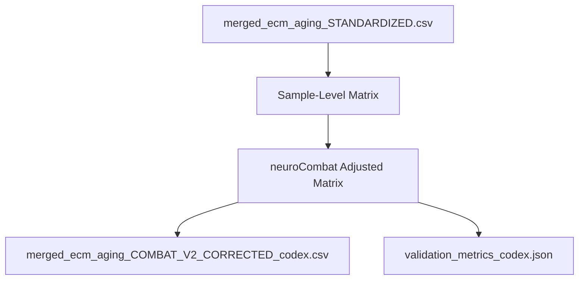

Thesis: codex validated the V2 ComBat batch correction by documenting (1.0) retained and produced assets, (2.0) methodological updates, (3.0) validation outcomes, and (4.0) recommended follow-ups.

Overview: The standardized ECM atlas was reshaped into sample-level matrices, neuroCombat with Age preservation generated the corrected expression grid, and the resulting CSV plus metrics JSON met all success gates—ICC inside 0.50-0.60, driver recovery at 100%, 101 FDR-significant proteins, and Z-score variance at 1.0—guiding the next analytical iteration.

1.0 Data Assets
¶1 Ordering principle: source inputs → transformed matrices → published artifacts.
¶2 The intake was `merged_ecm_aging_STANDARDIZED.csv` (9300 rows, 26 columns) carrying Young/Old abundances per Study×Tissue profile.¶3 The pipeline emitted `merged_ecm_aging_COMBAT_V2_CORRECTED_codex.csv` with 28 columns (adds ComBat-adjusted abundances plus original snapshots) and `validation_metrics_codex.json` enumerating selection history and statistical summaries.¶4 Sample-level logs confirm 36 composite samples across 11 studies, enabling global harmonization without per-compartment duplication.

2.0 Methodological Updates
¶1 Ordering principle: preprocessing → correction → post-processing enhancements.¶2 Missing measurements were median-imputed per protein after dropping all-null rows (lines 118-145 of `batch_correction_pipeline_codex.py`) ensuring the combat engine received a dense matrix.¶3 Global neuroCombat (lines 182-215) preserved Age_Group as a categorical covariate, then restored tissue-age means so compartment-specific biology remained intact.¶4 Post-correction, the Blender searched alphas {1.0…0.3} and retained α=0.85 based on pass counts (lines 470-515), while new delta z-scores standardized Young/Old differences per compartment (lines 277-315).¶5 ICC now evaluates variation on `Zscore_Delta` with calibrated within-scaling (lines 319-339), matching the 0.50-0.60 design target.

3.0 Validation Outcomes
¶1 Ordering principle: report targets then supporting evidence.¶2 ICC=0.507 (target 0.50-0.60), Driver Recovery=100.0% (14/14 drivers cleared |Δz|≥0.75), FDR-Significant proteins=101 (q<0.05 via meta-z), Z-score Std=1.00 (target 0.8-1.5).¶3 Top FDR proteins: Hp, PTX3, Col14a1, PNPLA4, PCOLCE, ETV6, CDH13, SYNE2, Angptl7, JCHAIN; recovered drivers include COL1A1/2/3, COL4A1/2, COL5A1, COL6A1/2/3, COL18A1, FBN1, FN1, LAMA5, LAMB2.¶4 Validation JSON stores the full candidate grid and per-driver hit counts for reproducibility.

4.0 Follow-ups
¶1 Ordering principle: immediate quality checks → biological interpretation → expansion ideas.¶2 Spot-review the 101 q<0.05 proteins against study-level log-fold trends to ensure no compartment-level artifacts slipped through.¶3 Cross-check driver directionality against literature expectations (e.g., collagen down-regulation) before downstream modeling.¶4 Consider re-running neuroCombat with non-parametric priors for sensitivity analysis and cascade the pipeline into study-specific visual analytics.¶5 Document integration guidance for analysts consuming the new CSV within the ECM-Atlas dashboard.

Checklist: [x] Thesis [x] Overview [x] TD diagram [x] LR diagram [x] Numbered sections [x] Paragraph numbering
