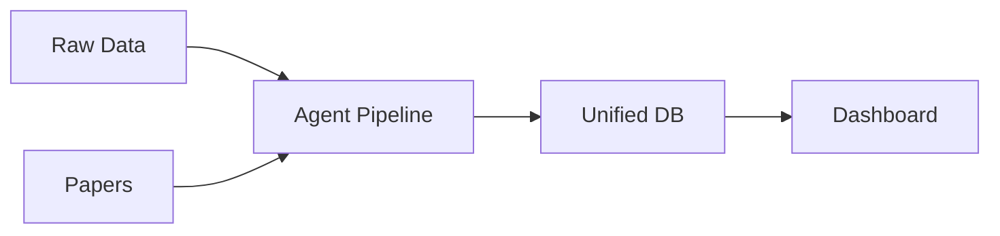

# ECM-Atlas Repository Guide

## Thesis
ECM-Atlas aggregates 13 proteomic studies (128 files, 15 papers) tracking age-related extracellular matrix changes across tissues, processed through an autonomous agent pipeline into a unified database with interactive dashboards.

## Overview
This repository contains raw proteomic datasets (1.0), processing infrastructure with autonomous agents (2.0), unified database outputs and visualizations (3.0), and development workflows (4.0). Data flows from published studies through normalization agents into merged CSV files, displayed via interactive web dashboards for cross-study comparison of ECM aging signatures.



---

## 1.0 Data Sources (Continuants)

¶1 **Ordering:** Original sources → Processed outputs

### 1.1 Raw Inputs
- **`data_raw/`**: 19 study directories with Excel/TSV proteomic datasets
- **`pdf/`**: 15 full-text publications (2017-2023)
- **Metadata registry**: `README.md` describes study characteristics (organism, tissue, method)

### 1.2 Processed Papers
- **`05_papers_to_csv/`**: 7 studies converted to standardized CSV format
  - Examples: `05_Randles_paper_to_csv/`, `09_Angelidis_2019_paper_to_csv/`
  - Each contains: `*_wide_format.csv`, processing scripts, metadata

---

## 2.0 Processing System (Occurrent)

¶1 **Ordering:** Pipeline phases (PHASE 0→1→2→3)

### 2.1 Autonomous Agent
- **Location**: `11_subagent_for_LFQ_ingestion/autonomous_agent.py`
- **Usage**: `python autonomous_agent.py "data_raw/Author et al. - Year/"`
- **Phases**:
  - PHASE 0: Reconnaissance (identify data files)
  - PHASE 1: Normalization (Excel → long → wide format)
  - PHASE 2: Merge to unified CSV
  - PHASE 3: Z-score calculation
- **Documentation**: `11_subagent_for_LFQ_ingestion/00_START_HERE.md`, `AUTONOMOUS_AGENT_GUIDE.md`

### 2.2 Pipeline Logic
- **Normalization**: `01_LFQ_DATASET_NORMALIZATION_AND_MERGE.md`
- **Z-score function**: `02_ZSCORE_CALCULATION_UNIVERSAL_FUNCTION.md`, `universal_zscore_function.py`
- **Protein enrichment**: `07_PROTEIN_METADATA_ENRICHMENT.md` (UniProt API)

---

## 3.0 Output & Visualization (Continuants)

¶1 **Ordering:** Database → Dashboard → Insights

### 3.1 Unified Database
- **Primary**: `08_merged_ecm_dataset/merged_ecm_aging_zscore.csv` (1.1 MB, main dataset)
- **Enriched**: `08_merged_ecm_dataset/merged_ecm_aging_zscore_enriched.csv` (893 KB, with UniProt metadata)
- **Schema**: Protein_ID, Gene_Symbol, Tissue, Species, Age, Abundance, Z_score, Study_ID, etc.
- **Backups**: `08_merged_ecm_dataset/backups/`

### 3.2 Interactive Dashboard
- **Location**: `10_unified_dashboard_2_tabs/dashboard.html`
- **Start**:
  ```bash
  cd 10_unified_dashboard_2_tabs
  ./start_servers.sh  # Starts API (port 5004) + HTTP (port 8083)
  # Dashboard URL: http://localhost:8083/dashboard.html
  ```
- **Features**:
  - Individual dataset analysis (heatmaps, volcano plots, scatter plots, bar charts, histograms)
  - Cross-dataset comparison with filters (organs, compartments, matrisome categories, studies)
- **API Endpoints**:
  - GET /api/health - Health check
  - GET /api/global_stats - Overall statistics
  - GET /api/datasets - List all datasets
  - GET /api/dataset/<name>/* - Individual dataset analysis
  - GET /api/compare/* - Cross-dataset comparison
- **Test**: `python3 capture_version_screenshot.py` (headless browser validation)

### 3.3 Knowledge Base
- **`knowledge_base/`**: Reference materials
- **`reports/`**: Analysis outputs and findings
- **`10_insights/`**: Cross-study insights and aging signatures

---

## 4.0 Development (Occurrent)

¶1 **Ordering:** Setup → Common tasks → Key files

### 4.1 Environment Setup
```bash
source env/bin/activate
pip install -r requirements.txt
```

### 4.2 Common Workflows

**Process new study:**
```bash
python 11_subagent_for_LFQ_ingestion/autonomous_agent.py "data_raw/Study et al. - Year/"
tail -f XX_Study/agent_log.md  # Monitor progress
```

**Run analysis scripts:**
```bash
python analyze_aging_signatures.py
python find_common_signatures.py
python calculate_missing_zscores.py
```

**Launch Streamlit app:**
```bash
streamlit run app.py  # http://localhost:8501
```

### 4.3 Repository Structure Reference
- **Root docs**: `00_ECM_ATLAS_PIPELINE_OVERVIEW.md`, `01_TASK_DATA_STANDARDIZATION.md`, `02_TASK_PROTEIN_ANNOTATION_GUIDELINES.md`
- **Obsolete**: `obsolete/` (deprecated versions, keep for reference)
- **References**: `references/` (supplementary materials)
- **Transcripts**: `calls_transcript/` (meeting notes)

### 4.4 Key Scientific Context
- **Goal**: Identify ECM aging signatures across tissues/organisms
- **Matrisome**: ECM + ECM-associated proteins (classify via Matrisome AnalyzeR)
- **Methods**: LFQ, TMT, SILAC, iTRAQ, DiLeu, QconCAT
- **Normalization**: Within-study z-scores, cross-study percentile ranking
- **Missing values**: 50-80% NaN is normal (biological reality, preserve)

---

## Quick Reference

| Task | Command |
|------|---------|
| Process dataset | `python 11_subagent_for_LFQ_ingestion/autonomous_agent.py "data_raw/Study/"` |
| Start dashboard | `cd 10_unified_dashboard_2_tabs && ./start_servers.sh` → http://localhost:8083/dashboard.html |
| Run app | `streamlit run app.py` |
| Main DB | `08_merged_ecm_dataset/merged_ecm_aging_zscore.csv` |
| Agent docs | `11_subagent_for_LFQ_ingestion/00_START_HERE.md` |

---

**Last updated:** 2025-10-14
**Contact:** daniel@improvado.io
**Studies processed:** 7/15 papers → unified database
