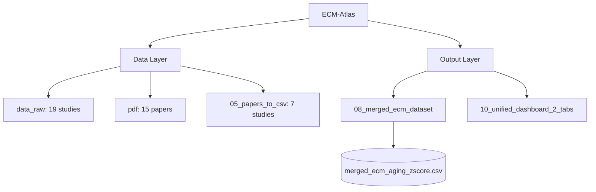
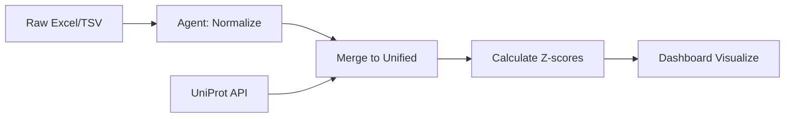

# ECM-Atlas Repository Guide

## Thesis
ECM-Atlas aggregates 13 proteomic studies (128 files, 15 papers) tracking age-related ECM changes, processed via autonomous agent pipeline into unified database with interactive dashboards for cross-tissue aging signature analysis.

YOU MUST before creating new files, search if solution already exist, like if you want to test dashbord, look if we alrady ahve code for this etc. and reuse existing code and documents and folders. 

## Overview
Repository contains data sources (1.0), processing pipelines (2.0), outputs (3.0), and workflows (4.0). Raw proteomic datasets flow through autonomous normalization agents into merged CSV database, visualized via web dashboard with cross-study comparison capabilities.

**System Structure (Continuants):**


**Processing Flow (Occurrents):**


---

## Documentation Standard

**For AI Agent:** When creating `.md` files or technical descriptions, follow Knowledge Framework:
- Structure: Thesis (1 sentence) → Overview (1 paragraph) → Mermaid diagrams → MECE sections
- Diagrams: TD for structure (Continuants), LR for processes (Occurrents)
- Format: Number sections (1.0, 2.0), paragraphs (¶1, ¶2), state ordering principle in ¶1
- Reference: `/Users/Kravtsovd/projects/chrome-extension-tcs/How to organize documents_knowladge_framework.md`

---

## 1.0 Data Sources

¶1 Ordering: Raw inputs → Processed outputs

- **`data_raw/`**: 19 study directories (Excel/TSV proteomic datasets)
- **`pdf/`**: 15 publications (2017-2023)
- **`05_papers_to_csv/`**: 7 processed studies as CSV (`*_wide_format.csv`, scripts, metadata)

---

## 2.0 Processing Pipeline

¶1 Ordering: PHASE 0→1→2→3

**Autonomous Agent** (`11_subagent_for_LFQ_ingestion/autonomous_agent.py`):
- PHASE 0: Reconnaissance (identify files)
- PHASE 1: Normalization (Excel → long → wide CSV)
- PHASE 2: Merge to unified DB
- PHASE 3: Z-score calculation

**Key Scripts**:
- `merge_to_unified.py`, `universal_zscore_function.py`
- Docs: `00_START_HERE.md`, `AUTONOMOUS_AGENT_GUIDE.md`

---

## 3.0 Outputs

¶1 Ordering: Database → Dashboard → Insights

**Database** (`08_merged_ecm_dataset/`):
- `merged_ecm_aging_zscore.csv` (1.1 MB, main)
- `merged_ecm_aging_zscore_enriched.csv` (893 KB, +UniProt metadata)
- Schema: Protein_ID, Gene_Symbol, Tissue, Species, Age, Abundance, Z_score, Study_ID

**Dashboard** (`10_unified_dashboard_2_tabs/`):
- Start: `./start_servers.sh` → http://localhost:8083/dashboard.html
- Features: Heatmaps, volcano plots, scatter plots, cross-dataset comparison
- API: `/api/health`, `/api/datasets`, `/api/compare/*`

**Knowledge**: `knowledge_base/`, `reports/`, `10_insights/`

---

## 4.0 Development

¶1 Ordering: Setup → Workflows → Context

**Setup**:
```bash
source env/bin/activate
pip install -r requirements.txt
```

**Workflows**:
```bash
# Process new study
python 11_subagent_for_LFQ_ingestion/autonomous_agent.py "data_raw/Study/"

# Start dashboard
cd 10_unified_dashboard_2_tabs && ./start_servers.sh

# Analysis scripts
python analyze_aging_signatures.py
python find_common_signatures.py
```

**Scientific Context**:
- Goal: Identify ECM aging signatures across tissues/organisms
- Methods: LFQ, TMT, SILAC, iTRAQ, DiLeu
- **Data Handling:**
  - **NaN (missing data):** 50-80% is normal in LFQ, preserve don't impute (excluded from mean/std calculations)
  - **Zero values (detected absence):** 0.0 abundance = protein measured as undetectable/absent (included in mean/std, produces valid z-scores)
  - See: `11_subagent_for_LFQ_ingestion/02_ZSCORE_CALCULATION_UNIVERSAL_FUNCTION.md` → "Zero Value Handling" section
- Normalization: Within-study z-scores (per compartment), cross-study percentiles
- **⚠️ After adding new dataset:** Update `04_compilation_of_papers/00_README_compilation.md` (processing status, study counts, tables)

---

## Quick Reference

| Task | Command |
|------|---------|
| Process dataset | `python 11_subagent_for_LFQ_ingestion/autonomous_agent.py "data_raw/Study/"` |
| Start dashboard | `cd 10_unified_dashboard_2_tabs && ./start_servers.sh` |
| Main DB | `08_merged_ecm_dataset/merged_ecm_aging_zscore.csv` |
| Agent docs | `11_subagent_for_LFQ_ingestion/00_START_HERE.md` |

---

**Last updated:** 2025-10-14
**Contact:** daniel@improvado.io
**Status:** 7/15 papers processed
