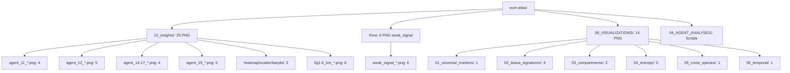
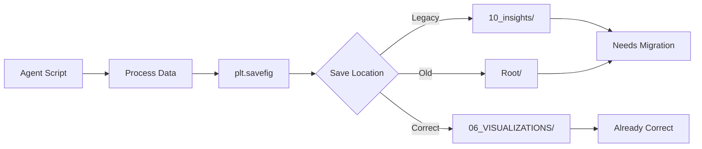
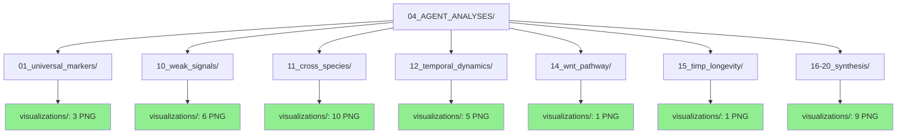

# ECM-Atlas Artifact Audit & Reorganization Plan

**Thesis:** This audit identifies 49 PNG visualization files scattered across 10_insights (29), root (6), and 06_VISUALIZATIONS (14), maps each to generating agent scripts, and provides reorganization plan to consolidate all artifacts within agent-specific folders under 04_AGENT_ANALYSES structure.

## Overview

¶1 Audit reveals three artifact locations: (1) 10_insights temporary folder with 29 PNGs from 11 agents, (2) project root with 6 weak_signal PNGs from agent_10, (3) properly organized 06_VISUALIZATIONS with 14 PNGs across 6 categories. Each PNG traced to generating script in 04_AGENT_ANALYSES via savefig() calls. Reorganization requires moving 35 misplaced PNGs to agent folders, updating 14 script paths, and revising documentation references. Plan ensures artifacts co-located with generation code for maintainability.

## Continuant Structure (Current State)



## Occurrent Workflow (Generation Process)



---

## 1.0 Agent-to-Artifact Mapping

¶1 **Ordering:** Agents 01-20 sequentially, showing script location → current PNG location → correct target location.

### 1.1 Agent 01: Universal Markers

**Script:** `04_AGENT_ANALYSES/01_universal_markers/visualize_universal_markers.py`

**Current Location:** `10_insights/`
- heatmap_top20_universal_markers.png
- scatter_tissue_consistency.png
- barplot_category_direction.png

**Correct Location:** `04_AGENT_ANALYSES/01_universal_markers/`

**Path Variable:** `OUTPUT_DIR = "/Users/Kravtsovd/projects/ecm-atlas/10_insights/"`

---

### 1.2 Agent 06: Outlier Proteins

**Script:** `04_AGENT_ANALYSES/06_outlier_proteins/agent_06_outlier_analysis.py`

**Current Location:** `06_VISUALIZATIONS/01_universal_markers/`
- agent_06_outlier_visualizations.png

**Status:** ✅ Already in correct visualization folder (but should be in agent folder)

**Path Variable:** `OUTPUT_DIR` pointing to visualization folder

---

### 1.3 Agent 10: Weak Signals

**Script:**
- `04_AGENT_ANALYSES/10_weak_signals/agent_10_visualizations.py`
- `04_AGENT_ANALYSES/10_weak_signals/agent_10_summary_figure.py`

**Current Location:** Project root `/`
- weak_signal_forest_plots.png
- weak_signal_landscape.png
- weak_signal_statistical_analysis.png
- weak_signal_matrisome_enrichment.png
- weak_signal_tissue_heatmap.png
- weak_signal_summary.png

**Correct Location:** `04_AGENT_ANALYSES/10_weak_signals/visualizations/`

**Path Variables:** Hardcoded `/Users/Kravtsovd/projects/ecm-atlas/weak_signal_*.png`

---

### 1.4 Agent 11: Cross-Species Analysis

**Scripts:**
- `04_AGENT_ANALYSES/11_cross_species/agent_11_visualizations.py`
- `04_AGENT_ANALYSES/11_cross_species/agent_11_create_visualizations.py`

**Current Location:** `10_insights/`

**Group A - Cross-species comparison (from agent_11_visualizations.py):**
- agent_11_fig1_human_mouse_correlation.png
- agent_11_fig2_species_venn.png
- agent_11_fig3_lifespan_correlation.png
- agent_11_fig4_conservation_heatmap.png

**Group B - Basement membrane analysis (from agent_11_create_visualizations.py):**
- fig1_bm_protein_ranking.png
- fig2_bm_tissue_heatmap.png
- fig3_col4a3_analysis.png
- fig4_breach_correlation.png
- fig5_therapeutic_targets.png
- fig6_family_comparison.png

**Correct Location:** `04_AGENT_ANALYSES/11_cross_species/visualizations/`

**Path Variable:** `output_dir = "/Users/Kravtsovd/projects/ecm-atlas/10_insights/"`

---

### 1.5 Agent 12: Temporal Dynamics

**Scripts:**
- `04_AGENT_ANALYSES/12_temporal_dynamics/agent_12_temporal_analysis.py`
- `04_AGENT_ANALYSES/12_temporal_dynamics/agent_12_versican_inflammatory_scaffold.py`

**Current Location:** `10_insights/`
- agent_12_temporal_dynamics_visualizations.png (from temporal_analysis.py)
- agent_12_correlation_matrix.png (from versican script)
- agent_12_temporal_cascade.png
- agent_12_tissue_protein_heatmap.png
- agent_12_ha_metabolism.png

**Correct Location:** `04_AGENT_ANALYSES/12_temporal_dynamics/visualizations/`

**Path Variables:** Hardcoded `/Users/Kravtsovd/projects/ecm-atlas/10_insights/agent_12_*.png`

---

### 1.6 Agent 14: FRZB/WNT Pathway

**Script:** `04_AGENT_ANALYSES/14_wnt_pathway/agent_14_frzb_wnt_analysis.py`

**Current Location:** `10_insights/`
- agent_14_frzb_wnt_visualizations.png

**Correct Location:** `04_AGENT_ANALYSES/14_wnt_pathway/visualizations/`

**Path Variable:** `OUTPUT_PATH = Path("/Users/Kravtsovd/projects/ecm-atlas/10_insights")`

---

### 1.7 Agent 15: TIMP3 Therapeutic

**Script:** `04_AGENT_ANALYSES/15_timp_longevity/agent_15_timp3_therapeutic_evaluator.py`

**Current Location:** `10_insights/`
- agent_15_timp3_therapeutic_analysis.png

**Correct Location:** `04_AGENT_ANALYSES/15_timp_longevity/visualizations/`

**Path Variable:** `OUTPUT_DIR` pointing to 10_insights

---

### 1.8 Agent 16: TGF-β Pathway

**Script:** `04_AGENT_ANALYSES/16-20_synthesis/agent_16_tgfb_pathway_analysis.py`

**Current Location:** `10_insights/`
- agent_16_tgfb_pathway_analysis.png

**Correct Location:** `04_AGENT_ANALYSES/16-20_synthesis/visualizations/`

**Path Variable:** `output_dir = '/Users/Kravtsovd/projects/ecm-atlas/10_insights'`

---

### 1.9 Agent 17: Collagen Crosslinking

**Script:** `04_AGENT_ANALYSES/16-20_synthesis/agent_17_collagen_crosslinking_entropy.py`

**Current Location:** `10_insights/`
- agent_17_enzyme_trajectories.png
- agent_17_crosslinking_index.png
- agent_17_correlations.png

**Correct Location:** `04_AGENT_ANALYSES/16-20_synthesis/visualizations/`

**Path Variable:** `OUTPUT_DIR = Path("/Users/Kravtsovd/projects/ecm-atlas/10_insights")`

---

### 1.10 Agent 19: Species Conservation

**Script:** `04_AGENT_ANALYSES/16-20_synthesis/agent_19_species_conservation_analyzer.py`

**Current Location:** `10_insights/`
- species_distribution_venn.png
- tissue_conservation_scores.png
- human_vs_mouse_scatter.png
- therapeutic_translatability.png
- direction_agreement.png

**Correct Location:** `04_AGENT_ANALYSES/16-20_synthesis/visualizations/`

**Path Variable:** `OUTPUT_DIR = Path("/Users/Kravtsovd/projects/ecm-atlas/10_insights")`

---

## 2.0 Reorganization Actions

¶1 **Ordering:** Create folders → Move files → Update scripts → Verify documentation → Clean temporary locations.

### 2.1 Create Visualization Subfolders

**Action:** Create `visualizations/` subfolder in each agent directory that generates PNGs.

```bash
# Create visualization folders
mkdir -p 04_AGENT_ANALYSES/01_universal_markers/visualizations
mkdir -p 04_AGENT_ANALYSES/10_weak_signals/visualizations
mkdir -p 04_AGENT_ANALYSES/11_cross_species/visualizations
mkdir -p 04_AGENT_ANALYSES/12_temporal_dynamics/visualizations
mkdir -p 04_AGENT_ANALYSES/14_wnt_pathway/visualizations
mkdir -p 04_AGENT_ANALYSES/15_timp_longevity/visualizations
mkdir -p 04_AGENT_ANALYSES/16-20_synthesis/visualizations
```

### 2.2 Move PNG Files

**From 10_insights/ (29 files):**

```bash
# Agent 01
mv 10_insights/heatmap_top20_universal_markers.png 04_AGENT_ANALYSES/01_universal_markers/visualizations/
mv 10_insights/scatter_tissue_consistency.png 04_AGENT_ANALYSES/01_universal_markers/visualizations/
mv 10_insights/barplot_category_direction.png 04_AGENT_ANALYSES/01_universal_markers/visualizations/

# Agent 11 - Group A
mv 10_insights/agent_11_fig1_human_mouse_correlation.png 04_AGENT_ANALYSES/11_cross_species/visualizations/
mv 10_insights/agent_11_fig2_species_venn.png 04_AGENT_ANALYSES/11_cross_species/visualizations/
mv 10_insights/agent_11_fig3_lifespan_correlation.png 04_AGENT_ANALYSES/11_cross_species/visualizations/
mv 10_insights/agent_11_fig4_conservation_heatmap.png 04_AGENT_ANALYSES/11_cross_species/visualizations/

# Agent 11 - Group B (basement membrane)
mv 10_insights/fig1_bm_protein_ranking.png 04_AGENT_ANALYSES/11_cross_species/visualizations/
mv 10_insights/fig2_bm_tissue_heatmap.png 04_AGENT_ANALYSES/11_cross_species/visualizations/
mv 10_insights/fig3_col4a3_analysis.png 04_AGENT_ANALYSES/11_cross_species/visualizations/
mv 10_insights/fig4_breach_correlation.png 04_AGENT_ANALYSES/11_cross_species/visualizations/
mv 10_insights/fig5_therapeutic_targets.png 04_AGENT_ANALYSES/11_cross_species/visualizations/
mv 10_insights/fig6_family_comparison.png 04_AGENT_ANALYSES/11_cross_species/visualizations/

# Agent 12
mv 10_insights/agent_12_temporal_dynamics_visualizations.png 04_AGENT_ANALYSES/12_temporal_dynamics/visualizations/
mv 10_insights/agent_12_correlation_matrix.png 04_AGENT_ANALYSES/12_temporal_dynamics/visualizations/
mv 10_insights/agent_12_temporal_cascade.png 04_AGENT_ANALYSES/12_temporal_dynamics/visualizations/
mv 10_insights/agent_12_tissue_protein_heatmap.png 04_AGENT_ANALYSES/12_temporal_dynamics/visualizations/
mv 10_insights/agent_12_ha_metabolism.png 04_AGENT_ANALYSES/12_temporal_dynamics/visualizations/

# Agent 14
mv 10_insights/agent_14_frzb_wnt_visualizations.png 04_AGENT_ANALYSES/14_wnt_pathway/visualizations/

# Agent 15
mv 10_insights/agent_15_timp3_therapeutic_analysis.png 04_AGENT_ANALYSES/15_timp_longevity/visualizations/

# Agent 16
mv 10_insights/agent_16_tgfb_pathway_analysis.png 04_AGENT_ANALYSES/16-20_synthesis/visualizations/

# Agent 17
mv 10_insights/agent_17_enzyme_trajectories.png 04_AGENT_ANALYSES/16-20_synthesis/visualizations/
mv 10_insights/agent_17_crosslinking_index.png 04_AGENT_ANALYSES/16-20_synthesis/visualizations/
mv 10_insights/agent_17_correlations.png 04_AGENT_ANALYSES/16-20_synthesis/visualizations/

# Agent 19
mv 10_insights/species_distribution_venn.png 04_AGENT_ANALYSES/16-20_synthesis/visualizations/
mv 10_insights/tissue_conservation_scores.png 04_AGENT_ANALYSES/16-20_synthesis/visualizations/
mv 10_insights/human_vs_mouse_scatter.png 04_AGENT_ANALYSES/16-20_synthesis/visualizations/
mv 10_insights/therapeutic_translatability.png 04_AGENT_ANALYSES/16-20_synthesis/visualizations/
mv 10_insights/direction_agreement.png 04_AGENT_ANALYSES/16-20_synthesis/visualizations/
```

**From Root / (6 files):**

```bash
# Agent 10
mv weak_signal_forest_plots.png 04_AGENT_ANALYSES/10_weak_signals/visualizations/
mv weak_signal_landscape.png 04_AGENT_ANALYSES/10_weak_signals/visualizations/
mv weak_signal_statistical_analysis.png 04_AGENT_ANALYSES/10_weak_signals/visualizations/
mv weak_signal_matrisome_enrichment.png 04_AGENT_ANALYSES/10_weak_signals/visualizations/
mv weak_signal_tissue_heatmap.png 04_AGENT_ANALYSES/10_weak_signals/visualizations/
mv weak_signal_summary.png 04_AGENT_ANALYSES/10_weak_signals/visualizations/
```

### 2.3 Update Script Paths

**Scripts to modify (14 files):**

1. `04_AGENT_ANALYSES/01_universal_markers/visualize_universal_markers.py`
   - Change: `OUTPUT_DIR = "10_insights/"`
   - To: `OUTPUT_DIR = "./visualizations/"`

2. `04_AGENT_ANALYSES/10_weak_signals/agent_10_visualizations.py`
   - Change: `plt.savefig('/Users/Kravtsovd/projects/ecm-atlas/weak_signal_*.png')`
   - To: `plt.savefig('./visualizations/weak_signal_*.png')`

3. `04_AGENT_ANALYSES/10_weak_signals/agent_10_summary_figure.py`
   - Change: `plt.savefig('/Users/Kravtsovd/projects/ecm-atlas/weak_signal_summary.png')`
   - To: `plt.savefig('./visualizations/weak_signal_summary.png')`

4. `04_AGENT_ANALYSES/11_cross_species/agent_11_visualizations.py`
   - Change: `output_dir = "/Users/Kravtsovd/projects/ecm-atlas/10_insights/"`
   - To: `output_dir = "./visualizations/"`

5. `04_AGENT_ANALYSES/11_cross_species/agent_11_create_visualizations.py`
   - Change: `plt.savefig('/Users/Kravtsovd/projects/ecm-atlas/10_insights/fig*.png')`
   - To: `plt.savefig('./visualizations/fig*.png')`

6-9. `04_AGENT_ANALYSES/12_temporal_dynamics/` (2 scripts)
   - Change: Hardcoded `/Users/Kravtsovd/projects/ecm-atlas/10_insights/`
   - To: `./visualizations/`

10. `04_AGENT_ANALYSES/14_wnt_pathway/agent_14_frzb_wnt_analysis.py`
    - Change: `OUTPUT_PATH = Path("/Users/.../10_insights")`
    - To: `OUTPUT_PATH = Path("./visualizations")`

11. `04_AGENT_ANALYSES/15_timp_longevity/agent_15_timp3_therapeutic_evaluator.py`
    - Change: `OUTPUT_DIR` pointing to 10_insights
    - To: `OUTPUT_DIR = Path("./visualizations")`

12. `04_AGENT_ANALYSES/16-20_synthesis/agent_16_tgfb_pathway_analysis.py`
    - Change: `output_dir = '/Users/.../10_insights'`
    - To: `output_dir = './visualizations'`

13. `04_AGENT_ANALYSES/16-20_synthesis/agent_17_collagen_crosslinking_entropy.py`
    - Change: `OUTPUT_DIR = Path("/Users/.../10_insights")`
    - To: `OUTPUT_DIR = Path("./visualizations")`

14. `04_AGENT_ANALYSES/16-20_synthesis/agent_19_species_conservation_analyzer.py`
    - Change: `OUTPUT_DIR = Path("/Users/.../10_insights")`
    - To: `OUTPUT_DIR = Path("./visualizations")`

---

## 3.0 Documentation Updates Required

¶1 **Ordering:** Main CLAUDE.md → README files → Agent-specific docs → Visualization catalog.

### 3.1 CLAUDE.md
- Update paths in "Quick Reference" section
- Update visualization artifact locations

### 3.2 Agent README Files
- Update output file locations in each agent's README
- Add `visualizations/` folder descriptions

### 3.3 Knowledge Base Documents
- Search and replace: `10_insights/agent_` → `04_AGENT_ANALYSES/*/visualizations/agent_`
- Search and replace: Root `weak_signal_` → `04_AGENT_ANALYSES/10_weak_signals/visualizations/weak_signal_`

---

## 4.0 Post-Reorganization State

¶1 **Final Structure:** All 35 misplaced PNGs moved to agent folders, scripts updated to relative paths, 10_insights deprecated, clear artifact ownership.



**Benefits:**
- ✅ Artifacts co-located with generation code
- ✅ Relative paths (portable, no hardcoded /Users/)
- ✅ Clear ownership (agent folder = all artifacts)
- ✅ Deprecated 10_insights temporary folder
- ✅ 06_VISUALIZATIONS remains for publication-ready consolidated views

---

## 5.0 Validation Checklist

- [ ] All 35 PNG files moved to agent folders
- [ ] 14 scripts updated with relative paths
- [ ] All scripts successfully generate PNGs in new locations
- [ ] Documentation updated with new paths
- [ ] 10_insights folder empty (archive or delete)
- [ ] No PNG files in project root
- [ ] Git commit with message: "refactor: consolidate all agent visualization artifacts to agent folders"

---

**Last Updated:** 2025-10-16
**Audit Status:** Complete - Ready for execution
**Total Artifacts:** 49 PNG files (35 to move, 14 already correct)
