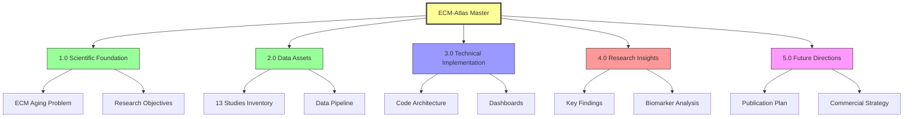

# ECM-Atlas: Universal Documentation

**Thesis:** ECM-Atlas consolidates 13 proteomic studies (2017-2023) tracking extracellular matrix aging across tissues into unified database with interactive dashboards, enabling cross-study identification of aging biomarkers for longevity research and potential therapeutic targets.

**Overview:** This master document provides hierarchical navigation through ECM-Atlas project, structured by BFO ontology categories (Continuants vs Occurrents). Section 1.0 establishes scientific foundation (aging problem, ECM significance, research objectives). Section 2.0 catalogs data assets (13 studies, 128 files, standardization pipeline). Section 3.0 details technical implementation (parsing, normalization, visualization architecture). Section 4.0 synthesizes research insights from team discussions (biomarkers, key proteins, therapeutic strategies). Section 5.0 outlines future development (publication roadmap, commercialization potential, collaboration opportunities). Each bullet point links to detailed Level 2 documents following same framework structure.

---

## 1.0 SCIENTIFIC FOUNDATION (Continuant - Problem Space)

**¶1 Ordering principle:** Problem definition → scientific significance → research objectives. Establishes "why" before "what" and "how".

**Core Questions Addressed:**
- Why ECM aging matters for longevity research
- Gap in current proteomic data landscape
- How unified database enables new discoveries

**Navigation:**
- **[01_Scientific_Foundation.md](./01_Scientific_Foundation.md)** - Deep dive into ECM aging biology, hallmarks significance hierarchy, theoretical framework
  - Level 3: [01a_ECM_Aging_Mechanisms.md](./01a_ECM_Aging_Mechanisms.md) - Molecular mechanisms, crosslinking, glycation
  - Level 3: [01b_Aging_Hallmarks_Hierarchy.md](./01b_Aging_Hallmarks_Hierarchy.md) - Ranked importance of hallmarks (ECM vs genomic instability vs transposon activation)

---

## 2.0 DATA ASSETS (Continuant - What Exists)

**¶1 Ordering principle:** Inventory → structure → processing status. Catalogues physical artifacts before describing transformations.

**Key Metrics:**
- 13 published studies (2017-2023)
- 128 files (58 proteomics, 31 documentation, 39 supplements)
- ~500MB total raw data
- 15,000+ unique proteins across datasets

**Navigation:**
- **[02_Data_Assets_Catalog.md](./02_Data_Assets_Catalog.md)** - Complete study inventory, file formats, metadata registry
  - Level 3: [02a_Study_Summaries.md](./02a_Study_Summaries.md) - Per-study details (tissue, organism, method, key findings)
  - Level 3: [02b_Data_Schema_Specification.md](./02b_Data_Schema_Specification.md) - Unified 13-column schema, wide vs long format, annotation strategy

---

## 3.0 TECHNICAL IMPLEMENTATION (Occurrent - Processes & Architecture)

**¶1 Ordering principle:** Architecture → pipeline → interfaces. Describes system structure before data flows before user interactions.

**Technical Components:**
- Python parsing pipeline (Excel/TSV → standardized CSV)
- Z-score normalization + percentile ranking
- Streamlit web application
- Interactive dashboards (heatmaps, volcano plots, scatter)

**Navigation:**
- **[03_Technical_Architecture.md](./03_Technical_Architecture.md)** - Code structure, processing pipeline, deployment
  - Level 3: [03a_Data_Processing_Pipeline.md](./03a_Data_Processing_Pipeline.md) - Parsing logic, normalization algorithms, validation criteria
  - Level 3: [03b_Visualization_Dashboards.md](./03b_Visualization_Dashboards.md)** - Randles 2021 kidney dashboard architecture, Flask API, Plotly charts

---

## 4.0 RESEARCH INSIGHTS (Continuant & Occurrent - Knowledge Generated)

**¶1 Ordering principle:** Findings → interpretations → hypotheses. Moves from observed data patterns to biological meaning to testable predictions.

**Key Discoveries (from team calls 2025-10-12):**
- Identified tissue compartment-specific aging signatures (glomerular vs tubulointerstitial)
- Biomarker evaluation framework (longitudinal + cross-sectional robustness)
- Hypothesis: 2-3 universal ECM proteins change across all organs (potential therapeutic targets)
- Directed evolution strategy for enzyme engineering (ECM remodeling in crosslinked matrix)

**Navigation:**
- **[04_Research_Insights.md](./04_Research_Insights.md)** - Synthesis of team discussions, scientific hypotheses, analysis results
  - Level 3: [04a_Biomarker_Framework.md](./04a_Biomarker_Framework.md) - Evaluation criteria, cross-sectional vs longitudinal, population heterogeneity
  - Level 3: [04b_Key_Protein_Candidates.md](./04b_Key_Protein_Candidates.md) - Cross-organ aging markers, potential intervention targets, validation strategy
  - Level 3: [04c_Therapeutic_Strategies.md](./04c_Therapeutic_Strategies.md) - Enzyme engineering, directed evolution, sequence-to-function analysis

---

## 5.0 FUTURE DIRECTIONS (Occurrent - Planned Actions)

**¶1 Ordering principle:** Short-term (demo) → medium-term (publication) → long-term (commercialization). Temporal sequence from weeks to years.

**Timeline:**
- **Immediate (weeks):** Complete Hyundai track prototype demo, interactive chatbot
- **Short-term (months):** Preprint publication, whole blood proteomics integration
- **Medium-term (1 year):** Collaboration with longevity labs (Fedichev group), expand to multi-omics
- **Long-term (2-5 years):** Company formation around discovered key proteins, directed evolution platform

**Navigation:**
- **[05_Future_Directions.md](./05_Future_Directions.md)** - Roadmap, milestones, resource requirements
  - Level 3: [05a_Publication_Strategy.md](./05a_Publication_Strategy.md) - Preprint timeline, journal targets, co-author coordination
  - Level 3: [05b_Commercialization_Plan.md](./05b_Commercialization_Plan.md) - Market analysis, IP strategy, funding pathways
  - Level 3: [05c_Collaboration_Opportunities.md](./05c_Collaboration_Opportunities.md) - Academic partnerships, industry contacts, longevity ecosystem

---

## APPENDICES

### A. Meeting Transcripts (2025-10-12)
- **10:35 Call:** Project kickoff, schema design, success criteria ([calls_transcript/20251012_1035_gnr-avbr-ipz.md](../calls_transcript/20251012_1035_gnr-avbr-ipz.md))
- **15:35 Call:** Visualization dashboard, z-score analysis, Git workflow ([calls_transcript/20251012_1535_gnr-avbr-ipz.md](../calls_transcript/20251012_1535_gnr-avbr-ipz.md))
- **18:45 Call:** Biomarkers, theories of aging, enzyme engineering ([calls_transcript/20251012_1845_gnr-avbr-ipz.md](../calls_transcript/20251012_1845_gnr-avbr-ipz.md))

### B. Repository Structure
- **Code:** [app.py](../app.py) - Streamlit application
- **Data:** [data_raw/](../data_raw/) - 13 study directories
- **Tasks:** [01_TASK_DATA_STANDARDIZATION.md](../01_TASK_DATA_STANDARDIZATION.md) - Parsing specifications

### C. External Resources
- **Matrisome Project:** https://sites.google.com/uic.edu/matrisome
- **Human Matrisome Reference:** 1,026 genes ([Google Sheets](https://docs.google.com/spreadsheets/d/1GwwV3pFvsp7DKBbCgr8kLpf8Eh_xV8ks/edit))
- **Mouse Matrisome Reference:** 1,109 genes ([Google Sheets](https://docs.google.com/spreadsheets/d/1Te6n2q_cisXeirzBClK-VzA6T-zioOB5/edit))

---

## NAVIGATION TIPS

**How to Use This Documentation:**
1. Start with this master overview to understand project scope
2. Click Level 2 links (e.g., `01_Scientific_Foundation.md`) for section deep-dives
3. Follow Level 3 links within sections for specialized topics
4. Use Appendices for raw transcripts, code references, external resources

**Document Structure Pattern (All Levels):**
- **Thesis:** One-sentence summary
- **Overview:** One paragraph expanding thesis, previewing sections
- **Mermaid diagram:** Visual structure (LR for flows, TD for hierarchies)
- **Numbered sections (1.0, 2.0):** MECE organization
- **Paragraphs (¶1, ¶2):** Ordering principle stated first

**Quick Access:**
- Scientific context → [01_Scientific_Foundation.md](./01_Scientific_Foundation.md)
- Dataset details → [02_Data_Assets_Catalog.md](./02_Data_Assets_Catalog.md)
- Code & architecture → [03_Technical_Architecture.md](./03_Technical_Architecture.md)
- Research findings → [04_Research_Insights.md](./04_Research_Insights.md)
- Next steps → [05_Future_Directions.md](./05_Future_Directions.md)

---

## METADATA

**Document Version:** 1.0
**Created:** 2025-10-12
**Authors:** Daniel Kravtsov, Rakhan Aimbetov
**Project:** ECM-Atlas (Hyundai Track Prototype)
**Repository:** https://github.com/raimbetov/ecm-atlas
**Framework:** MECE + BFO + DRY ([Knowledge Framework](../../chrome-extension-tcs/How to organize documents_knowladge_framework.md))

---

### ✅ Author Checklist
- [x] Thesis (1 sentence) present and previews sections
- [x] Overview (1 paragraph)
- [x] Mermaid overview diagram (TD for hierarchy) present and readable
- [x] Numbered sections (1.0-5.0); each has ¶1 with ordering principle
- [x] MECE verified (no overlap; complete coverage)
- [x] DRY verified (no duplicates; references to Level 2/3 docs instead)
