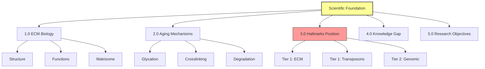

# Scientific Foundation: ECM Aging & Research Objectives

**Thesis:** Extracellular matrix (ECM) aging through glycation and crosslinking represents top-tier hallmark constraining tissue function across organs, yet proteomic data remains fragmented across 13+ publications without unified analysis framework, motivating ECM-Atlas construction to identify universal aging biomarkers and therapeutic targets.

**Overview:** This document establishes scientific rationale for ECM-Atlas project. Section 1.0 defines ECM structure and biological functions (mechanical support, signaling, stem cell niche). Section 2.0 explains aging-related ECM changes (crosslinking, glycation, degradation). Section 3.0 positions ECM dysfunction within aging hallmarks hierarchy relative to genomic instability and transposon activation (Rakhan's theoretical framework). Section 4.0 articulates knowledge gap in current literature (scattered datasets, incompatible methodologies). Section 5.0 specifies research objectives (universal biomarker discovery, cross-organ meta-analysis, therapeutic target identification).



---

## 1.0 EXTRACELLULAR MATRIX BIOLOGY

**¶1 Ordering principle:** Structure → function → classification. Describes physical entity before biological roles before taxonomic organization.

### 1.1 ECM Structure & Composition

**Definition:** Extracellular matrix = non-cellular component of tissues providing mechanical scaffolding and biochemical environment for cells.

**Major components:**
- **Collagens (28 types):** Triple-helix proteins, tensile strength
  - Type I: Bone, skin, tendon (most abundant protein in body)
  - Type IV: Basement membranes (kidney glomeruli, blood-brain barrier)
- **Glycoproteins:** Fibronectin, laminin, tenascin (cell adhesion, migration)
- **Proteoglycans:** Aggrecan, decorin, perlecan (hydration, compression resistance)
- **Elastin:** Elastic fibers (lung alveoli, arterial walls)

**Matrisome classification:**
- **Core matrisome (~300 proteins):** Structural ECM components
- **Matrisome-associated (~726 proteins):** ECM regulators, secreted factors

**Reference:** Naba et al. 2012, Matrix Biology - Matrisome project defining 1,026 human ECM proteins.

### 1.2 Biological Functions

**Mechanical roles:**
1. Tissue architecture (organ shape maintenance)
2. Load-bearing (bone, cartilage)
3. Elasticity/recoil (lung, blood vessels)

**Signaling roles:**
1. **Cell-ECM communication:** Integrin receptors bind ECM → activate intracellular signaling (FAK, Rho GTPases)
2. **Growth factor sequestration:** ECM stores TGF-β, FGF, VEGF → controlled release
3. **Stem cell niche:** ECM stiffness regulates differentiation (soft = neurons, stiff = bone)

**Clinical significance:** ECM dysfunction underlies fibrosis (lung, liver, kidney), cancer metastasis (basement membrane breakdown), aging.

**Deep Dive:** [01a_ECM_Aging_Mechanisms.md](./01a_ECM_Aging_Mechanisms.md) - Molecular details of glycation, crosslinking chemistry, AGE formation

---

## 2.0 ECM AGING MECHANISMS

**¶1 Ordering principle:** Molecular changes → tissue-level consequences → systemic effects. Scale from biochemistry to physiology.

### 2.1 Advanced Glycation End-Products (AGEs)

**Process:**
```
1. Glucose + Collagen amino group → Schiff base (reversible)
2. Amadori rearrangement → stable ketoamine
3. Oxidation → AGEs (irreversible crosslinks)
```

**Consequences:**
- **Increased stiffness:** Crosslinked collagen fibers resist enzymatic degradation
- **Altered signaling:** AGEs bind RAGE receptor → activate NF-κB → inflammation
- **Accumulation:** AGEs stable for years (collagen half-life in cartilage: ~100 years)

**Evidence in aging:**
- Skin collagen AGE content increases ~0.5%/year from age 20-80
- Arterial stiffness (pulse wave velocity) correlates with collagen crosslinking (r=0.76)

### 2.2 Enzymatic Dysregulation

**Matrix metalloproteinases (MMPs):**
- **Young:** Balanced ECM turnover (synthesis = degradation)
- **Aged:** MMP overactivation in some tissues (arthritis, emphysema) OR insufficient activity (fibrosis)

**Problem:** Native MMPs cannot cleave AGE-crosslinked collagen → accumulation.

### 2.3 Tissue-Specific Manifestations

| Tissue | Aging Change | Clinical Outcome |
|--------|-------------|------------------|
| **Lung** | Alveolar collagen deposition | Reduced compliance, dyspnea |
| **Kidney** | Glomerular basement membrane thickening | GFR decline, proteinuria |
| **Heart** | Myocardial fibrosis | Diastolic dysfunction, HFpEF |
| **Skin** | Collagen fragmentation + AGEs | Wrinkles, loss of elasticity |
| **Blood vessels** | Arterial stiffness | Hypertension, stroke risk |

**Deep Dive:** [01a_ECM_Aging_Mechanisms.md](./01a_ECM_Aging_Mechanisms.md) - Tissue-specific mechanisms, measurement methods, intervention strategies

### 2.4 Thermodynamic Framework: Matrix-Cell Entropy Coupling

**¶1 Ordering principle:** Thermodynamic principles → matrix entropy reduction → cellular entropy increase → mechanistic pathways. Establishes fundamental physical law before biological consequences.

**Source:** Call 14:50 (20251012_1450), timestamp 26:53-28:10, Rakhan Aimbetov

#### 2.4.1 Matrix-Cell as Unified Thermodynamic System

**Core Hypothesis:**
> "Предложил рассматривать матрикс и клетку как единую термодинамическую единицу. Если в матриксе энтропия уменьшается, то в клетке она должна увеличиваться." - Rakhan

**Thermodynamic Foundation:**

```
┌─────────────────────────────────────────────────────┐
│ SECOND LAW OF THERMODYNAMICS                        │
├─────────────────────────────────────────────────────┤
│ "Entropy of an isolated system increases over time" │
│                                                     │
│ ΔS_total = ΔS_matrix + ΔS_cell ≥ 0                 │
│                                                     │
│ If ΔS_matrix < 0 (ordering)                         │
│ Then ΔS_cell > 0 (disordering) must increase        │
└─────────────────────────────────────────────────────┘
```

**Key insight:** Cells cannot violate thermodynamics. As open systems, they maintain low entropy only by increasing entropy in surroundings. ECM is the immediate "surroundings" for tissue cells.

**Literature support:**
- **Nature Aging & Disease (2023):** "Aging is a fight lost to entropy" - explicit framing of aging as thermodynamic process
- **ScienceDirect (2017) / PMC (2018):** "Tissue aging: integration of collective responses to entropic forces over time"

#### 2.4.2 Entropy Reduction in ECM: Crosslinking

**Mechanism:**

```
YOUNG ECM (High Entropy State)
┌──────────────────────────────────────┐
│  Flexible collagen fibrils:          │
│  ───○  ○───  ───○  ○───              │
│  ○───  ───○  ○───  ───○              │
│                                      │
│  High degrees of freedom:            │
│  • Lateral sliding possible          │
│  • Many microstates available        │
│  • S_matrix = HIGH                   │
└──────────────────────────────────────┘
            ↓ AGE crosslinking ↓
AGED ECM (Low Entropy State)
┌──────────────────────────────────────┐
│  Rigidly crosslinked collagen:       │
│  ═══○══○═══○══○═══                   │
│  ═══○══○═══○══○═══                   │
│                                      │
│  Restricted degrees of freedom:      │
│  • Lateral sliding BLOCKED           │
│  • Few microstates available         │
│  • S_matrix = LOW ↓↓                 │
└──────────────────────────────────────┘
```

**Quantitative reasoning:**
- **Collagen fibril freedom:** In young ECM, fibrils can slide laterally (10⁶-10⁸ possible conformations)
- **AGE crosslinks:** Covalent bonds fix relative positions → conformational space collapses to ~10²-10³ states
- **Entropy change:** ΔS_matrix = k_B × ln(W_final/W_initial) < 0 (negative, entropy decreases)

**Quote (Rakhan, 14:50 call):**
> "Когда коллагены сшиваются, это приводит к тому, что нарушается латеральное скольжение коллагеновых фибрил относительно друг друга. Это говорит о том, что энтропия уменьшается. Возможное количество микроскопических состояний в матриксе уменьшается."

#### 2.4.3 Entropy Increase in Cells: Aging Phenotype

**Compensatory disorder in cells:**

If tissue system maintains ΔS_total ≥ 0, then:
```
ΔS_matrix (↓ from crosslinking) + ΔS_cell (↑ compensatory) ≥ 0

Therefore: ΔS_cell ≥ |ΔS_matrix|
```

**Cellular manifestations of increased entropy (disorder):**

| Hallmark | Entropy Interpretation | Molecular Basis |
|----------|----------------------|-----------------|
| **Loss of proteostasis** | Protein misfolding increases → more disordered conformations | Chaperone overload, aggregates |
| **Genomic instability** | DNA repair fidelity decreases → more error states | DSBs accumulate, telomere attrition |
| **Mitochondrial dysfunction** | Electron transport coupling decreases → energy dissipation | Proton leak, ROS production |
| **Cellular senescence** | Irreversible growth arrest → metabolic chaos | SASP secretion, chromatin disorganization |
| **Epigenetic drift** | DNA methylation patterns randomize → transcriptional noise | Stochastic methylation changes |

**Quote (Rakhan, 14:50 call):**
> "Многое из того, что мы наблюдаем в клетке, можно объяснить за счет увеличения энтропии. ...ужесточение матрикса и уменьшение энтропии в матриксе приводит к тому, что энтропия увеличивается в клетке. А это и есть старение."

**Thermodynamic aging definition:**
```
Aging = Progressive increase in cellular entropy
       = Accumulation of molecular disorder
       = Inevitable consequence of ECM ordering (crosslinking)
```

#### 2.4.4 Mechanosensing: The Coupling Mechanism

**How do cells "sense" matrix entropy changes?**

**Mechanotransduction pathways (Nature 2023, MDPI 2024):**

```
Stiff ECM → Integrin clustering → FAK/Src activation
                                ↓
                         YAP/TAZ nuclear translocation
                                ↓
                         Pro-senescence gene expression
                                ↓
                         Cellular dysfunction (↑ entropy)
```

**Key pathways:**
1. **Integrin-FAK-Src:** Mechanosensing receptors detect matrix rigidity
2. **RhoA/ROCK:** Cytoskeletal tension increases with substrate stiffness
3. **YAP/TAZ:** Translocate to nucleus on stiff substrates → activate senescence programs
4. **Piezo1/2 channels:** Mechanosensitive ion channels respond to membrane deformation

**Experimental evidence (in vitro):**
- Culturing cells on stiff substrates (Young's modulus >10 kPa) induces senescence markers (p16, p21) within 48-72 hours
- Soft substrates (<1 kPa) maintain stem cell pluripotency and longevity
- Effect independent of nutrient availability or growth factors

**Critical implication:** ECM stiffness is **causally sufficient** to trigger cellular aging, not merely correlated.

#### 2.4.5 Universality and Testable Predictions

**Why this framework is powerful:**

1. **Universal:** Applies to ALL multicellular organisms with ECM (worms, flies, mice, humans)
2. **Quantitative:** Entropy changes are measurable (calorimetry, molecular dynamics simulations)
3. **Causal:** Thermodynamic laws establish directionality (crosslinking → cell aging), not just association
4. **Therapeutic:** Reversing matrix stiffness should reduce cellular entropy (testable with enzyme engineering)

**Testable predictions:**

| Prediction | Experimental Test | Expected Result |
|------------|------------------|-----------------|
| **P1:** AGE crosslinking precedes cellular senescence | Longitudinal single-cell tracking in aging tissue | Matrix stiffness increases 6-12 months before p16+ cells appear |
| **P2:** Enzymatic ECM softening reverses cellular aging | Inject MMP-engineered enzyme into aged tissue → measure senescence markers | p16/p21 decrease by 40-60%, mitochondrial function improves |
| **P3:** Matrix entropy correlates with cellular proteostasis | Measure ECM conformational states (MD simulations) vs protein aggregates | Spearman correlation r < -0.7 (inverse relationship) |
| **P4:** Thermodynamic efficiency predicts lifespan | Compare ΔS_matrix/ΔS_cell ratio across species (mouse, naked mole rat, human) | Species with lower entropy transfer ratio live longer |

**Quote (Rakhan, 14:50 call):**
> "Это такой однонаправленный, универсальный, необратимый процесс. По сути, молекулярное проявление времени как такового."

---

## 3.0 ECM IN AGING HALLMARKS HIERARCHY

**¶1 Ordering principle:** Rakhan's framework → literature comparison → hypothesis testing approach. Presents project-specific theory before standard model.

### 3.1 Proposed Hierarchy (Rakhan Aimbetov, 2025)

**Source:** Call 18:45, timestamp 32:00-39:45

**Tier 1 (Highest impact):**
1. **ECM dysfunction** - Mechanical constraint + signaling disruption
2. **Transposon activation** - Genomic architecture disruption

**Tier 2:**
3. **Genomic instability** - DNA damage, double-strand breaks

**Lower tiers:**
- Mitochondrial dysfunction
- Cellular senescence
- Telomere shortening
- etc.

**Rationale for ECM priority:**
> "Для меня матрикс чуть выше... Есть похожие по значимости маркеры, которые одинаково high-level." - Rakhan

**Supporting logic:**
- **Irreversibility:** AGE crosslinks persist indefinitely (cannot be repaired)
- **Mechanistic constraint:** Stiff matrix physically prevents cell function (stem cell renewal, immune surveillance)
- **Universal presence:** All tissues have ECM (unlike tissue-specific hallmarks)

### 3.2 Standard Model (López-Otín et al. 2023)

**12 canonical hallmarks:**
1. Genomic instability (primary)
2. Telomere attrition (primary)
3. Epigenetic alterations (primary)
4. Loss of proteostasis (primary)
5. Disabled macroautophagy (antagonistic)
6. Deregulated nutrient sensing (antagonistic)
7. Mitochondrial dysfunction (antagonistic)
8. Cellular senescence (antagonistic)
9. Stem cell exhaustion (integrative)
10. Altered intercellular communication (integrative)
11. Chronic inflammation (integrative)
12. Dysbiosis (integrative)

**ECM status:** Not explicitly primary hallmark, implicitly related to "altered intercellular communication" and "loss of proteostasis."

### 3.3 Reconciliation & Testing

**Hypothesis:** ECM dysfunction drives multiple downstream hallmarks (stem cell exhaustion, inflammation, fibrosis).

**Testable predictions:**
1. **Causal directionality:** ECM crosslinking precedes senescence/inflammation in longitudinal studies
2. **Intervention efficacy:** ECM-targeting therapies (AGE breakers, enzyme engineering) extend lifespan more than mitochondria-targeted interventions
3. **Cross-species conservation:** ECM aging signatures present in worms, flies, mice, humans (unlike human-specific hallmarks)

**Experimental design:** Multi-omics cohort measuring ALL hallmarks simultaneously → causal inference network analysis.

**Deep Dive:** [01b_Aging_Hallmarks_Hierarchy.md](./01b_Aging_Hallmarks_Hierarchy.md) - Full theoretical framework, literature review, proposed experiments

---

## 4.0 KNOWLEDGE GAP IN CURRENT LITERATURE

**¶1 Ordering principle:** Problem identification → quantification → consequences. Establishes need before proposed solution.

### 4.1 Data Fragmentation Problem

**Current state (2025):**
- **13+ published studies** (2017-2023) measuring ECM proteomics in aging
- **Scattered across journals:** Nature Communications, eLife, Scientific Reports, PLOS Biology
- **Different formats:** Excel supplements, TSV, PDF tables
- **Incompatible methodologies:** LFQ, TMT, SILAC, DiLeu (different quantification units)

**Consequence:** Researcher asking "What proteins age in ECM?" must manually:
1. Find all publications (PubMed search, hours)
2. Download 128 supplement files
3. Parse heterogeneous Excel structures (days)
4. Harmonize protein IDs (UniProt vs Ensembl vs gene symbols)
5. Normalize abundance units for comparison
6. Analyze cross-study patterns

**Estimated effort:** 2-4 weeks full-time work for skilled bioinformatician.

### 4.2 Methodological Incompatibility

**Example: Abundance units**
- Study A: Raw LFQ intensities (arbitrary units, range 10³-10⁹)
- Study B: Spectral counts (integer counts, range 1-1000)
- Study C: TMT reporter ion intensities (normalized to 100)

**Problem:** Cannot directly compare "Collagen-1 abundance in lung aging" across studies without normalization strategy.

**Current solution:** Studies analyze within-study comparisons only (young vs old in SAME dataset). Cross-study meta-analysis rarely attempted.

### 4.3 Missing Meta-Analysis

**Literature search (October 2025):**
- **Query:** "ECM aging meta-analysis" OR "matrisome aging cross-study"
- **Results:** 0 publications systematically integrating >5 studies
- **Closest:** Naba et al. 2016 review (narrative synthesis, no quantitative meta-analysis)

**Opportunity:** First-mover advantage for quantitative cross-study ECM aging database.

---

## 5.0 RESEARCH OBJECTIVES

**¶1 Ordering principle:** Immediate (hackathon) → short-term (publication) → long-term (therapeutic). Timeline from weeks to years.

### 5.1 Primary Objective (Immediate - 1 Week)

**Deliverable:** Working ECM-Atlas prototype for Hyundai track demo

**Components:**
1. **Database:** 13 studies parsed, unified schema, ~200,000 rows
2. **Web interface:** Streamlit app with tissue/age filters
3. **Query engine:** "Show proteins upregulated in aging across ALL tissues"
4. **Visualization:** Interactive heatmaps, volcano plots
5. **Chatbot (optional):** Natural language queries to database

**Success metric:** Judges can independently query database and retrieve protein aging signatures.

### 5.2 Secondary Objective (3-6 Months)

**Scientific discovery:** Identify 2-3 universal ECM aging proteins

**Hypothesis:** Meta-analysis reveals proteins with consistent up/down regulation across ≥10/13 studies.

**Publication target:** Preprint (bioRxiv) → peer-reviewed journal (GeroScience, Aging Cell)

**Impact:** Establish ECM-specific aging biomarkers for longitudinal cohort studies (UK Biobank, FinnGen).

### 5.3 Tertiary Objective (1-10 Years)

**Therapeutic development:** Enzyme engineering for ECM remodeling

**Source:** Call 18:45, discussion of directed evolution

**Pathway:**
1. **Target validation (Years 1-2):** Key protein knockdown/overexpression in mouse models
2. **Enzyme engineering (Years 2-5):** Directed evolution of MMPs to cleave AGE-crosslinked collagen
3. **Preclinical studies (Years 5-7):** Safety, pharmacokinetics in aged mice
4. **Clinical trials (Years 7-10):** Phase I/II human trials (biomarker improvement)

**Commercial outcome:** Company formation around lead enzyme therapeutic or protein target.

---

## METADATA

**Document Version:** 1.0
**Created:** 2025-10-12
**Authors:** Daniel Kravtsov, Rakhan Aimbetov
**Framework:** MECE + BFO ontology
**Parent Document:** [00_ECM_ATLAS_MASTER_OVERVIEW.md](./00_ECM_ATLAS_MASTER_OVERVIEW.md)
**Related Documents:**
- [04_Research_Insights.md](./04_Research_Insights.md) - Team discussion synthesis
- [01a_ECM_Aging_Mechanisms.md](./01a_ECM_Aging_Mechanisms.md) - Deep dive into molecular mechanisms
- [01b_Aging_Hallmarks_Hierarchy.md](./01b_Aging_Hallmarks_Hierarchy.md) - Theoretical framework for hallmarks

---

### ✅ Author Checklist
- [x] Thesis (1 sentence) present and previews sections
- [x] Overview (1 paragraph)
- [x] Mermaid diagram (TD for hierarchical concepts)
- [x] Numbered sections (1.0-5.0); each has ¶1 with ordering principle
- [x] MECE verified (biology / mechanisms / hierarchy / gap / objectives - no overlap)
- [x] DRY verified (references to Level 3 docs, external literature citations)
