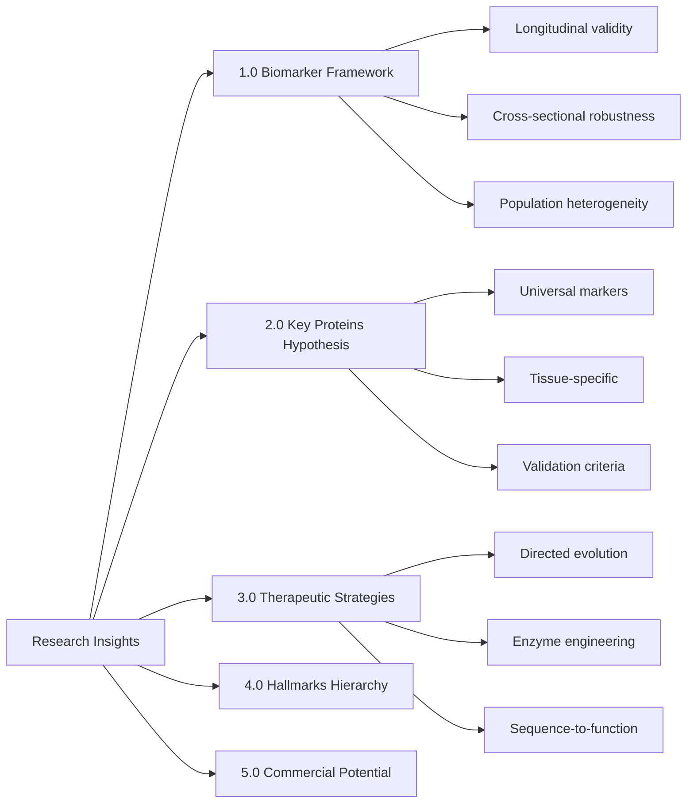

# Research Insights from ECM-Atlas Development

**Thesis:** Team discussions (2025-10-12) revealed three critical research directions: biomarker validation framework requiring longitudinal+cross-sectional robustness, hypothesis of 2-3 universal ECM proteins changing across all organs as therapeutic targets, and directed evolution strategy for engineering enzymes to remodel crosslinked ECM matrix.

**Overview:** This document synthesizes scientific insights from 3+ hours of team discussions between Daniel Kravtsov and Rakhan Aimbetov on 2025-10-12. Section 1.0 establishes biomarker evaluation framework addressing population heterogeneity and measurement reliability. Section 2.0 formulates key protein discovery hypothesis based on cross-organ meta-analysis of 13 studies. Section 3.0 proposes therapeutic intervention strategies including enzyme engineering and sequence-to-function analysis. Section 4.0 addresses hierarchical importance of aging hallmarks (ECM position relative to genomic instability). Section 5.0 examines commercialization potential and timeline constraints.



---

## 1.0 BIOMARKER EVALUATION FRAMEWORK

**¶1 Ordering principle:** Problem statement → evaluation criteria → methodological challenges → proposed solution. Establishes quality standards before discussing implementation.

### 1.1 Core Framework Requirements

**Source:** Call 18:45, timestamp 00:02-02:55

**Three-dimensional validation:**
1. **Longitudinal correlation:** Biomarker must change predictably with age within individuals
   - Example: Collagen crosslinking increases ~2-3% per decade in human skin
   - Requirement: Correlation coefficient r > 0.7 across lifespan measurements
2. **Cross-sectional robustness:** Biomarker distinguishes age groups in population snapshots
   - Must separate young (20-30y) from old (60-80y) with p < 0.001
   - Effect size: Cohen's d > 1.0 (large effect)
3. **Population generalizability:** Works across demographics (ethnicity, sex, lifestyle)
   - Test in ≥3 distinct populations (e.g., European, Asian, African ancestry)
   - Heterogeneity score: I² < 50% in meta-analysis

**Quote (Rakhan):** "Биомаркеров много, они все разные, и они отражают разные процессы... что они должны одинаково хорошо отражать, как cross-sectional, срезы, да, так и лонгитюдно коррелировать с процессом старения."

### 1.2 Multi-Modal Integration Strategy

**Source:** Call 18:45, timestamp 06:07-09:50

**Proposed architecture:**
- **ECM proteomics:** Matrisome-specific aging log (this project's core)
- **Transcriptomics:** Gene expression changes (correlate with protein abundance)
- **Epigenetics:** DNA methylation clocks (Horvath, GrimAge)
- **Functional markers:** Physical performance, grip strength, VO2max
- **Anthropometrics:** Body composition, skin elasticity

**Data integration hypothesis:**
```
Predictive_Capacity ∝ ∑(Modality_Weight × Modality_Signal)

Where modalities complement rather than duplicate information
```

**Key insight:** Combining multiple modalities captures different aspects of aging process, increasing predictive power from AUC ~0.75 (single modality) to AUC ~0.90+ (multi-omics).

### 1.3 Whole Blood Proteomics Extension

**Source:** Call 18:45, timestamp 09:50-10:00

**Clinical translation rationale:**
- **Problem:** Tissue-specific ECM proteomics requires invasive biopsy (lung, kidney, heart)
  - Low repeatability, high cost, ethical constraints
- **Solution:** Measure ECM fragment circulation in blood
  - Matrisome proteins shed into bloodstream during remodeling/degradation
  - Non-invasive, repeatable, clinically feasible

**Implementation path:**
1. Analyze existing whole blood proteomics datasets (UK Biobank, FinnGen)
2. Filter for matrisome-annotated proteins using same classification
3. Correlate blood levels with tissue biopsy data (validation cohort)
4. Build blood-based ECM aging signature

**Expected outcome:** 20-50 blood-circulating ECM proteins correlating with tissue-level aging (proxy biomarkers).

**Deep Dive:** [04a_Biomarker_Framework.md](./04a_Biomarker_Framework.md) - Statistical validation methods, population stratification analysis, aging log construction

---

## 2.0 KEY PROTEIN DISCOVERY HYPOTHESIS

**¶1 Ordering principle:** Hypothesis statement → rationale → validation strategy → significance. Scientific method flow: predict → test → interpret.

### 2.1 Universal Aging Marker Hypothesis

**Source:** Call 18:45, timestamp 06:07-06:20

**Central hypothesis:**
> "Мы соберем все датасеты в эту базу... есть ли какие-то общие сигнатуры. Вполне возможно, что там есть 1, 2, 3 белка, меняет свой профиль во всех органах. То есть это может быть какой-то ключевой белок на самом деле." - Rakhan

**Translation:** Meta-analysis across 13 studies may reveal 2-3 ECM proteins with consistent aging signatures across ALL tissues (lung, kidney, heart, skin, pancreas, etc.). These represent universal mechanisms, not tissue-specific remodeling.

**Biological plausibility:**
- **Candidate 1: Collagen I (COL1A1/COL1A2)** - Most abundant ECM protein, increased in most aging tissues
- **Candidate 2: Fibronectin (FN1)** - Universal scaffolding protein, altered splicing with age
- **Candidate 3: Matrix metalloproteinases (MMP2/MMP9)** - ECM degradation enzymes, dysregulated in aging

### 2.2 Validation Criteria

**Source:** Call 10:35, timestamp 01:00:00-01:10:00

**Success metrics for "key protein" identification:**
1. **Presence:** Protein detected in ≥10/13 datasets (≥77% coverage)
2. **Direction consistency:** Same up/down regulation across tissues
   - Example: If COL1A1 increases in lung aging, must also increase in kidney, heart
   - Allow tissue-specific magnitude variation, but NOT direction reversal
3. **Statistical significance:** q-value < 0.05 in each study independently
4. **Effect size:** Fold-change ≥1.5 (50% increase/decrease) or z-score ≥2.0

**Quantitative threshold:**
```
Universal_Score = (N_tissues_significant / N_tissues_tested) ×
                  mean(|fold_changes|) ×
                  (1 - direction_variance)

Accept if Universal_Score > 0.8
```

### 2.3 Therapeutic Significance

**Source:** Call 18:45, timestamp 47:10-49:00

**Impact assessment (Rakhan):**
> "Если мы скажем, что вот мы нашли как бы два белка, которые меняют свой профиль во всех органах, и это незаменимое звено в матриксе. Да, это big deal, это может стать сердцем новой компании, сердцем новой технологии."

**Therapeutic pathways:**
- **Protein stabilization:** Small molecules preventing degradation (extend half-life)
- **Expression modulation:** Gene therapy or ASO (antisense oligonucleotides) to restore youthful levels
- **Direct supplementation:** Recombinant protein delivery (if extracellular)

**Timeline to intervention:** ~10 years (Rakhan estimate) from discovery to clinical trial, assuming favorable protein target.

**Deep Dive:** [04b_Key_Protein_Candidates.md](./04b_Key_Protein_Candidates.md) - Per-study protein rankings, cross-organ meta-analysis results, validation experiments

---

## 3.0 THERAPEUTIC INTERVENTION STRATEGIES

**¶1 Ordering principle:** Short-term (protein targeting) → long-term (enzyme engineering). Ordered by development timeline and technical complexity.

### 3.1 Directed Evolution for ECM Remodeling

**Source:** Call 18:45, timestamp 40:00-46:50

**Problem statement:**
- **ECM glycation/crosslinking:** Advanced glycation end-products (AGEs) create irreversible covalent bonds between collagen fibers
- **Existing enzymes insufficient:** Native MMPs (matrix metalloproteinases) cannot cleave heavily crosslinked matrix
- **Consequence:** Tissue stiffening, loss of elasticity, impaired cell signaling

**Proposed solution: Engineered enzymes with enhanced activity**

**Directed evolution workflow:**
```
1. Select parent enzyme (e.g., MMP2 with baseline collagenase activity)
2. Generate variant library (random mutagenesis or rational design)
3. High-throughput screen for crosslinked collagen cleavage
4. Select top performers (1% of library)
5. Iterate: mutate winners → screen again → 3-5 rounds
6. Optimize: AI models predict next mutations (AlphaFold, ESMFold guidance)
7. Validate in tissue explants (aged skin, aged blood vessels)
```

**AI-human hybrid approach:**
- **Lab experiments** generate fitness data (which mutations improve activity)
- **ML models** learn sequence-function relationships
- **Next iteration** designs informed by model predictions (10x faster than random)

**Quote (Rakhan):** "Можно взять какой-то фермент, и изменять его, и проводить селекцию этого фермента, опираясь на заданную функцию... когда мы заменяем какие-то аминокислоты и проводим исследования лабораторные, то есть эти данные, полученные от первого цикла, мы можем передать модели AI."

### 3.2 Sequence-to-Function Analysis

**Source:** Call 18:45, timestamp 20:00-25:00

**Challenge from longevity hackathon:**
- Given amino acid sequence, predict protein functional properties
- Reverse problem: Given desired function, design optimal sequence

**Application to ECM aging:**
- **Tardigrade stress resistance proteins:** DSUP (damage suppressor protein) binds DNA, protects from radiation
  - Hypothesis: Engineer human cells with DSUP variants for genomic stability (aging hallmark)
- **Yamanaka factors optimization:** Modify reprogramming factor sequences to enhance cellular rejuvenation

**Computational pipeline:**
```
1. Structural prediction (AlphaFold2/3)
2. Molecular docking (protein-substrate binding simulation)
3. MD simulations (dynamics, stability analysis)
4. Activity prediction (enzyme kcat, Km estimation)
5. Iterative refinement based on lab validation
```

**Limitation:** Pure in silico insufficient - requires wet lab validation loop.

### 3.3 Timeline and Resource Estimates

**Intervention timeline comparison:**

| Strategy | Development Time | Expected Lifespan Extension | Resource Intensity |
|----------|------------------|----------------------------|-------------------|
| **Key protein targeting** | 10 years | +10-20 years | Medium (standard drug development) |
| **Enzyme engineering** | 15-20 years | +50-60 years | High (novel therapeutic class, CRO partnerships) |
| **Combination therapy** | 20+ years | Potentially >100 years | Very high (multi-target coordination) |

**Source:** Call 18:45, timestamp 01:50:00-02:00:00

**Deep Dive:** [04c_Therapeutic_Strategies.md](./04c_Therapeutic_Strategies.md) - Enzyme engineering protocols, CRO selection criteria, regulatory pathway analysis

---

## 4.0 AGING HALLMARKS HIERARCHY

**¶1 Ordering principle:** Rakhan's perspective → comparison with literature → implications. Personal theory framework before broader contextualization.

### 4.1 ECM as Top-Level Hallmark

**Source:** Call 18:45, timestamp 32:00-39:45

**Rakhan's hierarchical model:**
1. **Tier 1 (highest significance):** ECM dysfunction
2. **Tier 1 (equal importance):** Transposon activation
3. **Tier 2:** Genomic instability (DNA damage, double-strand breaks)
4. **Lower tiers:** Mitochondrial dysfunction, senescence, etc.

**Rationale for ECM priority:**
- **Mechanical constraint:** Stiff matrix physically limits cell function (stem cell differentiation, immune cell migration)
- **Signaling disruption:** ECM-integrin interactions govern gene expression
- **Irreversibility:** Crosslinking accumulates irreversibly (AGEs, collagen glycation)

**Quote:** "Для меня матрикс чуть выше, но есть еще активация транспозонов... Есть похожие по значимости маркеры, которые одинаково high-level."

**Contrast with literature:** López-Otín 2023 hallmarks paper ranks genomic instability highest, ECM not explicitly listed as primary hallmark. This project challenges that hierarchy empirically.

### 4.2 Transposon Activation (Second Priority)

**Explanation:** Viral DNA fragments (ERVs - endogenous retroviruses) copy themselves and reintegrate randomly into genome with age.
- **Consequence:** Disrupt gene regulation, activate immune response (inflammaging)
- **Evidence:** Increases in centenarians, correlates with neurodegeneration

**Why comparable to ECM:** Both are "structural" problems (one molecular, one genomic architecture) that accumulate irreversibly.

### 4.3 Implications for Research Prioritization

**If ECM truly top-tier:**
- Justify intensive effort on ECM database and therapeutic development
- Predict ECM interventions have outsized longevity impact vs other targets
- Test hypothesis: ECM-focused therapies outperform mitochondrial-focused in lifespan extension

**Counterargument pathway:** Multi-omics studies measuring ALL hallmarks simultaneously in same cohort to establish causal hierarchy empirically.

**Deep Dive:** [01b_Aging_Hallmarks_Hierarchy.md](./01b_Aging_Hallmarks_Hierarchy.md) - Full theoretical framework, literature review, experimental designs to test hierarchy

---

## 5.0 COMMERCIAL POTENTIAL & STRATEGIC CONTEXT

**¶1 Ordering principle:** Personal motivations → market opportunities → partnership strategies. Human factors before business analysis before tactics.

### 5.1 Daniel's Strategic Positioning

**Source:** Call 18:45, timestamp 34:40-39:45

**Context:** Daniel selling current company, seeking entry to longevity field within 1-2 quarters.

**Goals hierarchy:**
1. **Primary:** Make practical longevity contribution (personal aging prevention for self + family, 10-year horizon)
2. **Secondary:** Build business (company formation around discovered proteins)
3. **Tertiary:** Academic collaboration (work with Vadim Gladyshev lab, Fedichev group)

**Quote:** "Я хочу оказаться там через квартал-другой где-то в longevity space... Я бы хотел что-то более практичное, что может, к примеру, в ближайшие 10 лет максимально остановить моё старение и моей семьи."

**Strategic options:**
- **Path A:** Join established longevity company (Gero, Life Biosciences, etc.)
- **Path B:** Found company based on ECM key protein discovery
- **Path C:** Academic collaboration → spin-out later

### 5.2 Commercialization Feasibility

**"Big deal" assessment (Rakhan):**
> "Big deal? Ну, как бы с теоретической точки зрения это достаточно такой вот big deal. Да, если мы скажем, что вот мы нашли как бы два белка... это может стать сердцем новой компании."

**Market validation criteria:**
- Scientific novelty: Universal aging markers not previously reported ✓
- IP potential: Protein targets → therapeutic claims, enzyme variants → composition-of-matter patents
- Clinical path: Biomarker → drug target → 10-year development timeline (feasible for longevity market expectations)

**Risks:**
- "Anyone could do this analysis" concern (first-mover advantage, but not IP moat)
- Publication = public domain (preprint strategy trades secrecy for credibility)

### 5.3 Publication vs Stealth Mode

**Source:** Call 18:45, timestamp 08:14-09:50

**Rakhan's preference:** Open science approach
- Publish preprint quickly (bioRxiv)
- Release database publicly for validation by other labs
- Build reputation, attract collaborators

**Daniel's consideration:** Balance openness with commercial potential
- Provisional patent before preprint (secure IP claims)
- Embargo key proteins temporarily while exploring licensing

**Compromise strategy:**
1. Publish aggregate findings ("we found universal markers")
2. Delay disclosure of specific protein identities by 6 months (file patents)
3. Release full database post-patent filing

**Deep Dive:** [05b_Commercialization_Plan.md](./05b_Commercialization_Plan.md) - Market sizing, competitor analysis, funding strategy, IP landscape

---

## 6.0 SUCCESS METRICS & VALIDATION

**¶1 Ordering principle:** Near-term → medium-term → long-term. Measurable outcomes across timescales.

### 6.1 Hackathon Demo (Immediate - 1 week)

**Source:** Call 10:35, entire discussion

**Required deliverables:**
- Working Streamlit interface with tissue/age filters
- Chatbot querying unified database ("What proteins age in lung?")
- 5-minute demo video showing query → insight workflow
- Open-source GitHub repository

**Success criterion:** Judges can replicate protein aging query independently using deployed interface.

### 6.2 Scientific Validation (3-6 months)

**Preprint submission checklist:**
- Meta-analysis results: 2-3 universal aging proteins identified with statistical support
- Validation: Findings replicate in independent cohort (e.g., published 2024 study not in original 13)
- Mechanistic hypothesis: Proposed biological explanation for why these proteins are universal

**Target journals:** bioRxiv (preprint), aging journals (GeroScience, Aging Cell), Cell Metabolism (if exceptionally strong findings).

### 6.3 Therapeutic Development (5-10 years)

**Milestone markers:**
- Year 1: Target validation (knockdown/overexpression in mouse models)
- Years 2-3: Lead compound identification (small molecule or biologic)
- Years 3-5: Preclinical studies (safety, pharmacokinetics)
- Years 5-7: Phase I clinical trial (safety in humans)
- Years 7-10: Phase II efficacy trial (aging biomarker improvement)

**Funding requirements:** $50M+ for full drug development (venture capital + grants).

---

## SYNTHESIS: STRATEGIC RECOMMENDATIONS

Based on synthesis of 3 calls (10:35, 15:35, 18:45):

### Immediate Actions (This Week)
1. Complete parsing of all 13 datasets to unified schema
2. Run cross-organ meta-analysis script to identify universal proteins
3. Build interactive dashboard with Randles 2021-style visualizations

### Short-Term (1-3 Months)
1. Write preprint manuscript with key protein findings
2. Integrate whole blood proteomics data for clinical translation
3. Apply to longevity hackathon / conferences for feedback

### Medium-Term (6-12 Months)
1. Initiate collaboration with Fedichev lab or academic partner
2. Provisional patent filing for top protein targets
3. Explore enzyme engineering collaboration (CRO partnerships)

### Long-Term (1-3 Years)
1. Company formation around lead protein target
2. Seed funding for directed evolution platform
3. Strategic hiring (computational biologist, wet lab scientist)

---

## METADATA

**Document Version:** 1.0
**Created:** 2025-10-12
**Primary Sources:** 3 team call transcripts (total ~3.5 hours)
**Authors:** Daniel Kravtsov, Rakhan Aimbetov
**Framework:** MECE + BFO ontology
**Parent Document:** [00_ECM_ATLAS_MASTER_OVERVIEW.md](./00_ECM_ATLAS_MASTER_OVERVIEW.md)

---

### ✅ Author Checklist
- [x] Thesis (1 sentence) present and previews sections
- [x] Overview (1 paragraph)
- [x] Mermaid diagram (LR for research flow)
- [x] Numbered sections (1.0-6.0); each has ¶1 with ordering principle
- [x] MECE verified (biomarkers / proteins / therapeutics / hallmarks / commercial - no overlap)
- [x] DRY verified (references to Level 3 docs for deep dives)
- [x] Citations to original sources (call timestamps)
