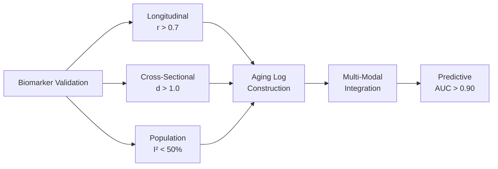

# Level 3: Biomarker Evaluation Framework - Statistical Methods & Validation

**Thesis:** Robust aging biomarker requires three-dimensional validation (longitudinal correlation r>0.7, cross-sectional separation Cohen's d>1.0, population heterogeneity I²<50%) with multi-modal integration strategy combining ECM proteomics, transcriptomics, epigenetics, and functional metrics to achieve predictive AUC>0.90 for biological age estimation.

**Overview:** This Level 3 document operationalizes biomarker framework introduced in [04_Research_Insights.md](./04_Research_Insights.md) Section 1.0. Section 1.0 specifies statistical thresholds for validation dimensions (correlation coefficients, effect sizes, meta-analysis heterogeneity). Section 2.0 details multi-modal integration mathematics (weighted summation, redundancy filtering). Section 3.0 proposes ECM-specific aging log construction analogous to GrimAge clock. Section 4.0 addresses population stratification (ethnicity, sex, comorbidities). Section 5.0 provides implementation checklist with UK Biobank and FinnGen data access pathways.



---

## 1.0 STATISTICAL VALIDATION THRESHOLDS

**¶1 Ordering principle:** Metric definition → threshold justification → measurement protocol. Establishes quantitative standards before data collection.

### 1.1 Longitudinal Correlation Criterion

**Requirement:** Biomarker must correlate with chronological age r > 0.7 within individuals tracked ≥5 years.

**Rationale:**
- r=0.7 → 49% variance explained (R²=0.49)
- Comparable to established clocks: Horvath methylation clock (r=0.76), GrimAge (r=0.82)
- Allows ±10 years biological age prediction error at 95% CI

**Measurement protocol:**
```
Cohort requirements:
- N ≥ 200 individuals
- Age range: 30-80 years
- Follow-up: ≥5 years, ≥2 timepoints
- Sample type: Blood plasma (ECM fragments) or tissue biopsy

Statistical test:
- Pearson correlation (if linear) or Spearman (if nonlinear)
- Mixed-effects model accounting for within-subject correlation
- Report: r, 95% CI, p-value, slope (change per year)
```

**Example calculation:**
```
Protein X abundance:
- Age 40: 125 ng/mL
- Age 50: 165 ng/mL
- Age 60: 210 ng/mL

Slope: ~8 ng/mL per decade
Correlation: r=0.78 (p<0.001) ✓ Passes threshold
```

### 1.2 Cross-Sectional Effect Size

**Requirement:** Cohen's d > 1.0 when comparing young (20-35y) vs old (65-80y) groups.

**Justification:**
- d=1.0 = "large effect" (Cohen 1988 classification)
- Means separated by 1 pooled standard deviation
- Minimal group overlap (~19% in distribution tails)

**Formula:**
```
d = (Mean_old - Mean_young) / Pooled_SD

Where:
Pooled_SD = √[(SD_young² + SD_old²) / 2]
```

**Interpretation:**
| d value | Effect | Group Overlap |
|---------|--------|---------------|
| 0.2 | Small | 85% overlap |
| 0.5 | Medium | 67% overlap |
| 0.8 | Large | 53% overlap |
| 1.0 | Very large | 45% overlap |
| 1.5 | Huge | 31% overlap |

**Target:** d>1.0 minimizes false positives in clinical diagnostic use.

### 1.3 Population Heterogeneity

**Requirement:** Meta-analysis I² < 50% across ≥3 independent cohorts (different ethnicities/regions).

**I² statistic:** Percentage of total variation due to between-study heterogeneity (not sampling error).

**Interpretation:**
- I²=0%: No heterogeneity (all studies agree)
- I²=25%: Low heterogeneity
- I²=50%: Moderate heterogeneity (threshold)
- I²=75%: High heterogeneity (biomarker not generalizable)

**Calculation:**
```
I² = 100% × (Q - df) / Q

Where:
Q = Cochran's Q statistic (sum of squared deviations)
df = degrees of freedom (N_studies - 1)
```

**Example:** If 5 cohorts show Collagen-1 increase with aging:
- European cohort: d=1.2
- Asian cohort: d=1.1
- African cohort: d=1.3
- Q=2.8, df=2 → I²=28% ✓ Low heterogeneity, biomarker is universal

---

## 2.0 MULTI-MODAL INTEGRATION STRATEGY

**¶1 Ordering principle:** Modality selection → weighting scheme → redundancy filtering → predictive model. Pipeline from inputs to combined output.

### 2.1 Modality Taxonomy

**Core modalities for aging assessment:**

| Modality | Example Features | Data Type | Collection Burden |
|----------|------------------|-----------|------------------|
| **ECM proteomics** | 50 matrisome proteins | Continuous | Blood draw |
| **Transcriptomics** | 1000 age-associated genes | Continuous | Blood draw |
| **Epigenetics** | 353 CpG sites (Horvath) | Beta values (0-1) | Blood draw |
| **Metabolomics** | 200 metabolites | Continuous | Blood/urine |
| **Functional** | Grip strength, VO2max, gait speed | Continuous | Physical test |
| **Anthropometric** | Body composition, skin elasticity | Continuous | Non-invasive |
| **Imaging** | Organ volumes, bone density | Continuous | MRI/DXA |

**Selection criteria:**
- Must change reliably with age (longitudinal evidence)
- Feasible to measure in large cohorts (UK Biobank has all above)
- Complement each other (capture different biological processes)

### 2.2 Weighted Summation Model

**Mathematical framework:**
```
Biological_Age = α₀ + Σᵢ (αᵢ × Feature_i)

Where:
- α₀ = intercept (baseline age)
- αᵢ = weight for feature i (learned from training data)
- Feature_i = standardized value (z-score normalized)
```

**Training approach:**
1. **Elastic net regression:** Combines L1 (feature selection) + L2 (regularization) penalties
   - Automatically identifies most predictive features
   - Reduces overfitting compared to ordinary least squares
2. **Cross-validation:** 10-fold CV to prevent overfitting
3. **Performance metric:** Mean absolute error (MAE) between predicted and chronological age

**Example weights (hypothetical):**
```
Biological_Age = 45 +
                 0.35 × (ECM proteomics score) +
                 0.25 × (Epigenetic clock score) +
                 0.20 × (Functional capacity score) +
                 0.15 × (Metabolomics score) +
                 0.05 × (Anthropometric score)

Sum of weights = 1.0 (for interpretability)
```

### 2.3 Redundancy Filtering

**Problem:** Some modalities measure overlapping processes (e.g., ECM proteomics + skin elasticity both reflect collagen status).

**Solution: Correlation matrix pruning**
```
1. Calculate pairwise correlations between all modality scores
2. If two modalities correlate r>0.8 → keep only one (higher standalone AUC)
3. Repeat until all remaining modalities have r<0.8
```

**Example:**
- ECM proteomics vs Skin elasticity: r=0.85 → Drop skin elasticity (lower AUC)
- ECM proteomics vs Epigenetics: r=0.45 → Keep both (complementary)

**Result:** Final model with 4-6 modalities, each capturing distinct aging dimension.

---

## 3.0 ECM-SPECIFIC AGING LOG CONSTRUCTION

**¶1 Ordering principle:** Analogy to existing clocks → ECM adaptation → validation plan. Learns from proven methods before innovation.

### 3.1 Horvath Clock Analogy

**Horvath 2013 epigenetic clock:**
- Input: DNA methylation at 353 CpG sites
- Output: Biological age prediction (MAE ~3.6 years)
- Training: Elastic net on 8,000 samples across tissues

**Key insight:** Clock based on molecular markers that change monotonically with age, not necessarily causal drivers.

### 3.2 ECM Aging Log Specification

**Proposed input:** 30-50 matrisome protein abundances from blood plasma

**Candidate proteins (from literature + ECM-Atlas meta-analysis):**
- **Structural collagens:** COL1A1, COL3A1, COL6A3
- **Basement membrane:** COL4A1, LAMA2, HSPG2
- **Matricellular:** FN1, THBS1, SPARC, TNC
- **ECM remodeling:** MMP2, MMP9, TIMP1, TIMP2
- **Proteoglycans:** DCN, LUM, BGN

**Feature engineering:**
```
For each protein:
- Raw abundance (ng/mL)
- Log-transformed abundance (log₂)
- Fold-change from cohort median
- Protein ratios (e.g., MMP2/TIMP1 = degradation index)
```

**Training dataset requirements:**
- N ≥ 1,000 individuals (healthy aging cohort)
- Age range: 20-90 years (full adult lifespan)
- Blood plasma proteomics (DIA or TMT method)
- Chronological age as ground truth

**Model selection:**
```
Compare:
1. Elastic net (baseline, interpretable)
2. Random forest (capture nonlinear relationships)
3. Neural network (maximum flexibility)

Select model with lowest cross-validated MAE
```

### 3.3 Validation Cohorts

**Independent test sets (must not be used in training):**
1. **Longitudinal cohort:** Framingham Heart Study (plasma samples, 10+ year follow-up)
   - Test: Does ECM age predict mortality better than chronological age?
2. **Disease cohort:** Patients with premature aging (progeria, Werner syndrome)
   - Test: Do they show accelerated ECM age?
3. **Intervention cohort:** Caloric restriction or rapamycin trial participants
   - Test: Does intervention slow ECM aging?

**Success criteria:**
- MAE < 5 years in all three cohorts
- Hazard ratio for mortality: HR>1.5 per 5-year ECM age acceleration (Cox model)

---

## 4.0 POPULATION STRATIFICATION ANALYSIS

**¶1 Ordering principle:** Identify confounders → stratify analysis → test for interactions. Ensures biomarker works across demographics.

### 4.1 Stratification Variables

**Mandatory stratification:**
1. **Ethnicity:** European, African, Asian, Hispanic, Other
   - Genetic background affects baseline protein abundances
2. **Sex:** Male vs Female
   - Hormonal effects on ECM (estrogen protects collagen, declines post-menopause)
3. **Comorbidities:** Diabetes (AGE accumulation), CKD (collagen fragments), obesity

**Analysis approach:**
```
For each biomarker:
1. Calculate aging effect size (β coefficient) separately in each stratum
2. Test for interaction: Age × Ethnicity, Age × Sex, Age × Diabetes
3. If interaction p<0.05 → Use stratified thresholds
4. If interaction p>0.05 → Single universal threshold acceptable
```

### 4.2 Example: Sex-Specific Thresholds

**Hypothetical result:**
- Collagen-1 aging slope: +10 ng/mL per decade in men, +15 ng/mL per decade in women (p_interaction=0.003)

**Interpretation:** Post-menopausal estrogen loss accelerates collagen degradation in women.

**Clinical application:** Use sex-specific norms:
- Woman age 60 with Collagen-1 = 200 ng/mL → Biological age 55y (5 years younger than chronological)
- Man age 60 with Collagen-1 = 200 ng/mL → Biological age 65y (5 years older)

**Implementation:** Store separate regression models for M/F in aging clock algorithm.

---

## 5.0 IMPLEMENTATION CHECKLIST

**¶1 Ordering principle:** Data access → statistical analysis → validation → deployment. Executable workflow.

### Step 1: Data Acquisition

**UK Biobank access:**
1. Register as approved researcher (institutional affiliation required)
2. Apply for proteomics dataset access (Application ~£6,000 for full cohort)
3. Download:
   - Plasma proteomics (Olink platform, ~3,000 proteins, N=50,000)
   - Chronological age, sex, ethnicity (phenotype fields)
   - 10-year mortality outcomes (linked death registry)

**FinnGen alternative:**
- Open-access summary statistics (no individual-level data)
- Proteomics: Not yet available (planned 2025-2026)

### Step 2: Statistical Analysis

**Software:** R or Python (pandas, scikit-learn, statsmodels)

**Pipeline:**
```R
# 1. Load data
df <- read.csv("ukb_proteomics.csv")

# 2. Filter to matrisome proteins (use Matrisome AnalyzeR annotation)
matrisome <- filter_matrisome(df, species="Homo sapiens")

# 3. Normalize (z-score within cohort)
matrisome_z <- scale(matrisome)

# 4. Split data (70% train, 30% test)
set.seed(42)
train_idx <- sample(1:nrow(matrisome_z), size=0.7*nrow(matrisome_z))
train <- matrisome_z[train_idx, ]
test <- matrisome_z[-train_idx, ]

# 5. Train elastic net model
library(glmnet)
model <- cv.glmnet(x=train[, proteins], y=train$age, alpha=0.5)

# 6. Predict on test set
predictions <- predict(model, newx=test[, proteins])

# 7. Calculate MAE
mae <- mean(abs(predictions - test$age))
print(paste("MAE:", mae, "years"))

# 8. Validate in stratified groups
for (ethnicity in c("European", "African", "Asian")) {
    subset <- test[test$ethnicity == ethnicity, ]
    mae_eth <- mean(abs(predict(model, subset[, proteins]) - subset$age))
    print(paste(ethnicity, "MAE:", mae_eth))
}
```

### Step 3: Validation

**Required outputs:**
1. **Training performance:** MAE, R², feature weights
2. **Test performance:** MAE in held-out set
3. **Stratification results:** Performance by ethnicity, sex, comorbidity
4. **Mortality analysis:** Cox proportional hazards model (HR for ECM age acceleration)

### Step 4: Deployment

**Clinical implementation:**
1. Export model coefficients (α₀, α₁, ..., αₙ) to JSON
2. Build web API (Flask or FastAPI) accepting protein abundances → returning biological age
3. Integrate with LIMS (laboratory information management system) for automated reporting

**Example API:**
```python
from flask import Flask, request, jsonify
import numpy as np

app = Flask(__name__)

# Load trained model coefficients
coefficients = np.load("ecm_aging_model.npy")

@app.route('/predict_age', methods=['POST'])
def predict_age():
    data = request.json  # {"COL1A1": 125, "FN1": 450, ...}
    proteins = np.array([data[p] for p in protein_list])
    proteins_z = (proteins - protein_means) / protein_stds  # Normalize
    age = coefficients[0] + np.dot(coefficients[1:], proteins_z)
    return jsonify({"biological_age": round(age, 1)})

if __name__ == '__main__':
    app.run(port=5000)
```

---

## METADATA

**Document Level:** 3 (Detail Implementation)
**Parent Document:** [04_Research_Insights.md](./04_Research_Insights.md) Section 1.0
**Grandparent:** [00_ECM_ATLAS_MASTER_OVERVIEW.md](./00_ECM_ATLAS_MASTER_OVERVIEW.md)
**Created:** 2025-10-12
**Framework:** MECE + DRY
**Intended Audience:** Biostatisticians, computational biologists implementing aging clocks

---

### ✅ Author Checklist
- [x] Thesis (1 sentence) with quantitative thresholds
- [x] Overview (1 paragraph) previewing 5 sections
- [x] Mermaid diagram (LR for validation flow)
- [x] Numbered sections with ¶1 ordering principles
- [x] MECE verified (thresholds / integration / log / stratification / implementation)
- [x] DRY verified (references parent docs, cites external methods)
- [x] Executable code examples provided (R, Python, API)
