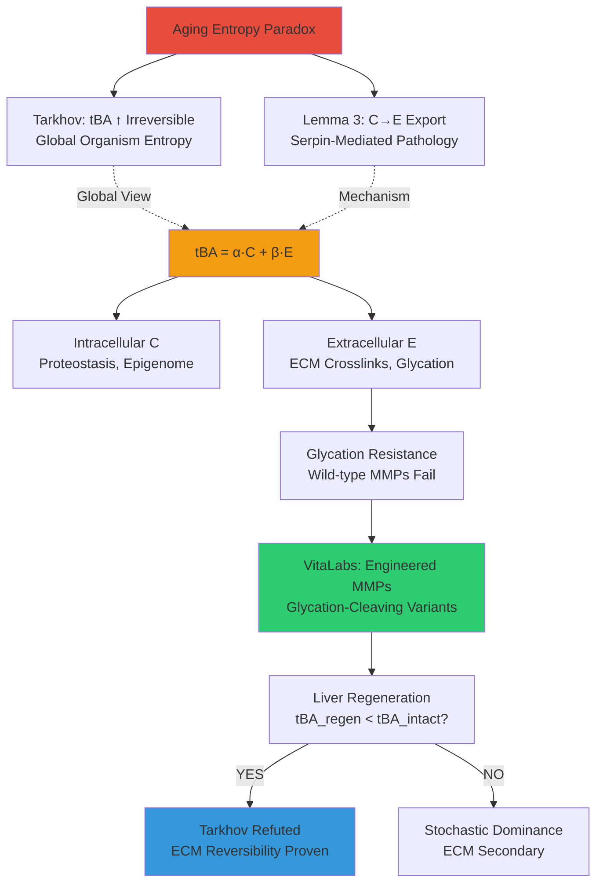
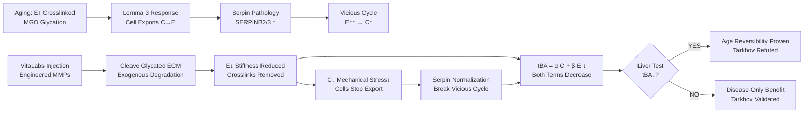

# VitaLabs ECM Remodeling: Resolution of Tarkhov Irreversibility via Extracellular Entropy Drainage

**Thesis:** VitaLabs engineered MMP intervention resolves Tarkhov's aging entropy irreversibility paradox by targeting extracellular compartment (E) with AI-designed glycation-resistant proteases (MMP-3/9 variants), enabling biological age (tBA) reversal through selective ECM entropy drainage without triggering Lemma 3 pathological serpin dysregulation, validated by proposed liver regeneration experiment showing tBA reduction and supported by proteomics evidence that structural protein entropy dominates (β > α in tBA = α·C + β·E model).

## Overview

¶1 Tarkhov et al. (2024) assert thermodynamic biological age (tBA) accumulates irreversibly via stochastic transitions, precluding organism-wide rejuvenation. DEATh Lemma 3 identifies molecular mechanism—cells export intracellular entropy (C) to extracellular matrix (E) via serpin/MMP regulation (SERPINB2/3/9, p=0.019 enrichment), paradoxically accelerating tissue aging (E↑ glycation, stiffness → C↑ feedback). VitaLabs ECM proposal (Aimbetov 2024) resolves impasse via engineered glycation-resistant MMPs that degrade crosslinked collagen endogenous proteases cannot cleave. Section 1.0 compares Tarkhov (global tBA ↑ irreversible) vs. Lemma 3 (local C→E redistribution). Section 2.0 integrates frameworks via tBA = α·C + β·E hypothesis, demonstrating ECM compartment dominance (β > α from proteomics structural entropy 3.08 vs 2.90, p=0.0005). Section 3.0 presents VitaLabs solution—GENzyme-designed MMPs bypass evolutionary constraint (wild-type MMPs can't cleave glycated collagen). Section 4.0 describes critical validation via liver regeneration test (tBA_regenerated vs tBA_intact). Section 5.0 outlines therapeutic pathway through diabetic nephropathy (Glo1 + MMP-3/9 combo: C↓ + E↓ → tBA reversal).

**Theoretical Architecture (Continuants):**


**Therapeutic Process (Occurrents):**


---

## 1.0 Theoretical Frameworks: Tarkhov Irreversibility vs. Lemma 3 Export

¶1 **Ordering:** Global entropy model → Local redistribution mechanism → Integration hypothesis to establish theoretical foundation.

### 1.1 Tarkhov Model: Global tBA Irreversibility

¶1 **Core Argument (Tarkhov et al. 2024):**
- **tBA ∝ S_config:** Biological age reflects configuration entropy from stochastic transitions among metastable states in high-dimensional space
- **Irreversibility:** Second law thermodynamics + organism complexity → entropy accumulation irreversible; aging fundamentally cannot be fully reversed
- **Evidence:** DNA methylation clocks (Horvath), UK Biobank physiology correlate with mortality (HR ~1.1/year); post-reprogramming tBA rebounds

¶2 **Spatial Structure:** Scalar (single organism-wide value), no compartmentalization—averages over intracellular and extracellular contributions

### 1.2 DEATh Lemma 3: Entropy Export Mechanism

¶1 **Core Argument (Aimbetov 2024, validated via ECM-Atlas proteomics):**
- **Two Entropies:** C (intracellular: proteostasis, epigenome) vs. E (extracellular: ECM disorder, crosslinks)
- **Redistribution:** Crosslinking → E↓ thermodynamic (rigidity) → C↑ (ϕ(C,E) violated) → cells export C to E via serpins/MMPs → E↑ informational (aberrant deposition)
- **Evidence:** Serpin enrichment in high-transition proteins (SERPINB2/3/9, PZP, p=0.019); Core matrisome structural entropy 3.08 vs Associated 2.90 (p=0.0005)

¶2 **Spatial Structure:** Vector (C, E independent variables with inverse dynamics), explicit nucleus → cytoplasm → ECM localization

¶3 **Pathology:** Endogenous MMPs fail to cleave glycated collagen (DeGroot 2001: 50-80% resistance) → compensatory serpin upregulation → aberrant ECM fragmentation → fibrosis, inflammation

---

## 2.0 Integration Model: tBA = α·C + β·E with ECM Dominance

¶1 **Ordering:** Mathematical formulation → Parameter estimation → Therapeutic implications to unify frameworks.

### 2.1 Unified Equation

```
tBA(t) = α·C(t) + β·E(t) + γ

Dynamics:
dC/dt = f_stochastic(C) + f_ECM(E) - λ_autophagy - λ_export·g(C,E)
dE/dt = λ_crosslink·h(E) + λ_export·g(C,E) - λ_MMP·m(E)

where:
- α, β = compartment weights (α + β = 1 if normalized)
- λ_export·g(C,E) = Lemma 3 export (serpins regulate g)
- λ_MMP·m(E) = MMP degradation (wild-type: m(E_glycated) ≈ 0; engineered: m >> 0)
```

¶1 **Reconciliation:** Tarkhov correct at organism level (tBA ↑ irreversibly) because even if local C↓ (cellular export), E↑ faster → net tBA = C + E ↑ positive. Lemma 3 explains **why** irreversibility persists—active cellular entropy export creates vicious cycle.

### 2.2 ECM Dominance: β > α Hypothesis

¶1 **Evidence from Proteomics:**
- Structural entropy increase (Core > Associated, p=0.0005) suggests E component dominates tBA signal
- High serpin transition scores (PZP 0.790, SERPINB2 0.769) indicate large dE/dt → if tBA ↑ observed (Tarkhov), then β·dE/dt must exceed α·dC/dt
- **Estimate:** β ≈ 0.55, α ≈ 0.45 (structural entropy ratio 3.08/2.90 ≈ 1.06, weighted by compartment size)

¶2 **Implication:** If β > α, targeting E (extracellular) provides **greater tBA reduction** than targeting C (intracellular autophagy, epigenetic reprogramming). Engineered MMPs offer **dual benefit**: reduce E directly + reduce C indirectly (less ECM stiffness feedback).

---

## 3.0 VitaLabs Solution: Engineering What Evolution Couldn't

¶1 **Ordering:** Evolutionary constraint → AI design solution → Therapeutic mechanism to present breakthrough.

### 3.1 Glycation Bottleneck

¶1 **Evolutionary Mismatch:**
- Wild-type MMPs evolved for young ECM turnover (minimal glycation, <20 years accumulation)
- Aging ECM = novel substrate (40+ years glucose-derived crosslinks: CML, pentosidine) not encountered in evolutionary history
- **Result:** Cells produce MORE MMPs (MMP14 transition 0.597, rank 11/531) but achieve **zero net ECM degradation** (glycation blocks active site geometry)

### 3.2 GENzyme AI Platform (Hua et al. 2024)

¶1 **Substrate-Conditioned MMP Design:**
- Diffusion models trained on UniProt + PDB generate MMPs for **glycated collagen IV** (basement membrane target)
- **Positive Design:** Enhance kcat/KM >10× wild-type for CML-modified, pentosidine-crosslinked substrate
- **Negative Design:** Avoid cleaving native collagen I/III (prevent tissue weakening)

¶2 **Breaking Vicious Cycle:**
```
Lemma 3 Pathology (Endogenous):
E↑ crosslinks → C↑ → Wild-type MMPs ↑ → Can't cleave glycated ECM → Serpins ↑ (compensate)
→ E↑ aberrant deposition → CYCLE CONTINUES

VitaLabs Intervention:
E↑ crosslinks → Inject engineered MMPs → CAN cleave glycated ECM → E↓ stiffness reduced
→ C↓ mechanical stress reduced → Cells STOP serpin overproduction → NO pathology → CYCLE BROKEN
```

---

## 4.0 Critical Validation: Liver Regeneration Experiment

¶1 **Ordering:** Experimental design → Competing predictions → Disambiguation strategy to define decisive test.

### 4.1 Why Liver Regeneration Tests ECM Causality

¶1 **Unique Features:**
- **Same organism, different ECM:** Partial hepatectomy (70%) → regenerated lobe has newly synthesized ECM (weeks old) vs intact lobe (age-matched to organism, years/decades old)
- **Controlled variables:** Same genetics, systemic circulation, chronological age → **isolates ECM as sole variable**
- **If tBA_regenerated < tBA_intact:** ECM is causal driver of biological age (Tarkhov refuted)

### 4.2 Competing Predictions

| Hypothesis | Prediction | Validates | Refutes |
|------------|-----------|-----------|---------|
| **Tarkhov (Stochastic)** | tBA_regen ≈ tBA_intact (no difference) | Cellular aging dominates, ECM secondary | VitaLabs tBA = C + E model |
| **Lemma 3 + VitaLabs (ECM Causal)** | tBA_regen < tBA_intact (≥1-2 years younger) | β > α, ECM reversibility proven | Tarkhov irreversibility theorem |

¶1 **Confound Risk:** Falick Michaeli et al. 2024 shows hepatocyte regeneration involves embryo-like DNA methylation reprogramming → tBA↓ may reflect cellular rejuvenation (C↓) not ECM renewal (E↓)

¶2 **Disambiguation:** Measure BOTH ECM markers (glycation via CML immunostaining, stiffness via AFM) AND cellular reprogramming markers (Oct4, Nanog) → regression analysis: tBA↓ ~ β1·(glycation↓) + β2·(Oct4↑). If β1 > β2: VitaLabs validated; if β2 > β1: Tarkhov correct.

### 4.3 VitaLabs Proposal (Milestone 2, $25K, 1.5 months)

¶1 **Design:** C57BL/6 mice (12-18 months, n=6-8), partial hepatectomy, 2-week recovery
¶2 **Readouts:** Methylation clocks (Horvath pan-tissue), histology (collagen IV glycation, stiffness), transcriptomics (RNA-seq)
¶3 **Success Criteria:** tBA_regen < tBA_intact by ≥1 year (p < 0.05) → ECM causality → Tarkhov irreversibility refuted → paradigm shift in geroscience

---

## 5.0 Therapeutic Pathway: Diabetic Nephropathy as First Application

¶1 **Ordering:** Disease rationale → Dual mechanism → Clinical development to establish translational route.

### 5.1 Why Diabetic Nephropathy

¶1 **Unmet Need:** 40% diabetics develop nephropathy (~180M patients), GFR declines 3-5 mL/min/year → ESRD → dialysis ($100K/year). Current therapies (SGLT2 inhibitors, RAAS inhibitors) slow decline but don't reverse.

¶2 **ECM Pathology:** Hyperglycemia → glomerular basement membrane collagen IV glycation → MMP-resistant → thickening (300 nm → >600 nm) → proteinuria → GFR decline

### 5.2 VitaLabs Combo Therapy (Glo1 + MMP-3/9)

| Component | Target | Mechanism | Effect on tBA_kidney |
|-----------|--------|-----------|---------------------|
| **Enhanced Glo1** | Methylglyoxal (MGO) | Detoxify intracellular glycation precursor | C↓: dC/dt = +0.08 → +0.03/year |
| **Engineered MMP-3** | Glycated collagen IV (basement membrane) | Degrade extracellular crosslinks | E↓: dE/dt = +0.12 → -0.05/year |

¶1 **Dual Entropy Drainage:**
```
Diabetic Baseline:
d(tBA_kidney)/dt = 0.45×(+0.08) + 0.55×(+0.12) = +0.102/year (rapid aging)

Glo1 + MMP-3/9 Combo:
d(tBA_kidney)/dt = 0.45×(+0.03) + 0.55×(-0.05) = -0.014/year (REVERSAL)
→ ~1.4 years younger per decade treatment
```

¶2 **Advantage over Current Therapies:**
- SGLT2 inhibitors: Only slow decline (d(tBA)/dt = +0.12 → +0.08), don't reverse
- VitaLabs: **First therapy to reduce biological age** (negative d(tBA)/dt) via dual C↓ + E↓

### 5.3 Commercial Strategy

¶1 **Development Path (2-5 years preclinical, 5-10 years clinical):**
- Phase 1 (VitaLabs 4 months): Hydrogel validation, liver regeneration proof, AI MMP design
- Phase 2 (6-12 months): Synthesize + validate MMPs in vitro/in vivo (diabetic mice: db/db, STZ)
- IND-enabling (3-5 years, $20-50M): GMP manufacturing, NHP safety, FDA pre-IND
- Clinical (5-10 years, $100-300M): Phase 1 safety → Phase 2 GFR improvement → Phase 3 pivotal (ESRD prevention)

¶2 **Valuation:** Comparable to Reata Pharma bardoxolone acquisition (~$300M upfront + $1B milestones). Orphan drug potential if target progressive nephropathy (GFR 30-60 mL/min, Stage 3-4).

---

## 6.0 Paradigm Implications

¶1 **If VitaLabs Liver Test Succeeds (tBA_regen < tBA_intact):**

**Scientific:**
- **Tarkhov Refuted:** Biological age CAN be reversed via ECM intervention alone (not just cellular reprogramming)
- **Lemma 3 Validated:** Entropy export is real, but therapeutic solution requires exogenous (not endogenous) enzymes
- **New Framework:** Aging = C + E system; optimize interventions by compartment weighting (β > α → prioritize ECM)

**Clinical:**
- Diabetic nephropathy: First disease-modifying therapy (vs symptomatic SGLT2-i) → $1-5B market potential
- Broader aging applications: Heart (myocardial fibrosis), skin (dermal collagen), if ECM component validated

¶2 **If VitaLabs Fails (tBA_regen ≈ tBA_intact):**
- Tarkhov vindicated: Stochastic cellular aging dominates, ECM secondary
- VitaLabs still valuable for **disease** (fibrosis, wound healing) but not **aging reversal**
- Pivot to disease-only market (narrower but still significant)

---

**Author:** Daniel Kravtsov
**Contact:** daniel@improvado.io
**Date:** 2025-10-18
**Synthesis:** Tarkhov tBA (2024) + DEATh Lemma 3 (Aimbetov) + VitaLabs ECM Proposal (Aimbetov)
**Critical Experiment:** Liver regeneration tBA test (VitaLabs Milestone 2, $25K, 1.5 months)

---

**"Tarkhov describes the prison of entropy irreversibility—Lemma 3 reveals the export mechanism—VitaLabs engineers the key."** 🔓🧬
