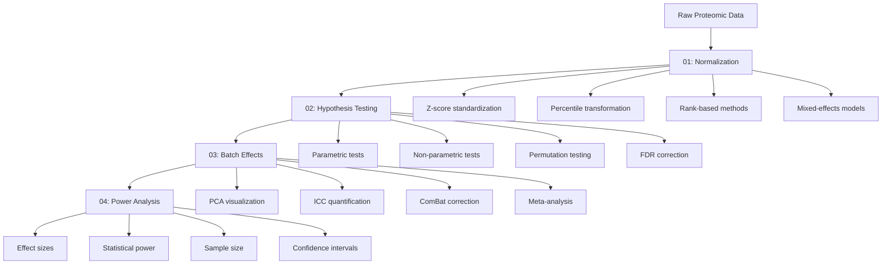
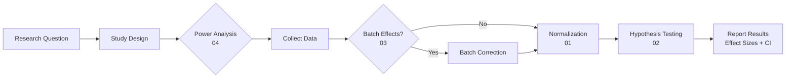

# Statistical Methods Reference Library

**Thesis:** This reference library provides accessible, generalizable study materials for statistical concepts used in proteomic multi-study integration, covering normalization (z-score, percentile, rank-based), hypothesis testing (parametric, non-parametric, permutation), batch effect detection and correction (PCA, ICC, ComBat), and power analysis (effect sizes, sample size calculation, confidence intervals).

## Overview

Statistical analysis of multi-study proteomic datasets requires understanding data normalization to remove technical variation, hypothesis testing with multiple comparison correction, batch effect detection and mitigation, and power analysis for study design. These four guides provide high-level study materials allowing humans or AI agents to understand techniques used in ECM-Atlas validation reports without needing to read implementation code.





---

## Document Guide

### [01_normalization_methods.md](01_normalization_methods.md)

**Purpose:** Understand methods to transform proteomic abundances for cross-sample comparison.

**Covers:**
- **Z-score standardization:** Within-group mean-centering (μ=0, σ=1)
- **Percentile normalization:** Rank transformation (0-100 scale)
- **Rank-based correlation:** Spearman's ρ for monotonic relationships
- **Mixed-effects models:** Hierarchical variance decomposition
- **Global standardization:** Pooled mean/SD across all samples

**Key concepts:**
- Assumptions (normality, homoscedasticity, independence)
- When to use each method
- Advantages and limitations
- Method selection guide

**Use when:**
- Choosing normalization strategy for new analysis
- Understanding why ECM-Atlas uses within-study z-scores
- Validating findings with alternative methods

**Read time:** 30 minutes

---

### [02_statistical_testing.md](02_statistical_testing.md)

**Purpose:** Learn hypothesis testing, p-values, and multiple testing correction for proteomic studies.

**Covers:**
- **Assumption validation:** Normality (Shapiro-Wilk), variance equality (Levene), independence
- **Parametric tests:** t-test, ANOVA, paired tests
- **Non-parametric tests:** Mann-Whitney U, Wilcoxon, Kruskal-Wallis
- **Permutation testing:** Null distribution generation, validation
- **Multiple testing correction:** FDR (Benjamini-Hochberg), FWER (Bonferroni), Holm

**Key concepts:**
- Type I and Type II errors
- P-value interpretation
- False discovery rate control
- Effect sizes vs statistical significance

**Use when:**
- Deciding between parametric vs non-parametric tests
- Understanding why zero proteins pass FDR<0.05 in ECM-Atlas
- Applying appropriate multiple testing correction
- Validating parametric p-values with permutation tests

**Read time:** 40 minutes

---

### [03_batch_effects.md](03_batch_effects.md)

**Purpose:** Detect and correct systematic technical variation confounding biological signal.

**Covers:**
- **Batch effect sources:** Instrument calibration, sample preparation, processing batches
- **Detection methods:** PCA visualization, ICC quantification
- **Correction algorithms:** ComBat (empirical Bayes), limma, mixed-effects models
- **Validation:** Before/after comparison, biological signal preservation
- **Alternatives:** Stratified analysis, meta-analysis, study selection

**Key concepts:**
- ICC interpretation (< 0.5 = poor reliability)
- PCA clustering patterns
- When batch correction succeeds vs fails
- Meta-analysis for heterogeneous studies

**Use when:**
- Integrating data from multiple studies
- Understanding why ECM-Atlas has ICC=0.29 (batch effects dominate)
- Deciding whether to apply ComBat or stratify analyses
- Validating cross-study comparisons

**Read time:** 35 minutes

---

### [04_effect_sizes_and_power.md](04_effect_sizes_and_power.md)

**Purpose:** Quantify magnitude of effects, design adequately powered studies, and report uncertainty.

**Covers:**
- **Effect size metrics:** Cohen's d, correlation r, odds ratios, η²/R²
- **Statistical power:** Concept, factors affecting power, power calculations
- **Sample size calculation:** A priori design, post-hoc assessment
- **Confidence intervals:** Parametric and bootstrap CIs
- **Bootstrap methods:** Resampling for non-parametric effect size estimation

**Key concepts:**
- Cohen's benchmarks (d: 0.2=small, 0.5=medium, 0.8=large)
- Power = 1 - β (typically 80%)
- Sample size for different effect sizes
- CI interpretation (does NOT cross zero → significant)

**Use when:**
- Designing new proteomic study (calculate required sample size)
- Interpreting biological importance (not just p-values)
- Understanding why typical ECM-Atlas study has only 17% power
- Reporting effect sizes with confidence intervals

**Read time:** 35 minutes

---

## Recommended Reading Order

### For New Researchers

**Minimal path (2 hours):**
1. [01_normalization_methods.md](01_normalization_methods.md) - Section 1 (z-scores), Section 6 (method selection)
2. [02_statistical_testing.md](02_statistical_testing.md) - Section 2 (t-tests), Section 5 (FDR correction)
3. [04_effect_sizes_and_power.md](04_effect_sizes_and_power.md) - Section 1 (Cohen's d), Section 4 (confidence intervals)

**Comprehensive path (4-5 hours):**
1. Read all four documents sequentially
2. Focus on "Key concepts" and "Use when" sections
3. Review code examples for techniques used in your analysis
4. Consult decision matrices for method selection

### For Understanding ECM-Atlas Reports

**To understand Agent 1 (Z-Score Audit):**
- [01_normalization_methods.md](01_normalization_methods.md) - Section 1.0 (z-scores)
- [02_statistical_testing.md](02_statistical_testing.md) - Section 1.0 (assumptions), Section 4.0 (permutation)
- [03_batch_effects.md](03_batch_effects.md) - Section 2.0 (detection: PCA, ICC)

**To understand Agent 2 (Alternative Methods):**
- [01_normalization_methods.md](01_normalization_methods.md) - All sections (comprehensive method comparison)
- [04_effect_sizes_and_power.md](04_effect_sizes_and_power.md) - Section 4.0 (bootstrap CIs)

**To understand Agent 3 (Hallucination Check):**
- [02_statistical_testing.md](02_statistical_testing.md) - Section 5.0 (multiple testing correction)
- [04_effect_sizes_and_power.md](04_effect_sizes_and_power.md) - Section 1.0 (effect sizes), Section 4.0 (CIs)
- [03_batch_effects.md](03_batch_effects.md) - Section 2.2 (ICC calculation)

---

## Quick Reference Tables

### Normalization Method Selection

| Scenario | Recommended Method | Document Reference |
|----------|-------------------|-------------------|
| Normal data, balanced studies | Within-study z-score | [01](01_normalization_methods.md#10-z-score-standardization) |
| Non-normal data | Percentile normalization | [01](01_normalization_methods.md#20-percentile-normalization) |
| Outliers present | Rank-based Spearman | [01](01_normalization_methods.md#30-rank-based-correlation-spearman) |
| High batch effects (ICC<0.5) | Stratified or ComBat | [03](03_batch_effects.md#30-batch-correction-methods) |
| Variance decomposition needed | Mixed-effects model | [01](01_normalization_methods.md#40-mixed-effects-models) |

### Statistical Test Selection

| Data Type | Assumptions Met? | Recommended Test | Document Reference |
|-----------|------------------|------------------|-------------------|
| Two groups | Yes (normal, equal var) | Student's t-test | [02](02_statistical_testing.md#21-students-t-test-independent-samples) |
| Two groups | Unequal variance | Welch's t-test | [02](02_statistical_testing.md#22-welchs-t-test-unequal-variance) |
| Two groups | Non-normal | Mann-Whitney U | [02](02_statistical_testing.md#32-mann-whitney-u-test-two-groups) |
| Multiple groups | Normal, equal var | One-way ANOVA | [02](02_statistical_testing.md#24-one-way-anova-multiple-groups) |
| Multiple groups | Non-normal | Kruskal-Wallis | [02](02_statistical_testing.md#34-kruskal-wallis-test-multiple-groups) |
| Validation needed | Any data | Permutation test | [02](02_statistical_testing.md#40-permutation-testing) |

### Multiple Testing Correction

| Number of Tests | Priority | Recommended Method | Document Reference |
|-----------------|----------|-------------------|-------------------|
| k < 10 | Few false positives critical | Bonferroni | [02](02_statistical_testing.md#53-family-wise-error-rate-fwer---bonferroni) |
| 10 ≤ k < 100 | Balance power and FDR | Holm-Bonferroni | [02](02_statistical_testing.md#54-holm-bonferroni-sequential) |
| k ≥ 100 | Discovery phase | Benjamini-Hochberg FDR | [02](02_statistical_testing.md#52-false-discovery-rate-fdr---benjamini-hochberg) |
| Correlated tests | Positive correlation | Benjamini-Yekutieli | [02](02_statistical_testing.md#55-method-selection-guide) |

### Batch Effect Assessment

| ICC Value | PCA Pattern | Interpretation | Action | Document Reference |
|-----------|-------------|----------------|--------|-------------------|
| ICC > 0.75 | Studies overlap | Minimal batch effects | Proceed with analysis | [03](03_batch_effects.md#23-decision-matrix) |
| 0.5 < ICC < 0.75 | Moderate clustering | Moderate batch effects | Apply batch correction | [03](03_batch_effects.md#31-combat-empirical-bayes) |
| ICC < 0.5 | Strong clustering | Severe batch effects | **Mandatory correction or stratify** | [03](03_batch_effects.md#51-stratified-analysis-within-study) |
| ICC < 0.3 | Complete separation | Overwhelming batch | Correction may fail; meta-analysis | [03](03_batch_effects.md#52-meta-analysis-random-effects) |

### Sample Size Requirements (α=0.05, Power=0.80)

| Effect Size | Cohen's d | n per Group | Total n | Document Reference |
|-------------|-----------|-------------|---------|-------------------|
| Small | 0.2 | 394 | 788 | [04](04_effect_sizes_and_power.md#31-t-test-two-groups) |
| Medium | 0.5 | 64 | 128 | [04](04_effect_sizes_and_power.md#31-t-test-two-groups) |
| Large | 0.8 | 26 | 52 | [04](04_effect_sizes_and_power.md#31-t-test-two-groups) |
| Very Large | 1.2 | 15 | 30 | [04](04_effect_sizes_and_power.md#23-power-calculation-a-priori) |

---

## Common Questions

### Q: Which normalization method should I use?

**A:** Start with within-study z-score normalization ([01](01_normalization_methods.md#10-z-score-standardization)) if data is approximately normal and studies are balanced. Validate with percentile normalization ([01](01_normalization_methods.md#20-percentile-normalization)). Report consensus proteins significant in both methods for highest confidence.

**Decision tree:** [01_normalization_methods.md, Section 6.1](01_normalization_methods.md#61-decision-flowchart)

---

### Q: How do I know if my data has batch effects?

**A:** Calculate ICC and generate PCA plot ([03](03_batch_effects.md#20-batch-effect-detection)).
- **ICC < 0.5:** Strong batch effects detected
- **PCA:** Studies cluster separately (not overlapping by biology)

**Action:** Apply ComBat correction ([03](03_batch_effects.md#31-combat-empirical-bayes)) or stratified analysis ([03](03_batch_effects.md#51-stratified-analysis-within-study)).

---

### Q: Why did I get zero significant proteins after FDR correction?

**A:** Three common reasons:
1. **True negatives:** No real biological effects
2. **Underpowered:** Sample size too small to detect medium effects ([04](04_effect_sizes_and_power.md#24-power-calculation-post-hoc))
3. **Batch effects:** High heterogeneity inflates variance ([03](03_batch_effects.md))

**Solution:** Check power analysis ([04, Section 2](04_effect_sizes_and_power.md#20-statistical-power)), assess batch effects ([03, Section 2](03_batch_effects.md#20-batch-effect-detection)), consider within-study analyses ([03](03_batch_effects.md#51-stratified-analysis-within-study)).

---

### Q: Should I use parametric or non-parametric tests?

**A:** Test assumptions first ([02](02_statistical_testing.md#10-assumption-validation)):
- **Shapiro-Wilk p > 0.05:** Data is normal → use parametric
- **Shapiro-Wilk p < 0.05:** Data is non-normal → use non-parametric

**When in doubt:** Use both, compare results. If conclusions differ, trust non-parametric (no assumptions) and report both.

---

### Q: How many samples do I need?

**A:** Depends on expected effect size ([04](04_effect_sizes_and_power.md#30-sample-size-calculation)):
- **Medium effect (d=0.5):** n=64 per group for 80% power
- **Large effect (d=0.8):** n=26 per group
- **Small effect (d=0.2):** n=394 per group (often impractical)

**For proteomic discovery:** Aim for n ≥ 50 per group to detect d=0.5 effects reliably.

---

### Q: What is a good effect size?

**A:** Depends on context ([04](04_effect_sizes_and_power.md#11-cohens-d-standardized-mean-difference)):
- **Cohen's d > 0.8:** Large effect (likely biologically important)
- **0.5 ≤ d < 0.8:** Medium effect (potentially important)
- **d < 0.5:** Small effect (may lack biological significance despite statistical significance)

**Recommendation:** Prioritize proteins with large effect sizes (d > 0.8) for experimental validation, even if p-value is marginally significant.

---

## Glossary

**α (alpha):** Type I error rate (false positive probability); typically 0.05.

**β (beta):** Type II error rate (false negative probability); Power = 1 - β.

**Batch effect:** Systematic technical variation correlating with processing batch or study, confounding biological signal.

**Cohen's d:** Standardized mean difference in standard deviation units; d = (μ₁ - μ₂) / s_pooled.

**ComBat:** Empirical Bayes batch correction algorithm for multi-study integration.

**Confidence interval (CI):** Range of values consistent with observed data; 95% CI covers true parameter in 95% of repeated experiments.

**Effect size:** Magnitude of difference or association, independent of sample size.

**FDR (False Discovery Rate):** Expected proportion of false positives among discoveries; controlled via Benjamini-Hochberg.

**FWER (Family-Wise Error Rate):** Probability of ≥1 false positive across all tests; controlled via Bonferroni.

**ICC (Intraclass Correlation):** Proportion of variance due to between-group differences; ICC < 0.5 indicates poor reliability (high batch effects).

**Mixed-effects model:** Regression with fixed effects (population-level) and random effects (group-level variation).

**Normalization:** Transformation to remove unwanted technical variation while preserving biological signal.

**P-value:** Probability of observing data as extreme as observed, assuming null hypothesis is true.

**PCA (Principal Component Analysis):** Dimensionality reduction for visualizing dominant sources of variance.

**Permutation test:** Non-parametric test generating null distribution by shuffling group labels.

**Power:** Probability of detecting an effect if it truly exists; Power = 1 - β; typically 80%.

**Spearman's ρ:** Rank-based correlation coefficient for monotonic relationships.

**Z-score:** Standardized value: z = (x - μ) / σ; mean=0, SD=1 after transformation.

---

## Python/R Package Summary

**Python:**
- `scipy.stats`: Parametric and non-parametric tests
- `statsmodels`: Power analysis, mixed-effects models, multiple testing correction
- `sklearn.decomposition.PCA`: Principal component analysis
- `numpy`, `pandas`: Data manipulation

**R:**
- `sva` (ComBat): Batch effect correction
- `limma` (removeBatchEffect): Alternative batch correction
- `lme4`: Mixed-effects models (lmer)
- `pwr`: Power analysis

**Installation:**
```bash
# Python
pip install scipy statsmodels scikit-learn numpy pandas

# R
install.packages("BiocManager")
BiocManager::install(c("sva", "limma"))
install.packages(c("lme4", "pwr"))
```

---

## Document Metadata

**Created:** 2025-10-18
**Framework:** MECE + BFO Ontology
**Purpose:** High-level study materials for statistical concepts in proteomic multi-study integration
**Audience:** Researchers and AI agents analyzing ECM-Atlas or similar datasets
**Total Reading Time:** ~140 minutes (comprehensive), ~120 minutes (focused)

**Documents:**
1. [01_normalization_methods.md](01_normalization_methods.md) - 30 min
2. [02_statistical_testing.md](02_statistical_testing.md) - 40 min
3. [03_batch_effects.md](03_batch_effects.md) - 35 min
4. [04_effect_sizes_and_power.md](04_effect_sizes_and_power.md) - 35 min

**Updates:** Add new documents for additional statistical concepts as needed. Maintain MECE organization and cross-references.

---

**Status:** Complete
**Version:** 1.0
**License:** Open access for research and education
