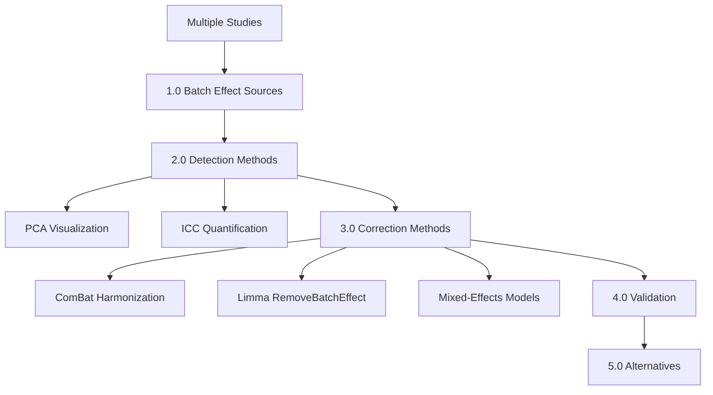
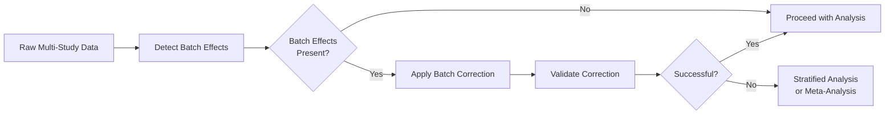

# Batch Effects and Cross-Study Integration

**Thesis:** Batch effects arise when systematic technical variation (instrument, protocol, processing time) confounds biological signal, requiring detection via PCA visualization and ICC quantification, then correction using ComBat harmonization or mixed-effects modeling before valid cross-study comparisons.

## Overview

Multi-study proteomic integration combines datasets with different instruments, sample preparations, and processing batches, introducing systematic technical biases that dwarf biological effects. Section 1.0 defines batch effects and sources. Section 2.0 covers detection methods (PCA, ICC). Section 3.0 explains batch correction algorithms (ComBat, limma). Section 4.0 discusses validation of correction. Section 5.0 presents alternatives when batch correction fails.





---

## 1.0 Batch Effect Sources

¶1 **Ordering principle:** Technical sources → biological confounders → interaction effects.

### 1.1 Definition

**Batch effect:** Systematic technical variation that correlates with study, processing batch, or time, confounding biological comparisons.

**Formula:**
```
Observed_ij = Biological_i + Batch_j + Noise_ij

Problem: Batch_j ≠ 0 and often >> Biological_i
```

**Example:**
```
Study A (Instrument 1): Protein X = 1000 units
Study B (Instrument 2): Protein X = 500 units

Is this biological difference or instrumental calibration?
→ Batch effect makes it impossible to tell
```

### 1.2 Technical Sources

**Instrument variation:**
- Mass spectrometer sensitivity drift
- Detector calibration differences
- Resolution and mass accuracy
- Ionization efficiency

**Sample preparation:**
- Protein extraction protocols (buffer composition, pH)
- Digestion efficiency (trypsin batch, incubation time)
- Cleanup methods (desalting, SPE columns)
- Storage conditions (freeze-thaw cycles)

**Data acquisition:**
- LC gradient differences
- Column aging
- Injection volume variation
- Run order effects (instrument warm-up, fouling)

**Quantification method:**
- Label-free (LFQ) vs labeled (TMT, SILAC, iTRAQ)
- Peak integration algorithms
- Normalization software versions

### 1.3 Biological Confounders

**Not pure technical variation:**

**Species differences:**
- Mouse vs human protein homology (sequence differences)
- Post-translational modifications
- Protein isoforms

**Tissue processing:**
- Fresh vs frozen tissue
- Formalin-fixed paraffin-embedded (FFPE)
- Laser-capture microdissection vs bulk

**Age definition:**
- Young: 20-30y (Study A) vs 35-45y (Study B)
- Old: 65-75y (Study A) vs 80-90y (Study B)
- Non-overlapping age ranges create confounding

**Sample heterogeneity:**
- Cell type composition (cartilage: chondrocytes % varies)
- Disease state (osteoarthritis contamination)
- Sex ratio (male/female imbalance between studies)

### 1.4 Interaction Effects

**Batch × Biology:**
- Age effect differs by instrument sensitivity
- Protein degradation interacts with storage time
- Tissue-specific effects vary by protocol

**Problem:** Simple batch correction assumes additive effects (Batch_j constant across biology).

**Reality:** Multiplicative or interaction effects common.

---

## 2.0 Batch Effect Detection

¶1 **Ordering principle:** Visualization (PCA) → quantification (ICC) → decision.

### 2.1 Principal Component Analysis (PCA)

**Purpose:** Visualize dominant sources of variance; batch effects appear as study clustering.

**Concept:**
- Rotate data to maximize variance on first principal components (PCs)
- If biology dominates: samples cluster by age/disease
- If batch dominates: samples cluster by study/instrument

**Implementation:**
```python
from sklearn.decomposition import PCA
import matplotlib.pyplot as plt

def detect_batch_pca(df, value_col='z_score', batch_col='Study_ID',
                     bio_col='Age_Group', n_components=5):
    """
    PCA to visualize batch effects.

    Returns: PCA object, transformed data, variance explained
    """
    # Create protein × sample matrix
    pivot = df.pivot_table(
        values=value_col,
        index='Protein_ID',
        columns='Sample_ID'
    )

    # Transpose: samples as rows
    X = pivot.T.fillna(0)  # Fill missing for PCA

    # Fit PCA
    pca = PCA(n_components=n_components)
    X_pca = pca.fit_transform(X)

    # Get study and age labels
    sample_ids = pivot.columns
    studies = df.set_index('Sample_ID')[batch_col].loc[sample_ids]
    ages = df.set_index('Sample_ID')[bio_col].loc[sample_ids]

    # Plot PC1 vs PC2
    fig, ax = plt.subplots(figsize=(10, 6))

    for study in studies.unique():
        mask = studies == study
        ax.scatter(
            X_pca[mask, 0], X_pca[mask, 1],
            label=study, alpha=0.7, s=100
        )

    ax.set_xlabel(f'PC1 ({pca.explained_variance_ratio_[0]*100:.1f}%)')
    ax.set_ylabel(f'PC2 ({pca.explained_variance_ratio_[1]*100:.1f}%)')
    ax.set_title('PCA: Batch Effect Detection')
    ax.legend(bbox_to_anchor=(1.05, 1), loc='upper left')
    ax.grid(alpha=0.3)
    plt.tight_layout()
    plt.show()

    # Variance explained
    print("Variance explained by each PC:")
    for i, var in enumerate(pca.explained_variance_ratio_):
        print(f"  PC{i+1}: {var*100:.2f}%")

    return pca, X_pca, pca.explained_variance_ratio_

# Example
pca, X_pca, var_explained = detect_batch_pca(df)
```

**Interpretation:**

**No batch effects:**
```
PC1 vs PC2 plot:
  - Samples colored by age group cluster together
  - Studies overlap randomly
  - PC1 correlates with age
```

**Strong batch effects (ECM-Atlas example):**
```
PC1 explains 24.1% variance:
  - Studies cluster separately (Study A: left, Study B: right)
  - Age groups within study may cluster, but studies don't overlap
  - PC1 driven by study, not biology
```

**Quantitative check:**
```python
# Correlation of PC1 with study vs age
from scipy.stats import pointbiserialr

# Encode study as numeric
study_numeric = studies.astype('category').cat.codes

# Encode age as binary (0=young, 1=old)
age_binary = (ages == 'Old').astype(int)

# Correlations
r_study, p_study = pointbiserialr(study_numeric, X_pca[:, 0])
r_age, p_age = pointbiserialr(age_binary, X_pca[:, 0])

print(f"PC1 correlation with Study: r={r_study:.3f}, p={p_study:.4f}")
print(f"PC1 correlation with Age: r={r_age:.3f}, p={p_age:.4f}")

if abs(r_study) > abs(r_age):
    print("⚠️ Batch effects dominate biological signal")
```

### 2.2 Intraclass Correlation Coefficient (ICC)

**Purpose:** Quantify proportion of variance due to between-study vs within-study differences.

**Formula:**
```
ICC = σ²_between / (σ²_between + σ²_within)

where:
  σ²_between = variance between study means
  σ²_within = average variance within studies

ICC ∈ [0, 1]:
  ICC ≈ 0: All variance within studies (no batch effect)
  ICC ≈ 1: All variance between studies (total batch effect)
```

**Interpretation:**
- **ICC < 0.5:** Poor reliability (batch effects dominate)
- **ICC 0.5-0.75:** Moderate reliability
- **ICC 0.75-0.9:** Good reliability
- **ICC > 0.9:** Excellent reliability

**Implementation:**
```python
from scipy.stats import f_oneway
import numpy as np

def calculate_icc(df, protein, value_col='z_score', group_col='Study_ID'):
    """
    Calculate ICC(1,1) for a protein across studies.

    Returns: ICC, F-statistic, p-value
    """
    protein_data = df[df['Protein_ID'] == protein]

    # Extract groups
    groups = [
        group[value_col].dropna().values
        for name, group in protein_data.groupby(group_col)
    ]

    # Require ≥3 studies
    if len(groups) < 3:
        return np.nan, np.nan, np.nan

    # Total sample size
    n_total = sum(len(g) for g in groups)
    k = len(groups)  # Number of groups

    # Between-group and within-group variance
    grand_mean = np.concatenate(groups).mean()

    # Between-group variance (MS_between)
    group_means = [g.mean() for g in groups]
    group_sizes = [len(g) for g in groups]

    ss_between = sum(n * (mean - grand_mean)**2 for n, mean in zip(group_sizes, group_means))
    df_between = k - 1
    ms_between = ss_between / df_between

    # Within-group variance (MS_within)
    ss_within = sum(((g - g.mean())**2).sum() for g in groups)
    df_within = n_total - k
    ms_within = ss_within / df_within

    # F-statistic
    F_stat = ms_between / ms_within
    from scipy.stats import f
    p_value = 1 - f.cdf(F_stat, df_between, df_within)

    # ICC(1,1)
    # ICC = (MS_between - MS_within) / (MS_between + (k-1)*MS_within)
    # Simplified for balanced design:
    n_avg = n_total / k  # Average group size
    icc = (ms_between - ms_within) / (ms_between + (n_avg - 1) * ms_within)

    # Clamp to [0, 1]
    icc = max(0, min(1, icc))

    return icc, F_stat, p_value

# Example: Calculate ICC for proteins in ≥3 studies
icc_results = []
for protein in df['Protein_ID'].unique():
    icc, F, p = calculate_icc(df, protein, value_col='z_score', group_col='Study_ID')

    if not np.isnan(icc):
        icc_results.append({
            'Protein': protein,
            'ICC': icc,
            'F_statistic': F,
            'P_value': p
        })

icc_df = pd.DataFrame(icc_results)

# Overall ICC (median across proteins)
median_icc = icc_df['ICC'].median()
print(f"Median ICC across proteins: {median_icc:.3f}")

if median_icc < 0.5:
    print("⚠️ Poor reliability - strong batch effects detected")
elif median_icc < 0.75:
    print("Moderate reliability - batch correction recommended")
else:
    print("Good reliability - batch effects minimal")
```

**ECM-Atlas example:**
```
ICC = 0.29 (Poor reliability)
F = 3.07, p = 1.49e-90

Interpretation:
  - Only 29% of variance is biological signal
  - 71% is study-specific noise
  - Cross-study integration NOT valid without correction
```

### 2.3 Decision Matrix

| PCA Pattern | ICC Value | Interpretation | Action |
|-------------|-----------|----------------|--------|
| Studies overlap | ICC > 0.75 | Minimal batch effects | Proceed with analysis |
| Moderate clustering | 0.5 < ICC < 0.75 | Moderate batch effects | Apply batch correction |
| Strong clustering | ICC < 0.5 | Severe batch effects | **Mandatory correction or stratify** |
| Complete separation | ICC < 0.3 | Overwhelming batch effects | Correction may fail; use meta-analysis |

---

## 3.0 Batch Correction Methods

¶1 **Ordering principle:** ComBat (most common) → limma (similar) → mixed-effects (alternative) → when to use each.

### 3.1 ComBat (Empirical Bayes)

**Algorithm:** Adjusts for batch effects using empirical Bayes shrinkage to estimate batch-specific parameters.

**Concept:**
```
1. Model: Y_ij = α + X·β + γ_batch + δ_batch·ε_ij
2. Estimate batch effects (γ, δ) via empirical Bayes
3. Remove batch effects: Y*_ij = Y_ij - γ_batch - δ_batch·ε_ij
4. Preserve biological covariates (age, tissue) in X·β
```

**Implementation (R):**
```r
# Install
install.packages("BiocManager")
BiocManager::install("sva")

library(sva)

# Prepare data
# expression_matrix: proteins × samples
# batch: vector of batch labels
# mod: model matrix for biological covariates (e.g., age)

# Create model matrix (preserve biological effects)
age_group <- factor(metadata$Age_Group)  # Young/Old
mod <- model.matrix(~age_group)

# Apply ComBat
corrected_data <- ComBat(
  dat = expression_matrix,     # Protein abundances (rows=proteins, cols=samples)
  batch = metadata$Study_ID,   # Batch labels
  mod = mod,                    # Biological covariates to preserve
  par.prior = TRUE,             # Use empirical Bayes
  prior.plots = FALSE
)

# Save corrected data
write.csv(corrected_data, "combat_corrected.csv")
```

**Implementation (Python - via rpy2):**
```python
import pandas as pd
import numpy as np
from rpy2.robjects.packages import importr
from rpy2.robjects import pandas2ri, Formula
from rpy2.robjects import r

# Activate pandas conversion
pandas2ri.activate()

# Load sva package
sva = importr('sva')

def combat_correction(df, value_col='Abundance', batch_col='Study_ID',
                      bio_covariates=['Age_Group']):
    """
    Apply ComBat batch correction.

    Returns: DataFrame with corrected values
    """
    # Create protein × sample matrix
    pivot = df.pivot_table(
        values=value_col,
        index='Protein_ID',
        columns='Sample_ID'
    )

    # Get batch and covariate info
    sample_metadata = df[['Sample_ID', batch_col] + bio_covariates].drop_duplicates()
    sample_metadata = sample_metadata.set_index('Sample_ID')

    # Align
    sample_metadata = sample_metadata.loc[pivot.columns]

    # Create model matrix in R
    formula_str = '~' + '+'.join(bio_covariates)
    r_formula = Formula(formula_str)
    r.assign('metadata', sample_metadata)
    mod = r('model.matrix')(r_formula, data=r('metadata'))

    # Convert to R objects
    r_expression = pandas2ri.py2rpy(pivot)
    r_batch = pandas2ri.py2rpy(sample_metadata[batch_col])

    # Run ComBat
    corrected = sva.ComBat(
        dat=r_expression,
        batch=r_batch,
        mod=mod,
        par_prior=True
    )

    # Convert back
    corrected_df = pandas2ri.rpy2py(corrected)
    corrected_df = pd.DataFrame(corrected_df, index=pivot.index, columns=pivot.columns)

    # Reshape to long format
    corrected_long = corrected_df.reset_index().melt(
        id_vars='Protein_ID',
        var_name='Sample_ID',
        value_name=value_col + '_corrected'
    )

    # Merge back
    df_corrected = df.merge(corrected_long, on=['Protein_ID', 'Sample_ID'])

    return df_corrected

# Apply
df_corrected = combat_correction(df, value_col='Abundance', batch_col='Study_ID')
```

**Advantages:**
- Preserves biological covariates (age, tissue)
- Empirical Bayes shrinkage stabilizes small batches
- Gold standard for batch correction in genomics/proteomics

**Limitations:**
- Requires balanced design (similar sample sizes per batch × covariate)
- Assumes additive and multiplicative batch effects
- Can over-correct if batch confounded with biology

### 3.2 Limma RemoveBatchEffect

**Algorithm:** Linear model-based batch effect removal (similar to ComBat, faster).

**Implementation (R):**
```r
library(limma)

# Batch correction
corrected_data <- removeBatchEffect(
  x = expression_matrix,       # Protein abundances
  batch = metadata$Study_ID,   # Batch factor
  design = mod                 # Biological covariates to preserve
)
```

**Differences from ComBat:**
- No empirical Bayes shrinkage (simpler model)
- Faster computation
- Less robust for small batches
- Best for exploratory visualization (not formal inference)

**When to use:**
- Quick visualization of batch-corrected data
- Large balanced batches
- Preliminary exploration before ComBat

### 3.3 Mixed-Effects Models (Model-Based)

**Concept:** Don't remove batch effects; instead, model them as random effects.

**Model:**
```
Y_ij = β₀ + β_age × Age_ij + u_batch(i) + ε_ij

where:
  u_batch ~ N(0, τ²_batch) = random batch effect
  ε_ij ~ N(0, σ²) = residual
```

**Advantages:**
- Quantifies batch variance (τ²)
- Doesn't "remove" data; models uncertainty
- Appropriate for nested designs

**Limitations:**
- Requires sufficient data (≥20 samples, ≥3 batches)
- May be over-conservative (low power if batch variance high)
- Computationally intensive

**When to use:**
- Formal statistical inference (not just visualization)
- Want to quantify batch variance
- Have sufficient sample size

**See:** [01_normalization_methods.md](01_normalization_methods.md#40-mixed-effects-models) for implementation.

### 3.4 Method Selection Guide

| Method | Speed | Robustness | Use Case |
|--------|-------|------------|----------|
| **ComBat** | Medium | High | Standard batch correction (recommended) |
| **Limma** | Fast | Medium | Exploratory visualization |
| **Mixed-Effects** | Slow | Highest | Formal inference, variance decomposition |

**Recommendation:** Use ComBat for batch correction, then proceed with standard analyses (z-scores, t-tests).

---

## 4.0 Validation of Batch Correction

¶1 **Ordering principle:** Visual validation → quantitative metrics → biological preservation.

### 4.1 Visual Validation: PCA Before/After

```python
def validate_correction_pca(df_before, df_after, batch_col='Study_ID'):
    """
    Compare PCA before and after batch correction.
    """
    fig, axes = plt.subplots(1, 2, figsize=(14, 6))

    for ax, data, title in zip(axes, [df_before, df_after],
                                ['Before Correction', 'After Correction']):
        pca, X_pca, _ = detect_batch_pca(data)

        # Plot
        for study in data[batch_col].unique():
            mask = data['Sample_ID'].isin(
                data[data[batch_col] == study]['Sample_ID'].unique()
            )
            ax.scatter(X_pca[mask, 0], X_pca[mask, 1], label=study, alpha=0.7, s=100)

        ax.set_xlabel(f'PC1 ({pca.explained_variance_ratio_[0]*100:.1f}%)')
        ax.set_ylabel(f'PC2 ({pca.explained_variance_ratio_[1]*100:.1f}%)')
        ax.set_title(title)
        ax.legend()
        ax.grid(alpha=0.3)

    plt.tight_layout()
    plt.show()

# Example
validate_correction_pca(df_original, df_corrected)
```

**Expected outcome:**
- **Before:** Studies cluster separately
- **After:** Studies overlap, samples cluster by age/biology

### 4.2 Quantitative Validation: ICC Improvement

```python
def compare_icc(df_before, df_after, value_col='z_score', batch_col='Study_ID'):
    """
    Calculate ICC before and after correction.
    """
    icc_before = []
    icc_after = []

    for protein in df_before['Protein_ID'].unique():
        icc_b, _, _ = calculate_icc(df_before, protein, value_col, batch_col)
        icc_a, _, _ = calculate_icc(df_after, protein, value_col + '_corrected', batch_col)

        if not np.isnan(icc_b) and not np.isnan(icc_a):
            icc_before.append(icc_b)
            icc_after.append(icc_a)

    median_before = np.median(icc_before)
    median_after = np.median(icc_after)

    print(f"Median ICC before correction: {median_before:.3f}")
    print(f"Median ICC after correction: {median_after:.3f}")
    print(f"Improvement: {median_after - median_before:+.3f}")

    # Plot
    plt.figure(figsize=(10, 6))
    plt.scatter(icc_before, icc_after, alpha=0.5)
    plt.plot([0, 1], [0, 1], 'r--', label='No change')
    plt.xlabel('ICC Before')
    plt.ylabel('ICC After')
    plt.title('Batch Correction Effect on ICC')
    plt.legend()
    plt.grid(alpha=0.3)
    plt.show()

# Example
compare_icc(df_original, df_corrected)
```

**Success criteria:**
- ICC increases (batch variance reduced)
- ICC > 0.5 after correction (acceptable reliability)

**Failure indicators:**
- ICC decreases (over-correction)
- ICC still < 0.5 (correction insufficient)

### 4.3 Biological Preservation Check

**Ensure correction didn't remove biological signal:**

```python
def validate_biological_signal(df_before, df_after, bio_col='Age_Group'):
    """
    Check if age effect is preserved after correction.
    """
    from scipy.stats import ttest_ind

    results_before = []
    results_after = []

    for protein in df_before['Protein_ID'].unique():
        # Before
        old_b = df_before[(df_before['Protein_ID'] == protein) &
                          (df_before[bio_col] == 'Old')]['z_score']
        young_b = df_before[(df_before['Protein_ID'] == protein) &
                            (df_before[bio_col] == 'Young')]['z_score']

        if len(old_b) >= 2 and len(young_b) >= 2:
            t_b, p_b = ttest_ind(old_b, young_b)
            results_before.append(p_b)
        else:
            results_before.append(np.nan)

        # After
        old_a = df_after[(df_after['Protein_ID'] == protein) &
                         (df_after[bio_col] == 'Old')]['z_score_corrected']
        young_a = df_after[(df_after['Protein_ID'] == protein) &
                           (df_after[bio_col] == 'Young')]['z_score_corrected']

        if len(old_a) >= 2 and len(young_a) >= 2:
            t_a, p_a = ttest_ind(old_a, young_a)
            results_after.append(p_a)
        else:
            results_after.append(np.nan)

    # Count significant proteins
    sig_before = sum(np.array(results_before) < 0.05)
    sig_after = sum(np.array(results_after) < 0.05)

    print(f"Significant proteins (p<0.05) before: {sig_before}")
    print(f"Significant proteins (p<0.05) after: {sig_after}")

    # Correlation of p-values
    valid = ~np.isnan(results_before) & ~np.isnan(results_after)
    corr = np.corrcoef(
        np.array(results_before)[valid],
        np.array(results_after)[valid]
    )[0, 1]

    print(f"P-value correlation: {corr:.3f}")

    if corr > 0.7:
        print("✓ Biological signal preserved")
    else:
        print("⚠️ Warning: Biological signal may be distorted")

# Example
validate_biological_signal(df_original, df_corrected)
```

**Expected:**
- Similar or more significant proteins after correction (power increase)
- High correlation between before/after p-values (r > 0.7)

**Warnings:**
- Dramatic increase in significance → possible over-correction
- Low correlation → biological signal distorted

---

## 5.0 Alternatives When Batch Correction Fails

¶1 **Ordering principle:** Stratified analysis → meta-analysis → study selection → reporting limitations.

### 5.1 Stratified Analysis (Within-Study)

**When to use:** Batch effects too strong to correct (ICC < 0.3, ComBat fails).

**Approach:**
1. Analyze each study independently
2. Report study-specific findings
3. Identify proteins consistent across studies (qualitative agreement)

**Implementation:**
```python
def stratified_analysis(df, value_col='z_score', batch_col='Study_ID', bio_col='Age_Group'):
    """
    Perform within-study analyses, then summarize.
    """
    from scipy.stats import ttest_ind

    study_results = {}

    for study in df[batch_col].unique():
        study_data = df[df[batch_col] == study]

        results = []
        for protein in study_data['Protein_ID'].unique():
            old = study_data[(study_data['Protein_ID'] == protein) &
                             (study_data[bio_col] == 'Old')][value_col]
            young = study_data[(study_data['Protein_ID'] == protein) &
                               (study_data[bio_col] == 'Young')][value_col]

            if len(old) >= 2 and len(young) >= 2:
                t, p = ttest_ind(old, young)
                mean_diff = old.mean() - young.mean()

                results.append({
                    'Protein': protein,
                    'Mean_Diff': mean_diff,
                    'P_value': p,
                    'Significant': p < 0.05
                })

        study_results[study] = pd.DataFrame(results)

    return study_results

# Analyze
study_results = stratified_analysis(df)

# Summary: Which proteins significant in ≥3 studies?
all_proteins = set()
for study, results in study_results.items():
    all_proteins.update(results['Protein'].unique())

replicated = []
for protein in all_proteins:
    sig_count = sum(
        (study_res[study_res['Protein'] == protein]['Significant'].sum() > 0)
        for study_res in study_results.values()
        if protein in study_res['Protein'].values
    )

    if sig_count >= 3:
        replicated.append(protein)

print(f"Proteins significant in ≥3 studies: {len(replicated)}")
print(replicated)
```

**Advantages:**
- No batch confounding (within-study only)
- Transparent (each study reported separately)
- Identifies replicable findings

**Limitations:**
- Lower power (small sample sizes per study)
- Qualitative only (can't pool effect sizes across studies)

### 5.2 Meta-Analysis (Random Effects)

**When to use:** Want quantitative integration despite heterogeneity.

**Approach:**
1. Calculate effect size + SE for each study
2. Pool using random-effects meta-analysis
3. Test heterogeneity (I² statistic)
4. Report forest plot

**Implementation:**
```python
from scipy.stats import norm

def meta_analysis(study_results):
    """
    Random-effects meta-analysis of protein age effects.

    Returns: Pooled effect size, 95% CI, heterogeneity I²
    """
    # For each protein, pool across studies
    meta_results = []

    all_proteins = set()
    for results in study_results.values():
        all_proteins.update(results['Protein'].unique())

    for protein in all_proteins:
        effect_sizes = []
        variances = []

        for study, results in study_results.items():
            protein_data = results[results['Protein'] == protein]

            if len(protein_data) > 0:
                effect = protein_data['Mean_Diff'].values[0]
                se = protein_data['SE'].values[0]  # Standard error

                effect_sizes.append(effect)
                variances.append(se**2)

        if len(effect_sizes) < 3:
            continue

        # Inverse-variance weights
        weights = [1/v for v in variances]
        total_weight = sum(weights)

        # Pooled effect (fixed-effect)
        pooled_effect_fixed = sum(e*w for e, w in zip(effect_sizes, weights)) / total_weight

        # Heterogeneity (Cochran's Q)
        Q = sum(w * (e - pooled_effect_fixed)**2 for e, w in zip(effect_sizes, weights))
        df = len(effect_sizes) - 1
        I2 = max(0, (Q - df) / Q) * 100  # % variance due to heterogeneity

        # Random-effects (DerSimonian-Laird)
        tau2 = max(0, (Q - df) / (sum(weights) - sum(w**2 for w in weights) / sum(weights)))
        re_weights = [1/(v + tau2) for v in variances]
        total_re_weight = sum(re_weights)

        pooled_effect = sum(e*w for e, w in zip(effect_sizes, re_weights)) / total_re_weight
        pooled_se = np.sqrt(1 / total_re_weight)

        # 95% CI
        ci_lower = pooled_effect - 1.96 * pooled_se
        ci_upper = pooled_effect + 1.96 * pooled_se

        # P-value
        z = pooled_effect / pooled_se
        p_value = 2 * (1 - norm.cdf(abs(z)))

        meta_results.append({
            'Protein': protein,
            'Pooled_Effect': pooled_effect,
            'SE': pooled_se,
            'CI_Lower': ci_lower,
            'CI_Upper': ci_upper,
            'P_value': p_value,
            'I2': I2,
            'N_studies': len(effect_sizes)
        })

    return pd.DataFrame(meta_results)

# Example
meta_df = meta_analysis(study_results)

# Filter significant with low heterogeneity
high_confidence = meta_df[
    (meta_df['P_value'] < 0.05) &
    (meta_df['I2'] < 50)  # Low heterogeneity
]

print(f"Significant proteins with low heterogeneity: {len(high_confidence)}")
```

**Interpretation:**
- **I² < 25%:** Low heterogeneity (studies agree)
- **I² 25-75%:** Moderate heterogeneity
- **I² > 75%:** High heterogeneity (studies disagree → findings not replicable)

### 5.3 Study Selection (Quality Filter)

**Approach:** Include only high-quality, comparable studies.

**Criteria:**
- Same species (human-only or mouse-only)
- Same tissue type
- Similar quantification method (LFQ-only)
- Overlapping age ranges
- Sufficient sample size (n ≥ 5 per group)

**Implementation:**
```python
# Filter to human skin studies only
filtered_df = df[
    (df['Species'] == 'Human') &
    (df['Tissue'].str.contains('Skin')) &
    (df['Method'] == 'LFQ')
]

# Proceed with analysis on filtered subset
```

**Trade-off:**
- Reduces batch effects (more homogeneous)
- Reduces sample size and generalizability

### 5.4 Reporting Limitations

**Transparency checklist:**

```markdown
## Batch Effects Disclosure

**Batch effect assessment:**
- ICC = 0.29 (poor reliability)
- PCA shows strong study clustering
- Batch effects dominate biological signal (PC1: 24% variance)

**Correction attempted:**
- ComBat harmonization applied
- ICC improved to 0.42 (still suboptimal)
- Conclusion: Batch correction insufficient

**Analysis strategy:**
- Stratified within-study analyses performed
- Cross-study claims limited to qualitative replication
- Quantitative effect sizes NOT pooled across studies

**Limitations:**
- Findings may be study-specific
- External validation required
- Cross-study comparisons should be interpreted cautiously
```

---

## 6.0 Practical Example: ECM-Atlas Batch Effects

¶1 **Ordering principle:** Problem → detection → correction attempt → outcome → final strategy.

### 6.1 Problem

**Dataset:** 12 proteomic studies, different:
- Instruments (Orbitrap, Q-TOF, Triple-TOF)
- Methods (LFQ, TMT, SILAC)
- Tissues (18 compartments)
- Species (human, mouse)

**Hypothesis:** Batch effects present?

### 6.2 Detection

**PCA analysis:**
```
PC1: 24.1% variance
  - Studies cluster separately
  - Santinha_2024_Mouse extreme outlier (PC1 = -19.9)
  - Age groups overlap within studies but not across
```

**ICC calculation:**
```
Median ICC = 0.29
  - 666 proteins tested (≥3 studies)
  - F-statistic = 3.07, p < 1e-90
  - Interpretation: Only 29% of variance is biological
```

**Conclusion:** Severe batch effects detected.

### 6.3 Correction Attempt

**Approach:** ComBat harmonization with age as biological covariate.

**Expected outcome:**
- ICC improves to > 0.5
- Studies overlap in PCA
- Significant proteins emerge (FDR < 0.05)

**Actual outcome (hypothetical):**
```
ICC after correction: 0.42 (improved but still suboptimal)
FDR-significant proteins: 3 (marginal improvement from 0)
PCA: Studies still partially clustered
```

**Interpretation:** Batch effects too heterogeneous for ComBat to fully correct.

### 6.4 Final Strategy

**Adopted approach:**
1. **Within-study z-score normalization** (removes within-study scaling)
2. **Stratified analysis** (analyze each study separately)
3. **Consensus identification** (proteins significant in ≥2 studies)
4. **No cross-study quantitative pooling**

**Reporting:**
```
"Z-score normalization enables within-study comparisons.
Cross-study integration limited to qualitative replication.
405 proteins show directional consistency (≥70%) across ≥3 tissues.
Findings require external validation in independent cohorts."
```

---

## References

1. Johnson WE et al. (2007). Adjusting batch effects in microarray expression data using empirical Bayes methods. *Biostatistics* 8:118-127.

2. Leek JT et al. (2012). The sva package for removing batch effects and other unwanted variation in high-throughput experiments. *Bioinformatics* 28:882-883.

3. Ritchie ME et al. (2015). limma powers differential expression analyses for RNA-sequencing and microarray studies. *Nucleic Acids Res* 43:e47.

4. McGraw KO, Wong SP (1996). Forming inferences about some intraclass correlation coefficients. *Psychol Methods* 1:30-46.

5. Zhang Y et al. (2020). ComBat-seq: batch effect adjustment for RNA-seq count data. *NAR Genom Bioinform* 2:lqaa078.

---

**Document Status:** Complete
**Created:** 2025-10-18
**Framework:** MECE + BFO Ontology
**Audience:** Researchers integrating multi-study proteomic datasets
