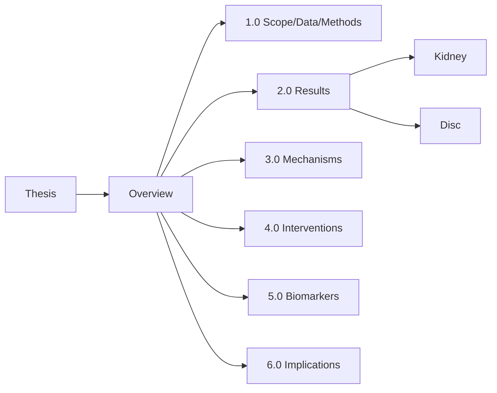

## ECM Aging in Kidney and Disc — MECE/Fractal Summary

### Thesis (1 sentence)
**Aging shifts ECM from specialized, tissue-optimized structure to a fibrosis- and inflammation-prone scaffold (kidney: COL4A3↓, VCAN↑; disc: loss of cartilage ECM with plasma/coagulation protein infiltration), yielding clear targets (e.g., TIMP3, FRZB) and biomarker panels for diagnosis and therapy monitoring.**

### Overview (1 paragraph preview of sections)
We analyze two LFQ proteomics studies across five compartments to: (1.0) define scope/data/methods; (2.0) report MECE results per tissue/compartment; (3.0) map mechanisms (fibrosis, coagulation–senescence, Wnt/TGF-β) with ordering from general→specific; (4.0) outline interventions by leverage points (anti‑fibrotic, Wnt modulators, senolytics, coagulation axis); (5.0) propose ECM "clock" biomarkers; (6.0) note implications and next steps.

---

### Mermaid Overview (LR)

### 1.0 Scope, Data, Methods
¶1 Ordering principle: general→specific (dataset→QC→analysis).
¶2 Data: merged LFQ proteomics from Randles 2021 (kidney: glomerular, tubulointerstitial) and Tam 2020 (disc: NP, IAF, OAF).
¶3 QC: standardized Z-scores; minor missingness; some gene→multi‑accession duplicates; distributions ~normal.
¶4 Analysis: |ΔZ|≥1 candidates; per‑compartment summaries; literature‑linked functional annotations.

### 2.0 Results (MECE by system)
¶1 Ordering principle: kidney→disc (low→high effect size).
#### 2.1 Kidney (glomerular, tubulointerstitial)
¶2 Signature: COL4A3↓ (BM loss), VCAN↑ (fibrotic proteoglycan); glomeruli also ELN↑, FCN2↑, FGL1↑; TI mirrors COL4A3↓/VCAN↑.
#### 2.2 Intervertebral disc (NP, IAF, OAF)
¶3 NP/IAF: strong up of plasma/coagulation proteins (FGA/FGB/FGG, PLG, F2, VTN, HRG, ITIH1/2/4), TSG‑6↑; cartilage ECM down (COL2A1, COL11A2, MATN3; VIT/FNDC3B↓); IL‑17B↓; FRZB↓.
¶4 OAF: remodeling/fibrosis markers MMP‑2↑, POSTN↑; modest TIMP3↑ (regional).

### 3.0 Mechanisms (from macro to pathway)
¶1 Ordering principle: macro pattern→ECM assemblies→signaling.
¶2 Macro: specialized matrix loss + interstitial/fibrotic accumulation; avascular→vascularized disc microenvironment.
¶3 ECM assemblies: HA–versican–TSG‑6–ITIH heavy‑chain complexes (inflammatory scaffold) in disc; BM thinning in kidney (COL4A3↓).
¶4 Signaling: coagulation/fibrinolysis footprint → PAR signaling → senescence; Wnt disinhibition via FRZB loss; TGF‑β‑like program (VCAN↑, collagen remodeling); anti‑angiogenic brakes reduced (SLIT3, TIMP3 regionality).

### 4.0 Interventions (leverage points)
¶1 Ordering principle: disease‑agnostic levers→tissue‑specific applications.
¶2 Disease‑agnostic: anti‑fibrotics (TGF‑β/miR‑21/RAAS), Wnt modulators (restore FRZB/sFRP3), senolytics/senomorphics, coagulation‑axis moderation (e.g., FXa/thrombin pathway), lifestyle (exercise/CR).
¶3 Disc focus: TIMP3 restoration (anti‑MMP/anti‑angiogenic), FRZB re‑balancing Wnt, anti‑angiogenic strategies, selective fibrin/HA‑HC complex disruption (risk/benefit).
¶4 Kidney focus: preserve BM (COL4A3 signature), curb VCAN‑driven fibrosis (anti‑TGF‑β/miR‑21; RAAS blockers).

### 5.0 Biomarkers (ECM "clock")
¶1 Ordering principle: proximal ECM fragments→systems readouts.
¶2 Proximal: versican fragments (versikine), collagen peptides (C1M/C3M/CTX‑II), HA fragments; MMP/TIMP ratio.
¶3 Systems: plasma infiltration signature in disc (fibrinogen complex, PLG, VTN), MRI T2/T1ρ for GAG loss; urinary BM fragments (kidney).
¶4 Use: staging biological ECM age; stratification; pharmacodynamic monitoring for anti‑fibrotic/senolytic/Wnt/coagulation‑axis trials.

### 6.0 Implications & Next Steps
¶1 Ordering principle: translation pipeline (diagnostics→therapeutics→validation).
¶2 Diagnostics: build compact ECM panel (versikine + collagen peptide + HA + MMP/TIMP) with tissue routing rules.
¶3 Therapeutics: prioritize disc (largest effect sizes); pilot TIMP3/FRZB and anti‑angiogenic combos; kidney: anti‑fibrotic adjutants.
¶4 Validation: IHC for COL4A3/VCAN (kidney), HA‑HC/TSG‑6 in disc; functionally test coagulation‑axis modulation and Wnt rebalancing.

---

### Appendix A — Key Entities (non‑redundant)
- **Kidney (core):** COL4A3↓, VCAN↑; ELN↑, FCN2↑, FGL1↑ (glomeruli).
- **Disc (core):** FGA/FGB/FGG↑, PLG↑, F2↑, VTN↑, HRG↑, ITIH1/2/4↑, TSG‑6↑; COL2A1↓, COL11A2↓, MATN3↓, VIT/FNDC3B↓; FRZB↓; MMP‑2↑, POSTN↑; regional TIMP3.

### Appendix B — Ordering/MECE Notes
- Sections are MECE: data/methods, results (kidney/disc), mechanisms, interventions, biomarkers, implications.
- Paragraph numbering (¶) conveys flow: ordering stated first in each section.

