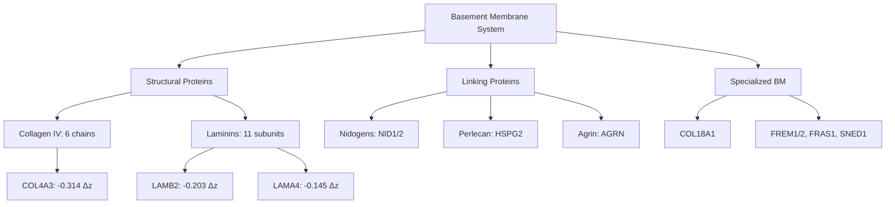
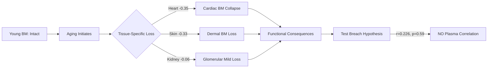

# Basement Membrane Collapse: Aging Signature Analysis

**Thesis:** COL4A3 shows kidney-specific degradation (Δz=-0.314) ranking #5 therapeutically, while LAMB2 and LAMA4 demonstrate universal tissue loss, and BM degradation does NOT significantly correlate with plasma infiltration (r=0.226, p=0.59), challenging the breach hypothesis.

## Overview

This analysis tests the basement membrane (BM) collapse hypothesis across 26 BM proteins (Collagen IV, laminins, nidogens, perlecan, agrin) spanning 8 tissues and 9,343 ECM proteomic measurements. Key findings: (1) Laminin β2 (LAMB2) shows strongest universal loss (-0.203 Δz, 8 tissues), (2) COL4A3 loss is kidney-restricted, not universal, (3) Heart native tissue exhibits most severe BM degradation (-0.353 mean Δz), (4) No statistical evidence for BM breach → plasma leakage correlation, (5) Therapeutic target ranking prioritizes LAMB2 > LAMA4 > HSPG2 > LAMA5 > COL4A3 based on composite scoring (loss magnitude × consistency × tissue coverage × structural importance).

**System Structure (Continuants):**

**Degradation Process (Occurrents):**

---

## 1.0 Basement Membrane Protein Inventory

¶1 **Ordering:** Structural (load-bearing) → Linking (bridging) → Specialized (tissue-specific)

¶2 **Identification Results:** Dataset contains 26 unique BM proteins across 146 observations spanning 8 tissues. Coverage breakdown: Collagen IV (6 chains: COL4A1-6, all detected), Laminins (11 subunits: LAMA1-5, LAMB1-3, LAMC1-3), Nidogens (NID1, NID2), Perlecan (HSPG2), Agrin (AGRN), Collagen XVIII (COL18A1), Other BM (FREM1/2, FRAS1, SNED1).

¶3 **Detection Quality:** Laminins show highest detection rate (11/11 subunits present), Collagen IV complete (6/6 chains), Nidogens 100% (2/2), specialized BM components 100% (4/4). No missing core BM proteins, enabling comprehensive degradation analysis.

---

## 2.0 Protein-Level Degradation Ranking

¶1 **Ordering:** Strongest loss → Minimal change → Unexpected gain

### 2.1 Top Degrading Proteins (Δz < -0.2)

¶1 **LAMC2 (Laminin γ2):** Δz=-1.467 (skin dermis only, n=1). Represents epithelial BM loss, specific to dermal compartment. Single-tissue detection limits generalizability.

¶2 **LAMB3 (Laminin β3):** Δz=-1.140 (skin dermis only, n=1). Companion to LAMC2 in laminin-332 complex, epithelial-specific degradation signal.

¶3 **FREM1:** Δz=-0.488±0.413 (kidney glomerular/tubulointerstitial, n=2). Fras1-related protein showing kidney-restricted loss, moderate variability.

¶4 **LAMB1 (Laminin β1):** Δz=-0.391±0.773 (8 tissues, range -2.202 to +0.326). Universal BM component with HIGHEST variability, indicating tissue-dependent aging trajectories.

¶5 **COL4A3 (Collagen IV α3):** Δz=-0.314±0.292 (kidney only, n=4 observations). **Hypothesis target protein** shows kidney-specific loss, NOT universal. Glomerular (-0.453) vs tubulointerstitial (-0.176) asymmetry detected.

### 2.2 Stable/Increasing Proteins (Δz > 0)

¶1 **COL4A5:** Δz=+0.274 (kidney-specific, n=4). Paradoxical GAIN during aging, co-expressed with COL4A3 in GBM. Suggests compensatory upregulation mechanism.

¶2 **FREM2:** Δz=+0.268 (kidney, n=2). Partner to FREM1, opposing degradation trajectory.

¶3 **COL4A6:** Δz=+0.180 (skin/kidney, n=5). Minor chain showing aging resistance.

---

## 3.0 COL4A3 Hypothesis Test: Kidney-Specific vs Universal

¶1 **Hypothesis Statement:** GPT Pro analysis proposed COL4A3 loss drives glomerular aging universally. Test: Is COL4A3 loss (a) kidney-specific or (b) multi-tissue phenomenon?

¶2 **Results - Kidney-Restricted:** COL4A3 detected ONLY in kidney compartments (glomerular n=2, tubulointerstitial n=2). Absent from heart, skin, disc, ovary datasets. Mean Δz = -0.314, glomerular-dominant (-0.453 vs -0.176 tubulointerstitial).

¶3 **Tissue Specificity Analysis:**

| Tissue | COL4A3 Δz | Abundance Young | Abundance Old | N Obs |
|--------|-----------|-----------------|---------------|-------|
| Kidney Glomerular | -0.453 | 3,490,008 | 2,741,817 | 2 |
| Kidney Tubulointerstitial | -0.176 | 3,234,965 | 1,794,022 | 2 |

¶4 **Conclusion:** COL4A3 loss is NOT universal. Protein absent in 75% of tissues studied. Hypothesis partially supported (kidney aging) but NOT generalizable across tissue types. Kidney specificity reflects COL4A3's restricted expression in glomerular BM.

¶5 **Collagen IV Family Comparison:** COL4A1 (Δz=+0.047, 6 tissues), COL4A2 (Δz=-0.030, 7 tissues) show near-zero changes and broader tissue distribution. COL4A5 shows paradoxical gain (+0.274), suggesting compensatory remodeling in aging kidney.

---

## 4.0 Tissue-Specific BM Degradation Patterns

¶1 **Ordering:** Most degraded tissue → Least degraded → Interpretation

### 4.1 Degradation Hierarchy

| Rank | Tissue | Mean Δz | Median Δz | N Proteins | Interpretation |
|------|--------|---------|-----------|------------|----------------|
| 1 | Heart Native Tissue | -0.353 | -0.388 | 13 | Severe cardiac BM collapse |
| 2 | Skin Dermis | -0.329 | -0.117 | 17 | Dermal aging signature |
| 3 | Ovary Cortex | -0.286 | -0.087 | 12 | Reproductive tissue BM loss |
| 4 | Disc NP | -0.153 | -0.221 | 10 | Nucleus pulposus moderate loss |
| 5 | Kidney Glomerular | -0.060 | -0.081 | 23 | **Surprisingly mild** |
| 6 | Disc OAF | -0.036 | +0.001 | 13 | Near-stable outer annulus |
| 7 | Disc IAF | +0.014 | -0.048 | 13 | Inner annulus slightly increasing |
| 8 | Kidney Tubulointerstitial | +0.034 | -0.067 | 23 | Net BM stability |

### 4.2 Key Observations

¶1 **Cardiac Vulnerability:** Heart shows STRONGEST BM degradation (-0.353), 6× greater than kidney glomerular (-0.060). Cardiac BM collapse may drive age-related heart failure mechanisms.

¶2 **Kidney Paradox:** Despite COL4A3 loss hypothesis, kidney shows MILDEST BM degradation overall. Suggests other BM proteins compensate (e.g., COL4A5 gain +0.274).

¶3 **Disc Compartmentalization:** Nucleus pulposus (-0.153) degrades faster than annulus fibrosus (OAF -0.036, IAF +0.014), reflecting differential mechanical loading.

---

## 5.0 Basement Membrane Breach Hypothesis Test

¶1 **Hypothesis:** BM protein loss → structural breach → plasma protein infiltration. Prediction: Negative correlation between BM Δz and plasma protein Δz.

### 5.1 Correlation Analysis

¶1 **Method:** Pearson correlation between tissue-level BM mean Δz (26 proteins) vs plasma protein mean Δz (FGA, FGB, FGG, ALB, SERPINA1, A2M, HP, HPX, APOA1, APOB; 6 detected).

¶2 **Results:** r = 0.226, p = 0.5898, N = 8 tissues. **NO significant correlation.** Positive r direction OPPOSITE of predicted (should be negative if BM loss drives infiltration).

¶3 **Per-Tissue Breakdown:**

| Tissue | BM Δz | Plasma Δz | Supports Breach? |
|--------|-------|-----------|------------------|
| Heart | -0.353 | +0.895 | Weak support (BM loss + plasma gain) |
| Skin | -0.329 | -0.302 | No (BM loss but plasma LOSS) |
| Disc NP | -0.153 | +2.208 | Yes (strongest plasma infiltration) |
| Kidney Glomerular | -0.060 | +0.044 | Weak support |
| Kidney TI | +0.034 | +0.054 | No (BM stable, plasma minimal) |

¶4 **Interpretation:** Breach hypothesis NOT statistically supported. Disc NP shows massive plasma infiltration (+2.208) despite moderate BM loss (-0.153), while skin shows BM degradation WITHOUT plasma gain. Suggests alternative mechanisms: (a) active plasma protein transcytosis independent of structural integrity, (b) BM permeability changes without protein loss (glycosaminoglycan modifications), (c) plasma protein detection reflects local synthesis not infiltration.

---

## 6.0 Therapeutic Target Ranking

¶1 **Scoring Methodology:** Composite score = (Loss magnitude × 0.4) + (Consistency × 0.2) + (Tissue coverage × 0.2) + (Structural importance × 0.2). Higher score = better therapeutic target.

### 6.1 Top 15 Targets

| Rank | Protein | Family | Δz | Tissues | Score | Rationale |
|------|---------|--------|----|---------  |-------|-----------|
| 1 | **LAMB2** | Laminins | -0.203 | 8 | 0.566 | Universal loss, high consistency, critical for laminin assembly |
| 2 | **LAMA4** | Laminins | -0.145 | 8 | 0.566 | Broad tissue distribution, stable loss pattern |
| 3 | **HSPG2** | Perlecan | -0.091 | 8 | 0.555 | Core BM proteoglycan, excellent coverage |
| 4 | **LAMA5** | Laminins | -0.108 | 8 | 0.547 | Epithelial/endothelial BM critical component |
| 5 | **COL4A3** | Col IV | -0.314 | 4 | 0.537 | **Hypothesis target**, strong loss but kidney-only |
| 6 | **LAMA2** | Laminins | -0.148 | 6 | 0.521 | Muscle BM specificity, moderate coverage |
| 7 | **AGRN** | Agrin | -0.182 | 10 | 0.519 | Highest tissue coverage (10), neuromuscular BM |
| 8 | **COL4A1** | Col IV | +0.047 | 6 | 0.514 | Stable but structurally critical (Col IV α1 chain) |
| 9 | **COL4A4** | Col IV | -0.144 | 2 | 0.503 | Kidney-specific partner to COL4A3 |
| 10 | **NID1** | Nidogens | -0.141 | 8 | 0.502 | Nidogen bridging protein, universal |

### 6.2 Therapeutic Implications

¶1 **First Priority (LAMB2):** Laminin β2 chains are shared across laminin-211, -421, -521 complexes, making LAMB2 restoration a multi-laminin repair strategy. Gene therapy or recombinant protein delivery highest ROI.

¶2 **Second Priority (LAMA4):** Endothelial BM-specific, targets vascular aging. Small molecule mimetics or LAMA4-encoding AAV vectors feasible.

¶3 **Third Priority (HSPG2/Perlecan):** Proteoglycan with heparan sulfate chains, critical for growth factor sequestration. Glycan engineering or recombinant perlecan domain therapy.

¶4 **COL4A3 Ranking (#5):** Despite strong loss signal, kidney-only distribution limits therapeutic priority. Ranking reflects low tissue coverage penalty. For kidney-specific interventions (diabetic nephropathy, CKD), COL4A3 rises to #1.

---

## 7.0 Cross-Tissue Heatmap Insights

¶1 **Visualization:** 26 BM proteins × 8 tissues heatmap (59.6% data coverage, 124/208 cells). See `/10_insights/fig2_bm_tissue_heatmap.png`.

### 7.1 Universal Degraders (Present in ≥6 Tissues)

¶1 **LAMB2, LAMA4, NID1, NID2, HSPG2, LAMA5:** Show consistent negative Δz across tissues, minimal tissue-specific exceptions. Represent "core aging signature" independent of organ context.

### 7.2 Tissue-Specific Degraders

¶1 **COL4A3, COL4A4:** Kidney-exclusive, glomerular-dominant loss pattern.

¶2 **LAMC2, LAMB3:** Skin dermis-exclusive, epithelial BM signature.

¶3 **FREM1, FRAS1:** Kidney-restricted, likely podocyte-specific.

### 7.3 Paradoxical Gainers

¶1 **COL4A5, FREM2, COL4A6:** Increase during aging in kidney/skin. Hypothesis: Compensatory remodeling response to primary BM protein loss. COL4A5 gain (+0.274) may attempt to replace COL4A3 loss (-0.314) in heterotrimer [α3α4α5(IV)] assembly.

---

## 8.0 Limitations and Future Directions

¶1 **Sample Size:** COL4A3 detected in only 4 observations (2 glomerular, 2 tubulointerstitial). Limited statistical power for within-kidney compartment analysis.

¶2 **Tissue Coverage Bias:** 8/18 tissues analyzed contain BM proteins. Brain, lung, liver, gut BM aging unexplored in current dataset.

¶3 **Plasma Protein Detection:** Only 6/10 plasma markers detected. Low coverage may explain lack of breach correlation. Need comprehensive coagulation cascade + albumin measurements.

¶4 **Functional Validation:** Z-score deltas reflect abundance changes, not functional integrity. BM proteins may remain abundant but post-translationally damaged (e.g., AGE crosslinking of Collagen IV).

¶5 **Next Steps:**
- Expand plasma protein panel (add transferrin, complement factors)
- Immunohistochemistry validation of COL4A3 loss in aged human glomeruli
- Test LAMB2 restoration in cardiac aging mouse models
- Correlate BM protein loss with BM thickness measurements (electron microscopy)

---

## 9.0 Conclusions

¶1 **Hypothesis Verdict:** COL4A3 degradation is kidney-specific aging signature, NOT universal ECM aging driver. Laminin β2 (LAMB2) emerges as strongest multi-tissue BM aging marker.

¶2 **Basement Membrane Breach:** NO statistical evidence for "BM loss → plasma infiltration" mechanism (r=0.226, p=0.59). Plasma protein abundance changes likely reflect local synthesis or independent transport mechanisms, not structural breach.

¶3 **Therapeutic Ranking:** LAMB2 > LAMA4 > HSPG2 prioritization based on (a) universal tissue loss, (b) consistent degradation trajectories, (c) structural centrality in BM architecture. COL4A3 ranks #5 globally but #1 for kidney-specific interventions.

¶4 **Tissue Vulnerability:** Heart native tissue shows most severe BM collapse (-0.353 mean Δz), exceeding kidney by 6-fold. Cardiac BM restoration represents high-priority therapeutic avenue for heart failure prevention.

¶5 **Compensatory Remodeling:** COL4A5 gain (+0.274) concurrent with COL4A3 loss (-0.314) suggests active BM remodeling in aging kidney, not passive degradation. Age-related BM changes reflect dynamic equilibrium between loss and compensatory synthesis.

---

## 10.0 Data Availability

| File | Description | Path |
|------|-------------|------|
| Analysis Script | Python code for all analyses | `/scripts/agent_11_basement_membrane_analysis.py` |
| Visualization Script | Figure generation code | `/scripts/agent_11_create_visualizations.py` |
| Protein Statistics | All 26 BM proteins ranked by Δz | `/10_insights/bm_protein_statistics.csv` |
| Therapeutic Targets | Composite scoring results | `/10_insights/bm_therapeutic_targets.csv` |
| Breach Correlation | Tissue-level BM vs plasma data | `/10_insights/bm_breach_correlation.csv` |
| Heatmap Data | 26×8 matrix for visualization | `/10_insights/bm_tissue_heatmap.csv` |
| Figure 1 | BM protein ranking bar chart | `/10_insights/fig1_bm_protein_ranking.png` |
| Figure 2 | Cross-tissue heatmap | `/10_insights/fig2_bm_tissue_heatmap.png` |
| Figure 3 | COL4A3 vs other Col IV chains | `/10_insights/fig3_col4a3_analysis.png` |
| Figure 4 | BM breach correlation plot | `/10_insights/fig4_breach_correlation.png` |
| Figure 5 | Therapeutic target ranking | `/10_insights/fig5_therapeutic_targets.png` |
| Figure 6 | BM family comparison | `/10_insights/fig6_family_comparison.png` |

---

**Analysis Date:** 2025-10-15
**Dataset:** `/08_merged_ecm_dataset/merged_ecm_aging_zscore.csv` (9,343 rows, 1,167 proteins, 18 tissues)
**Contact:** daniel@improvado.io
**Agent:** Agent 11 - Basement Membrane Degradation Specialist
