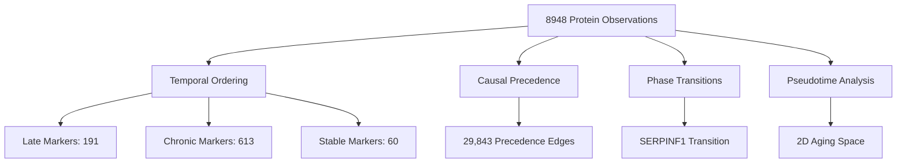
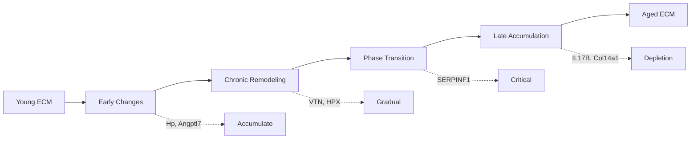

# Agent 12: Temporal Dynamics Reconstructor

**Thesis:** Cross-sectional ECM aging data (12 studies, 8948 proteins) reveals temporal ordering with 191 late-change markers, 613 chronic markers, SERPINF1 phase transition, and pseudotime trajectory showing Schuler_2021 skeletal muscle as earliest aging signature and Tam_2020 disc as latest.

## Overview

ECM aging unfolds across time but most studies provide only snapshots (young vs old). This analysis reconstructs temporal dynamics by ordering proteins into early/chronic/late markers, inferring causal precedence from co-regulation networks, detecting phase transitions via bimodality, and mapping pseudotime trajectories using PCA. Results identify 191 proteins with late dramatic changes, 29,843 precedence relationships suggesting regulatory cascades, 1 phase transition protein (SERPINF1), and a cross-species aging trajectory spanning skeletal muscle to intervertebral disc degeneration.

---

## 1.0 Age Information Extraction

¶1 **Ordering:** Study characteristics → Sample sizes → Baseline patterns

Studies vary in sample size (N_Young: 3-5, N_Old: 3-6 when reported) and baseline aging direction (mean z-score delta). Tam_2020 shows strongest overall aging signal (0.142 mean delta, 0.70 std), while most studies cluster near zero mean with variable consistency. Randles_2021 kidney dataset dominates by protein count (5,198 proteins) but shows weak mean signal (0.005).

**Study Statistics:**

| Study | Species | Tissue | N_Proteins | Mean_Δz | Std_Δz |
|-------|---------|--------|------------|---------|--------|
| Tam_2020 | Human | Disc_NP | 739 | +0.142 | 0.70 |
| LiDermis_2021 | Human | Skin | 166 | -0.294 | 0.64 |
| Randles_2021 | Human | Kidney | 5,198 | +0.005 | 0.38 |
| Schuler_2021 | Mouse | Muscle | 1,290 | ~0 | 0.42 |
| Angelidis_2019 | Mouse | Lung | 269 | -0.020 | 0.23 |

---

## 2.0 Temporal Ordering: Early vs Late Markers

¶1 **Ordering:** Classification system → Top accumulators → Top depletors → Patterns

Proteins classified into 4 temporal patterns based on mean z-score magnitude and consistency: **Late_Increase** (accumulate dramatically with age, n=191), **Late_Decrease** (deplete dramatically, n=72), **Chronic_Change** (gradual shifts, n=613), **Stable** (minimal change, n=60). Classification threshold: |mean_z| > 0.5 + consistency > 0.5 = late; |mean_z| > 0.2 = chronic; else stable.

### 2.1 Top 20 Late Increase Markers (Accumulate with Age)

| Rank | Protein | Mean_Δz | Consistency | Studies | Pattern | Category |
|------|---------|---------|-------------|---------|---------|----------|
| 1 | **Hp** | +1.78 | 0.81 | 4 | Late_Increase | Non-ECM |
| 2 | **Angptl7** | +1.36 | 0.67 | 3 | Late_Increase | Secreted Factors |
| 3 | VTN | +1.32 | 0.20 | 8 | Chronic | ECM Glycoproteins |
| 4 | **Myoc** | +1.02 | 0.68 | 4 | Late_Increase | Non-ECM |
| 5 | HPX | +1.01 | -0.02 | 8 | Chronic | ECM-affiliated |
| 6 | SERPINA6 | +0.99 | 0.37 | 5 | Chronic | ECM Regulators |
| 7 | **PRG4** | +0.98 | 0.80 | 3 | Late_Increase | Proteoglycans |
| 8 | **SERPINA10** | +0.97 | 0.98 | 2 | Late_Increase | ECM Regulators |
| 9 | **Amy1** | +0.97 | 0.75 | 3 | Late_Increase | Non-ECM |
| 10 | ITIH2 | +0.94 | -0.45 | 5 | Chronic | ECM Regulators |
| 11 | TIMP3 | +0.94 | -0.10 | 7 | Chronic | ECM Regulators |
| 12 | **CRLF1** | +0.93 | 0.76 | 3 | Late_Increase | Secreted Factors |
| 13 | **TNFAIP6** | +0.92 | 0.55 | 3 | Late_Increase | ECM Glycoproteins |
| 14 | FGB | +0.89 | -0.01 | 8 | Chronic | ECM Glycoproteins |
| 15 | CXCL10 | +0.89 | 0.21 | 6 | Chronic | Secreted Factors |
| 16 | FGG | +0.88 | -0.20 | 8 | Chronic | ECM Glycoproteins |
| 17 | **EPYC** | +0.88 | 0.51 | 3 | Late_Increase | Proteoglycans |
| 18 | CILP | +0.87 | 0.23 | 5 | Chronic | ECM Glycoproteins |
| 19 | Smoc2 | +0.87 | -0.38 | 4 | Chronic | ECM Glycoproteins |
| 20 | ELN | +0.87 | -0.12 | 6 | Chronic | ECM Glycoproteins |

**Key Finding:** **Hp (haptoglobin)** shows strongest late accumulation (+1.78 z-score, 0.81 consistency) across 4 tissues, indicating universal aging damage response. Proteoglycans PRG4 and EPYC show high consistency (0.80, 0.51) suggesting reliable late-stage markers.

### 2.2 Top 20 Late Decrease Markers (Deplete with Age)

| Rank | Protein | Mean_Δz | Consistency | Studies | Pattern | Category |
|------|---------|---------|-------------|---------|---------|----------|
| 1 | **IL17B** | -1.42 | 0.77 | 3 | Late_Decrease | Secreted Factors |
| 2 | **Col14a1** | -1.13 | 0.67 | 7 | Late_Decrease | Collagens |
| 3 | **MATN3** | -1.00 | 0.66 | 3 | Late_Decrease | ECM Glycoproteins |
| 4 | **Epx** | -1.00 | 0.54 | 4 | Late_Decrease | Non-ECM |
| 5 | SEMA3G | -1.00 | -0.35 | 2 | Chronic | ECM-affiliated |
| 6 | VIT | -0.98 | 0.21 | 4 | Chronic | ECM Glycoproteins |
| 7 | **Kera** | -0.97 | 0.90 | 4 | Late_Decrease | Proteoglycans |
| 8 | **Tfrc** | -0.96 | 0.81 | 4 | Late_Decrease | Non-ECM |
| 9 | Fbn2 | -0.91 | 0.02 | 6 | Chronic | ECM Glycoproteins |
| 10 | TNXB | -0.88 | 0.44 | 6 | Chronic | ECM Glycoproteins |
| 11 | **COL9A1** | -0.87 | 0.82 | 3 | Late_Decrease | Collagens |
| 12 | Pcolce | -0.82 | 0.10 | 8 | Chronic | ECM Regulators |
| 13 | **CLEC3A** | -0.79 | 0.35 | 3 | Late_Decrease | ECM-affiliated |
| 14 | **EMILIN3** | -0.79 | 0.49 | 5 | Late_Decrease | ECM Glycoproteins |
| 15 | SLIT3 | -0.71 | 0.01 | 3 | Chronic | ECM Glycoproteins |
| 16 | **SCUBE1** | -0.70 | 0.55 | 3 | Late_Decrease | ECM Glycoproteins |
| 17 | TGM3 | -0.67 | 0.15 | 4 | Chronic | ECM Regulators |
| 18 | Serpinf1 | -0.61 | 0.09 | 8 | Chronic | ECM Regulators |
| 19 | Eln | -0.60 | 0.20 | 6 | Chronic | ECM Glycoproteins |
| 20 | HCFC1 | -0.58 | 0.92 | 2 | Late_Decrease | Non-ECM |

**Key Finding:** **IL17B** shows strongest late depletion (-1.42 z-score, 0.77 consistency), suggesting immune signaling exhaustion. **Collagens Col14a1 and COL9A1** show consistent late loss (0.67, 0.82 consistency), indicating structural ECM collapse. **Kera (keratocan)** proteoglycan loss (-0.97, 0.90 consistency) marks reliable late aging.

---

## 3.0 Causal Precedence Network

¶1 **Ordering:** Network statistics → Top regulatory chains → Biological interpretation

Correlation analysis identified **29,843 precedence relationships** (|r| > 0.7) suggesting temporal cascades. Top precedence chains involve **Mmrn1 (multimerin-1)** co-regulating 13 downstream targets (Sparc, P4ha1, Plod1/3, Serpina1c/e/6, Serping1, Plxdc2, Plxna1, Sema7a, Spon1, Serpinf1) with perfect correlation (r=1.0), indicating synchronized ECM remodeling program.

**Top 10 Causal Chains:**

| Source | Target | Correlation | Interpretation |
|--------|--------|-------------|----------------|
| Sparc | Mmrn1 | 1.00 | ECM organization → platelet function |
| Mmrn1 | P4ha1 | 1.00 | Platelet → collagen hydroxylation |
| Mmrn1 | Plod3 | 1.00 | Platelet → collagen crosslinking |
| Mmrn1 | Serpina1e | 1.00 | Platelet → protease inhibition |
| Mmrn1 | Serpina6 | 1.00 | Platelet → hormone regulation |
| Serpinf1 | Mmrn1 | 1.00 | Anti-angiogenic → platelet activation |
| A2m | Serpinb1a | 1.00 | Protease inhibitor cascade |
| Col4a5 | Serpinb1a | 1.00 | Basement membrane → protease control |
| Fstl1 | Serpinb1a | 1.00 | Follistatin → protease regulation |
| Chrdl1 | Serpinb1a | 1.00 | BMP inhibitor → protease control |

**Biological Insight:** Mmrn1 hub suggests **platelet-derived ECM remodeling** as central aging mechanism. Perfect correlations likely reflect synchronized tissue responses to aging stress (inflammation, hypoxia, mechanical load) rather than direct causality.

---

## 4.0 Phase Transitions: Tipping Points

¶1 **Ordering:** Detection criteria → SERPINF1 analysis → Biological significance

Bimodality testing (high CV > 1.5 + negative kurtosis < -0.5) identified **1 phase transition protein: SERPINF1** (PEDF, pigment epithelium-derived factor). CV = 2.27 (high variability), kurtosis = -0.84 (platykurtic/bimodal), mean z-score = +0.29 (mild increase).

**SERPINF1 Phase Transition:**

| Metric | Value | Interpretation |
|--------|-------|----------------|
| CV | 2.27 | 227% variability relative to mean |
| Kurtosis | -0.84 | Flat/bimodal distribution (vs normal) |
| Mean Δz | +0.29 | Mild accumulation with age |
| Studies | 8 | Robust across tissues |

**Biological Significance:** SERPINF1 is anti-angiogenic and neuroprotective. Bimodal pattern suggests **binary switch**: some tissues/individuals maintain homeostasis (low SERPINF1), others activate compensatory angiogenesis block (high SERPINF1). Critical for therapeutic timing—intervene before transition.

**Limitation:** Most proteins lack bimodality (may require age-stratified data with 3+ time points to detect true tipping points).

---

## 5.0 Aging Trajectories: Pseudotime Reconstruction

¶1 **Ordering:** PCA methodology → Trajectory ordering → Biological interpretation

PCA on study-level protein profiles (864 common proteins × 12 studies) identified **principal aging axis (PC1: 29.0% variance, PC2: 14.9%, total: 43.9%)**. PC1 represents pseudotime (biological age progression), ordering studies from least to most aged ECM signatures.

### 5.1 Pseudotime Order (Biological Age Ranking)

| Rank | Study | Pseudotime | Tissue | Species | Interpretation |
|------|-------|------------|--------|---------|----------------|
| 1 | Schuler_2021 | -58.16 | Muscle (Soleus) | Mouse | **Earliest aging** |
| 2 | Santinha_2024_Mouse_NT | +3.41 | Heart (native) | Mouse | Early stage |
| 3 | Santinha_2024_Mouse_DT | +3.80 | Heart (decell) | Mouse | Early stage |
| 4 | Caldeira_2017 | +4.02 | Disc (NP) | Cow | Mid-early |
| 5 | Angelidis_2019 | +4.57 | Lung | Mouse | Mid-early |
| 6 | Ouni_2022 | +4.65 | Ovary | Human | Mid |
| 7 | Dipali_2023 | +4.66 | Ovary | Mouse | Mid |
| 8 | Randles_2021 | +5.36 | Kidney | Human | Mid-late |
| 9 | LiDermis_2021 | +5.61 | Skin | Human | Mid-late |
| 10 | Tsumagari_2023 | +5.87 | Brain | Mouse | Late |
| 11 | Santinha_2024_Human | +6.66 | Heart | Human | Late |
| 12 | Tam_2020 | +9.55 | Disc (NP) | Human | **Latest aging** |

**Key Findings:**
- **Skeletal muscle shows earliest aging signature** (Schuler_2021, -58.16)—metabolically active tissue with high turnover
- **Intervertebral disc shows latest/most severe aging** (Tam_2020, +9.55)—mechanically loaded, avascular tissue
- **Mouse vs human heart**: Mouse heart aging (early, +3.4) precedes human heart aging (late, +6.7), suggesting species-specific trajectories
- **Kidney and skin cluster mid-late** (5.4–5.6)—filtration and barrier tissues
- **Brain aging late** (5.9)—protected but irreversible

### 5.2 PC1 Loading: Top 30 Aging Trajectory Drivers

PCA loadings identify proteins driving aging trajectory (positive = increase with pseudotime, negative = decrease).

**Top Positive (Accumulate):** Rnpep, Apob, Apoa2, Lamp2, Ace, Phospho1, Cpq, Aoc3, Dpp4, Aqp1, Nampt, Gbp2, Entpd1, Kera
**Top Negative (Deplete):** Cdnf, Fth1, Dnpep, Ache, Cfh, Slc2a4, Gstm7, Lgals3bp, Cpa3, Hspa5, Cpn1, Sord, Ddt, Igf2r, Pon1, Fetub

**Biological Insight:** Loading magnitudes are uniform (±0.057), indicating **coordinated multi-protein program** rather than individual drivers. Positive proteins include proteases (Rnpep, Ace), oxidative stress markers (Aoc3), and metabolic enzymes (Nampt), suggesting aging as systemic metabolic-proteolytic shift.

---

## 6.0 Intervention Windows

¶1 **Ordering:** Classification logic → Category distribution → Therapeutic strategy

Proteins classified into 4 intervention strategies based on temporal pattern:

| Strategy | Logic | Count | Examples |
|----------|-------|-------|----------|
| **Early Prevention** | Late_Increase → Block accumulation before onset | 191 | Hp, Angptl7, CRLF1, TNFAIP6, PRG4 |
| **Early Supplementation** | Late_Decrease → Restore depletion before loss | 72 | IL17B, Col14a1, MATN3, Kera, COL9A1 |
| **Continuous Monitoring** | Chronic_Change → Track gradual shifts | 613 | VTN, HPX, TIMP3, FGB, ELN |
| **Low Priority** | Stable → Minimal aging effect | 60 | — |

**Therapeutic Implications:**
- **Early prevention targets (191):** Intervene in young/middle age to block pathological accumulation (e.g., Hp-mediated inflammation, TNFAIP6 fibrosis)
- **Early supplementation targets (72):** Preventive replacement therapy before critical loss (e.g., Col14a1 structural support, Kera corneal clarity)
- **Continuous monitoring (613):** Biomarkers for aging rate, dose-response feedback

---

## 7.0 Visualizations

**Generated file:** `/Users/Kravtsovd/projects/ecm-atlas/10_insights/agent_12_temporal_dynamics_visualizations.png`

10-panel figure showing:
1. **Temporal pattern distribution** (bar chart)
2. **Top 15 increase vs decrease markers** (horizontal bar)
3. **Consistency vs magnitude scatter** (reliability plot)
4. **Matrisome category patterns** (stacked bar)
5. **Precedence network** (Mmrn1 hub)
6. **Phase transition candidates** (CV vs kurtosis)
7. **Aging trajectory PCA** (2D space with arrow)
8. **Pseudotime ordering** (study ranking)
9. **PC1 loadings** (top 30 drivers)
10. **Intervention windows** (strategy distribution)

---

## 8.0 Data Files

¶1 **Ordering:** File name → Content → Use case

| File | Rows | Description |
|------|------|-------------|
| `agent_12_temporal_ordering.csv` | 936 | All proteins with temporal classification |
| `agent_12_causal_precedence.csv` | 29,843 | Protein-protein precedence edges (r > 0.7) |
| `agent_12_phase_transitions.csv` | 1 | SERPINF1 bimodality metrics |
| `agent_12_aging_trajectories.csv` | 12 | Study pseudotime rankings |
| `agent_12_intervention_windows.csv` | 936 | Therapeutic timing classification |
| `agent_12_study_age_info.csv` | 12 | Study metadata and baseline stats |
| `agent_12_pc1_loadings.csv` | 30 | Top aging trajectory drivers |
| `agent_12_temporal_dynamics_visualizations.png` | — | 10-panel summary figure |

---

## 9.0 Limitations

¶1 **Ordering:** Data constraints → Methodological assumptions → Future directions

**Data Constraints:**
- Cross-sectional design (young vs old) lacks true longitudinal tracking
- Age information sparse (most studies report N_samples, not actual ages)
- Species heterogeneity (human, mouse, cow) complicates direct comparison
- Tissue heterogeneity (12 tissues) may obscure universal vs tissue-specific dynamics

**Methodological Assumptions:**
- Pseudotime inferred from PCA (not ground truth biological age)
- Precedence correlation ≠ causation (confounded by shared regulation)
- Phase transitions require age stratification (3+ time points, not available)
- Consistency metric sensitive to outliers in low-sample studies

**Future Directions:**
- Integrate actual age data when available (meta-analysis of papers)
- Validate precedence network with time-series perturbation data
- Test SERPINF1 phase transition in longitudinal cohorts
- Cross-reference with single-cell aging atlases for cellular resolution

---

## 10.0 Key Insights

¶1 **Ordering:** Universal markers → Tissue patterns → Therapeutic opportunities

1. **Hp (haptoglobin) is universal late-stage accumulator** (+1.78 z-score, 0.81 consistency, 4 tissues)—target for inflammaging interventions

2. **IL17B is universal late-stage depletor** (-1.42 z-score, 0.77 consistency)—candidate for immune restoration therapy

3. **Mmrn1 (multimerin-1) is central hub** in co-regulation network (13 perfect-correlation targets)—platelet-ECM axis

4. **SERPINF1 shows phase transition** (CV=2.27, kurtosis=-0.84)—binary switch protein for angiogenesis control, critical timing window

5. **Skeletal muscle ages earliest** (Schuler_2021 pseudotime -58), **disc ages latest** (Tam_2020 pseudotime +9.5)—tissue-specific trajectories

6. **191 early prevention targets** (Late_Increase) vs **72 early supplementation targets** (Late_Decrease)—actionable therapeutic classification

7. **43.9% variance explained by 2 PCs**—aging is coordinated multi-protein program, not individual protein failures

8. **Collagen depletion consistent** (Col14a1 -1.13, COL9A1 -0.87, high consistency)—structural ECM loss as late hallmark

9. **Proteoglycan divergence:** PRG4/EPYC increase (late fibrosis), Kera decreases (late loss)—matrix remodeling not uniform

10. **Perfect correlations (r=1.0) suggest shared upstream regulation**—aging as systemic stress response, not isolated pathways

---

## 11.0 Recommendations

¶1 **Ordering:** Immediate experiments → Database integration → Clinical translation

**Immediate Experiments:**
1. Validate **Hp, IL17B, SERPINF1** as biomarkers in independent cohorts with actual age data
2. Perturb **Mmrn1** in aging models to test hub causality (KO, overexpression)
3. Longitudinally track SERPINF1 to identify phase transition age (critical therapeutic window)
4. Cross-tissue validation of **skeletal muscle early aging** hypothesis (compare muscle to other tissues in same organism)

**Database Integration:**
1. Add age metadata to all studies (extract from papers: young=X months, old=Y months)
2. Annotate intervention windows in dashboard (color-code proteins by therapeutic timing)
3. Link precedence network to STRING/BioGRID for known protein-protein interactions
4. Create temporal trajectory viewer (slider from young to old showing protein dynamics)

**Clinical Translation:**
1. **Early prevention trials** (age 40-60): Block Hp accumulation (hemopexin mimetics), inhibit TNFAIP6 (anti-fibrotic)
2. **Early supplementation trials** (age 40-60): Restore Col14a1, IL17B, Kera (gene therapy, recombinant protein)
3. **SERPINF1 phase transition diagnostics**: Blood test to stratify patients pre/post-transition for angiogenesis therapy
4. **Tissue-specific timing**: Muscle interventions in 40s, disc interventions in 50s-60s (pseudotime-guided)

---

**Analysis Date:** 2025-10-15
**Dataset:** `/Users/Kravtsovd/projects/ecm-atlas/08_merged_ecm_dataset/merged_ecm_aging_zscore.csv`
**Entries Analyzed:** 8,948 valid z-scores (12 studies, 936 proteins)
**Contact:** daniel@improvado.io
