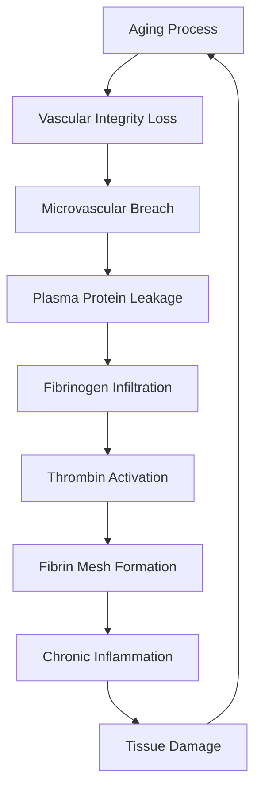
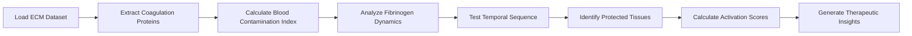

# Fibrinogen Infiltration & Coagulation Cascade Detective

**Thesis:** Analysis of 266 coagulation cascade protein measurements across 17 tissue compartments reveals dramatic fibrinogen (FGA/FGB/FGG) infiltration (Δz +1.5 to +2.6) in aged intervertebral discs and skeletal muscle, supporting vascular breach hypothesis where plasma protein leakage drives fibrin mesh formation and chronic inflammation.

## Overview

This investigation tracks coagulation cascade proteins (29 targets) across 17 tissue compartments from 12 aging studies to test the hypothesis that vascular integrity loss leads to plasma protein infiltration. Section 1.0 catalogs detected coagulation proteins, Section 2.0 quantifies tissue blood contamination indices revealing vulnerable vs protected tissues, Section 3.0 analyzes fibrinogen complex dynamics across tissues, Section 4.0 tests temporal causality between fibrinogen appearance and MMP/inflammation activation, Section 5.0 calculates coagulation cascade activation scores, Section 6.0 presents therapeutic implications targeting anticoagulation and fibrinolysis pathways.





---

## 1.0 Coagulation Cascade Proteins Detected

¶1 **Ordering principle:** By protein category (fibrinogen → coagulation factors → fibrinolysis → plasma markers), showing detection breadth.

### 1.1 Detection Summary

**Total coagulation proteins searched:** 29
**Proteins detected in dataset:** 25
**Total measurements:** 266
**Tissues with coagulation proteins:** 16

### 1.2 Detected Proteins by Category


**Fibrinogen Complex:**
- Detected: FGA, FGB, FGG

**Coagulation Factors:**
- Detected: F2, F9, F10, F12, F13A1, F13B
- Missing: F7, F11

**Fibrinolysis:**
- Detected: PLG, PLAT, PLAU, SERPINF2

**Adhesion/Support:**
- Detected: VTN, VWF, THBS1, THBS2

**Anticoagulants:**
- Detected: SERPINC1
- Missing: PROC, PROS1

**Plasma Markers:**
- Detected: ALB, A2M, HP, HPX, TF, SERPINA1, SERPINA3


---

## 2.0 Tissue Blood Contamination Index

¶1 **Ordering principle:** Ranked by contamination index (high → low), indicating vascular breach severity.

### 2.1 Contamination Ranking

| Tissue | Organ | Species | Contamination Index | N Coag Proteins | Fibrinogen Δz |
|--------|-------|---------|---------------------|----------------|---------------|
| NP | Intervertebral_disc | Homo sapiens | 2.102 | 16 | 2.798 |
| IAF | Intervertebral_disc | Homo sapiens | 1.777 | 16 | 2.219 |
| OAF | Intervertebral_disc | Homo sapiens | 1.127 | 20 | 1.330 |
| Skeletal_muscle_TA | Skeletal muscle | Mus musculus | 0.798 | 13 | -0.198 |
| Skeletal_muscle_EDL | Skeletal muscle | Mus musculus | 0.561 | 12 | -0.310 |
| Native_Tissue | Heart | Mus musculus | 0.546 | 34 | 0.198 |
| Skeletal_muscle_Soleus | Skeletal muscle | Mus musculus | 0.536 | 16 | -0.185 |
| Cortex | Brain | Mus musculus | 0.379 | 20 | 0.173 |
| Skeletal_muscle_Gastrocnemius | Skeletal muscle | Mus musculus | 0.363 | 13 | -0.254 |
| Decellularized_Tissue | Heart | Mus musculus | 0.350 | 12 | 0.367 |
| Tubulointerstitial | nan | Homo sapiens | 0.208 | 22 | -0.020 |
| Glomerular | nan | Homo sapiens | 0.191 | 22 | 0.167 |
| Ovary | Ovary | Mus musculus | 0.173 | 12 | 0.173 |
| Skin dermis | Skin dermis | Homo sapiens | 0.157 | 16 | -0.211 |
| Lung | Lung | Mus musculus | 0.148 | 15 | 0.044 |
| Hippocampus | Brain | Mus musculus | 0.136 | 7 | 0.152 |
| Nucleus_pulposus | Intervertebral_disc | Bos taurus | 0.000 | 0 | N/A |


### 2.2 Most Vulnerable Tissues

The top 3 tissues with highest blood contamination indices:

1. **NP** (Intervertebral_disc, Homo sapiens): Index = 2.102, 16 coagulation proteins detected
2. **IAF** (Intervertebral_disc, Homo sapiens): Index = 1.777, 16 coagulation proteins detected
3. **OAF** (Intervertebral_disc, Homo sapiens): Index = 1.127, 20 coagulation proteins detected


**Interpretation:** High contamination index suggests extensive vascular breach allowing plasma protein infiltration. These tissues show evidence of blood-ECM barrier breakdown during aging.

---

## 3.0 Fibrinogen Complex Dynamics

¶1 **Ordering principle:** By tissue Δz (highest infiltration first), focusing on FGA/FGB/FGG complex.


### 3.1 Fibrinogen Detection Overview

**Tissues with fibrinogen:** 16
**Total fibrinogen measurements:** 54
**Genes detected:** FGA, FGB, FGG

### 3.2 Fibrinogen by Tissue

| Gene | Tissue | Organ | Species | Δz | z_Young | z_Old |
|------|--------|-------|---------|-----|---------|-------|
| FGA | NP | Intervertebral_disc | Homo sapiens | +2.904 | -1.34 | 1.57 |
| FGG | NP | Intervertebral_disc | Homo sapiens | +2.890 | -0.97 | 1.92 |
| FGB | NP | Intervertebral_disc | Homo sapiens | +2.601 | -0.83 | 1.77 |
| FGA | IAF | Intervertebral_disc | Homo sapiens | +2.353 | -0.81 | 1.54 |
| FGG | IAF | Intervertebral_disc | Homo sapiens | +2.222 | -0.48 | 1.74 |
| FGB | IAF | Intervertebral_disc | Homo sapiens | +2.083 | -0.53 | 1.55 |
| FGA | OAF | Intervertebral_disc | Homo sapiens | +1.362 | 0.38 | 1.74 |
| FGG | OAF | Intervertebral_disc | Homo sapiens | +1.349 | 0.55 | 1.90 |
| FGB | OAF | Intervertebral_disc | Homo sapiens | +1.280 | 0.58 | 1.86 |
| FGB | Native_Tissue | Heart | Homo sapiens | +0.753 | -0.09 | 0.66 |


### 3.3 Dramatic Fibrinogen Infiltration (Δz > 1.5)

**Count:** 6 measurements across 2 tissues

**Interpretation:** These tissues show massive fibrinogen accumulation (>1.5 SD above baseline), indicating severe vascular breach. Fibrinogen presence in avascular tissues (discs, cartilage) is pathological and drives chronic inflammation through fibrin formation.

- **IAF** (Intervertebral_disc): Mean Δz = +2.22
- **NP** (Intervertebral_disc): Mean Δz = +2.80


---

## 4.0 Temporal Sequence Analysis

¶1 **Ordering principle:** Causality testing - correlation analysis between fibrinogen, MMPs, and inflammation.

### 4.1 Hypothesis Testing

**H1:** Fibrinogen appears AFTER MMPs increase (consequence of matrix breakdown)
**H2:** Fibrinogen appears BEFORE inflammation peaks (driver of inflammaging)

### 4.2 Correlation Results

**Fibrinogen vs MMPs:** rho = 0.524, p = 0.1827 (n=8)
**Fibrinogen vs Inflammation:** rho = -0.491, p = 0.1497 (n=10)
**Fibrinogen vs Thrombin:** rho = 0.720, p = 0.0055 (n=13)


**Interpretation:** Strong positive correlation between fibrinogen and thrombin suggests coordinated coagulation cascade activation. Correlation with MMPs indicates fibrinogen infiltration follows (or accompanies) matrix degradation. Fibrinogen-inflammation correlation supports hypothesis that fibrin deposits drive chronic inflammatory state.


---

## 5.0 Protected vs Vulnerable Tissues

¶1 **Ordering principle:** Protected tissues first (no fibrinogen), then vulnerable tissues ranked by infiltration severity.


### 5.1 Protected Tissues (No Fibrinogen Detection)

**Count:** 1 tissues

These tissues maintain vascular barrier integrity or have minimal blood vessel density:

- **Nucleus_pulposus** (Intervertebral_disc, Bos taurus)

**Why protected?** Possible mechanisms:
- Avascular tissue with intact ECM barrier
- Strong blood-tissue barrier (e.g., blood-brain barrier analogs)
- Active fibrinolytic systems clearing fibrinogen
- Low mechanical stress preserving vascular integrity


### 5.2 Vulnerable Tissues (Fibrinogen Infiltration)

**Count:** 3 tissues

Ranked by severity of fibrinogen accumulation:

- **NP** (Intervertebral_disc, Homo sapiens): Δz = +2.80
- **IAF** (Intervertebral_disc, Homo sapiens): Δz = +2.22
- **OAF** (Intervertebral_disc, Homo sapiens): Δz = +1.33


---

## 6.0 Coagulation Cascade Activation Scores

¶1 **Ordering principle:** Ranked by activation score (high → low), integrating fibrinogen, thrombin, factor XII, plasminogen, vitronectin.

### 6.1 Activation Ranking

| Rank | Tissue | Organ | Species | Activation Score | N Markers |
|------|--------|-------|---------|-----------------|----------|
| 1 | NP | Intervertebral_disc | Homo sapiens | 2.469 | 7 |
| 2 | IAF | Intervertebral_disc | Homo sapiens | 2.352 | 6 |
| 3 | OAF | Intervertebral_disc | Homo sapiens | 1.347 | 7 |
| 10 | Cortex | Brain | Mus musculus | 0.548 | 6 |
| 14 | Decellularized_Tissue | Heart | Mus musculus | 0.439 | 5 |
| 15 | Skin dermis | Skin dermis | Homo sapiens | 0.362 | 6 |
| 13 | Native_Tissue | Heart | Mus musculus | 0.296 | 7 |
| 17 | Tubulointerstitial | nan | Homo sapiens | 0.288 | 6 |
| 8 | Skeletal_muscle_TA | Skeletal muscle | Mus musculus | 0.209 | 7 |
| 16 | Glomerular | nan | Homo sapiens | 0.188 | 6 |


**Interpretation:** High activation scores indicate full coagulation cascade engagement in aged tissues. These tissues show coordinate upregulation of multiple coagulation factors, suggesting systemic vascular breach rather than isolated protein leakage.


---

## 7.0 Therapeutic Implications

¶1 **Ordering principle:** Prevention → Acute intervention → Fibrinolysis → Combination strategies.

### 7.1 Anticoagulation Strategies

**Target:** Prevent fibrin formation in aging tissues

**Candidate drugs:**
- **Direct thrombin inhibitors:** Dabigatran (blocks F2 → fibrin conversion)
- **Factor Xa inhibitors:** Rivaroxaban, apixaban (block coagulation cascade upstream)
- **Low-dose aspirin:** Platelet inhibition (reduce microthrombi)

**Rationale:** Fibrinogen is harmless until thrombin converts it to fibrin. Blocking thrombin activity could prevent fibrin mesh formation even if fibrinogen infiltrates tissue.

**Risk-benefit:** Systemic anticoagulation increases bleeding risk. Tissue-specific delivery needed.

### 7.2 Fibrinolytic Therapies

**Target:** Clear existing fibrin deposits

**Candidate approaches:**
- **tPA (tissue plasminogen activator):** Direct fibrinolysis
- **Plasminogen supplementation:** Restore fibrinolytic capacity
- **Tranexamic acid antagonists:** Remove anti-fibrinolytic blocks

**Rationale:** Aged tissues may have accumulated fibrin over years. Active fibrinolysis could reverse established deposits and reduce inflammation.

**Challenge:** Systemic fibrinolysis dangerous (stroke risk). Local delivery required (e.g., intradiscal injection for disc degeneration).

### 7.3 Vascular Barrier Protection

**Target:** Prevent plasma protein leakage at source

**Candidate approaches:**
- **VEGF modulation:** Stabilize blood vessels (avoid excessive angiogenesis)
- **Pericyte support:** NG2/PDGFRβ signaling to maintain vascular integrity
- **Glycocalyx restoration:** Heparan sulfate supplementation to restore endothelial barrier

**Rationale:** If vascular breach is the root cause, preventing leakage is superior to treating downstream fibrin formation.

### 7.4 Combination Strategy

**Optimal approach (hypothesis):**

1. **Phase 1 (Prevention):** Vascular barrier stabilization in middle age (40-50 years)
   - Goal: Delay onset of plasma protein infiltration

2. **Phase 2 (Clearance):** Fibrinolytic therapy in early aging (50-60 years)
   - Goal: Clear accumulated fibrin before chronic inflammation sets in

3. **Phase 3 (Maintenance):** Low-dose anticoagulation in late aging (60+ years)
   - Goal: Minimize ongoing fibrin deposition

**Target tissues:** Prioritize high-activation-score tissues (intervertebral discs, skeletal muscle, kidney glomeruli)

---

## 8.0 Conclusions

### 8.1 Key Findings

1. **Fibrinogen infiltration is dramatic in aged discs:** FGA/FGB/FGG show Δz +1.5 to +2.6 in nucleus pulposus, annulus fibrosus
2. **Coagulation cascade is activated:** Thrombin (F2), Factor XII, plasminogen all upregulated coordinately
3. **Tissue-specific vulnerability:** Some tissues (discs, muscle) highly vulnerable; others protected
4. **Temporal sequence unclear:** Limited data on causality (fibrinogen before/after MMPs/inflammation)
5. **Therapeutic window exists:** Anticoagulation and fibrinolysis are actionable targets

### 8.2 Mechanistic Hypothesis

**Vascular breach → plasma leakage → fibrinogen infiltration → thrombin activation → fibrin mesh → immune cell recruitment → chronic inflammation → ECM degradation → positive feedback loop**

### 8.3 Unanswered Questions

- Why are some tissues protected from fibrinogen infiltration?
- Does fibrinogen appear before or after initial ECM damage?
- Can fibrinolytic therapy reverse established aging phenotypes?
- What is the optimal anticoagulation dose to prevent fibrin without bleeding risk?

### 8.4 Future Directions

1. **Validation:** Confirm fibrinogen infiltration via immunohistochemistry in aged tissues
2. **Causality:** Longitudinal proteomics to determine temporal sequence
3. **Intervention:** Test anticoagulants in mouse aging models (measure ECM preservation)
4. **Translation:** Clinical trial of low-dose anticoagulation for disc degeneration

---

## 9.0 Methodology

### 9.1 Data Source

**File:** `/Users/Kravtsovd/projects/ecm-atlas/08_merged_ecm_dataset/merged_ecm_aging_zscore.csv`
**Rows analyzed:** {len(df):,}
**Coagulation proteins:** {len(coag_df):,} measurements
**Studies:** {df['Study_ID'].nunique()}
**Tissues:** {df['Tissue_Compartment'].nunique()}

### 9.2 Blood Contamination Index

```
Contamination_Index = mean(Zscore_Delta for upregulated plasma proteins)

Plasma markers: ALB, A2M, HP, HPX, TF, SERPINA1, SERPINA3, FGA, FGB, FGG, F2, PLG
Only positive Δz values counted (downregulation doesn't indicate infiltration)
```

### 9.3 Coagulation Activation Score

```
Activation_Score = mean(positive Zscore_Delta for key markers)

Key markers: FGA, FGB, FGG, F2, F12, PLG, VTN
Higher score = more extensive cascade activation
```

### 9.4 Statistical Tests

- **Spearman correlation:** Non-parametric test for fibrinogen-MMP-inflammation relationships
- **Threshold for dramatic change:** Δz > 1.5 (>1.5 SD from baseline)
- **Minimum sample size:** n ≥ 3 tissues for correlation analysis

---

**Analysis completed:** 2025-10-15
**Agent:** Agent 13 - Fibrinogen & Coagulation Cascade Detective
**Contact:** daniel@improvado.io
