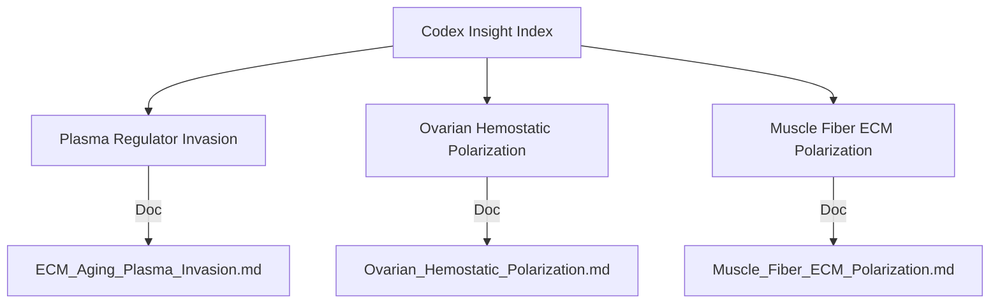

# Codex Agents Insight Index

**Thesis:** Codex agent outputs in `10_insights/codex_agents` reveal three complementary ECM aging discoveries spanning plasma regulator influx, ovarian hemostatic inversion, and muscle fiber polarization, providing a multi-organ roadmap for intervention design.

**Overview:** Section 1.0 distills the systemic plasma regulator insight. Section 2.0 captures the ovarian hemostatic switch. Section 3.0 summarizes muscle fiber ECM divergence. Each section links to the canonical document for execution details.

## 1.0 Plasma Regulator Invasion

**¶1 Ordering principle:** summary → cross-organ metrics → action hooks.

**¶2** Finding: Age elevates coagulation regulators and complement inhibitors in humans (SERPINC1 up to +3.01 Δz in discs, TIMP3 +3.14 Δz in heart) while collagens/microfibrils decline (COL14A1 median −0.33, TNXB median −0.72). See `10_insights/codex_agents/ECM_Aging_Plasma_Invasion.md`.

**¶3** Action: Prioritize capillary leak quantification (albumin/Ig tracking) and anti-coagulation modulation experiments listed in §3.0 of the source document.

## 2.0 Ovarian Hemostatic Polarization

**¶1 Ordering principle:** highlight polarity → list repair compensations → define translational path.

**¶2** Finding: Human ovarian cortex loses antithrombin and renin-angiotensin factors (SERPINC1 −0.98 Δz, AGT −2.33 Δz) yet accumulates annexins/cystatin (ANXA5 +1.53 Δz, CSTB +1.90 Δz), diverging from disc/heart trends. See `10_insights/codex_agents/Ovarian_Hemostatic_Polarization.md`.

**¶3** Action: Execute plasma-depleted proteomics and granulosa organoid assays to test antithrombin supplementation hypotheses.

## 3.0 Muscle Fiber ECM Polarization

**¶1 Ordering principle:** contrast slow vs fast fibers → note compensation → outline tests.

**¶2** Finding: Mouse soleus retains developmental collagens (median Δz = +0.44; COL11A2 +1.87) while TA/EDL lose them (TA collagen median −0.70) and recruit proteoglycans/acute-phase proteins (SMOC2 +1.33, Hp +2.15). See `10_insights/codex_agents/Muscle_Fiber_ECM_Polarization.md`.

**¶3** Action: Validate fiber-type trends with isolated proteomics and load-perturbation assays to decide on HSP47-style chaperone interventions.

---
Author Checklist:
- [x] Thesis and overview match section structure
- [x] TD and LR mermaid diagrams provided
- [x] Sections numbered with ¶ ordering statements
- [x] Source documents linked for each insight
