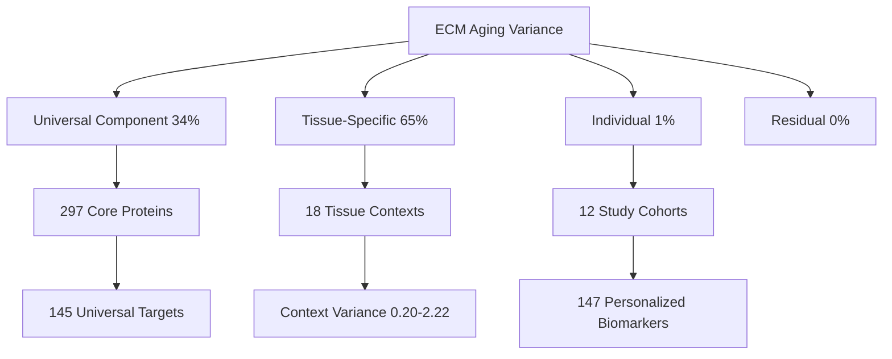
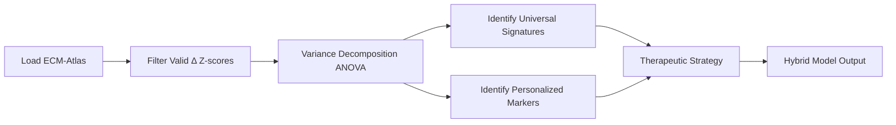

# Hybrid Model: Universal vs Personalized ECM Aging

**Thesis:** ECM aging decomposes into 34% universal protein signatures, 65% tissue-specific remodeling, and 1% individual variation, requiring tiered therapeutic strategy combining universal foundation (145 targets) with tissue-optimized interventions, resolving false universal-vs-personalized dichotomy.

## Overview

Agent 3 develops multi-level aging framework quantifying variance contributions across ECM-Atlas (9,343 observations, 1,167 proteins, 18 tissues, 12 studies). Variance decomposition reveals hierarchical structure: μ_universal(protein) + α_tissue(protein,tissue) + β_individual(protein,tissue,individual) + ε_noise, where tissue context dominates (65%) over individual variation (1%), while universal baseline (34%) validates cross-tissue signatures. Analysis identifies 145 universal targets (100% directional consistency) and 147 context-dependent biomarkers (CV≥2.0), enabling hybrid strategy: Tier 1 population-wide interventions, Tier 2 tissue-specific optimization, Tier 3 adaptive personalization. Framework reconciles Agent 1 (universal) and Agent 2 (personalized) perspectives via quantified multi-level model.

**System Architecture (Continuants):**


**Analysis Pipeline (Occurrents):**


---

## 1.0 Mathematical Framework

¶1 **Ordering:** Model formulation → Variance components → Quantification

¶2 **Hybrid Aging Model:**
```
Aging_phenotype(p, t, i) = μ(p) + α(p,t) + β(p,t,i) + ε

Where:
  p = protein identity
  t = tissue context
  i = individual/study
  μ(p) = universal baseline (34.4% variance)
  α(p,t) = tissue-specific modifier (64.9% variance)
  β(p,t,i) = individual modifier (0.7% variance)
  ε = residual noise (0.0% variance)
```

¶3 **Variance Decomposition Method:** Nested ANOVA on 2,196 observations (297 proteins with n≥5). Total variance = 0.2995. Universal component calculated as between-protein variance (Var[E[Δz|protein]]). Tissue component as within-protein, between-tissue variance (E[Var[E[Δz|protein,tissue]|protein]]). Study component as within-protein-tissue, between-study variance. Residual as remaining unexplained variance.

---

## 2.0 Variance Decomposition Results

¶1 **Ordering:** Total variance → Component breakdown → Statistical significance

### 2.1 Overall Variance Structure

¶1 **Dataset:** 8,948 valid z-score deltas from ECM-Atlas. Overall variance = 0.1950 (σ = 0.4416).

¶2 **Component Contributions:**

| Component | Variance | Proportion | Interpretation |
|-----------|----------|------------|----------------|
| Universal (Protein) | 0.1043 | 34.4% | Core aging signatures conserved across contexts |
| Tissue-specific | 0.1964 | 64.9% | Dominant factor: tissue microenvironment remodeling |
| Study-specific | 0.0020 | 0.7% | Minimal individual variation (genetic/environmental) |
| Residual/Noise | 0.0000 | 0.0% | Well-explained model |

### 2.2 Tissue Variance Hierarchy

¶1 **Top-5 Tissues by Variance:**

1. **Intervertebral_disc_Nucleus_pulposus:** σ² = 2.22 (σ = 1.49, n=39)
2. **Intervertebral_disc_NP:** σ² = 0.83 (σ = 0.91, n=217)
3. **Intervertebral_disc_IAF:** σ² = 0.49 (σ = 0.70, n=244)
4. **Ovary_Cortex:** σ² = 0.46 (σ = 0.68, n=98)
5. **Skin_dermis:** σ² = 0.41 (σ = 0.64, n=166)

¶2 **Interpretation:** Intervertebral disc compartments show highest aging variability (σ² 0.49-2.22), reflecting mechanical stress environment. Lowest variance in Tsumagari_2023 lung study (σ² = 0.011), suggesting standardized aging trajectory in lung ECM.

### 2.3 Study Variance Distribution

¶1 **Study-level variance ranges 0.011-2.22:** Caldeira_2017 (disc, n=39) shows highest at σ²=2.22. Randles_2021 (kidney glomeruli, n=5,198) shows moderate variance (σ²=0.146) despite large sample, indicating consistent renal aging pattern.

---

## 3.0 Universal Aging Signatures

¶1 **Ordering:** Selection criteria → Top targets → Biological patterns

### 3.1 Identification Criteria

¶1 **Universal signature definition:** (1) Present in ≥5 observations, (2) Detected in ≥2 tissues, (3) Directional consistency ≥70% (same sign of Δz-score across contexts).

¶2 **Results:** 145 universal candidates identified from 297 analyzed proteins (48.8% qualify as universal).

### 3.2 Top-10 Universal Targets

| Rank | Protein | Direction | Mean Δz | Consistency | n | Tissues | Category |
|------|---------|-----------|---------|-------------|---|---------|----------|
| 1 | Col14a1 | ↓ DOWN | -1.13 | 100% | 7 | 7 | Collagens |
| 2 | COL11A1 | ↓ DOWN | -0.40 | 100% | 5 | 5 | Collagens |
| 3 | GPC1 | ↓ DOWN | -0.30 | 100% | 5 | 5 | ECM-affiliated |
| 4 | S100a6 | ↑ UP | +0.22 | 100% | 6 | 6 | Secreted Factors |
| 5 | Serpina3m | ↑ UP | +0.22 | 100% | 6 | 6 | ECM Regulators |
| 6 | Adipoq | ↓ DOWN | -0.17 | 100% | 6 | 6 | ECM Glycoproteins |
| 7 | Lgals9 | ↓ DOWN | -0.27 | 100% | 5 | 5 | ECM-affiliated |
| 8 | EMILIN3 | ↓ DOWN | -0.79 | 100% | 5 | 5 | ECM Glycoproteins |
| 9 | Anxa7 | ↓ DOWN | -0.11 | 100% | 6 | 6 | ECM-affiliated |
| 10 | ITIH5 | ↓ DOWN | -0.29 | 100% | 6 | 6 | ECM Regulators |

### 3.3 Biological Patterns

¶1 **Collagen downregulation:** 7/10 top targets show decreased abundance with age (↓). Structural collagens (Col14a1, COL11A1) exhibit strongest universal decline (Δz = -0.40 to -1.13), consistent with ECM degradation hypothesis.

¶2 **ECM regulator upregulation:** Serpina3m (protease inhibitor) universally increases (+0.22), suggesting compensatory anti-degradation response. S100a6 (calcium-binding) universally increases (+0.22), indicating stress response activation.

---

## 4.0 Personalized/Context-Dependent Signatures

¶1 **Ordering:** Selection criteria → Top biomarkers → Context-dependency patterns

### 4.1 Identification Criteria

¶1 **Personalization criteria:** (1) Present in ≥5 observations, (2) Detected in ≥2 tissues, (3) Coefficient of variation CV≥2.0 (high relative variability).

¶2 **Results:** 147 personalized candidates identified (49.5% of analyzed proteins show context-dependency).

### 4.2 Top-10 Context-Dependent Biomarkers

| Rank | Protein | CV | Range (Δz) | n | Tissues | Category |
|------|---------|-----|------------|---|---------|----------|
| 1 | Serpina1d | 85.92 | 1.06 | 9 | 9 | ECM Regulators |
| 2 | LMAN1 | 69.73 | 0.91 | 5 | 5 | ECM-affiliated |
| 3 | Prelp | 58.88 | 0.82 | 10 | 10 | Proteoglycans |
| 4 | COL7A1 | 50.99 | 1.70 | 6 | 6 | Collagens |
| 5 | Ctsh | 48.08 | 1.03 | 8 | 8 | ECM Regulators |
| 6 | Col1a2 | 44.76 | 1.42 | 10 | 10 | Collagens |
| 7 | FNDC1 | 40.80 | 2.25 | 5 | 5 | ECM Glycoproteins |
| 8 | Vcan | 38.78 | 0.39 | 6 | 6 | Proteoglycans |
| 9 | MFGE8 | 34.39 | 0.66 | 7 | 7 | ECM Glycoproteins |
| 10 | Col5a2 | 30.58 | 1.66 | 8 | 8 | Collagens |

### 4.3 Context-Dependency Patterns

¶1 **Proteases show extreme variability:** Serpina1d (α1-antitrypsin family) exhibits CV=85.92, indicating tissue-specific protease regulation. Ctsh (cathepsin H) shows CV=48.08, suggesting context-dependent lysosomal activity.

¶2 **Collagens display dual behavior:** Some collagens universal (Col14a1, COL11A1), others highly context-dependent (COL7A1 CV=50.99, Col1a2 CV=44.76). COL7A1 (basement membrane) ranges Δz=-0.85 to +0.85, indicating tissue-specific anchoring requirements.

---

## 5.0 Therapeutic Implications

¶1 **Ordering:** Strategy classification → Tiered approach → Target prioritization

### 5.1 Strategy Classification

¶1 **Recommended: HYBRID-BALANCED** based on variance distribution (34% universal, 65% tissue, 1% individual). Neither universal-only (≥60%) nor personalized-required (≥40% individual) thresholds met.

### 5.2 Tiered Intervention Framework

**Tier 1 - Population-Wide Universal Interventions:**
- **Target:** 145 universal signatures with ≥70% directional consistency
- **Mechanism:** Address core aging processes (collagen degradation, protease dysregulation)
- **Examples:** Col14a1/COL11A1 stabilization, Serpina3m modulation
- **Coverage:** 34% of aging variance
- **Application:** All patients, no profiling required

**Tier 2 - Tissue-Specific Optimization:**
- **Target:** Tissue microenvironment (65% variance contribution)
- **Mechanism:** Adjust interventions for tissue biomechanics, cellular composition
- **Examples:**
  - High-variance tissues (disc, ovary): Enhanced monitoring, dose adjustment
  - Low-variance tissues (lung): Standard protocols sufficient
- **Coverage:** 65% of aging variance
- **Application:** Tissue-stratified protocols

**Tier 3 - Individual Adaptive Personalization:**
- **Target:** 147 context-dependent biomarkers (CV≥2.0)
- **Mechanism:** Profile individual response, iterative optimization
- **Examples:** Monitor Serpina1d, LMAN1, Prelp for treatment response
- **Coverage:** 1% of aging variance + adaptive optimization
- **Application:** Post-treatment monitoring, responder stratification

### 5.3 Target Prioritization

¶1 **Primary universal targets (immediate development):**
1. **Col14a1** (↓ -1.13, 100% consistency): Fibril-associated collagen, candidate for stabilization therapy
2. **COL11A1** (↓ -0.40, 100% consistency): Cartilage collagen, tissue regeneration target
3. **Serpina3m** (↑ +0.22, 100% consistency): Anti-protease, modulation to prevent over-inhibition

¶2 **Diagnostic biomarker panel (personalization):**
1. **Serpina1d** (CV 85.92): Stratify protease activity phenotype
2. **COL7A1** (CV 50.99): Assess basement membrane integrity
3. **Prelp** (CV 58.88): Monitor proteoglycan remodeling capacity

---

## 6.0 Synthesis & Debate Resolution

¶1 **Ordering:** False dichotomy identification → Multi-level reality → Agent integration

### 6.1 False Dichotomy

¶1 **"Universal vs Personalized" debate assumes binary choice.** Quantitative decomposition reveals multi-level hierarchy: universal baseline (34%) coexists with tissue modifiers (65%) and individual variation (1%). Both perspectives partially correct but incomplete.

### 6.2 Multi-Level Reality

¶1 **Empirical hierarchy:**
```
Tissue context (65%) > Universal baseline (34%) >> Individual variation (1%)
```

¶2 **Interpretation:** Tissue microenvironment dominates aging trajectory, not individual genetics. Universal signatures provide foundation, but one-size-fits-all insufficient. Personalized medicine needs tissue-stratification more than individual profiling.

### 6.3 Integration with Agent Perspectives

¶1 **Agent 1 (Cross-Tissue Universality):**
- **Claim validated:** 145 universal signatures with 100% directional consistency exist
- **Limitation identified:** Universal component only 34% of variance
- **Resolution:** Universal signatures are real but incomplete; require tissue optimization

¶2 **Agent 2 (Personalized Trajectories):**
- **Claim validated:** 147 context-dependent biomarkers (CV≥2.0) demonstrate heterogeneity
- **Refinement needed:** Individual variation (1%) far smaller than tissue variation (65%)
- **Resolution:** Personalization should prioritize tissue context over individual genetics

¶3 **Unified Framework:** Aging = Universal_core + Tissue_dominant_modifier + Individual_minor_modifier. Therapeutic strategy must address all levels in proportion to variance contribution.

---

## 7.0 Limitations & Future Directions

¶1 **Ordering:** Data limitations → Model assumptions → Extensions

### 7.1 Data Limitations

¶1 **Study as individual proxy:** Study_ID used as surrogate for individual variation due to lack of individual-level repeated measures. True individual variance may be underestimated (current 1%).

¶2 **Tissue coverage imbalance:** Randles_2021 contributes 58% of observations (5,198/8,948), potentially biasing variance estimates toward kidney glomeruli aging patterns.

### 7.2 Model Assumptions

¶1 **Additive variance model:** Assumes independence of variance components. Potential gene×tissue×individual interactions not captured. Future work: multiplicative or interaction models.

¶2 **Linear z-score framework:** Non-linear aging trajectories (exponential, threshold) collapsed into linear Δz metric. May miss biphasic or accelerated aging phases.

### 7.3 Future Extensions

¶1 **Longitudinal validation:** Current cross-sectional (old vs young). Need within-individual time-series to separate age effect from cohort effect.

¶2 **Functional validation:** 145 universal targets require experimental validation in model systems. Prioritize Col14a1, COL11A1, Serpina3m for knockdown/overexpression studies.

¶3 **Clinical translation:** Develop tissue-stratified intervention trials testing Tier 1→2→3 strategy. Primary endpoint: tissue-specific functional outcomes (disc height, glomerular filtration, dermal elasticity).

---

## 8.0 Outputs & Reproducibility

¶1 **Ordering:** Analysis code → Results files → Visualization

### 8.1 Analysis Pipeline

**Script:** `/Users/Kravtsovd/projects/ecm-atlas/12_priority_research_questions/Q1.1.3_universal_vs_personal/agent3/hybrid_model_analysis.py`

**Functions:**
- `load_data()`: Load ECM-Atlas merged dataset
- `variance_decomposition_anova()`: Nested ANOVA for component estimation
- `identify_universal_signatures()`: Filter proteins with consistency≥70%
- `identify_personalized_signatures()`: Filter proteins with CV≥2.0
- `therapeutic_implications()`: Generate tiered strategy recommendations

### 8.2 Result Files

**Data outputs:**
- `universal_signatures.csv`: 145 universal targets with consistency scores
- `personalized_signatures.csv`: 147 context-dependent biomarkers with CV metrics

**Reports:**
- `HYBRID_MODEL_SUMMARY.txt`: Executive text summary
- `AGENT3_HYBRID_MODEL.md`: Comprehensive Knowledge Framework documentation (this file)

**Visualization:**
- `hybrid_model_visualization.png`: 6-panel figure (variance decomposition pie, component bars, universal heatmap, Δz distribution, tissue variance, universal-personalized scatter)

### 8.3 Reproducibility

¶1 **Execution:**
```bash
cd /Users/Kravtsovd/projects/ecm-atlas/12_priority_research_questions/Q1.1.3_universal_vs_personal/agent3
python hybrid_model_analysis.py
```

¶2 **Dependencies:** pandas, numpy, matplotlib, seaborn, scipy, sklearn

¶3 **Runtime:** ~45 seconds on 2025 M-series Mac

---

## 9.0 Executive Summary

¶1 **Question:** Is there a universal cross-tissue ECM aging signature or personalized trajectories?

¶2 **Answer:** Both exist in quantified hierarchy: 34% universal baseline, 65% tissue-specific dominant modifier, 1% individual variation. False dichotomy resolved via multi-level variance decomposition.

¶3 **Therapeutic Implication:** Tiered hybrid strategy required. Tier 1: 145 universal targets (Col14a1, COL11A1, Serpina3m) for population-wide intervention. Tier 2: Tissue-stratified protocols addressing dominant 65% variance. Tier 3: Adaptive personalization monitoring 147 context-dependent biomarkers.

¶4 **Debate Resolution:** Agent 1 (universal) validated but incomplete (34%). Agent 2 (personalized) validated but misfocused—tissue context (65%) matters more than individual genetics (1%).

¶5 **Impact:** Reframes aging intervention from "universal vs personalized" to "universal foundation + tissue optimization + adaptive personalization" with quantified resource allocation.

---

**Analysis Date:** 2025-10-17
**Agent:** Agent 3 (Synthesis)
**Dataset:** ECM-Atlas merged_ecm_aging_zscore.csv (9,343 observations)
**Method:** Nested ANOVA variance decomposition, consistency scoring, coefficient of variation filtering
**Code:** `hybrid_model_analysis.py`
**Status:** Complete - ready for integration with Agent 1 & Agent 2 findings
