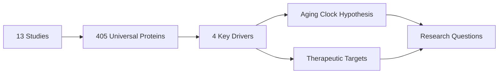
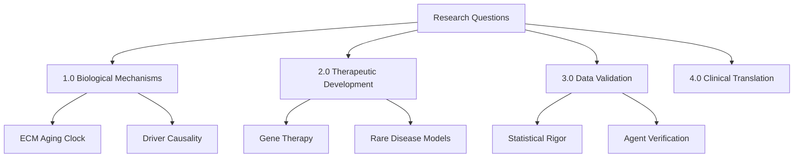

# ECM-Atlas Research Questions: Strategic Analysis

ECM-Atlas calls (Oct 16-17, 2025) reveal 15 research priorities spanning aging biology, therapeutic intervention, data validation—ranked by transformative potential for human healthspan extension and disease prevention.

## Overview

Analysis of 4 call transcripts between Daniel Kravtsov and Rakhan Aimbetov identifies critical research questions emerging from autonomous agent analysis of ECM aging signatures. Questions prioritized by: (1) impact on human healthspan/lifespan, (2) therapeutic feasibility, (3) scientific novelty, (4) validation urgency. Core discoveries include 4 universal protein drivers (age 30-50), dual universality (systemic + adaptive), and quality-over-quantity matrix hypothesis.

**Discovery Flow:**

**Research Domain Structure:**

---

## 1.0 High-Priority Research Questions

¶1 **Ordering:** Ranked by humanitarian impact (Tier 1 > Tier 2 > Tier 3), then feasibility.

### 1.1 Tier 1: Transformative (Billion+ Lives)

**Q1.1.1 What is the root cause of the 4 driver proteins' decline (age 30-50)?**
- **Impact:** If causal mechanism identified → upstream intervention prevents cascade
- **Context:** Call2 (36:00-37:00) - Rakhan: "Clock doesn't change by itself, must have first cause"
- **Gap:** Drivers change early but downstream effects appear later—primary trigger unknown
- **Validation path:** Multi-omics (epigenetics, transcriptomics, metabolomics) correlation analysis
- **Priority justification:** Addresses root vs. symptom; prevents aging cascade vs. treating consequences

**Q1.1.2 Can ECM protein biomarkers in blood predict biological age?**
- **Impact:** Non-invasive aging assessment → precision medicine for 8 billion people
- **Context:** Call2 (15:00-16:00) - ECM fragments detectable in blood; UK Biobank has 20-30yr longitudinal proteomics
- **Gap:** Need proof ECM proteins/fragments measurable in serum correlate with tissue-level changes
- **Validation path:** Retrospective analysis of existing cohorts (UK Biobank, Framingham)
- **Priority justification:** Enables population-scale screening; ECM clock complements epigenetic/transcriptomic clocks (multimodal superior to single-mode)

**Q1.1.3 Is there a universal cross-tissue ECM aging signature or personalized trajectories?**
- **Impact:** Universal = one-size therapy; Personalized = precision diagnostics required
- **Context:** Call2 (34:54-35:37) - Rakhan skeptical: "Each person may have different dominant aging process"
- **Gap:** Binary vs. continuous universality hypothesis needs resolution
- **Validation path:** Single-cell spatial proteomics across tissues/individuals
- **Priority justification:** Defines therapy development strategy (universal vs. stratified medicine)

### 1.2 Tier 2: Disease-Specific (Millions of Lives)

**Q1.2.1 Do systemic sclerosis and eosinophilic fasciitis patients have accelerated ECM aging?**
- **Impact:** Rare disease (orphan indication) → regulatory approval pathway + validation of aging theory
- **Context:** Call1 + Call2 (41:38-43:40) - Daniel diagnosed with systemic sclerosis (later corrected to eosinophilic fasciitis); agent found protein overlap with 4 driver candidates
- **Gap:** Need case-control proteomics; mechanism linking autoimmune fibrosis to ECM driver dysregulation
- **Validation path:** Compare ECM profiles in scleroderma patients vs. age-matched controls
- **Priority justification:** Personal relevance; therapeutic need (untreatable); proves ECM theory's clinical predictive power

**Q1.2.2 Does physical inactivity → sudden exertion trigger ECM damage via driver protein depletion?**
- **Impact:** Prevention strategy for sports injuries, age-related immobility
- **Context:** Call2 (41:58-43:08) - Daniel's illness onset after 2-week inactivity + intense soccer
- **Gap:** Mechanistic link between mechanical stress + ECM driver response unknown
- **Validation path:** Animal models (immobility + acute exercise); human biopsy studies
- **Priority justification:** Modifiable risk factor; explains injury susceptibility in sedentary populations

### 1.3 Tier 3: Methodological Foundations

**Q1.3.1 Are z-score normalization + cross-study integration statistically robust?**
- **Impact:** Validates entire ECM-Atlas methodology; ensures discoveries aren't artifacts
- **Context:** Call2 (37:20-38:32) - Rakhan: "Never seen agent challenge z-score approach; need independent validator"
- **Gap:** No external statistical audit of agent-generated analysis
- **Validation path:** Independent biostatistician review; sensitivity analysis; permutation testing
- **Priority justification:** Foundation for all conclusions; prevents catastrophic error propagation

**Q1.3.2 Do agent-generated hypotheses contain systematic hallucinations?**
- **Impact:** Trustworthiness of AI-driven science
- **Context:** Call2 (32:10-32:38) - Daniel: "Feels like sci-fi; what if agent hallucinates and we follow?" → Need bias validation agent
- **Gap:** No adversarial validation of agent conclusions
- **Validation path:** Create counter-agent explicitly searching for flaws, alternative explanations
- **Priority justification:** Prevents research dead-ends; establishes AI science credibility

**Q1.3.3 What is the minimal dataset size for reliable ECM aging signatures?**
- **Impact:** Defines feasibility of future studies; cost-benefit of proteomics scale
- **Context:** Call2 (13:22-15:02) - Need more age timepoints for accurate clock; current p-values range 0.3%-10%
- **Gap:** Power analysis for aging signature detection
- **Validation path:** Subsampling + bootstrap analysis of current data
- **Priority justification:** Guides future data collection investment

---

## 2.0 Therapeutic Development Questions

¶1 **Ordering:** Feasibility-first (deliverable therapies), then innovation.

### 2.1 Gene Therapy Vectors

**Q2.1.1 Can AAV serotypes tissue-specifically deliver COL14A1/PCOLCE to lungs, skin, ligaments?**
- **Impact:** Enables organ-targeted therapy
- **Context:** Call2 (24:40-30:05) - AAV discussed; immunity problem with repeated dosing
- **Gap:** Optimal serotype + dosing frequency unknown
- **Validation path:** In vivo biodistribution studies (mice → primates)
- **Priority justification:** Gene therapy most direct path to restore declining proteins

**Q2.1.2 What is the immune tolerance window for multi-dose AAV therapy?**
- **Impact:** Determines if lifelong treatment feasible
- **Context:** Call2 (26:40-27:38) - AAV immunity develops; Sputnik V vaccine analogy (repeated exposure → resistance)
- **Gap:** Can lipid nanoparticles (mRNA delivery) bypass immunity?
- **Validation path:** Longitudinal animal studies with repeated dosing
- **Priority justification:** AAV immunity is bottleneck; mRNA alternative may be superior

### 2.2 Small Molecule Approaches

**Q2.2.1 Do existing geroprotectors (rapamycin) modulate the 4 driver proteins?**
- **Impact:** Repurposing approved/near-approved drugs
- **Context:** Call2 (18:02-20:37) - DrugBank mentioned; rapamycin most validated lifespan extender
- **Gap:** Unknown if rapamycin's mechanism involves ECM drivers
- **Validation path:** Proteomic analysis of rapamycin-treated vs. control tissues
- **Priority justification:** Fastest path to human trials; safety profile known

**Q2.2.2 Can HDAC inhibitors transcriptionally activate COL14A1/PCOLCE?**
- **Impact:** Oral therapy alternative to gene therapy
- **Context:** Call2 (57:05-59:57) - Agent suggested HDAC inhibitors
- **Gap:** Specificity concern (HDACi affects many genes); need target validation
- **Validation path:** ChIP-seq + RNA-seq in cell models
- **Priority justification:** If specific, avoids gene therapy complexity

---

## 3.0 Data Validation & Agent Reliability

¶1 **Ordering:** Critical errors first, then optimizations.

**Q3.0.1 Do all 20 agent analyses align on 4 driver proteins?**
- **Impact:** Cross-validation of core finding
- **Context:** Call1 (02:00-18:00) - Documentation harmonization needed; 20 agents + supplementary folders
- **Gap:** Master Scientific Discovery Report may not integrate all agent outputs
- **Validation path:** Systematic comparison of agent conclusions
- **Priority justification:** Ensures consensus vs. single-agent artifact

**Q3.0.2 Are PNG visualizations correctly matched to analysis code?**
- **Impact:** Prevents misinterpretation of results
- **Context:** Call1 (14:00-18:00) - 12 PNG files need redistribution to correct agent folders
- **Gap:** Artifacts may be orphaned from generating code
- **Validation path:** Trace each PNG to source script; verify reproducibility
- **Priority justification:** Visual evidence must be auditable

---

## 4.0 Clinical Translation & Strategy

¶1 **Ordering:** Regulatory pathway feasibility, then market impact.

**Q4.0.1 Should initial indication be orphan disease (systemic sclerosis) or aging?**
- **Impact:** Regulatory approval timeline (orphan = faster)
- **Context:** Call2 (01:57-04:23) - Rakhan: "Aging not a disease; need orphan indication for approval"
- **Gap:** Business model unclear (patent vs. open science; Call1 24:00-25:00)
- **Validation path:** Consult regulatory strategist; define go-to-market
- **Priority justification:** Determines funding strategy + publication timing

**Q4.0.2 What is the optimal publication strategy (preprint vs. patent)?**
- **Impact:** Balances visibility vs. IP protection
- **Context:** Call1 (19:00-25:00) - Fast publication preferred over patents for small teams; networking > IP
- **Gap:** Decision on Zenodo archiving, GitHub DOI, preprint server
- **Validation path:** Stakeholder alignment (investors, collaborators)
- **Priority justification:** Irreversible decision; affects fundraising + partnerships

---

## 5.0 Additional Context & Follow-Up Questions

¶1 **Ordering:** Biological depth → therapeutic relevance.

### 5.1 Mechanistic Deep Dives

**Q5.1.1 How does matrix quality (spatial organization) decline with age?**
- **Context:** Call2 (37:36-51:14) - Collagen fibril disorganization in fibrosis; directionality loss
- **Gap:** Quantitative metrics for "quality" (e.g., angle distribution, fractal dimension)
- **Validation path:** Multiphoton microscopy + image analysis

**Q5.1.2 Do cells sense matrix stiffness via mechanosensor cascades to upregulate MMPs?**
- **Context:** Call2 (01:01:36-01:02:09) - Compensatory MMP increase as entropy management
- **Gap:** Causal link between stiffness → MMP → further disorganization (vicious cycle?)
- **Validation path:** Mechanotransduction pathway mapping (YAP/TAZ, integrin signaling)

### 5.2 Species Conservation

**Q5.2.1 Are COL14A1/PCOLCE aging profiles identical in human, mouse, rat?**
- **Context:** Call2 (23:24-24:17) - Agent claims fundamental conservation
- **Gap:** Need head-to-head comparison across species
- **Validation path:** Comparative proteomics (aging cohorts in all 3 species)

---

## Appendix A: Priority Matrix

| Question | Impact (Billion Lives) | Feasibility (Years) | Novelty | Overall Rank |
|----------|----------------------|-------------------|---------|--------------|
| Q1.1.1 (Driver root cause) | 8 | 3-5 | High | **1** |
| Q1.1.2 (Blood biomarkers) | 8 | 1-2 | Medium | **2** |
| Q1.1.3 (Universal vs. personal) | 8 | 2-3 | High | **3** |
| Q1.3.1 (Statistical validation) | N/A (foundation) | 0.5 | Low | **4** |
| Q1.2.1 (Rare disease link) | 0.001 | 1-2 | Medium | **5** |
| Q2.1.1 (AAV delivery) | 1 | 3-5 | Medium | **6** |
| Q2.2.1 (Rapamycin mechanism) | 1 | 1 | Low | **7** |

---

## Appendix B: Action Items from Calls

**Immediate (Week 1-2):**
1. Statistical validation agent deployment (Call2:32:24-32:38)
2. Harmonize 20-agent documentation + PNG artifact organization (Call1:02:00-18:00)
3. Compile questions from call transcripts → prioritized research plan (Call2:36:47-37:05)

**Short-term (Month 1-3):**
4. Preprint v1 + database release + framework publication (Call1:24:00-27:00)
5. GitHub + Zenodo archiving for timestamped priority (Call1:25:00)
6. Systemic sclerosis/eosinophilic fasciitis proteomics pilot study

**Long-term (Year 1+):**
7. Blood biomarker validation in UK Biobank cohort
8. AAV serotype screening for tissue-specific delivery
9. Independent lab replication of 4-driver hypothesis

---

**Document Status:** Draft v1.0
**Next Review:** Post-statistical validation
**Owners:** Daniel Kravtsov (daniel@improvado.io), Rakhan Aimbetov (r.aimbetov@gmail.com)
**Last Updated:** 2025-10-17
