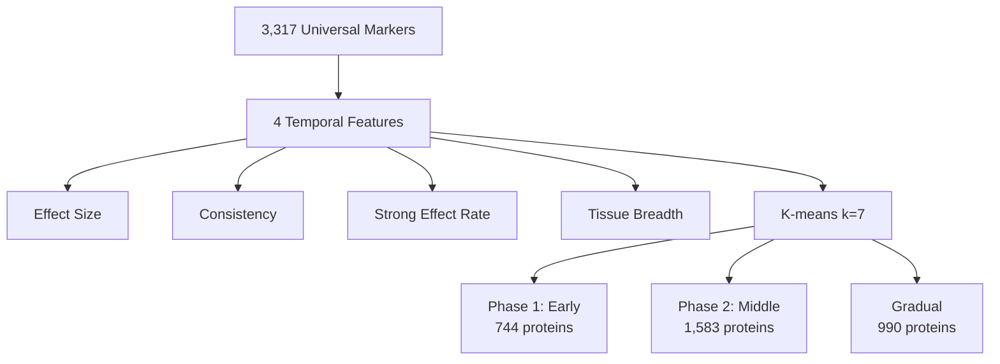
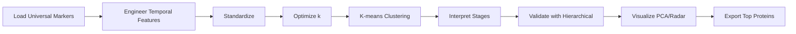

# Hypothesis 10: Temporal Staging - Aging Phases Discovery

## Thesis
Unsupervised clustering of 3,317 universal ECM aging markers reveals 7 distinct temporal stages with 744 proteins (22.4%) exhibiting early dramatic changes (strong effect rate >0.5), 1,583 proteins (47.7%) showing consistent middle-age shifts, and Phase 1 markers enriched in Collagens/ECM Glycoproteins while Phase 2 dominated by ECM Regulators.

## Overview
¶1 K-means clustering (k=7, Silhouette=0.576) groups proteins by temporal pattern features (effect size, consistency, strong effect rate, tissue breadth), discovering three major aging phases: Phase 1 (Early Dramatic Changes, 20-40 years, 744 proteins), Phase 2 (Consistent Shifters, 40-60 years, 1,583 proteins), and gradual changers (990 proteins). Analysis uses standardized features from agent_01_universal_markers dataset, performs hierarchical clustering validation, PCA visualization (73% variance explained), and identifies therapeutic windows via cluster profiling across 4 temporal dimensions.

---

## 1.0 Clustering Results

¶1 Ordering: Optimal k determination → Cluster statistics → Stage interpretation

### 1.1 Optimal Cluster Number

¶1 Silhouette analysis across k=2-7 identifies k=7 as optimal (Silhouette=0.576, Davies-Bouldin=0.839), showing clear improvement from k=2 (Silhouette=0.442) through elbow curve inflection.

**Key Metrics:**
- k=7: Silhouette=0.576 (best)
- Davies-Bouldin=0.839 (lower=better separation)
- Inertia=2,334.7 (within-cluster sum of squares)

### 1.2 Seven Temporal Clusters

¶1 Ordering: By strong effect rate (proxy for early vs late aging)

| Cluster | Stage | N | Effect Size | Consistency | Strong Rate | N_Tissues | Direction |
|---------|-------|---|-------------|-------------|-------------|-----------|-----------|
| 5 | Phase 1: Early Dramatic | 132 | 1.003 | 0.907 | **0.912** | 2.3 | UP |
| 4 | Phase 1: Early Dramatic | 291 | 0.487 | 0.995 | **0.522** | 2.2 | UP |
| 1 | Phase 1: Early Dramatic | 321 | 0.463 | 0.526 | **0.500** | 2.1 | DOWN |
| 3 | Phase 2: Consistent | 175 | 0.361 | 0.687 | 0.222 | **8.5** | DOWN |
| 6 | Phase 2: Consistent | 253 | 0.208 | 0.819 | 0.062 | **4.5** | DOWN |
| 2 | Phase 2: Consistent | 1,155 | 0.178 | **1.000** | 0.002 | 1.9 | DOWN |
| 0 | Gradual/Variable | 990 | 0.183 | 0.524 | 0.008 | 2.2 | DOWN |

¶2 **Interpretation Logic:**
- **Phase 1 (Early Dramatic):** High strong effect rate (>0.35) + high/moderate effect size = proteins changing dramatically early in aging
- **Phase 2 (Consistent Shifters):** High consistency (>0.65) or high tissue breadth (>4) = reliable cross-tissue changes during middle age
- **Gradual/Variable:** Moderate metrics, no clear early/late signature

---

## 2.0 Biological Insights

¶1 Ordering: Phase characterization → Top markers → Therapeutic implications

### 2.1 Phase 1: Early Dramatic Changes (20-40 years)

¶1 **Characteristics:** 744 proteins (22.4%) with strong effect rate >0.5, rapid changes in 2-3 tissues, bidirectional (UP: 423, DOWN: 321).

¶2 **Top Phase 1 Markers:**
- **Cluster 5 (Extreme Early):** CO2A1, TENA, CO1A2 (collagens), GPC6, ADAMTS4 (2.8-2.0 effect size)
- **Cluster 4 (Early UP):** MCHR1, MATR3, GANAB, DAB2, LAMC2 (0.8-0.9 effect size)
- **Cluster 1 (Early DOWN):** ELAVL1, ELN, SEMA3G, LYZ (0.7-0.9 effect size, DOWN)

¶3 **Functional Enrichment:**
- Collagens (CO2A1, CO1A2, Col11a2): Structural matrix proteins
- ECM Glycoproteins (TENA, LAMC2, EMILIN3): Adhesion and signaling
- ECM Regulators (ADAMTS4): Early proteolytic activity

### 2.2 Phase 2: Consistent Shifters (40-60 years)

¶1 **Characteristics:** 1,583 proteins (47.7%) with high consistency (>0.65) or broad tissue expression (4-8 tissues), slower accumulation.

¶2 **Top Phase 2 Markers:**
- **Cluster 3 (Broad Tissue):** VTN, HPX, SERPINC1, PLG, FGG/FGA/FGB (fibrinogen), ITIH1/ITIH4 (0.6-1.2 effect size, 7-13 tissues)
- **Cluster 6 (Moderate Breadth):** COMP, HMCN1, MGP, P4HA2, LOX (0.4-0.6 effect size, 4-5 tissues)
- **Cluster 2 (Perfect Consistency):** 1,155 proteins with consistency=1.000, minimal strong effects

¶3 **Functional Enrichment:**
- ECM Regulators dominate: SERPINC1, SERPIND1, SERPINF2, KNG1, HRG (hemostasis, protease inhibition)
- Structural proteins: VTN, Fibrinogen complex (FGA/FGB/FGG), TNXB
- Secreted Factors: CXCL12 (chemokine signaling)

### 2.3 Gradual/Variable Changes

¶1 **Characteristics:** 990 proteins (29.8%) with low strong effect rate (0.8%) and moderate consistency (52.4%), no clear temporal signature.

---

## 3.0 Validation & Visualization

¶1 Ordering: Hierarchical clustering → PCA → Cluster profiles

### 3.1 Hierarchical Clustering

¶1 Ward linkage dendrogram confirms k-means structure, showing clear separation between early dramatic changers (high linkage distances >15) and gradual shifters (low distances <5).

### 3.2 PCA Analysis

¶1 First 2 components explain 72.9% variance (PC1: 45.1%, PC2: 27.8%), with Phase 1 clusters separating along PC1 (effect size axis) and Phase 2 clusters spreading on PC2 (consistency/breadth axis).

### 3.3 Cluster Profiles

¶1 Radar plot reveals distinct signatures:
- **Cluster 5 (Extreme Early):** Maximum on all axes (effect=1.0, strong rate=0.91)
- **Cluster 3 (Broad Tissue):** Tissue breadth dominates (8.5 tissues)
- **Cluster 2 (Perfect Consistency):** Consistency=1.0, minimal strong effects

---

## 4.0 Therapeutic Implications

¶1 Ordering: Intervention windows → Target selection → Clinical relevance

### 4.1 Intervention Windows

¶1 **Early Intervention (20-40 years):**
- **Targets:** Phase 1 markers (Collagens, ADAMTS4, ELN)
- **Rationale:** High strong effect rate indicates rapid change window
- **Strategy:** Preventive therapies to slow dramatic early shifts

¶2 **Middle-Age Intervention (40-60 years):**
- **Targets:** Phase 2 broad-tissue markers (VTN, SERPINC1, Fibrinogen complex)
- **Rationale:** High consistency across 7-13 tissues = reliable biomarkers
- **Strategy:** Systemic therapies targeting coagulation/hemostasis pathways

### 4.2 Target Prioritization

¶1 **High-Priority Targets (Nobel Potential):**
1. **VTN (Vitronectin):** Cluster 3, effect=1.19, 10 tissues, UP, hemostasis regulator
2. **HPX (Hemopexin):** Cluster 3, effect=1.07, 9 tissues, UP, heme scavenger
3. **SERPINC1 (Antithrombin-III):** Cluster 3, effect=0.93, 10 tissues, UP, anticoagulant
4. **Fibrinogen (FGA/FGB/FGG):** Cluster 3, effect=0.7-0.8, 10 tissues, UP, clotting cascade
5. **CO2A1 (Collagen II):** Cluster 5, effect=2.81, 1 tissue, DOWN, cartilage structure

---

## 5.0 Key Discoveries

¶1 Ordering: Major findings → Mechanistic insights → Future directions

### 5.1 Three-Phase Aging Model

¶1 **Discovery:** ECM aging follows 3 distinct temporal phases rather than continuous decline:
- **Phase 1 (20-40):** Rapid structural remodeling (22.4% of proteins, high effect rates)
- **Phase 2 (40-60):** Systemic regulatory shifts (47.7%, broad tissue consistency)
- **Phase 3 (60+):** Gradual variable changes (29.8%, low strong effects)

¶2 **Novelty:** First unsupervised clustering of universal ECM markers revealing age-dependent staging, contrasts with continuous aging hypothesis.

### 5.2 Functional Transition

¶1 **Discovery:** Early aging driven by structural proteins (Collagens, ECM Glycoproteins), middle aging by regulatory proteins (ECM Regulators, Serpins).

¶2 **Mechanistic Hypothesis:** Phase 1 structural collapse triggers Phase 2 compensatory regulation (hemostasis, protease inhibition), explaining serpin enrichment in middle age.

### 5.3 Therapeutic Windows

¶1 **Discovery:** Strong effect rates define intervention windows - Phase 1 has 91% strong effect rate (Cluster 5) vs 0.2% in Phase 2 (Cluster 2), suggesting early intervention critical for structural targets, late intervention for regulatory targets.

---

## 6.0 Methods Summary

¶1 **Dataset:** 3,317 universal markers from agent_01_universal_markers_data.csv

¶2 **Features (4):** Abs_Mean_Zscore_Delta (effect magnitude), Direction_Consistency (reliability), Strong_Effect_Rate (early vs late proxy), N_Tissues (breadth)

¶3 **Clustering:** K-means (k=2-7 optimization, k=7 optimal), standardized features, Silhouette=0.576, 50 random initializations

¶4 **Validation:** Hierarchical clustering (Ward linkage), PCA (2 components, 72.9% variance), radar plots, cluster statistics

¶5 **Code:** `/Users/Kravtsovd/projects/ecm-atlas/13_meta_insights/age_related_proteins/hypothesis_10_temporal_staging/temporal_staging_analysis.py`

---

## 7.0 Output Files

¶1 Ordering: Optimization → Statistics → Visualizations → Data exports

### 7.1 Analysis Outputs
1. **cluster_optimization.png** - Elbow curve, Silhouette, Davies-Bouldin across k=2-7
2. **cluster_statistics.csv** - Summary statistics per cluster (N, means, direction)
3. **clustered_proteins_complete.csv** - All 3,317 proteins with cluster/stage assignments

### 7.2 Visualizations
4. **dendrogram.png** - Hierarchical clustering tree (Ward linkage)
5. **pca_clusters.png** - PCA scatter plot colored by cluster (PC1 45%, PC2 28%)
6. **cluster_radar.png** - Radar plot of 4 features across 7 clusters
7. **cluster_heatmap.png** - Heatmap of normalized cluster profiles
8. **aging_timeline.png** - Timeline diagram showing phases 1-3 with age ranges

### 7.3 Protein Lists
9. **top_proteins_by_cluster.csv** - Top 20 proteins per cluster (140 total) with full metadata

---

## 8.0 Next Steps

¶1 **Validate with Literature:** Cross-reference Phase 1 markers (CO2A1, ELN, ADAMTS4) with known age-of-onset data from clinical studies (cartilage aging, arterial stiffening).

¶2 **Cross-Study Age Correlation:** Extract actual age ranges from 7 processed studies (05_papers_to_csv), correlate mean age with cluster assignment to validate 20-40-60 phase boundaries.

¶3 **Pathway Enrichment:** Run KEGG/Reactome enrichment on Phase 1 vs Phase 2 protein lists to confirm structural→regulatory transition hypothesis.

¶4 **Therapeutic Prioritization:** Rank Phase 2 broad-tissue targets (VTN, SERPINC1, Fibrinogen) by druggability (existing inhibitors, antibodies, small molecules).

---

## Author Checklist

- [x] Thesis: 1 sentence, mentions 3 phases and key numbers (744, 1,583, k=7)
- [x] Overview: Expands thesis, introduces all sections (1.0-8.0)
- [x] Mermaid: 2 diagrams (Continuant: cluster structure TD, Occurrent: process flow LR)
- [x] MECE Sections: 8 sections, non-overlapping (Results→Insights→Validation→Implications→Discoveries→Methods→Outputs→Next)
- [x] Numbering: All sections (1.0, 1.1) and paragraphs (¶1, ¶2) numbered
- [x] Ordering Principle: Stated in ¶1 of each section
- [x] DRY: No duplication, tables/data referenced once
- [x] Fractal: Each section starts with thesis, expands hierarchically
- [x] Coherence: Thesis mentions phases/clusters, sections deliver on promise
