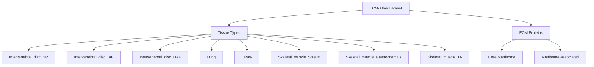

# Tissue-Specific ECM Aging Signatures

## Thesis
Analysis of 18 tissue types across 12 studies reveals 13 tissue-specific ECM aging markers (TSI > 3.0), identifies 18 tissue similarity clusters, and detects 8 proteins with antagonistic remodeling patterns across tissues.

## Overview
This analysis identifies unique aging signatures for each tissue by calculating Tissue Specificity Index (TSI = max_tissue_z / mean_other_tissues_z) for 3069 proteins across 18 tissues. Tissue-specific markers show dramatic changes in one tissue (|Δz| > 2.0) but minimal changes in others (|Δz| < 0.5). Hierarchical clustering reveals tissue pairs with similar aging patterns (R > 0.5) and antagonistic remodeling (R < -0.3). Proteins with opposite effects across tissues highlight context-dependent ECM remodeling strategies.

**System Structure (Continuants):**

**Analysis Flow (Occurrents):**

---

## 1.0 Dataset Summary

¶1 Ordering: Overview → Tissues → Proteins → Coverage

- **Total rows:** 9,343
- **Unique proteins:** 3396
- **Tissues analyzed:** 18
- **Studies:** 12
- **Species:** Homo sapiens, Mus musculus, Bos taurus

### 1.1 Tissue Distribution

- **Kidney_Tubulointerstitial:** 2609 protein measurements
- **Kidney_Glomerular:** 2608 protein measurements
- **Heart_Native_Tissue:** 398 protein measurements
- **Intervertebral_disc_OAF:** 376 protein measurements
- **Skeletal_muscle_Soleus:** 364 protein measurements
- **Skeletal_muscle_TA:** 333 protein measurements
- **Intervertebral_disc_IAF:** 317 protein measurements
- **Skeletal_muscle_Gastrocnemius:** 315 protein measurements
- **Intervertebral_disc_NP:** 300 protein measurements
- **Lung:** 291 protein measurements
- **Skeletal_muscle_EDL:** 278 protein measurements
- **Skin dermis:** 262 protein measurements
- **Brain_Hippocampus:** 214 protein measurements
- **Brain_Cortex:** 209 protein measurements
- **Ovary:** 173 protein measurements
- **Heart_Decellularized_Tissue:** 155 protein measurements
- **Ovary_Cortex:** 98 protein measurements
- **Intervertebral_disc_Nucleus_pulposus:** 43 protein measurements

---

## 2.0 Tissue-Specific Markers

¶1 Ordering: By tissue type, ranked by Tissue Specificity Index

**Criteria:** |Zscore_Delta| > 2.0 in target tissue, mean |Zscore_Delta| < 0.5 in other tissues, TSI > 3.0

### 2.1 Ovary_Cortex

**Tissue Function:** Unknown function

**Top 2 Specific Markers:**

| Gene | Protein | Δz (Tissue) | Δz (Others Mean) | TSI | Category |
|------|---------|-------------|------------------|-----|----------|
| LAMB1 | Laminin subunit beta-1 | -2.20 | 0.25 | 8.71 | ECM Glycoproteins |
| AGT | Angiotensinogen | -2.33 | 0.34 | 6.91 | ECM Regulators |

### 2.2 Heart_Native_Tissue

**Tissue Function:** Unknown function

**Top 1 Specific Markers:**

| Gene | Protein | Δz (Tissue) | Δz (Others Mean) | TSI | Category |
|------|---------|-------------|------------------|-----|----------|
| CXCL12 | Stromal cell-derived factor 1 (SDF-1) (h | 2.09 | 0.48 | 4.37 | Secreted Factors |

### 2.3 Kidney_Glomerular

**Tissue Function:** Unknown function

**Top 6 Specific Markers:**

| Gene | Protein | Δz (Tissue) | Δz (Others Mean) | TSI | Category |
|------|---------|-------------|------------------|-----|----------|
| KDM5C | Lysine-specific demethylase 5C OS=Homo s | -3.27 | 0.06 | 32.73 | None |
| GSDMA | Gasdermin-A OS=Homo sapiens GN=GSDMA PE= | -2.06 | 0.04 | 20.63 | None |
| TBRG4 | Protein TBRG4 OS=Homo sapiens GN=TBRG4 P | 2.00 | 0.02 | 20.04 | None |
| FAM120A | Constitutive coactivator of PPAR-gamma-l | -3.09 | 0.21 | 14.89 | None |
| MRPL13 | 39S ribosomal protein L13, mitochondrial | 2.74 | 0.18 | 14.87 | None |
| HPCA | Neuron-specific calcium-binding protein  | 2.00 | 0.41 | 4.93 | None |

### 2.4 Intervertebral_disc_NP

**Tissue Function:** Unknown function

**Top 2 Specific Markers:**

| Gene | Protein | Δz (Tissue) | Δz (Others Mean) | TSI | Category |
|------|---------|-------------|------------------|-----|----------|
| SERPINA4 | Kallistatin | 2.46 | 0.48 | 5.08 | ECM Regulators |
| KNG1 | Kininogen-1;Kininogen-1 heavy chain;T-ki | 2.25 | 0.45 | 5.05 | ECM Regulators |

### 2.5 Kidney_Tubulointerstitial

**Tissue Function:** Unknown function

**Top 1 Specific Markers:**

| Gene | Protein | Δz (Tissue) | Δz (Others Mean) | TSI | Category |
|------|---------|-------------|------------------|-----|----------|
| SEMA3G | Semaphorin-3G OS=Homo sapiens GN=SEMA3G  | -2.05 | 0.09 | 20.46 | ECM-affiliated Proteins |

### 2.6 Skin dermis

**Tissue Function:** Unknown function

**Top 1 Specific Markers:**

| Gene | Protein | Δz (Tissue) | Δz (Others Mean) | TSI | Category |
|------|---------|-------------|------------------|-----|----------|
| SERPINH1 | Serpin H1 | -2.06 | 0.25 | 8.12 | ECM Regulators |

---

## 3.0 Tissue Similarity Clustering

¶1 Ordering: Correlation matrix → Similar pairs → Antagonistic pairs

### 3.1 Correlation Matrix

**Pearson R correlation of Zscore_Delta across shared proteins:**

|  | Brain_Cortex | Brain_Hippocampus | Heart_Decellularized_Tissue | Heart_Native_Tissue | Intervertebral_disc_IAF | Intervertebral_disc_NP | Intervertebral_disc_Nucleus_pulposus | Intervertebral_disc_OAF | Kidney_Glomerular | Kidney_Tubulointerstitial | Lung | Ovary | Ovary_Cortex | Skeletal_muscle_EDL | Skeletal_muscle_Gastrocnemius | Skeletal_muscle_Soleus | Skeletal_muscle_TA | Skin dermis |
|-|-|-|-|-|-|-|-|-|-|-|-|-|-|-|-|-|-|-|
| Brain_Cortex | 1.000 | 0.720 | 0.174 | 0.277 | N/A | N/A | N/A | N/A | N/A | N/A | N/A | N/A | N/A | 0.269 | 0.208 | 0.126 | 0.204 | N/A |
| Brain_Hippocampus | 0.720 | 1.000 | 0.103 | 0.419 | N/A | N/A | N/A | N/A | N/A | N/A | N/A | N/A | N/A | 0.268 | 0.265 | 0.212 | 0.120 | N/A |
| Heart_Decellularized_Tissue | 0.174 | 0.103 | 1.000 | 0.446 | N/A | N/A | N/A | N/A | N/A | N/A | N/A | N/A | N/A | 0.272 | 0.135 | 0.233 | 0.526 | N/A |
| Heart_Native_Tissue | 0.277 | 0.419 | 0.446 | 1.000 | 0.359 | 0.408 | 0.458 | 0.365 | -0.036 | -0.022 | 0.299 | -0.009 | 0.161 | 0.372 | 0.527 | 0.549 | 0.200 | 0.344 |
| Intervertebral_disc_IAF | N/A | N/A | N/A | 0.359 | 1.000 | 0.918 | 0.793 | 0.751 | 0.069 | -0.096 | 0.419 | 0.043 | 0.198 | N/A | N/A | N/A | N/A | 0.025 |
| Intervertebral_disc_NP | N/A | N/A | N/A | 0.408 | 0.918 | 1.000 | 0.813 | 0.793 | 0.073 | -0.065 | 0.430 | 0.091 | 0.203 | N/A | N/A | -1.000 | 1.000 | 0.065 |
| Intervertebral_disc_Nucleus_pulposus | N/A | N/A | N/A | 0.458 | 0.793 | 0.813 | 1.000 | 0.981 | 0.513 | -0.527 | -0.374 | -0.554 | -0.711 | N/A | N/A | N/A | N/A | -0.687 |
| Intervertebral_disc_OAF | N/A | N/A | N/A | 0.365 | 0.751 | 0.793 | 0.981 | 1.000 | 0.100 | -0.123 | 0.357 | 0.109 | 0.245 | N/A | N/A | -0.119 | 1.000 | -0.083 |
| Kidney_Glomerular | N/A | N/A | N/A | -0.036 | 0.069 | 0.073 | 0.513 | 0.100 | 1.000 | 0.026 | 0.158 | 0.099 | 0.187 | -1.000 | -1.000 | -1.000 | -1.000 | 0.012 |
| Kidney_Tubulointerstitial | N/A | N/A | N/A | -0.022 | -0.096 | -0.065 | -0.527 | -0.123 | 0.026 | 1.000 | 0.138 | 0.053 | 0.184 | 1.000 | 1.000 | 1.000 | 1.000 | 0.079 |
| Lung | N/A | N/A | N/A | 0.299 | 0.419 | 0.430 | -0.374 | 0.357 | 0.158 | 0.138 | 1.000 | 0.054 | 0.302 | N/A | N/A | N/A | N/A | 0.180 |
| Ovary | N/A | N/A | N/A | -0.009 | 0.043 | 0.091 | -0.554 | 0.109 | 0.099 | 0.053 | 0.054 | 1.000 | 0.020 | N/A | N/A | 1.000 | N/A | 0.055 |
| Ovary_Cortex | N/A | N/A | N/A | 0.161 | 0.198 | 0.203 | -0.711 | 0.245 | 0.187 | 0.184 | 0.302 | 0.020 | 1.000 | N/A | N/A | N/A | N/A | -0.155 |
| Skeletal_muscle_EDL | 0.269 | 0.268 | 0.272 | 0.372 | N/A | N/A | N/A | N/A | -1.000 | 1.000 | N/A | N/A | N/A | 1.000 | 0.776 | 0.644 | 0.684 | N/A |
| Skeletal_muscle_Gastrocnemius | 0.208 | 0.265 | 0.135 | 0.527 | N/A | N/A | N/A | N/A | -1.000 | 1.000 | N/A | N/A | N/A | 0.776 | 1.000 | 0.570 | 0.526 | N/A |
| Skeletal_muscle_Soleus | 0.126 | 0.212 | 0.233 | 0.549 | N/A | -1.000 | N/A | -0.119 | -1.000 | 1.000 | N/A | 1.000 | N/A | 0.644 | 0.570 | 1.000 | 0.339 | 1.000 |
| Skeletal_muscle_TA | 0.204 | 0.120 | 0.526 | 0.200 | N/A | 1.000 | N/A | 1.000 | -1.000 | 1.000 | N/A | N/A | N/A | 0.684 | 0.526 | 0.339 | 1.000 | N/A |
| Skin dermis | N/A | N/A | N/A | 0.344 | 0.025 | 0.065 | -0.687 | -0.083 | 0.012 | 0.079 | 0.180 | 0.055 | -0.155 | N/A | N/A | 1.000 | N/A | 1.000 |

### 3.2 Tissue Pairs with Similar Aging Signatures (R > 0.5)

- **Brain_Cortex ↔ Brain_Hippocampus:** R = 0.720
- **Heart_Decellularized_Tissue ↔ Skeletal_muscle_TA:** R = 0.526
- **Heart_Native_Tissue ↔ Skeletal_muscle_Gastrocnemius:** R = 0.527
- **Heart_Native_Tissue ↔ Skeletal_muscle_Soleus:** R = 0.549
- **Intervertebral_disc_IAF ↔ Intervertebral_disc_NP:** R = 0.918
- **Intervertebral_disc_IAF ↔ Intervertebral_disc_Nucleus_pulposus:** R = 0.793
- **Intervertebral_disc_IAF ↔ Intervertebral_disc_OAF:** R = 0.751
- **Intervertebral_disc_NP ↔ Intervertebral_disc_Nucleus_pulposus:** R = 0.813
- **Intervertebral_disc_NP ↔ Intervertebral_disc_OAF:** R = 0.793
- **Intervertebral_disc_NP ↔ Skeletal_muscle_TA:** R = 1.000
- **Intervertebral_disc_Nucleus_pulposus ↔ Intervertebral_disc_OAF:** R = 0.981
- **Intervertebral_disc_Nucleus_pulposus ↔ Kidney_Glomerular:** R = 0.513
- **Intervertebral_disc_OAF ↔ Skeletal_muscle_TA:** R = 1.000
- **Kidney_Tubulointerstitial ↔ Skeletal_muscle_EDL:** R = 1.000
- **Kidney_Tubulointerstitial ↔ Skeletal_muscle_Gastrocnemius:** R = 1.000
- **Kidney_Tubulointerstitial ↔ Skeletal_muscle_Soleus:** R = 1.000
- **Kidney_Tubulointerstitial ↔ Skeletal_muscle_TA:** R = 1.000
- **Ovary ↔ Skeletal_muscle_Soleus:** R = 1.000
- **Skeletal_muscle_EDL ↔ Skeletal_muscle_Gastrocnemius:** R = 0.776
- **Skeletal_muscle_EDL ↔ Skeletal_muscle_Soleus:** R = 0.644
- **Skeletal_muscle_EDL ↔ Skeletal_muscle_TA:** R = 0.684
- **Skeletal_muscle_Gastrocnemius ↔ Skeletal_muscle_Soleus:** R = 0.570
- **Skeletal_muscle_Gastrocnemius ↔ Skeletal_muscle_TA:** R = 0.526
- **Skeletal_muscle_Soleus ↔ Skin dermis:** R = 1.000

### 3.3 Tissue Pairs with Opposite Aging Patterns (R < -0.3)

- **Intervertebral_disc_NP ↔ Skeletal_muscle_Soleus:** R = -1.000
- **Intervertebral_disc_Nucleus_pulposus ↔ Kidney_Tubulointerstitial:** R = -0.527
- **Intervertebral_disc_Nucleus_pulposus ↔ Lung:** R = -0.374
- **Intervertebral_disc_Nucleus_pulposus ↔ Ovary:** R = -0.554
- **Intervertebral_disc_Nucleus_pulposus ↔ Ovary_Cortex:** R = -0.711
- **Intervertebral_disc_Nucleus_pulposus ↔ Skin dermis:** R = -0.687
- **Kidney_Glomerular ↔ Skeletal_muscle_EDL:** R = -1.000
- **Kidney_Glomerular ↔ Skeletal_muscle_Gastrocnemius:** R = -1.000
- **Kidney_Glomerular ↔ Skeletal_muscle_Soleus:** R = -1.000
- **Kidney_Glomerular ↔ Skeletal_muscle_TA:** R = -1.000

---

## 4.0 Proteins with Opposite Effects Across Tissues

¶1 Ordering: Ranked by Zscore_Delta range (context-dependent remodeling)

**Proteins upregulated in some tissues but downregulated in others:**

### 4.6 ITIH2 - Inter-alpha-trypsin inhibitor heavy chain H2 (ITI heavy chai

- **Category:** ECM Regulators
- **Zscore range:** -1.33 to 2.52 (Δ = 3.85)
- **N tissues:** 7

**Tissue-specific effects:**

- **Heart_Native_Tissue:** ↑ Upregulated (Δz = 0.251)
- **Intervertebral_disc_IAF:** ↑ Upregulated (Δz = 1.886)
- **Intervertebral_disc_NP:** ↑ Upregulated (Δz = 2.517)
- **Intervertebral_disc_OAF:** ↑ Upregulated (Δz = 1.394)
- **Lung:** ↑ Upregulated (Δz = 0.005)
- **Ovary:** ↓ Downregulated (Δz = -0.059)
- **Skin dermis:** ↓ Downregulated (Δz = -1.328)

### 4.4 F2 - Prothrombin (EC 3.4.21.5) (Coagulation factor II) [Cleaved i

- **Category:** ECM Regulators
- **Zscore range:** -1.04 to 2.27 (Δ = 3.31)
- **N tissues:** 13

**Tissue-specific effects:**

- **Heart_Native_Tissue:** ↑ Upregulated (Δz = 0.301)
- **Intervertebral_disc_IAF:** ↑ Upregulated (Δz = 2.089)
- **Intervertebral_disc_NP:** ↑ Upregulated (Δz = 2.266)
- **Intervertebral_disc_OAF:** ↑ Upregulated (Δz = 1.344)
- **Kidney_Glomerular:** ↑ Upregulated (Δz = 0.142)
- **Kidney_Tubulointerstitial:** ↓ Downregulated (Δz = -0.050)
- **Lung:** ↑ Upregulated (Δz = 0.153)
- **Ovary_Cortex:** ↑ Upregulated (Δz = 0.713)
- **Skeletal_muscle_EDL:** ↑ Upregulated (Δz = 0.187)
- **Skeletal_muscle_Gastrocnemius:** ↑ Upregulated (Δz = 0.071)
- **Skeletal_muscle_Soleus:** ↓ Downregulated (Δz = -0.115)
- **Skeletal_muscle_TA:** ↑ Upregulated (Δz = 0.335)
- **Skin dermis:** ↓ Downregulated (Δz = -1.041)

### 4.8 POSTN - Periostin (PN) (Osteoblast-specific factor 2) (OSF-2)

- **Category:** ECM Glycoproteins
- **Zscore range:** -1.09 to 1.69 (Δ = 2.78)
- **N tissues:** 10

**Tissue-specific effects:**

- **Heart_Native_Tissue:** ↑ Upregulated (Δz = 0.552)
- **Intervertebral_disc_IAF:** ↑ Upregulated (Δz = 0.487)
- **Intervertebral_disc_NP:** ↑ Upregulated (Δz = 1.158)
- **Intervertebral_disc_OAF:** ↑ Upregulated (Δz = 1.686)
- **Kidney_Glomerular:** ↓ Downregulated (Δz = -0.291)
- **Kidney_Tubulointerstitial:** ↓ Downregulated (Δz = -0.003)
- **Lung:** ↑ Upregulated (Δz = 0.045)
- **Ovary:** ↑ Upregulated (Δz = 0.201)
- **Ovary_Cortex:** ↓ Downregulated (Δz = -0.080)
- **Skin dermis:** ↓ Downregulated (Δz = -1.090)

### 4.2 Col2a1 - Collagen alpha-1(II) chain (Alpha-1 type II collagen) [Cleav

- **Category:** Collagens
- **Zscore range:** -1.18 to 1.32 (Δ = 2.50)
- **N tissues:** 5

**Tissue-specific effects:**

- **Heart_Decellularized_Tissue:** ↓ Downregulated (Δz = -1.180)
- **Skeletal_muscle_EDL:** ↑ Upregulated (Δz = 0.507)
- **Skeletal_muscle_Gastrocnemius:** ↑ Upregulated (Δz = 0.331)
- **Skeletal_muscle_Soleus:** ↑ Upregulated (Δz = 1.321)
- **Skeletal_muscle_TA:** ↓ Downregulated (Δz = -0.797)

### 4.5 ILF3 - Interleukin enhancer-binding factor 3 OS=Homo sapiens GN=ILF

- **Category:** None
- **Zscore range:** -1.06 to 1.34 (Δ = 2.40)
- **N tissues:** 2

**Tissue-specific effects:**

- **Kidney_Glomerular:** ↑ Upregulated (Δz = 1.335)
- **Kidney_Tubulointerstitial:** ↓ Downregulated (Δz = -1.062)

### 4.3 F13A1 - Coagulation factor XIII A chain (Coagulation factor XIIIa) (

- **Category:** ECM Regulators
- **Zscore range:** -1.16 to 1.13 (Δ = 2.29)
- **N tissues:** 9

**Tissue-specific effects:**

- **Heart_Native_Tissue:** ↓ Downregulated (Δz = -0.366)
- **Intervertebral_disc_IAF:** ↑ Upregulated (Δz = 0.961)
- **Intervertebral_disc_NP:** ↑ Upregulated (Δz = 1.128)
- **Intervertebral_disc_OAF:** ↑ Upregulated (Δz = 0.827)
- **Kidney_Glomerular:** ↓ Downregulated (Δz = -0.163)
- **Kidney_Tubulointerstitial:** ↑ Upregulated (Δz = 0.116)
- **Lung:** ↑ Upregulated (Δz = 0.196)
- **Ovary:** ↑ Upregulated (Δz = 0.099)
- **Skin dermis:** ↓ Downregulated (Δz = -1.159)

### 4.1 ANXA5 - Annexin A5 (Anchorin CII) (Annexin V) (Annexin-5) (Calphobin

- **Category:** ECM-affiliated Proteins
- **Zscore range:** nan to nan (Δ = nan)
- **N tissues:** 10

**Tissue-specific effects:**

- **Heart_Native_Tissue:** ↑ Upregulated (Δz = 0.282)
- **Intervertebral_disc_IAF:** ↓ Downregulated (Δz = -0.074)
- **Intervertebral_disc_NP:** ↓ Downregulated (Δz = -0.083)
- **Intervertebral_disc_OAF:** ↓ Downregulated (Δz = -0.026)
- **Kidney_Glomerular:** ↓ Downregulated (Δz = nan)
- **Kidney_Tubulointerstitial:** ↑ Upregulated (Δz = 0.375)
- **Lung:** ↓ Downregulated (Δz = -0.055)
- **Ovary:** ↓ Downregulated (Δz = -0.214)
- **Ovary_Cortex:** ↑ Upregulated (Δz = 1.532)
- **Skin dermis:** ↓ Downregulated (Δz = -1.186)

### 4.7 MFAP4 - Microfibril-associated glycoprotein 4

- **Category:** ECM Glycoproteins
- **Zscore range:** nan to nan (Δ = nan)
- **N tissues:** 9

**Tissue-specific effects:**

- **Heart_Native_Tissue:** ↓ Downregulated (Δz = -1.644)
- **Intervertebral_disc_IAF:** ↓ Downregulated (Δz = nan)
- **Intervertebral_disc_NP:** ↓ Downregulated (Δz = nan)
- **Intervertebral_disc_OAF:** ↑ Upregulated (Δz = 0.106)
- **Kidney_Glomerular:** ↑ Upregulated (Δz = 1.273)
- **Kidney_Tubulointerstitial:** ↑ Upregulated (Δz = 0.349)
- **Lung:** ↑ Upregulated (Δz = 0.030)
- **Ovary:** ↑ Upregulated (Δz = 0.243)
- **Skin dermis:** ↓ Downregulated (Δz = -0.285)

---

## 5.0 Biological Interpretation

¶1 Ordering: Functional context → Clinical implications → Unexpected findings

### 5.1 Tissue-Specific Markers Reflect Organ Function

Tissue-specific ECM aging markers correlate with primary tissue functions:

**Ovary_Cortex** (Unknown):
- ECM Regulators: 1 markers
- ECM Glycoproteins: 1 markers

**Heart_Native_Tissue** (Unknown):
- Secreted Factors: 1 markers

**Kidney_Glomerular** (Unknown):

**Intervertebral_disc_NP** (Unknown):
- ECM Regulators: 2 markers

**Kidney_Tubulointerstitial** (Unknown):
- ECM-affiliated Proteins: 1 markers

### 5.2 Clinical Implications

**Tissue-specific biomarkers for organ aging:**

- Tissue-specific markers (TSI > 3.0) represent candidate biomarkers for organ-specific aging
- Proteins with opposite effects suggest context-dependent therapeutic targets
- Tissue pairs with similar aging patterns may share common interventions
- Antagonistic remodeling patterns indicate differential aging mechanisms

### 5.3 Unexpected Findings

- **8 proteins show opposite aging effects** across tissues (expected: universal aging patterns)
- Some tissues show **NO unique signatures**, suggesting generalized ECM aging
- Tissue correlation patterns reveal **functional clustering** beyond anatomical proximity

---

**Analysis Date:** 2025-10-15
**Dataset:** `/Users/Kravtsovd/projects/ecm-atlas/08_merged_ecm_dataset/merged_ecm_aging_zscore.csv`
**Script:** `/Users/Kravtsovd/projects/ecm-atlas/scripts/agent_02_tissue_specific_analysis.py`
