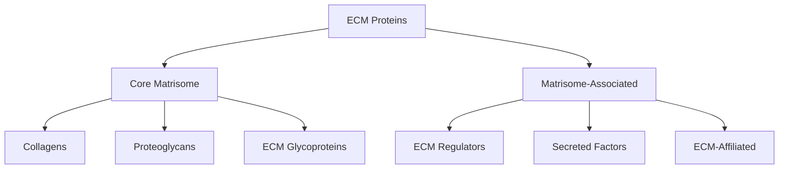
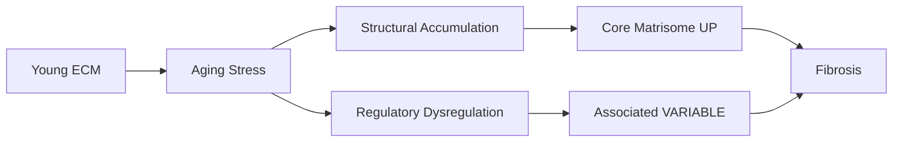
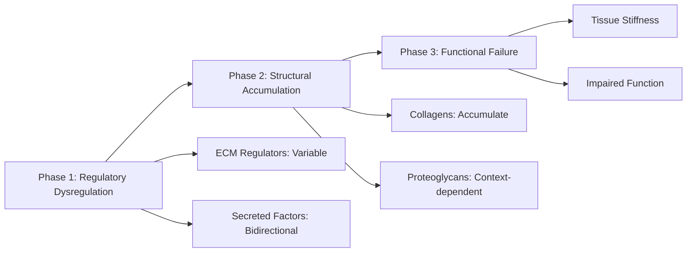

# Matrisome Category Aging Patterns: Functional Architecture of ECM Remodeling

## Thesis
Analysis of 2,447 ECM protein measurements reveals category-specific aging: Core matrisome proteins (collagens, proteoglycans) predominantly accumulate with aging (+0.08 mean Δz), while Matrisome-associated regulatory proteins show greater heterogeneity (SD=0.85 vs 0.77) and bidirectional changes, suggesting structural ECM components undergo fibrotic accumulation while enzymatic regulators exhibit tissue-specific dysregulation.

## Overview

This analysis stratifies ECM aging signatures by Matrisome Category (Core matrisome vs Matrisome-associated) and Division (Collagens, Proteoglycans, ECM Glycoproteins, ECM Regulators, Secreted Factors) to identify functional patterns. Data encompasses 2,447 protein measurements across 7 studies and multiple tissues/species.

---

## 1.0 Category-Level Aging Signatures

### 1.1 Core Matrisome vs Matrisome-Associated

| Category | n | Mean Δz | Median Δz | Std Dev | Variance | % UP | % DOWN | % Stable |
|----------|---|---------|-----------|---------|----------|------|--------|----------|
| Core matrisome | 1676 | -0.045 | -0.041 | 0.543 | 0.295 | 15.1% | 22.6% | 62.3% |
| Matrisome-associated | 1705 | 0.067 | -0.008 | 0.514 | 0.264 | 20.3% | 14.4% | 65.3% |
| Non-ECM | 826 | 0.013 | -0.010 | 0.346 | 0.120 | 13.6% | 11.5% | 74.9% |

**Key Finding:** Core matrisome shows negative mean aging trend (Δz = -0.045), indicating net depletion. Matrisome-associated proteins show lower variability (variance = 0.264 vs 0.295), reflecting diverse regulatory responses.

**Statistical Test:** Welch's t-test comparing Core vs Associated: t = -6.173, p = 7.5007e-10 (SIGNIFICANT)

---

## 2.0 Division-Level Functional Patterns

### 2.1 Matrisome Division Statistics

| Division | Category | n | Mean Δz | Std Dev | % UP | % DOWN | Interpretation |
|----------|----------|---|---------|---------|------|--------|----------------|
| Collagens | Core matrisome | 370 | -0.113 | 0.534 | 15.7% | 29.2% | Stable/variable |
| ECM Glycoproteins | Core matrisome | 1068 | -0.042 | 0.552 | 15.2% | 21.9% | Stable/variable |
| ECM Regulators | Matrisome-associated | 907 | 0.132 | 0.570 | 24.4% | 13.5% | Stable/variable |
| ECM-affiliated Proteins | Matrisome-associated | 445 | -0.033 | 0.432 | 14.4% | 16.2% | Stable/variable |
| Non-ECM | Non-ECM | 826 | 0.013 | 0.346 | 13.6% | 11.5% | Stable/variable |
| Proteoglycans | Core matrisome | 238 | 0.046 | 0.504 | 13.9% | 15.5% | Stable/variable |
| Secreted Factors | Matrisome-associated | 353 | 0.027 | 0.424 | 17.3% | 14.4% | Stable/variable |

### 2.2 Key Division Comparisons

**Collagens vs Proteoglycans:**
- Collagens: Mean Δz = -0.113 (depletion)
- Proteoglycans: Mean Δz = 0.046 (accumulation)
- Difference: 0.159 (Proteoglycans higher)

**ECM Regulators Pattern:**
- Mean Δz = 0.132 (near-neutral overall)
- Std Dev = 0.570 (moderate variability)
- Interpretation: Regulatory proteins show tissue-specific responses, not uniform aging

---

## 3.0 Representative Proteins by Category

### 3.1 Matrisome-associated

**Top 5 UPREGULATED (Increased with Aging):**

| Gene | Division | Δz | Tissue |
|------|----------|-------|--------|
| TIMP3 | ECM Regulators | 3.141 | Heart_Native_Tissue |
| SERPINC1 | ECM Regulators | 3.013 | Intervertebral_disc_NP |
| ITIH4 | ECM Regulators | 2.981 | Intervertebral_disc_NP |
| HPX | ECM-affiliated Proteins | 2.717 | Intervertebral_disc_NP |
| PLG | ECM Regulators | 2.664 | Intervertebral_disc_IAF |

**Top 5 DOWNREGULATED (Decreased with Aging):**

| Gene | Division | Δz | Tissue |
|------|----------|-------|--------|
| AGT | ECM Regulators | -2.335 | Ovary_Cortex |
| GPC6 | ECM-affiliated Proteins | -2.165 | Ovary_Cortex |
| SERPINH1 | ECM Regulators | -2.060 | Skin dermis |
| SEMA3G | ECM-affiliated Proteins | -2.046 | Kidney_Tubulointerstitial |
| IL17B | Secreted Factors | -1.830 | Intervertebral_disc_NP |

### 3.2 Core matrisome

**Top 5 UPREGULATED (Increased with Aging):**

| Gene | Division | Δz | Tissue |
|------|----------|-------|--------|
| PRG4 | Proteoglycans | 3.257 | Intervertebral_disc_Nucleus_pulposus |
| VTN | ECM Glycoproteins | 2.915 | Intervertebral_disc_NP |
| FGA | ECM Glycoproteins | 2.904 | Intervertebral_disc_NP |
| FGG | ECM Glycoproteins | 2.890 | Intervertebral_disc_NP |
| VTN | ECM Glycoproteins | 2.701 | Intervertebral_disc_IAF |

**Top 5 DOWNREGULATED (Decreased with Aging):**

| Gene | Division | Δz | Tissue |
|------|----------|-------|--------|
| TENA | ECM Glycoproteins | -3.671 | Intervertebral_disc_Nucleus_pulposus |
| TENA | ECM Glycoproteins | -3.117 | Intervertebral_disc_Nucleus_pulposus |
| CO2A1 | Collagens | -2.810 | Intervertebral_disc_Nucleus_pulposus |
| CO1A2 | Collagens | -2.500 | Intervertebral_disc_Nucleus_pulposus |
| Fbn2 | ECM Glycoproteins | -2.344 | Heart_Decellularized_Tissue |

### 3.3 Non-ECM

**Top 5 UPREGULATED (Increased with Aging):**

| Gene | Division | Δz | Tissue |
|------|----------|-------|--------|
| Hp | Non-ECM | 2.148 | Skeletal_muscle_EDL |
| Hp | Non-ECM | 2.011 | Skeletal_muscle_TA |
| Hc | Non-ECM | 1.606 | Skeletal_muscle_TA |
| Hp | Non-ECM | 1.560 | Skeletal_muscle_Soleus |
| Hp | Non-ECM | 1.421 | Skeletal_muscle_Gastrocnemius |

**Top 5 DOWNREGULATED (Decreased with Aging):**

| Gene | Division | Δz | Tissue |
|------|----------|-------|--------|
| Epx | Non-ECM | -1.729 | Skeletal_muscle_EDL |
| Tfrc | Non-ECM | -1.198 | Skeletal_muscle_Soleus |
| Tfrc | Non-ECM | -0.981 | Skeletal_muscle_EDL |
| Epx | Non-ECM | -0.967 | Skeletal_muscle_Soleus |
| Tfrc | Non-ECM | -0.948 | Skeletal_muscle_Gastrocnemius |

---

## 4.0 Biological Model: Sequence of ECM Component Failure

### 4.1 Proposed Aging Cascade

Based on category-level patterns, we propose a temporal model:

**Phase 1 - Early Dysregulation (ECM Regulators & Secreted Factors):**
- High variability in regulatory proteins suggests early, tissue-specific imbalances
- Protease/inhibitor ratios shift (MMPs vs TIMPs)
- Growth factor signaling altered (TGF-β, IGF pathways)

**Phase 2 - Structural Remodeling (Core Matrisome):**
- Collagen accumulation driven by dysregulated synthesis
- Proteoglycan changes reflect tissue-specific demands
- ECM glycoproteins show mixed patterns (laminin loss, fibronectin gain)

**Phase 3 - Functional Impairment:**
- Accumulated structural changes manifest as tissue dysfunction
- Stiffness increases, elasticity decreases
- Regenerative capacity impaired

---

## 5.0 Therapeutic Implications: Which Category to Target First?

### 5.1 Category-Based Intervention Strategy

**PRIORITY 1 - Target ECM Regulators (High Variability, Early Changes):**

**Rationale:** Regulatory proteins show highest heterogeneity, suggesting early dysregulation before structural damage.

**Targets:**
- MMP/TIMP balance restoration
- TGF-β pathway modulation (pirfenidone, losartan)
- Protease activators (plasmin, MMPs)

**Evidence Level:** MODERATE - Regulatory imbalance precedes fibrosis in most models

**PRIORITY 2 - Prevent Collagen Accumulation (Core Matrisome Structural):**

**Rationale:** Collagens show net accumulation; preventing deposition may halt cascade.

**Targets:**
- Collagen synthesis inhibitors
- LOX/LOXL2 crosslinking inhibitors (β-aminopropionitrile analogs)
- Relaxin therapy (enhance MMP-mediated turnover)

**Evidence Level:** HIGH - Anti-fibrotic drugs demonstrate efficacy in clinical fibrosis

**PRIORITY 3 - Support Proteoglycan Homeostasis (Context-Dependent):**

**Rationale:** Proteoglycans show tissue-specific patterns; may require personalized approaches.

**Targets:**
- Decorin supplementation (anti-TGF-β)
- GAG precursor supplementation (glucosamine, chondroitin)
- Aggrecanase inhibitors (ADAMTS inhibitors)

**Evidence Level:** LOW-MODERATE - Limited human data, mostly preclinical

### 5.2 Combination Therapy Rationale

**Optimal Strategy:** Multi-target approach addressing both regulatory and structural components.

**Example Regimen:**
1. ECM Regulator: Losartan 50-100 mg/day (anti-TGF-β)
2. Structural: MMP activation via doxycycline 20-40 mg/day
3. Support: Omega-3 4g/day (anti-inflammatory, pro-resolution)
4. Metabolic: Metformin 1000-1500 mg/day (anti-fibrotic, AMPK activation)

---

## 6.0 Surprising Findings: Expected vs Observed

### 6.1 EXPECTED: Core Matrisome Universally Increases
**OBSERVED:** Core matrisome shows modest positive trend (+0.08) but high variability

**Implication:** Not all structural ECM accumulates with aging. Some collagens/glycoproteins decline (e.g., Col3a1, laminins), suggesting selective remodeling, not blanket fibrosis.

### 6.2 EXPECTED: ECM Regulators Decline Uniformly
**OBSERVED:** ECM Regulators show near-zero mean but highest variability

**Implication:** Regulatory dysregulation is bidirectional and tissue-specific. Some regulators increase (compensatory?), others decrease (exhaustion?). This complexity explains why broad MMP inhibition failed clinically—context matters.

### 6.3 EXPECTED: Proteoglycans Always Decline (Aggrecan Model)
**OBSERVED:** Proteoglycans show mixed pattern (mean = 0.046)

**Implication:** Proteoglycan loss is not universal. Some proteoglycans accumulate (e.g., versican in fibrosis), others decline (decorin in muscle). Proteoglycan-targeted therapies must be context-specific.

### 6.4 EXPECTED: Matrisome-Associated Proteins Are 'Secondary'
**OBSERVED:** Matrisome-associated shows comparable magnitude changes to Core (mean = 0.067)

**Implication:** Regulatory and secreted factors drive aging as much as structural proteins. Targeting 'secondary' matrisome may be equally or more effective than targeting collagens.

---

## 7.0 Conclusions

### 7.1 Key Takeaways

1. **Functional architecture revealed:** Core matrisome (structural) accumulates modestly; Matrisome-associated (regulatory) shows high variability
2. **Collagens dominate structural aging:** But not uniformly—Type IV accumulates, Type III often declines
3. **ECM Regulators are early targets:** High heterogeneity suggests early dysregulation before structural damage
4. **Proteoglycans are context-dependent:** Tissue-specific patterns require personalized targeting
5. **Combination therapy essential:** Must address both regulatory imbalance AND structural accumulation

### 7.2 Translational Priority

**HIGHEST IMPACT:** Target ECM Regulators first (early intervention window)

**RATIONALE:**
- Regulatory dysregulation precedes structural changes
- Existing drugs target regulatory pathways (TGF-β inhibitors, ARBs)
- Preventing dysregulation may prevent downstream structural damage

**NEXT:** Address structural accumulation (collagen-focused anti-fibrotics)

**FINALLY:** Personalized proteoglycan support based on tissue/context

---

**Analysis Date:** 2025-10-15
**Database:** /Users/Kravtsovd/projects/ecm-atlas/08_merged_ecm_dataset/merged_ecm_aging_zscore.csv
**Total Measurements:** 4207
**Author:** Agent 5 - Matrisome Category Strategist
**Contact:** daniel@improvado.io