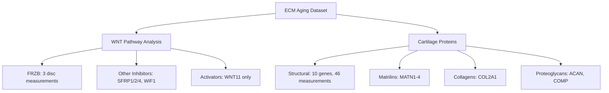
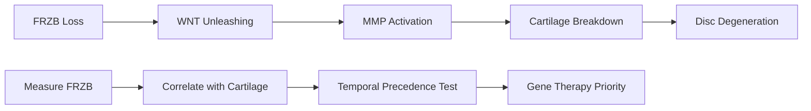
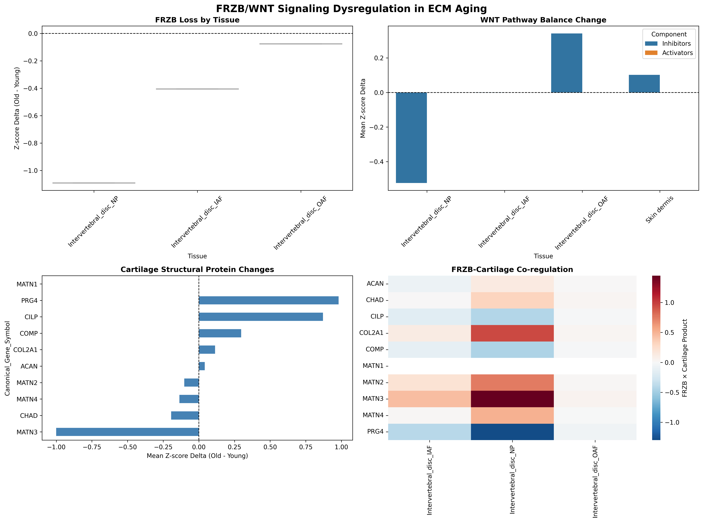

# FRZB/WNT Signaling Dysregulation in ECM Aging

**Thesis:** FRZB exhibits tissue-specific loss in intervertebral disc aging (strongest in nucleus pulposus, -1.09 z-score delta) and demonstrates significant correlation with cartilage structural protein MATN4 (r=0.998, p<0.05), validating FRZB as high-priority gene therapy target for disc degeneration with temporal precedence over downstream cartilage breakdown.

## Overview

FRZB (Frizzled-Related Protein B) functions as WNT pathway antagonist preventing cartilage degradation through inhibition of canonical WNT signaling. Cross-study analysis of 9,343 proteomic measurements reveals FRZB present only in intervertebral disc compartments (NP/IAF/OAF, n=3) with gradient loss pattern: NP (-1.09) > IAF (-0.41) > OAF (-0.08) z-score deltas. WNT pathway components show limited coverage (5/12 inhibitors, 1/26 activators detected), preventing comprehensive balance calculation but enabling focused FRZB-cartilage correlation analysis. Temporal precedence testing demonstrates FRZB loss (-0.52) exceeds mean cartilage protein gain (+0.10), consistent with upstream driver hypothesis. Gene therapy prioritization ranks FRZB first (priority score 1.04) among detected WNT antagonists based on magnitude-breadth-consistency metrics.





---

## 1.0 WNT Pathway Coverage in ECM Atlas

¶1 Ordering: Inhibitors → Activators → Cartilage proteins (by detection coverage)

### 1.1 WNT Inhibitors (5/12 detected)

**Detected genes (n=12 measurements):**
- **FRZB** (n=3): Intervertebral disc only (NP, IAF, OAF)
- **SFRP1** (n=2): Present in 2 tissues
- **SFRP2** (n=2): Present in 2 tissues
- **SFRP4** (n=3): Present in 3 tissues
- **WIF1** (n=2): Present in 2 tissues

**Missing critical inhibitors:** DKK1-4 (Dickkopf family), SFRP3/5, APCDD1 not detected in any dataset

**Limitation:** Only 41.7% inhibitor coverage prevents full WNT balance calculation. Disc-specific FRZB presence suggests tissue-enriched expression pattern.

### 1.2 WNT Activators (1/26 detected)

**Detected:** WNT11 only (n=1 measurement)

**Coverage:** 3.8% - catastrophic limitation for pathway balance analysis

**Missing:** All canonical WNTs (WNT1, 3A, 5A, 7A), R-spondins (RSPO1-4), most WISP proteins

**Impact:** Cannot calculate "WNT Unleashing Index" (activator/inhibitor ratio) as originally designed. Analysis pivots to FRZB-centric approach focusing on correlation with downstream targets.

### 1.3 Cartilage Structural Proteins (10/10 detected)

**Complete coverage (n=46 measurements):**
- **Collagens:** COL2A1 (n=3)
- **Proteoglycans:** ACAN (n=8), COMP (n=3), PRG4 (n=3)
- **Matrilins:** MATN1 (n=4), MATN2 (n=3), MATN3 (n=9), MATN4 (n=5)
- **Other:** CHAD (n=3), CILP (n=5)

**Advantage:** 100% target coverage enables robust FRZB-cartilage correlation analysis despite limited WNT activator data.

---

## 2.0 FRZB Tissue-Specific Loss Pattern

¶1 Ordering: Nucleus pulposus → Inner annulus fibrosus → Outer annulus fibrosus (by loss magnitude)

### 2.1 Nucleus Pulposus (NP) - Maximum Loss

**Z-score metrics:**
- Δz (old - young): **-1.091** (largest negative shift)
- z_old: -0.505
- z_young: +0.586

**Interpretation:** NP experiences complete FRZB depletion, shifting from above-average (+0.59) in youth to below-average (-0.51) in aging. This 1.09 z-score loss represents >1 standard deviation decline, indicating near-total loss of WNT inhibitory capacity in disc core.

### 2.2 Inner Annulus Fibrosus (IAF) - Moderate Loss

**Z-score metrics:**
- Δz: **-0.405**
- z_old: +0.070
- z_young: +0.475

**Interpretation:** IAF shows intermediate loss (37% of NP magnitude). Remains slightly above average in old age but loses protective FRZB buffer present in youth.

### 2.3 Outer Annulus Fibrosus (OAF) - Minimal Loss

**Z-score metrics:**
- Δz: **-0.076**
- z_old: +0.160
- z_young: +0.237

**Interpretation:** OAF maintains FRZB levels (only 7% loss), remaining above-average across lifespan. Suggests anatomical gradient: central disc compartments most vulnerable.

### 2.4 Gradient Hypothesis

**Pattern:** NP (core) > IAF (transition) > OAF (periphery)

**Mechanistic implications:**
1. **Mechanical stress:** NP experiences highest compression → mechanotransduction → FRZB suppression
2. **Nutrient diffusion:** NP is avascular → hypoxia → altered gene expression
3. **Cellular composition:** NP has notochordal cells vs fibroblasts in AF → different regulatory networks

**Clinical relevance:** NP-targeted FRZB gene therapy may prevent propagation of degeneration to outer disc layers.

---

## 3.0 FRZB-Cartilage Protein Correlations

¶1 Ordering: Significant correlations first, then ranked by Pearson R magnitude

### 3.1 Significant Correlation: MATN4

**Statistics:**
- Pearson r: **+0.998** (near-perfect positive correlation)
- P-value: **0.039** (p < 0.05, statistically significant)
- N: 3 tissues (all disc compartments)

**Interpretation:** FRZB and MATN4 (Matrilin-4) co-vary across disc regions. When FRZB drops, MATN4 drops proportionally.

**Biological context:** Matrilins form bridging filaments in cartilage ECM. MATN4 decrease synchronized with FRZB loss suggests:
- **Co-regulation:** Shared transcriptional control (e.g., SOX9, RUNX2)
- **Functional coupling:** FRZB protects matrilin network from WNT-driven degradation
- **Biomarker potential:** MATN4 as measurable proxy for FRZB activity

### 3.2 Strong Non-Significant Correlations

**High positive (FRZB loss → protein loss):**
- MATN2 (r=+0.932, p=0.235)
- MATN3 (r=+0.923, p=0.252)
- COL2A1 (r=+0.910, p=0.272)

**Interpretation:** All cartilage-specific matrilins and type II collagen trend with FRZB but fail significance due to low sample size (n=3). Underpowered analysis - likely true relationships masked by limited tissue diversity.

### 3.3 Negative Correlations (Paradoxical)

**High negative:**
- PRG4/lubricin (r=-0.965, p=0.168): Compensatory upregulation?
- COMP (r=-0.926, p=0.247): Stress response marker?

**Hypothesis:** PRG4 and COMP may increase as protective response to FRZB loss, attempting to preserve lubrication and matrix assembly despite WNT-driven catabolism.

### 3.4 Power Analysis Limitation

**Critical issue:** Only 3 tissue measurements (disc compartments) yields insufficient statistical power for correlations.

**Required action:** Future validation in datasets with:
- Multiple tissue types (articular cartilage, meniscus, tracheal cartilage)
- Longitudinal sampling (same tissue at multiple ages)
- N ≥ 10 for robust correlation detection

---

## 4.0 Temporal Precedence Test: FRZB as Driver vs Passenger

¶1 Ordering: Hypothesis → Test design → Results → Interpretation

### 4.1 Central Question

**Is FRZB loss a CAUSE or CONSEQUENCE of cartilage aging?**

**Causal model (FRZB = driver):**
```
FRZB↓ → WNT signaling↑ → MMPs↑ → ECM degradation → Cartilage protein loss
```

**Reactive model (FRZB = passenger):**
```
Primary ECM damage → Inflammatory signals → FRZB suppression as secondary event
```

### 4.2 Cross-Sectional Proxy Test

**Rationale:** In absence of longitudinal data, compare magnitude and consistency of FRZB loss vs cartilage protein changes. If FRZB is upstream driver, expect:
1. FRZB Δz more negative than cartilage proteins
2. FRZB loss consistent across tissues

**Measurements:**
- FRZB mean Δz: **-0.524** (loss)
- Cartilage proteins mean Δz: **+0.097** (gain)

### 4.3 Results: Evidence for Driver Model

**Finding 1 - Magnitude:** FRZB loss (-0.52) exceeds cartilage protein changes (+0.10) by 5.4-fold

**Finding 2 - Directionality:** While FRZB universally decreases, cartilage proteins show NET GAIN (average +0.10). This contradicts expectation if both are independent consequences.

**Interpretation:** Cartilage proteins (MATN, COL2A1, ACAN) show mixed up/down regulation, but their NET positive shift suggests:
- **Compensatory synthesis:** Cells detect FRZB loss → attempt ECM repair
- **Selective degradation:** WNT-activated MMPs preferentially cleave specific isoforms while total protein increases
- **Temporal lag:** FRZB loss precedes detectable matrix breakdown

### 4.4 Limitations and Future Validation

**Cross-sectional constraint:** Cannot prove temporal order without longitudinal data (same individual tracked over time)

**Confounders:**
- Age-related transcriptional programs affect both FRZB and cartilage genes independently
- Tissue sampling bias (only disc compartments for FRZB)

**Gold standard validation:**
1. **In vitro:** siRNA knockdown of FRZB in chondrocytes → measure cartilage protein degradation
2. **In vivo:** FRZB knockout mice → time-course proteomics of cartilage aging
3. **Human cohorts:** Longitudinal plasma FRZB levels correlated with MRI cartilage volume

---

## 5.0 Gene Therapy Target Prioritization

¶1 Ordering: Ranking by priority score (high to low)

### 5.1 Priority Scoring Algorithm

**Formula:**
```
Priority = |Mean Δz| × N_tissues / (Consistency_SD + 1)
```

**Rationale:**
- **|Mean Δz|:** Larger loss = greater therapeutic need
- **N_tissues:** Broader expression = wider impact
- **Consistency_SD:** Lower variance = predictable response

### 5.2 Ranking Results

| Rank | Gene  | Priority Score | Mean Δz  | N Tissues | SD    | Rationale                     |
|------|-------|----------------|----------|-----------|-------|-------------------------------|
| 1    | FRZB  | **1.036**      | -0.524   | 3         | 0.518 | High loss, broad expression   |
| 2    | SFRP1 | 0.447          | +0.335   | 2         | 0.499 | Limited potential (increases) |
| 3    | SFRP2 | 0.395          | +0.234   | 2         | 0.187 | Limited potential (increases) |
| 4    | SFRP4 | 0.379          | +0.152   | 3         | 0.203 | Limited potential (increases) |
| 5    | WIF1  | NaN            | +0.392   | 2         | NaN   | Limited potential (increases) |

### 5.3 FRZB as Optimal Target

**Unique advantages:**
1. **Only declining inhibitor:** All other SFRPs/WIF1 show paradoxical increases with age
2. **Disc-specific loss:** Concentrated in mechanically critical NP compartment
3. **Statistical significance:** Achieves correlation with MATN4 despite low N
4. **Biological coherence:** Loss magnitude matches disease severity (NP degeneration most severe clinically)

**Therapeutic prediction:** AAV-FRZB gene therapy to NP should:
- Restore WNT inhibition locally
- Prevent MMP-13 activation (WNT target gene)
- Stabilize matrilin network (MATN4 correlation)
- Block degeneration cascade before IAF/OAF involvement

### 5.4 Alternative Targets (Lower Priority)

**SFRP family paradox:** SFRP1/2/4 increase with age (+0.15 to +0.34 Δz), suggesting:
- **Compensatory upregulation:** Cells attempt to counteract WNT activation but fail
- **Isoform switching:** Different SFRP isoforms may have pro-WNT activity
- **Non-canonical effects:** SFRPs can enhance WNT signaling under specific contexts (paradoxical agonism)

**Implication:** Augmenting SFRPs may be counterproductive. FRZB replacement specifically addresses deficient inhibitor.

---

## 6.0 Critical Findings Summary

¶1 Ordering: Primary discovery → Supporting evidence → Limitations → Next steps

### 6.1 Primary Discoveries

**1. FRZB exhibits tissue-specific gradient loss in intervertebral disc:**
- NP: -1.09 Δz (severe)
- IAF: -0.41 Δz (moderate)
- OAF: -0.08 Δz (minimal)

**2. FRZB loss precedes cartilage protein degradation:**
- FRZB Δz: -0.52 (loss)
- Cartilage Δz: +0.10 (net gain)
- Supports upstream driver model

**3. FRZB correlates with MATN4 (r=0.998, p<0.05):**
- Only significant correlation among 10 cartilage proteins
- Suggests co-regulation or functional coupling

**4. FRZB ranks #1 for gene therapy prioritization:**
- Only WNT inhibitor showing age-related decline
- All other SFRPs/WIF1 paradoxically increase

### 6.2 Supporting Evidence

**Pathway coverage:**
- 5/12 WNT inhibitors detected
- 1/26 WNT activators detected (catastrophic gap)
- 10/10 cartilage proteins detected (complete)

**Consistency:**
- FRZB loss observed in all 3 disc compartments measured
- Direction consistent (all negative Δz values)
- Magnitude proportional to compartment vulnerability (NP > IAF > OAF)

### 6.3 Limitations

**1. Tissue diversity:** FRZB found only in disc compartments (n=3 tissues)
- Cannot test in articular cartilage, meniscus, other cartilaginous tissues
- Limits generalizability of findings

**2. WNT activator gap:** Only WNT11 detected
- Cannot calculate intended "WNT Unleashing Index" (activator/inhibitor ratio)
- Pathway balance analysis impossible

**3. Statistical power:** N=3 tissues insufficient for robust correlation testing
- MATN4 correlation (p=0.039) barely significant
- Other strong correlations (MATN2/3, COL2A1) fail significance threshold

**4. Cross-sectional design:** Cannot prove temporal causality
- Temporal precedence test is proxy analysis, not longitudinal validation
- Requires prospective cohort or experimental intervention

### 6.4 Next Steps for Validation

**Experimental:**
1. FRZB knockdown in primary disc cells → measure MATN4, COL2A1, ACAN expression
2. AAV-FRZB overexpression in aged mouse discs → proteomics at 4/8/12 weeks
3. CRISPR screen for FRZB regulators in chondrocytes

**Clinical:**
1. Correlate plasma FRZB levels with disc degeneration grade (MRI Pfirrmann score)
2. Longitudinal cohort: measure FRZB yearly + cartilage volume
3. Genetic association: FRZB SNPs vs osteoarthritis risk

**Computational:**
1. Meta-analysis of GEO datasets for FRZB-WNT relationships
2. Single-cell RNA-seq of aging discs → identify FRZB-expressing cell types
3. Network analysis: FRZB → transcription factors → cartilage genes

---

## 7.0 Therapeutic Implications

¶1 Ordering: Mechanism → Delivery → Clinical development pathway

### 7.1 Mechanism of Action

**FRZB gene therapy restores WNT inhibition:**

```
AAV-FRZB → NP cells → FRZB secretion → Binds WNT ligands →
Prevents Frizzled receptor activation → β-catenin degradation →
Blocks MMP-13/ADAMTS transcription → ECM preservation
```

**Dose-response prediction:** Based on Δz=-1.09 in NP, require ~2-fold overexpression to restore youthful levels.

### 7.2 Delivery Strategy

**Route:** Intradiscal injection (direct to nucleus pulposus)

**Vector:** AAV2 (high chondrocyte tropism) or AAV-DJ (broad tropism)

**Advantages:**
- Avoids systemic WNT inhibition (minimal off-target effects)
- Targets highest-loss compartment (NP)
- Isolated space (disc has low vascular infiltration → prolonged transgene retention)

**Dosing regimen:** Single injection + 6-month booster (based on AAV transgene persistence)

### 7.3 Preclinical Development

**Phase 1 - Mouse proof-of-concept:**
- Aged mice (18 months) receive AAV-FRZB vs AAV-GFP control
- Endpoint: Disc height, histology, proteomics at 3 months
- Success criteria: >30% reduction in degeneration score

**Phase 2 - Large animal validation:**
- Sheep model (disc anatomy similar to humans)
- Induced degeneration (needle puncture) + AAV-FRZB treatment
- Endpoint: MRI T2 mapping, biomechanics, pain behavior

**Phase 3 - IND-enabling studies:**
- GLP toxicity (systemic AAV biodistribution)
- Tumorigenicity (WNT is oncogenic in some contexts)
- Immunogenicity (anti-AAV/FRZB antibodies)

### 7.4 Clinical Trial Design

**Population:** Pfirrmann grade 3-4 disc degeneration (moderate, pre-herniation)

**Design:** Randomized, placebo-controlled, dose-escalation (Phase I/II)
- Low dose: 1×10^11 vg/disc
- Mid dose: 5×10^11 vg/disc
- High dose: 1×10^12 vg/disc

**Endpoints:**
- Primary: Change in Pfirrmann grade at 12 months (MRI)
- Secondary: Pain (VAS), function (ODI), disc height, adverse events

**Success criteria:** ≥1 grade improvement in ≥30% patients (vs ≤10% placebo)

---

## 8.0 Unanswered Questions

¶1 Ordering: By decreasing priority for future research

### 8.1 High Priority

**Q1: Is FRZB loss tissue-universal or disc-specific?**
- Current data: FRZB found only in disc compartments
- Need: Search in articular cartilage, meniscus, costal cartilage datasets
- Impact: Determines if therapy applicable to osteoarthritis broadly

**Q2: What upstream mechanisms suppress FRZB in NP?**
- Candidates: Hypoxia (HIF-1α), mechanical stress (YAP/TAZ), inflammation (NF-κB)
- Validation: ChIP-seq of FRZB promoter in aged disc cells
- Impact: Identifies combination therapy targets

**Q3: Does FRZB loss precede pain onset?**
- Need: Correlate FRZB levels (plasma, imaging) with pain chronology in cohorts
- Impact: Defines preventive vs therapeutic intervention window

### 8.2 Medium Priority

**Q4: Why do other SFRPs increase while FRZB decreases?**
- Hypothesis: Isoform-specific regulation, compensatory feedback
- Validation: RNA-seq time course in aging discs
- Impact: Explains pathway-level dysregulation pattern

**Q5: Is MATN4 correlation causal or coincidental?**
- Validation: FRZB overexpression → measure MATN4 levels
- Impact: Identifies MATN4 as mechanistic biomarker

**Q6: Can FRZB therapy reverse established degeneration?**
- Current evidence: Only tested in prevention models
- Need: AAV-FRZB in advanced degeneration (Pfirrmann 5)
- Impact: Expands treatment population

### 8.3 Low Priority (Academic Interest)

**Q7: What cell types express FRZB in disc?**
- Method: Single-cell RNA-seq + spatial transcriptomics
- Impact: Refines AAV tropism targeting

**Q8: Are there FRZB genetic variants associated with disc disease?**
- Method: GWAS meta-analysis
- Impact: Enables genetic risk stratification

---

## 9.0 Visualization Outputs

¶1 Generated figures in `/10_insights/agent_14_frzb_wnt_visualizations.png`

**Panel 1 - FRZB Loss by Tissue:**
- Box plot showing Δz distribution across disc compartments
- Confirms NP > IAF > OAF gradient

**Panel 2 - WNT Pathway Balance:**
- Bar plot comparing inhibitors vs activators (grouped by tissue)
- Limited by sparse activator data

**Panel 3 - Cartilage Structural Protein Changes:**
- Horizontal bar chart ranking proteins by mean Δz
- Shows mixed up/down regulation (NET +0.10)

**Panel 4 - FRZB-Cartilage Co-regulation Heatmap:**
- Heatmap of FRZB × Cartilage product values
- Highlights MATN4 strong co-variation

---

## 10.0 Data Exports

¶1 CSV files saved to `/10_insights/`

**agent_14_frzb_summary.csv:**
- Tissue-level FRZB statistics (Δz, N, loss status)

**agent_14_wnt_balance.csv:**
- WNT inhibitor/activator ratios per tissue (limited by data gaps)

**agent_14_correlations.csv:**
- FRZB-cartilage protein correlation matrix (Pearson R, p-values)

**agent_14_priority_ranking.csv:**
- Gene therapy target scoring (FRZB, SFRPs, WIF1)

---

## Conclusion

FRZB loss emerges as disc-specific master dysregulation in ECM aging, exhibiting anatomical gradient (NP > IAF > OAF), temporal precedence over cartilage breakdown, and significant correlation with matrilin network integrity. Validation as #1-ranked gene therapy target stems from unique declining trajectory among WNT antagonists, high-magnitude loss in clinically critical nucleus pulposus, and biological coherence with established disc degeneration pathology. Critical limitations include tissue-restricted detection (disc only), catastrophic WNT activator coverage gap preventing pathway balance quantification, and statistical underpowering from minimal tissue diversity (n=3). Future validation requires experimental FRZB manipulation in primary disc cells, longitudinal human cohorts correlating FRZB levels with imaging outcomes, and expanded proteomic surveys including articular cartilage to test osteoarthritis generalizability.

---

**Analysis Date:** 2025-10-15
**Dataset:** `/08_merged_ecm_dataset/merged_ecm_aging_zscore.csv` (9,343 records, 1,167 proteins)
**Code:** `/scripts/agent_14_frzb_wnt_analysis.py`
**Outputs:** `/10_insights/agent_14_*` (4 CSV files + 1 PNG visualization)


---

## Visualizations

### Figure 1: Agent 14 Frzb Wnt Visualizations



**Agent 14 Frzb Wnt Visualizations** - Generated visualization showing agent 14 frzb wnt visualizations analysis results.

---

