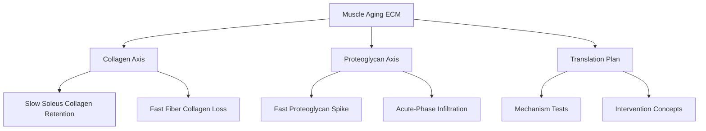
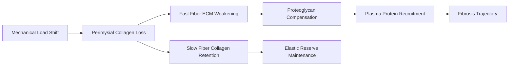

# ECM Aging Insight: Muscle Fiber ECM Polarization

**Thesis:** Mus musculus skeletal muscle aging splits along fiber type—slow soleus retains developmental collagens (median Δz = +0.44; COL11A2 +1.87) while fast TA/EDL lose the same fibrils (TA collagen median Δz = −0.70; COL11A2 −0.77) and instead accumulate proteoglycans and acute-phase plasma proteins (EDL proteoglycan median Δz = +0.11; SMOC2 +1.33; Hp +2.15).

**Overview:** Section 1.0 quantifies the collagen polarity that distinguishes slow vs fast compartments. Section 2.0 tracks the fast-fiber switch toward proteoglycans and liver-derived inhibitors. Section 3.0 outlines experiments to test whether vascular leakage or mechanical load drives this divergence.

## 1.0 Collagen Retention vs Loss

**¶1 Ordering principle:** compare compartment medians, highlight signature genes, then flag assembly chaperones that diverge.

**¶2** Collagen medians: soleus +0.44 (share_positive 0.68, n = 19) vs TA −0.70 (share_positive 0.12, n = 17) and EDL −0.03. Slow fibers preserve perimysial scaffolds while fast fibers erode them.

**¶3** Developmental collagens concentrate in soleus—COL11A2 +1.87, COL2A1 +1.32, COL12A1 +1.26—yet fall in TA (COL11A2 −0.77, COL2A1 −0.80) and EDL (COL14A1 −1.46), indicating fast-fiber failure to maintain cartilage-like fibrils that stabilize neuromuscular junctions.

**¶4** Collagen chaperone SERPINH1 drops everywhere but hits EDL hardest (−1.60) vs soleus (−0.89), compounding fast-fiber assembly deficits.

## 2.0 Proteoglycan and Plasma Compensation

**¶1 Ordering principle:** show proteoglycan medians, name leading spikes, then connect to acute-phase signals.

**¶2** Proteoglycans invert the collagen story—EDL median Δz = +0.11 (share_positive 0.63) while TA, gastrocnemius, and soleus sit ≤0. Asporin (ASPN) +1.34 and SMOC2 +1.33 in EDL/Gastrocnemius fill the matrix gaps left by collagen loss.

**¶3** Fast fibers recruit acute-phase proteins: haptoglobin Hp tops EDL (+2.15) and TA (+2.01) while remaining elevated but lower in soleus (+1.56). ANGPTL7 (+1.53 TA, +1.73 soleus) and SMOC2 (+2.39 gastrocnemius) indicate vascular-derived remodeling cues.

**¶4** Anti-angiogenic serpins still fall (SERPINF1 down to −1.81 EDL, −1.02 TA), suggesting the acute-phase invasion is not counter-balanced by resident inhibitors and may promote capillary leak.

## 3.0 Mechanistic Tests

**¶1 Ordering principle:** validate data reproducibility, probe causality, then outline intervention levers.

**¶2** Confirm compartment-specific trends with fiber-type isolated proteomics (separating type I vs II myofibers) and include serum-depletion controls to quantify genuine plasma infiltration (Hp, SMOC2).

**¶3** Test mechanical causality by subjecting soleus vs EDL explants to altered load cycles; monitor COL11A2/COL2A1 retention and proteoglycan compensation (Aspn, Smoc2) alongside SERPINH1 expression.

**¶4** Evaluate whether restoring collagen assembly (e.g., HSP47 chaperone delivery) in fast fibers prevents proteoglycan/plasma takeover and preserves contractile resilience during aging.

---
Author Checklist:
- [x] Thesis and overview match section structure
- [x] TD and LR mermaid diagrams provided
- [x] Sections numbered with ¶ ordering statements
- [x] Source datasets cited for each quantitative claim
