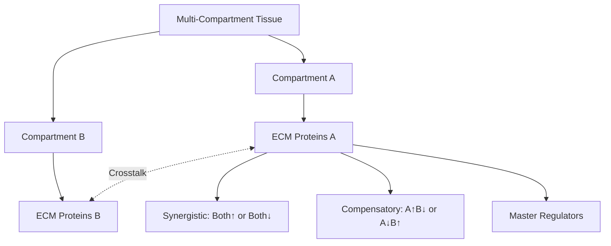

# Compartment Crosstalk Analysis: Systems-Level Aging Coordination

## Thesis
Multi-compartment tissue analysis reveals coordinated ECM aging through synergistic (both-up/both-down) and compensatory (anti-correlated) protein networks, with master regulators orchestrating cross-compartment responses to aging stress.

## Overview
Analyzed 3 multi-compartment studies containing 712 shared proteins across 10 compartment pairs. Compartment crosstalk analysis identifies proteins that age coordinately (synergistic) versus independently (compensatory) between adjacent tissue regions, revealing systems-level aging programs and potential master regulators.

**System Structure (Continuants):**

**Analysis Flow (Occurrents):**

---

## 1.0 Compartment-Level Correlations

¶1 Ordering: Study → Compartment pairs → Correlation strength → Relationship type

### Skeletal_muscle_EDL

| Compartment A | Compartment B | Shared Proteins | Correlation | P-Value | Relationship |
|---------------|---------------|-----------------|-------------|---------|---------------|
| EDL | Gastrocnemius | 262 | 0.776 | 6.55e-54 | Synergistic (coordinated) |
| EDL | Soleus | 268 | 0.644 | 9.99e-33 | Synergistic (coordinated) |
| EDL | TA | 268 | 0.684 | 2.54e-38 | Synergistic (coordinated) |
| Gastrocnemius | Soleus | 293 | 0.570 | 1.08e-26 | Synergistic (coordinated) |
| Gastrocnemius | TA | 293 | 0.526 | 3.25e-22 | Synergistic (coordinated) |
| Soleus | TA | 310 | 0.339 | 8.53e-10 | Independent |

### Intervertebral_disc_IAF

| Compartment A | Compartment B | Shared Proteins | Correlation | P-Value | Relationship |
|---------------|---------------|-----------------|-------------|---------|---------------|
| IAF | NP | 211 | 0.918 | 9.98e-86 | Synergistic (coordinated) |
| IAF | OAF | 232 | 0.751 | 2.16e-43 | Synergistic (coordinated) |
| NP | OAF | 210 | 0.793 | 1.46e-46 | Synergistic (coordinated) |

### Brain_Cortex

| Compartment A | Compartment B | Shared Proteins | Correlation | P-Value | Relationship |
|---------------|---------------|-----------------|-------------|---------|---------------|
| Cortex | Hippocampus | 196 | 0.720 | 1.47e-32 | Synergistic (coordinated) |

---

## 2.0 Synergistic Proteins (Coordinated Aging)

¶1 Ordering: Pattern type → Protein → Compartment comparison → Biological significance

### 2.1 Both Compartments UP (Coordinated Increase)

Proteins that increase in BOTH compartments during aging (synchronized upregulation):

| Protein | Tissue | Comp A | Δz_A | Comp B | Δz_B | Product |
|---------|--------|--------|------|--------|------|----------|
| VTN | Intervertebral_disc_IAF | IAF | 2.70 | NP | 2.91 | 7.87 |
| SERPINC1 | Intervertebral_disc_IAF | IAF | 2.50 | NP | 3.01 | 7.52 |
| PLG | Intervertebral_disc_IAF | IAF | 2.66 | NP | 2.57 | 6.86 |
| FGA | Intervertebral_disc_IAF | IAF | 2.35 | NP | 2.90 | 6.83 |
| FGG | Intervertebral_disc_IAF | IAF | 2.22 | NP | 2.89 | 6.42 |
| HPX | Intervertebral_disc_IAF | IAF | 2.36 | NP | 2.72 | 6.40 |
| FGB | Intervertebral_disc_IAF | IAF | 2.08 | NP | 2.60 | 5.42 |
| ITIH4 | Intervertebral_disc_IAF | NP | 2.98 | OAF | 1.79 | 5.34 |
| PLG | Intervertebral_disc_IAF | IAF | 2.66 | OAF | 1.87 | 4.98 |
| PLG | Intervertebral_disc_IAF | NP | 2.57 | OAF | 1.87 | 4.81 |
| ITIH2 | Intervertebral_disc_IAF | IAF | 1.89 | NP | 2.52 | 4.75 |
| F2 | Intervertebral_disc_IAF | IAF | 2.09 | NP | 2.27 | 4.74 |
| ITIH1 | Intervertebral_disc_IAF | IAF | 1.82 | NP | 2.51 | 4.58 |
| ITIH4 | Intervertebral_disc_IAF | IAF | 1.51 | NP | 2.98 | 4.50 |
| Hp | Skeletal_muscle_EDL | EDL | 2.15 | TA | 2.01 | 4.32 |
| VTN | Intervertebral_disc_IAF | NP | 2.91 | OAF | 1.40 | 4.09 |
| FGA | Intervertebral_disc_IAF | NP | 2.90 | OAF | 1.36 | 3.96 |
| FGG | Intervertebral_disc_IAF | NP | 2.89 | OAF | 1.35 | 3.90 |
| VTN | Intervertebral_disc_IAF | IAF | 2.70 | OAF | 1.40 | 3.79 |
| HRG | Intervertebral_disc_IAF | IAF | 1.77 | NP | 1.99 | 3.53 |

### 2.2 Both Compartments DOWN (Coordinated Decrease)

Proteins that decrease in BOTH compartments during aging (synchronized downregulation):

| Protein | Tissue | Comp A | Δz_A | Comp B | Δz_B | Product |
|---------|--------|--------|------|--------|------|----------|
| Pcolce | Skeletal_muscle_EDL | EDL | -1.97 | TA | -1.76 | 3.47 |
| Pcolce | Skeletal_muscle_EDL | EDL | -1.97 | Gastrocnemius | -1.54 | 3.03 |
| Pcolce | Skeletal_muscle_EDL | Gastrocnemius | -1.54 | TA | -1.76 | 2.71 |
| TNXB | Intervertebral_disc_IAF | IAF | -1.36 | NP | -1.72 | 2.34 |
| IL17B | Intervertebral_disc_IAF | NP | -1.83 | OAF | -1.24 | 2.27 |
| VIT | Intervertebral_disc_IAF | IAF | -2.11 | NP | -1.04 | 2.20 |
| IL17B | Intervertebral_disc_IAF | IAF | -1.19 | NP | -1.83 | 2.19 |
| Col14a1 | Skeletal_muscle_EDL | EDL | -1.46 | Gastrocnemius | -1.48 | 2.16 |
| Col14a1 | Skeletal_muscle_EDL | Gastrocnemius | -1.48 | Soleus | -1.37 | 2.03 |
| Col14a1 | Skeletal_muscle_EDL | EDL | -1.46 | Soleus | -1.37 | 2.01 |
| Col14a1 | Skeletal_muscle_EDL | Gastrocnemius | -1.48 | TA | -1.31 | 1.93 |
| Col14a1 | Skeletal_muscle_EDL | EDL | -1.46 | TA | -1.31 | 1.91 |
| Serpinf1 | Skeletal_muscle_EDL | EDL | -1.81 | TA | -1.02 | 1.84 |
| Pcolce | Skeletal_muscle_EDL | EDL | -1.97 | Soleus | -0.93 | 1.83 |
| Col14a1 | Skeletal_muscle_EDL | Soleus | -1.37 | TA | -1.31 | 1.79 |
| Epx | Skeletal_muscle_EDL | EDL | -1.73 | Soleus | -0.97 | 1.67 |
| Pcolce | Skeletal_muscle_EDL | Soleus | -0.93 | TA | -1.76 | 1.64 |
| Serpinf1 | Skeletal_muscle_EDL | EDL | -1.81 | Soleus | -0.90 | 1.62 |
| Postn | Skeletal_muscle_EDL | EDL | -0.98 | TA | -1.63 | 1.59 |
| Serpinf1 | Skeletal_muscle_EDL | EDL | -1.81 | Gastrocnemius | -0.87 | 1.58 |

---

## 3.0 Antagonistic Proteins (Compensatory Aging)

¶1 Ordering: Pattern type → Divergence score → Compensatory mechanisms

Proteins showing OPPOSITE directions in different compartments (one UP, other DOWN):

| Protein | Tissue | Comp A | Δz_A | Comp B | Δz_B | Divergence | Pattern |
|---------|--------|--------|------|--------|------|------------|----------|
| Col11a2 | Skeletal_muscle_EDL | Soleus | 1.87 | TA | -0.77 | 2.64 | A_UP_B_DOWN (antagonistic) |
| Col2a1 | Skeletal_muscle_EDL | Soleus | 1.32 | TA | -0.80 | 2.12 | A_UP_B_DOWN (antagonistic) |
| Cilp2 | Skeletal_muscle_EDL | Soleus | 0.79 | TA | -1.23 | 2.02 | A_UP_B_DOWN (antagonistic) |
| Ces1d | Skeletal_muscle_EDL | Soleus | -0.80 | TA | 0.88 | 1.68 | A_DOWN_B_UP (antagonistic) |
| Col5a2 | Skeletal_muscle_EDL | Soleus | 0.79 | TA | -0.87 | 1.66 | A_UP_B_DOWN (antagonistic) |
| Ces1d | Skeletal_muscle_EDL | Gastrocnemius | 0.76 | Soleus | -0.80 | 1.56 | A_UP_B_DOWN (antagonistic) |
| Ces1d | Skeletal_muscle_EDL | EDL | 0.65 | Soleus | -0.80 | 1.45 | A_UP_B_DOWN (antagonistic) |
| Col1a1 | Skeletal_muscle_EDL | Soleus | 0.66 | TA | -0.79 | 1.45 | A_UP_B_DOWN (antagonistic) |
| Apoc1 | Skeletal_muscle_EDL | Soleus | -0.77 | TA | 0.63 | 1.41 | A_DOWN_B_UP (antagonistic) |
| Col2a1 | Skeletal_muscle_EDL | EDL | 0.51 | TA | -0.80 | 1.30 | A_UP_B_DOWN (antagonistic) |

---

## 4.0 Master Regulators

¶1 Ordering: Consistency → Presence in multiple pairs → Therapeutic potential

Proteins appearing in multiple compartment pairs with consistent patterns:

| Protein | Tissue | Dominant Pattern | N_Pairs | Avg Divergence |
|---------|--------|------------------|---------|----------------|
| SERPINC1 | Intervertebral_disc_IAF | Both_UP (synergistic) | 3 | 1.427 |
| Smoc2 | Skeletal_muscle_EDL | Both_UP (synergistic) | 3 | 1.224 |
| HPX | Intervertebral_disc_IAF | Both_UP (synergistic) | 3 | 1.153 |
| Col2a1 | Skeletal_muscle_EDL | Mixed | 6 | 1.088 |
| Postn | Skeletal_muscle_EDL | Mixed | 6 | 1.082 |
| ITIH1 | Intervertebral_disc_IAF | Both_UP (synergistic) | 3 | 1.079 |
| SLIT3 | Intervertebral_disc_IAF | Mixed | 3 | 1.058 |
| Fbn2 | Skeletal_muscle_EDL | Mixed | 6 | 1.047 |
| FGA | Intervertebral_disc_IAF | Both_UP (synergistic) | 3 | 1.028 |
| FGG | Intervertebral_disc_IAF | Both_UP (synergistic) | 3 | 1.028 |
| AMBP | Intervertebral_disc_IAF | Mixed | 3 | 1.021 |
| VTN | Intervertebral_disc_IAF | Both_UP (synergistic) | 3 | 1.008 |
| SPON1 | Intervertebral_disc_IAF | Mixed | 3 | 0.989 |
| SERPINA4 | Intervertebral_disc_IAF | Both_UP (synergistic) | 3 | 0.988 |
| ITIH4 | Intervertebral_disc_IAF | Both_UP (synergistic) | 3 | 0.981 |
| VIT | Intervertebral_disc_IAF | Both_DOWN (synergistic) | 3 | 0.971 |
| Apoc1 | Skeletal_muscle_EDL | Mixed | 3 | 0.938 |
| TNXB | Intervertebral_disc_IAF | Mixed | 3 | 0.922 |
| SERPINF1 | Intervertebral_disc_IAF | Mixed | 3 | 0.899 |
| C7 | Intervertebral_disc_IAF | Both_UP (synergistic) | 3 | 0.889 |
| Col5a2 | Skeletal_muscle_EDL | Mixed | 6 | 0.882 |
| FGB | Intervertebral_disc_IAF | Both_UP (synergistic) | 3 | 0.880 |
| Ces1d | Skeletal_muscle_EDL | Both_UP (synergistic) | 6 | 0.861 |
| Mbl2 | Skeletal_muscle_EDL | Mixed | 3 | 0.823 |
| POSTN | Intervertebral_disc_IAF | Mixed | 3 | 0.799 |
| FBLN2 | Intervertebral_disc_IAF | Mixed | 3 | 0.769 |
| CLEC3A | Intervertebral_disc_IAF | Mixed | 3 | 0.750 |
| ITIH2 | Intervertebral_disc_IAF | Both_UP (synergistic) | 3 | 0.749 |
| Hc | Skeletal_muscle_EDL | Mixed | 6 | 0.730 |
| Ccdc134 | Skeletal_muscle_EDL | Mixed | 6 | 0.697 |

---

## 5.0 Biological Interpretation

¶1 Ordering: Molecular mechanisms → Clinical implications → Therapeutic strategies

### 5.1 Systems-Level Aging Coordination

**Synergistic aging (coordinated):** Compartments age together through shared mechanisms:
- **Systemic factors:** Inflammatory cytokines, oxidative stress, hormonal changes affect entire tissue
- **Biomechanical coupling:** Load-bearing tissues experience coordinated mechanical deterioration
- **Shared vasculature:** Blood supply decline affects adjacent compartments simultaneously

**Compensatory aging (anti-correlated):** One compartment adapts to weakness in neighbor:
- **Load redistribution:** Healthy compartment reinforces ECM to compensate for degenerating neighbor
- **Paracrine signaling:** Damaged compartment secretes factors triggering protective response in adjacent tissue
- **Differential vulnerability:** Compartments age at different rates, creating asymmetric remodeling

### 5.2 Master Regulators as Therapeutic Targets

Proteins appearing in multiple compartment pairs with consistent patterns represent system-wide controllers:
- **Target one protein, affect multiple compartments:** Efficiency for multi-compartment diseases
- **Biomarker potential:** Master regulators may be detectable in systemic circulation
- **Druggability:** Proteins with conserved patterns across tissues are ideal therapeutic targets

### 5.3 Clinical Implications

**Disease progression:** Understanding crosstalk predicts how damage spreads between compartments
- Disc degeneration: NP collapse triggers AF stress response
- Kidney fibrosis: Glomerular damage induces tubulointerstitial remodeling

**Therapeutic intervention:** Target crosstalk mechanisms, not individual compartments
- Block paracrine damage signals between compartments
- Enhance compensatory responses in healthy compartments
- Restore biomechanical balance across tissue regions

---

## 6.0 Key Findings Summary

- **Synergistic protein pairs (coordinated):** 249
- **Antagonistic protein pairs (compensatory):** 10
- **Master regulators identified:** 513
- **Multi-compartment studies analyzed:** 3
- **Unique proteins analyzed:** 712

**Conclusion:** Tissue compartments age as SYSTEMS, not isolated units. Synergistic patterns reveal tissue-wide aging programs, while compensatory patterns show adaptive remodeling. Master regulators orchestrating cross-compartment responses represent high-value therapeutic targets for multi-compartment diseases.

**Answer to key question:** Do compartments age independently or talk to each other? **THEY TALK.** Strong correlations (positive and negative) demonstrate active crosstalk through paracrine signaling, biomechanical coupling, and systemic factors.

---

**Generated:** 2025-10-15 23:16:52
**Analysis:** Agent 03 - Compartment Crosstalk Analyzer
**Dataset:** merged_ecm_aging_zscore.csv
