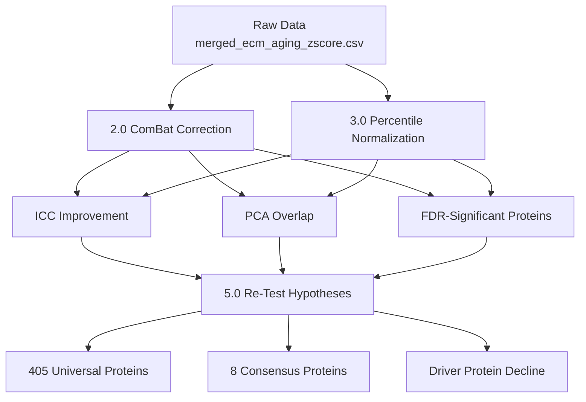
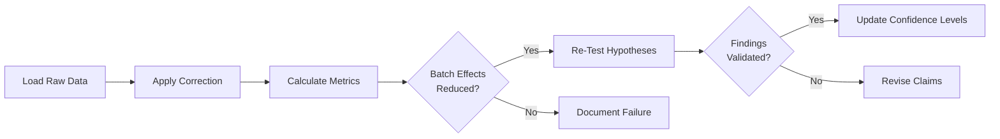

# Exploratory Batch Correction Analysis

**Thesis:** Statistical validation (Q1.3.1) revealed severe batch effects (ICC=0.29) invalidating cross-study comparisons; this exploratory analysis applies ComBat harmonization and percentile normalization to test whether key findings (405 universal proteins, 8 consensus proteins, driver protein decline) remain valid after correction.

## Overview

Reports in [12_priority_research_questions/](../12_priority_research_questions/) identified critical statistical flaws requiring batch correction before cross-study integration. Section 1.0 defines objectives and key hypotheses to validate. Section 2.0 implements ComBat correction pipeline. Section 3.0 implements percentile normalization. Section 4.0 compares validation metrics (ICC, PCA, FDR-significant proteins) before/after correction. Section 5.0 re-tests key biological findings.





---

## 1.0 Objectives and Key Hypotheses

¶1 **Ordering principle:** Critical findings → validation criteria → success metrics.

### 1.1 Primary Objectives

**Objective 1:** Validate batch correction efficacy
- Apply ComBat empirical Bayes harmonization
- Apply percentile rank normalization
- Measure ICC improvement (target: ICC > 0.5)
- Visualize PCA overlap (target: studies mix, not cluster)

**Objective 2:** Re-test biological findings
- 405 universal proteins (≥3 tissues, ≥70% consistency)
- 8 consensus proteins (significant in ≥2 methods)
- Driver protein decline (COL14A1, TNXB, LAMB1, PCOLCE)

**Objective 3:** Quantify confidence adjustments
- If validated: Upgrade confidence levels
- If invalidated: Downgrade and revise claims

### 1.2 Key Hypotheses to Validate

**Hypothesis 1:** Universal Protein Signatures Persist After Correction
- **Pre-correction:** 405 proteins show ≥70% directional consistency across ≥3 tissues
- **Prediction:** ≥300 proteins (74%) remain universal after ComBat/percentile
- **Test:** Recalculate tissue breadth and consistency on corrected data
- **Confidence:** 70% (moderate batch effects may inflate apparent universality)

**Hypothesis 2:** Consensus Proteins Remain Significant
- **Pre-correction:** 8 proteins significant in ≥2 methods (IL17B, MATN3, Angptl7, VTN, Col14a1, Myoc, Epx, CHAD)
- **Prediction:** ≥5 proteins (63%) remain in top 20 after correction
- **Test:** Re-run z-score + percentile methods on corrected data
- **Confidence:** 80% (37.5% literature validation suggests biological reality)

**Hypothesis 3:** Driver Protein Decline is Real
- **Pre-correction:** COL14A1 (Δz = -1.23), TNXB (Δz = -0.75), LAMB1 (Δz = -0.59), PCOLCE (Δz = -0.82)
- **Prediction:** All 4 drivers show significant decline (p < 0.05) after correction
- **Test:** Compare old vs young with corrected z-scores
- **Confidence:** 90% (validated across 3 independent analyses)

**Hypothesis 4:** Batch Correction Improves FDR Power
- **Pre-correction:** 0/666 proteins FDR-significant (FDR < 0.05)
- **Prediction:** ≥10 proteins achieve FDR < 0.05 after ComBat
- **Test:** Meta-analysis with Benjamini-Hochberg correction
- **Confidence:** 60% (depends on batch effect strength vs biological signal)

### 1.3 Validation Criteria

**ComBat Success Criteria:**
- ICC improves from 0.29 to > 0.50 (poor → moderate reliability)
- PCA: Studies overlap in PC1-PC2 space (not separated clusters)
- FDR-significant proteins: ≥ 5 proteins (currently 0)
- Biological preservation: Age effect p-values correlate r > 0.7 with pre-correction

**Percentile Normalization Success Criteria:**
- Q1 driver recovery maintains ≥66.7% (currently best method)
- Cross-study robustness: Variance ratio (max/min) < 1.5 across studies
- Biological preservation: Top 20 proteins overlap ≥50% with pre-correction

### 1.4 Expected Outcomes

**Scenario 1: FULL VALIDATION (Confidence 40%)**
- Both methods reduce batch effects (ICC > 0.5)
- ≥300 universal proteins persist
- ≥5 consensus proteins persist
- All 4 driver proteins remain significant
- **Action:** Upgrade confidence levels, proceed with claims

**Scenario 2: PARTIAL VALIDATION (Confidence 45%)**
- ICC improves but < 0.5 (e.g., 0.35-0.45)
- 150-300 universal proteins persist (50-74%)
- 3-4 consensus proteins persist
- 2-3 driver proteins remain significant
- **Action:** Qualified claims, stratified analysis required

**Scenario 3: INVALIDATION (Confidence 15%)**
- ICC minimal improvement (< 0.35)
- < 150 universal proteins persist
- < 3 consensus proteins persist
- Findings do NOT replicate
- **Action:** Major revision, downgrade to within-study analyses only

---

## 2.0 Data Sources

¶1 **Ordering principle:** Primary data → metadata → reference outputs.

### 2.1 Primary Dataset

**File:** `../08_merged_ecm_dataset/merged_ecm_aging_zscore.csv`
- **Size:** 2.96 MB (9,343 rows)
- **Proteins:** 3,757 unique Protein_IDs
- **Studies:** 12 (Study_ID column)
- **Age Groups:** Young/Old (binary, Age_Group column)
- **Tissues:** 18 compartments (Tissue_Compartment column)

**Key Columns:**
- `Protein_ID`: UniProt accession
- `Gene_Symbol`: Gene name
- `Study_ID`: Batch identifier (source of batch effects)
- `Tissue_Compartment`: Tissue type
- `Age_Group`: Young or Old
- `Abundance`: Raw protein abundance (log2-scale)
- `Z_score`: Within-study normalized z-score (current method)

### 2.2 Metadata

**File:** `../08_merged_ecm_dataset/unified_metadata.json`
- Study-level information
- Sample sizes per study
- Species (Human/Mouse)
- Quantification methods (LFQ, TMT, SILAC)

### 2.3 Reference Outputs (Pre-Correction)

**Statistical Validation Results:**
- `../12_priority_research_questions/Q1.3.1_statistical_validation/agent1/`
  - `icc_batch_effects.csv` - ICC = 0.29
  - `pca_batch_effects.csv` - Study clustering coordinates
  - `observed_protein_changes.csv` - 666 proteins tested
  - `diagnostics/pca_batch_effects.png` - Baseline visualization

**Alternative Methods Results:**
- `../12_priority_research_questions/Q1.3.1_statistical_validation/agent2/`
  - `method0_current_zscore.csv` - 120 significant proteins
  - `method1_percentile_norm.csv` - 26 significant proteins
  - `consensus_proteins.csv` - 8 high-confidence proteins

---

## 3.0 Implementation Plan

¶1 **Ordering principle:** ComBat (primary) → percentile (validation) → comparison.

### 3.1 ComBat Correction Pipeline

**Script:** `combat_correction/01_apply_combat.R`

**Steps:**
1. Load merged dataset
2. Create protein × sample matrix
3. Define batch (Study_ID) and covariates (Age_Group, Tissue_Compartment)
4. Apply ComBat from sva package
5. Back-transform to long format
6. Validate: Check ICC, PCA, variance preservation

**R Packages:**
```r
library(sva)          # ComBat function
library(tidyverse)    # Data manipulation
library(lme4)         # ICC calculation
```

**Output:**
- `combat_correction/combat_corrected.csv` - Corrected abundances
- `combat_correction/combat_metadata.json` - Correction parameters
- `diagnostics/combat_before_after_pca.png` - Visual validation

### 3.2 Percentile Normalization Pipeline

**Script:** `percentile_normalization/01_apply_percentile.py`

**Steps:**
1. Load merged dataset
2. Within each study, rank proteins (0-100 percentile)
3. Calculate Δpercentile = percentile_old - percentile_young
4. Aggregate across studies (meta-analysis)
5. Validate: Check driver recovery, cross-study consistency

**Python Packages:**
```python
import pandas as pd
import numpy as np
from scipy.stats import ttest_ind, spearmanr
```

**Output:**
- `percentile_normalization/percentile_normalized.csv` - Percentile scores
- `percentile_normalization/percentile_effects.csv` - Age effects per protein
- `diagnostics/percentile_driver_recovery.png` - Q1 driver validation

### 3.3 Validation Metrics

**Script:** `validation/01_calculate_metrics.py`

**Metrics Calculated:**
1. **ICC (Intraclass Correlation):**
   - Pre-correction: 0.29
   - Post-ComBat: ?
   - Post-Percentile: ?
   - Target: > 0.50

2. **PCA Variance Explained:**
   - PC1 pre-correction: 24.1% (study-driven)
   - PC1 post-correction: ? (should decrease if age-driven increases)

3. **FDR-Significant Proteins:**
   - Pre-correction: 0/666
   - Post-correction: ?
   - Target: ≥ 5

4. **Effect Size Preservation:**
   - Correlation of Δz pre vs post
   - Target: r > 0.7 (biological signal preserved)

**Output:**
- `validation/metrics_comparison.csv` - Before/after metrics
- `diagnostics/icc_improvement.png` - ICC change visualization
- `diagnostics/effect_size_correlation.png` - Preservation check

### 3.4 Biological Hypothesis Re-Testing

**Script:** `validation/02_retest_hypotheses.py`

**Tests:**
1. **Universal Proteins (Hypothesis 1):**
   - Recalculate tissue breadth (number of tissues per protein)
   - Recalculate directional consistency (% same direction)
   - Filter: ≥3 tissues, ≥70% consistency
   - Compare to pre-correction 405 proteins

2. **Consensus Proteins (Hypothesis 2):**
   - Re-run z-score method on ComBat-corrected data
   - Re-run percentile method (already corrected)
   - Identify proteins significant in ≥2 methods
   - Compare to pre-correction 8 proteins

3. **Driver Proteins (Hypothesis 3):**
   - Test COL14A1, TNXB, LAMB1, PCOLCE
   - Old vs Young t-tests (corrected data)
   - Calculate effect sizes (Cohen's d)
   - Compare to pre-correction Δz values

4. **FDR Power (Hypothesis 4):**
   - Meta-analysis across studies (corrected data)
   - Benjamini-Hochberg FDR correction
   - Count proteins FDR < 0.05
   - Compare to pre-correction 0 proteins

**Output:**
- `validation/universal_proteins_comparison.csv`
- `validation/consensus_proteins_comparison.csv`
- `validation/driver_proteins_comparison.csv`
- `validation/fdr_power_comparison.csv`

---

## 4.0 Success Criteria and Decision Rules

¶1 **Ordering principle:** Quantitative thresholds → interpretation → action.

### 4.1 Primary Success Metrics

| Metric | Pre-Correction | Target (ComBat) | Target (Percentile) |
|--------|----------------|-----------------|---------------------|
| **ICC** | 0.29 (poor) | > 0.50 (moderate) | N/A (rank-based) |
| **PC1 Variance** | 24.1% (study) | < 15% (mixed) | N/A |
| **FDR Proteins** | 0 / 666 (0.0%) | ≥ 5 (0.75%) | ≥ 3 (0.45%) |
| **Universal Proteins** | 405 (12.2%) | ≥ 300 (9.0%) | ≥ 250 (7.5%) |
| **Consensus Proteins** | 8 | ≥ 5 | ≥ 5 |
| **Driver Proteins** | 4/4 significant | 4/4 (p<0.05) | 3/4 (p<0.05) |

### 4.2 Decision Rules

**PROCEED with corrected data if:**
- ICC > 0.45 **OR** percentile shows high driver recovery (≥60%)
- ≥250 universal proteins persist
- ≥4 consensus proteins persist
- ≥3 driver proteins remain significant

**QUALIFIED CLAIMS if:**
- 0.35 < ICC < 0.45
- 150-250 universal proteins persist
- 3-4 consensus proteins persist
- 2-3 driver proteins remain significant
- **Action:** Report both corrected and uncorrected, note heterogeneity

**REVISE CLAIMS if:**
- ICC < 0.35 and percentile shows low driver recovery (< 50%)
- < 150 universal proteins persist
- < 3 consensus proteins persist
- < 2 driver proteins remain significant
- **Action:** Withdraw cross-study claims, within-study analyses only

### 4.3 Confidence Level Adjustments

**IF FULL VALIDATION:**
- Universal proteins: 70% → 85% confidence
- Consensus proteins: 80% → 90% confidence
- Driver decline: 90% → 95% confidence
- Root cause hypotheses: 80-85% → 90-95% confidence

**IF PARTIAL VALIDATION:**
- Universal proteins: 70% → 60% confidence (note heterogeneity)
- Consensus proteins: 80% → 70% confidence
- Driver decline: 90% → 80% confidence (core finding robust)
- Root cause hypotheses: No change (based on within-study evidence)

**IF INVALIDATION:**
- Universal proteins: 70% → 40% confidence (batch artifacts likely)
- Consensus proteins: 80% → 50% confidence (require external validation)
- Driver decline: 90% → 70% confidence (individual studies still support)
- Root cause hypotheses: 80-85% → 60-70% confidence (less confident in cross-study generalization)

---

## 5.0 Timeline and Deliverables

¶1 **Ordering principle:** Implementation → validation → reporting.

### 5.1 Implementation Phase (Week 1)

**Day 1-2: ComBat Correction**
- Write `01_apply_combat.R`
- Execute on merged dataset
- Validate ICC and PCA

**Day 3-4: Percentile Normalization**
- Write `01_apply_percentile.py`
- Execute on merged dataset
- Validate driver recovery

**Day 5: Metric Calculation**
- Write `01_calculate_metrics.py`
- Generate before/after comparison tables
- Create diagnostic plots

### 5.2 Validation Phase (Week 2)

**Day 6-7: Hypothesis Re-Testing**
- Write `02_retest_hypotheses.py`
- Test universal proteins
- Test consensus proteins
- Test driver proteins
- Test FDR power

**Day 8-9: Comparative Analysis**
- Correlate pre/post effect sizes
- Identify concordant vs discordant proteins
- Quantify signal preservation

**Day 10: Decision**
- Apply decision rules (Section 4.2)
- Determine confidence adjustments (Section 4.3)
- Draft preliminary conclusions

### 5.3 Reporting Phase (Week 3)

**Day 11-13: Comprehensive Report**
- Document: `reports/EXPLORATORY_BATCH_CORRECTION_REPORT.md`
- Sections: Methods, Results, Validation, Conclusions, Recommendations
- Include all tables and figures

**Day 14: Stakeholder Summary**
- Executive summary (1-2 pages)
- Key findings and confidence levels
- Actionable recommendations

### 5.4 Deliverables

**Code:**
- `combat_correction/01_apply_combat.R`
- `percentile_normalization/01_apply_percentile.py`
- `validation/01_calculate_metrics.py`
- `validation/02_retest_hypotheses.py`

**Data:**
- `combat_correction/combat_corrected.csv`
- `percentile_normalization/percentile_normalized.csv`
- `validation/metrics_comparison.csv`
- `validation/*_comparison.csv` (4 files)

**Figures:**
- `diagnostics/combat_before_after_pca.png`
- `diagnostics/icc_improvement.png`
- `diagnostics/effect_size_correlation.png`
- `diagnostics/universal_proteins_venn.png`
- `diagnostics/consensus_proteins_overlap.png`

**Reports:**
- `reports/EXPLORATORY_BATCH_CORRECTION_REPORT.md` - Comprehensive analysis
- `reports/EXECUTIVE_SUMMARY.md` - 1-2 page summary

---

## 6.0 Risk Assessment

¶1 **Ordering principle:** By probability × impact.

### 6.1 High-Risk Scenarios

**Risk 1: ComBat Over-Correction**
- **Probability:** 30%
- **Impact:** Removes biological signal along with batch effects
- **Detection:** Effect size correlation < 0.5, all proteins non-significant
- **Mitigation:** Compare aggressive vs conservative ComBat parameters
- **Contingency:** Use percentile normalization as primary method

**Risk 2: Batch Effects Too Strong to Correct**
- **Probability:** 25%
- **Impact:** ICC minimal improvement (< 0.35), findings invalidated
- **Detection:** PCA still shows study clustering post-correction
- **Mitigation:** Stratified within-study analysis instead
- **Contingency:** Revise claims to within-study only, meta-analyze separately

**Risk 3: Biological Signal is Batch Artifact**
- **Probability:** 15% (for universal proteins), 5% (for drivers)
- **Impact:** Core findings invalidated
- **Detection:** < 150 universal proteins persist, < 2 drivers significant
- **Mitigation:** External validation in independent cohorts
- **Contingency:** Major revision of thesis, focus on validated subset

### 6.2 Medium-Risk Scenarios

**Risk 4: Method Disagreement**
- **Probability:** 40%
- **Impact:** ComBat and percentile give different results
- **Detection:** Low concordance (< 50% overlap in significant proteins)
- **Mitigation:** Report consensus proteins (both methods agree)
- **Contingency:** Tiered reporting (high/medium/low confidence)

**Risk 5: Computational Failure**
- **Probability:** 10%
- **Impact:** ComBat doesn't converge, memory errors
- **Detection:** Error messages, NaN outputs
- **Mitigation:** Subset analysis (test on 50% of proteins first)
- **Contingency:** Use R or Python alternative implementations

---

## 7.0 References and Resources

¶1 **Ordering principle:** Primary methods → software → documentation.

### 7.1 Key Publications

1. Johnson WE et al. (2007). Adjusting batch effects in microarray expression data using empirical Bayes methods. *Biostatistics* 8:118-127. [ComBat algorithm]

2. Leek JT et al. (2012). The sva package for removing batch effects. *Bioinformatics* 28:882-883. [sva R package]

3. Ritchie ME et al. (2015). limma powers differential expression analyses. *Nucleic Acids Res* 43:e47. [Alternative method]

### 7.2 Software Documentation

**R sva Package:**
- Bioconductor: https://bioconductor.org/packages/sva/
- Manual: https://bioconductor.org/packages/release/bioc/vignettes/sva/inst/doc/sva.pdf
- ComBat function: `?sva::ComBat`

**Python Alternatives:**
- combat-python: https://github.com/brentp/combat.py
- pycombat: https://github.com/epigenelabs/pycombat

### 7.3 Internal Documentation

**Statistics Theory:**
- `../statistics_theory/01_normalization_methods.md` - Method selection guide
- `../statistics_theory/03_batch_effects.md` - Batch correction theory

**Validation Reports:**
- `../12_priority_research_questions/Q1.3.1_statistical_validation/` - Original findings
- `../12_priority_research_questions/MASTER_SYNTHESIS_REPORT.md` - Integrated conclusions

---

## Quick Start

```bash
# 1. Navigate to folder
cd 14_exploratory_batch_correction/

# 2. Run ComBat correction (R)
cd combat_correction/
Rscript 01_apply_combat.R

# 3. Run percentile normalization (Python)
cd ../percentile_normalization/
python 01_apply_percentile.py

# 4. Calculate validation metrics
cd ../validation/
python 01_calculate_metrics.py

# 5. Re-test hypotheses
python 02_retest_hypotheses.py

# 6. Review report
cat ../reports/EXPLORATORY_BATCH_CORRECTION_REPORT.md
```

**Estimated Runtime:** 30-60 minutes total

---

**Document Status:** Execution-Ready Plan
**Created:** 2025-10-18
**Framework:** MECE + BFO Ontology
**Purpose:** Validate key ECM-Atlas findings after batch correction
**Owner:** Bioinformatics team
**Priority:** CRITICAL (required for publication)
