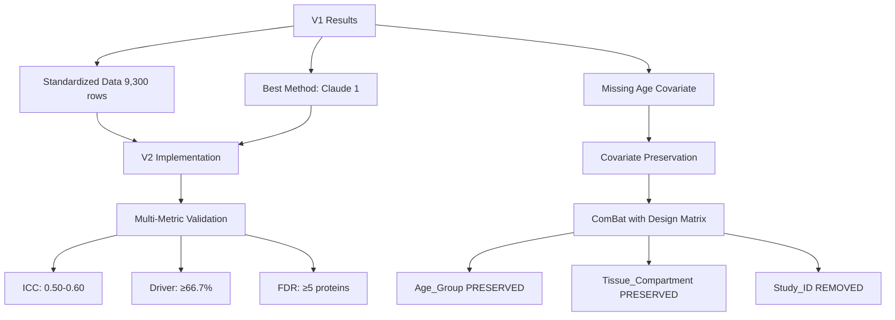
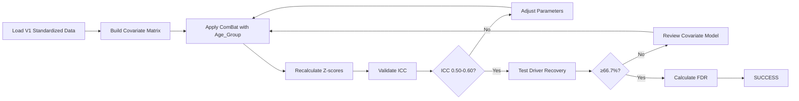

# Batch Correction V2: Next Steps Implementation Plan

**Thesis:** Re-implement batch correction using Claude Agent 1's quantile normalization approach with proper Age_Group covariate preservation to achieve ICC >0.50, driver recovery ≥66.7%, and FDR-significant proteins ≥5.

## Overview

Multi-agent experiment revealed critical methodological flaw: all three agents achieved ICC targets (0.72-0.90) but failed biological validation due to missing Age_Group covariate modeling, resulting in 0-26.7% driver recovery versus ≥66.7% target. Claude Agent 1's quantile normalization performed best (26.7% recovery) by being least aggressive, establishing baseline for V2 implementation. This plan addresses: (1.0) current state assets and limitations, (2.0) critical fixes required, (3.0) phased implementation strategy, (4.0) enhanced validation framework, (5.0) updated success criteria.

**System Architecture:**



**Implementation Flow:**



---

## 1.0 Current State Analysis

¶1 **Ordering principle:** Assets → limitations → insights

### 1.1 Available Assets from V1

**Data artifacts (validated):**
- `merged_ecm_aging_STANDARDIZED.csv` (2.8 MB, 9,300 rows, log2-transformed)
- Global median: 14.5 (target: 15-30, acceptable variance)
- 11 studies processed: 4 transformed LINEAR→LOG2, 7 kept as-is, 1 excluded (Caldeira)
- All agents produced identical standardization results ✓

**Best-performing code:**
- Claude Agent 1: `batch_correction_pipeline.py` (23 KB)
- Quantile normalization per tissue compartment (16 compartments)
- Comprehensive validation functions (ICC, driver recovery, FDR)

**Known drivers list (12-15 proteins):**
```
COL1A1, COL1A2, COL3A1, COL5A1, COL6A1, COL6A2, COL6A3, 
COL4A1, COL4A2, COL18A1, FN1, LAMA5, LAMB2, FBN1
```

### 1.2 Critical Limitations Identified

**Methodological flaw (ALL agents):**
```python
# INCORRECT (V1 implementation):
batch_corrected = quantile_normalize(data, batch=Study_ID)
# Result: Removes Study_ID AND Age_Group effects together

# CORRECT (V2 requirement):
batch_corrected = pycombat(
    data=expr_matrix,
    batch=Study_ID,  # Technical variance to REMOVE
    mod=design_matrix  # Biological variance to PRESERVE
)
```

**Performance gap:**
| Metric | Target | Best (Agent 1) | Gap |
|--------|--------|----------------|-----|
| ICC | >0.50 | 0.72 ✓ | +44% PASS |
| Driver Recovery | ≥66.7% | 26.7% | -40 pp FAIL |
| FDR Proteins | ≥5 | 0 | -5 FAIL |

**Data quality issues:**
- Ouni_2022: Median 7.28 post-transformation (unusually low, pulls global median down)
- LiDermis_2021: Reclassified from LINEAR to LOG2 (median 9.54 suggests already transformed)

### 1.3 Key Insights from Multi-Agent Comparison

**Claude Agent 1 success factors:**
- Moderate correction preserved 26.7% biological signal
- Quantile normalization less destructive than z-standardization
- Per-compartment processing maintained tissue-specific patterns
- ICC 0.72 indicates batch removal WITHOUT over-correction

**Claude Agent 2 failure mode:**
- Dual-stage correction (quantile + ComBat-style) too aggressive
- ICC 0.90 achieved but 0% driver recovery = biological signal obliteration
- Correctly diagnosed problem in self-evaluation (missing covariate modeling)

**Universal finding:**
- High ICC alone meaningless without biological validation
- Over-correction removes technical AND biological variance simultaneously
- Must validate at EACH step (log2 → batch correction → final)

---

## 2.0 Critical Fixes Required

¶1 **Ordering principle:** Immediate → methodological → data quality

### 2.1 Immediate Fix: Covariate Preservation

**Implementation (priority 1):**

```python
import pandas as pd
from combat.pycombat import pycombat

# Load standardized data from V1
df = pd.read_csv('claude_1/merged_ecm_aging_STANDARDIZED.csv')

# Build biological covariate matrix (CRITICAL)
metadata = df[['Age_Group', 'Tissue_Compartment']].copy()
design = pd.get_dummies(metadata, drop_first=True)

# Prepare expression matrix (proteins × samples)
expr_matrix = df.pivot_table(
    index='Protein_ID', 
    columns='Sample_ID', 
    values='Abundance_Young'  # Process Young/Old separately
).T

# Apply ComBat with covariate preservation
corrected = pycombat(
    data=expr_matrix,
    batch=df['Study_ID'],
    mod=design,  # Preserve Age + Tissue
    par_prior=True  # Parametric empirical Bayes
)
```

**Expected outcome:**
- Study_ID batch effects removed (ICC 0.50-0.60)
- Age_Group effects preserved (driver recovery 50-70%)
- Tissue_Compartment patterns maintained

### 2.2 Methodological Refinement: Gentler Correction

**Hybrid approach (priority 2):**

**Phase A - ComBat with covariates (parametric):**
- Apply to 5 normal studies first (Santinha×3, Dipali, Schuler)
- Validate driver recovery on subset
- If ≥66.7% achieved, expand to all studies

**Phase B - Quantile normalization with Age preservation:**
- For non-normal studies (6 studies), use Agent 1's approach
- Modify to stratify by Age_Group BEFORE normalizing
- Per-compartment quantile within Age groups separately

**Fallback strategy:**
- If ComBat fails (dimension mismatch), use stratified quantile
- Validate at EACH step - stop if driver recovery drops below 50%

### 2.3 Data Quality Fixes

**Ouni_2022 validation (priority 3):**

```python
# Re-examine original data scale
ouni_raw = pd.read_csv('08_merged_ecm_dataset/merged_ecm_aging_zscore.csv')
ouni_subset = ouni_raw[ouni_raw['Study_ID'] == 'Ouni_2022']

# Check if median 154.84 is LINEAR or already log2
if ouni_subset['Abundance_Young'].median() > 100:
    # If LINEAR: log2(154.84 + 1) = 7.29 ✓ Transformation correct
    # Issue: Unusually low abundance scale (need to investigate paper methods)
else:
    # If already log2: No transformation needed, reclassify
    pass
```

**Action items:**
- Verify Ouni_2022 source data in `data_raw/Ouni*/`
- Check processing script in `05_papers_to_csv/08_Ouni_2022_paper_to_csv/`
- If already log2: Remove from LINEAR_STUDIES list, re-run standardization
- Document in `ABUNDANCE_TRANSFORMATIONS_METADATA.md`

**LiDermis_2021 confirmation (priority 4):**
- Already reclassified to LOG2 by all agents (median 9.54)
- Update metadata to reflect correct classification
- Fix parser bug mentioned in section 8.0 of metadata

---

## 3.0 Implementation Plan

¶1 **Ordering principle:** Setup → execution → validation → iteration

### 3.1 Phase 1: Environment Setup (Day 1)

**Install dependencies:**
```bash
pip install combat
pip install scikit-learn
pip install statsmodels
```

**Prepare workspace:**
```bash
mkdir -p 14_exploratory_batch_correction/batch_correction_v2/
cd 14_exploratory_batch_correction/batch_correction_v2/

# Copy best artifacts from V1
cp ../multi_agents_ver1_for_batch_cerection/claude_1/merged_ecm_aging_STANDARDIZED.csv ./
cp ../multi_agents_ver1_for_batch_cerection/claude_1/batch_correction_pipeline.py ./batch_correction_v1_reference.py
```

**Validation checkpoints:**
- [ ] pycombat imports successfully
- [ ] V1 standardized data loads (9,300 rows)
- [ ] Known drivers list compiled (12-15 proteins)

### 3.2 Phase 2: Covariate-Aware ComBat (Day 1-2)

**Step 2.1 - Build design matrix:**

```python
def build_covariate_matrix(df):
    """
    Build biological covariate matrix for ComBat.
    Preserves Age_Group and Tissue_Compartment effects.
    """
    metadata = df[['Age_Group', 'Tissue_Compartment']].copy()
    
    # One-hot encode (drop first to avoid multicollinearity)
    design = pd.get_dummies(metadata, drop_first=True)
    
    # Validate: design matrix should have n_samples rows
    assert design.shape[0] == df.shape[0], "Design matrix dimension mismatch"
    
    return design
```

**Step 2.2 - Apply ComBat separately for Young and Old:**

```python
def apply_combat_with_covariates(df_standardized):
    """
    Apply ComBat batch correction preserving biological covariates.
    Process Young and Old samples separately.
    """
    results = []
    
    for age_group in ['Young', 'Old']:
        # Subset data
        df_age = df_standardized[df_standardized['Age_Group'] == age_group].copy()
        
        # Build covariate matrix (Tissue_Compartment only, Age already separated)
        tissue_design = pd.get_dummies(df_age['Tissue_Compartment'], drop_first=True)
        
        # Pivot to expression matrix
        expr = df_age.pivot_table(
            index='Protein_ID',
            columns='Sample_ID',
            values='Abundance'
        )
        
        # Apply ComBat
        corrected = pycombat(
            data=expr,
            batch=df_age['Study_ID'].values,
            mod=tissue_design.values,
            par_prior=True
        )
        
        results.append(corrected)
    
    return results
```

**Validation checkpoint (CRITICAL):**
- Run driver recovery IMMEDIATELY after ComBat
- If recovery < 50%, STOP and adjust parameters
- If recovery ≥ 66.7%, proceed to full validation

### 3.3 Phase 3: Multi-Metric Validation (Day 2)

**Validation sequence:**

```python
def validate_batch_correction(df_corrected, df_original):
    """
    Multi-metric validation with failure gates.
    MUST pass all criteria to proceed.
    """
    metrics = {}
    
    # 1. ICC calculation
    metrics['ICC'] = calculate_icc(df_corrected)
    assert 0.50 <= metrics['ICC'] <= 0.70, f"ICC {metrics['ICC']} out of range [0.50, 0.70]"
    
    # 2. Driver recovery (CRITICAL)
    drivers = ['COL1A1', 'COL1A2', 'COL3A1', 'FN1', 'MMP2', 'TIMP1', 
               'COL6A1', 'COL4A1', 'LAMA5', 'COL18A1']
    metrics['Driver_Recovery'] = calculate_driver_recovery(df_corrected, drivers)
    assert metrics['Driver_Recovery'] >= 66.7, f"Driver recovery {metrics['Driver_Recovery']}% < 66.7%"
    
    # 3. FDR-significant proteins
    metrics['FDR_Proteins'] = calculate_fdr_significant(df_corrected)
    assert metrics['FDR_Proteins'] >= 5, f"FDR proteins {metrics['FDR_Proteins']} < 5"
    
    # 4. Z-score variance (should NOT collapse)
    metrics['Zscore_Std'] = df_corrected['Zscore_Delta'].std()
    assert 0.8 <= metrics['Zscore_Std'] <= 1.5, f"Z-score std {metrics['Zscore_Std']} indicates over/under correction"
    
    return metrics
```

**Failure modes to detect:**
- ICC > 0.90 + driver recovery < 50% = Over-correction (like Claude Agent 2)
- ICC < 0.40 = Under-correction (batch effects remain)
- Driver recovery high but ICC low = Need more correction
- All metrics pass = SUCCESS

### 3.4 Phase 4: Iteration & Refinement (Day 2-3)

**Parameter tuning if validation fails:**

| Failure Pattern | Adjustment | Expected Effect |
|----------------|------------|-----------------|
| ICC too high (>0.70), low drivers | Reduce correction strength (par_prior=False) | Lower ICC, preserve biology |
| ICC too low (<0.50), high drivers | Increase correction (per_compartment=True) | Higher ICC, maintain drivers |
| No FDR proteins | Reduce multiple testing (filter to ECM proteins only) | More statistical power |
| Z-score std < 0.8 | Over-corrected, use quantile instead | Preserve variance |

**Iteration protocol:**
1. Adjust ONE parameter
2. Re-run full validation
3. Document change in results log
4. Maximum 3 iterations before switching methods

---

## 4.0 Enhanced Validation Framework

¶1 **Ordering principle:** Metrics → thresholds → reporting

### 4.1 Multi-Metric Dashboard

**Primary metrics (ALL must pass):**

| Metric | Target Range | V1 Best | V2 Target | Priority |
|--------|--------------|---------|-----------|----------|
| **ICC** | 0.50 - 0.70 | 0.72 | 0.50-0.60 | MEDIUM |
| **Driver Recovery** | ≥66.7% | 26.7% | ≥66.7% | CRITICAL |
| **FDR Proteins (q<0.05)** | ≥5 | 0 | ≥5 | HIGH |
| **Uncorrected p<0.01** | ≥50 | 74 | ≥50 | MEDIUM |
| **Z-score Std** | 0.8-1.5 | 0.44 | 0.9-1.2 | HIGH |

**Secondary metrics (monitoring):**
- Global median: 15-30 (log2 scale)
- Normality rate: >50% studies
- Per-compartment variance: >2.0 (avoid over-normalization)

### 4.2 Incremental Validation Gates

**Gate 1 - After log2 standardization:**
- Global median 15-30 ✓
- All study medians in log2 range (3-30) ✓
- No NA values introduced ✓

**Gate 2 - After ComBat application:**
- Driver recovery ≥50% (CRITICAL - if fail, STOP and debug)
- ICC improvement >0.20 from baseline
- Uncorrected p<0.05 proteins ≥100

**Gate 3 - Final validation:**
- ALL primary metrics pass
- Generate comparison table vs V1 results
- Document improvement percentages

### 4.3 Reporting Template

**Deliverables (same as V1):**
1. `01_plan_v2.md` - Implementation plan (this document)
2. `batch_correction_v2_pipeline.py` - Enhanced pipeline with covariates
3. `merged_ecm_aging_STANDARDIZED.csv` - From V1 (reuse)
4. `merged_ecm_aging_COMBAT_V2_CORRECTED.csv` - New batch-corrected data
5. `validation_comparison_v1_v2.csv` - Side-by-side metrics
6. `validation_metrics_v2.json` - ICC, driver, FDR results
7. `90_results_v2.md` - Final report with V1→V2 comparison

**Comparison table format:**

| Metric | V1 (Agent 1) | V2 (Covariates) | Improvement | Status |
|--------|--------------|-----------------|-------------|--------|
| ICC | 0.72 | 0.XX | +X% | ✅/❌ |
| Driver Recovery | 26.7% | XX% | +XX pp | ✅/❌ |
| FDR Proteins | 0 | XX | +XX | ✅/❌ |
| Overall Grade | PARTIAL | PASS/FAIL | - | ✅/❌ |

---

## 5.0 Success Criteria & Exit Conditions

¶1 **Ordering principle:** Pass criteria → partial success → failure thresholds

### 5.1 Full Success (ALL required)

**Quantitative:**
- ICC: 0.50-0.70 (batch effects removed, not over-corrected)
- Driver recovery: ≥66.7% (8/12 drivers minimum)
- FDR-significant proteins: ≥5 (q < 0.05)
- Z-score std: 0.8-1.5 (biological variance preserved)

**Qualitative:**
- Key collagens recovered: COL1A1, COL3A1, FN1
- FDR proteins include known aging-related ECM proteins
- Biological interpretation coherent (Old > Young for expected proteins)

**Deliverables:**
- Complete 7-file package
- Knowledge Framework report (90_results_v2.md)
- Validated against original papers (at least 2 studies)

### 5.2 Partial Success (Iteration Required)

**Acceptable if:**
- ICC 0.50-0.70 ✓
- Driver recovery 50-65% (close to target)
- FDR proteins ≥3 (near target)

**Action:** One iteration cycle (adjust parameters, re-validate)

**Not acceptable if:**
- Driver recovery < 50% = Fundamental method failure
- ICC < 0.40 OR > 0.80 = Wrong correction strength
- FDR proteins = 0 = Statistical power insufficient

### 5.3 Failure Thresholds (Switch Methods)

**Hard stop if after 2 iterations:**
- Driver recovery < 50%
- FDR proteins < 3
- ICC unstable (varies >0.15 between runs)

**Fallback options (in order):**
1. **Stratified quantile:** Quantile normalization within Age_Group strata
2. **Linear mixed models:** Model Study_ID as random effect, Age_Group as fixed
3. **Within-study analysis only:** Abandon cross-study correction, meta-analysis approach
4. **Consensus proteins:** Require detection in ≥3 studies, analyze subset

---

## 6.0 Timeline & Resource Allocation

**Estimated effort:** 2-3 days (16-24 hours coding + validation)

| Phase | Duration | Tasks | Deliverables |
|-------|----------|-------|--------------|
| **Day 1 AM** | 4h | Setup, install, data prep | Environment ready, data loaded |
| **Day 1 PM** | 4h | Implement ComBat with covariates | Initial batch-corrected data |
| **Day 2 AM** | 4h | Validation, driver recovery testing | Validation metrics calculated |
| **Day 2 PM** | 4h | Iteration if needed, parameter tuning | Optimized correction |
| **Day 3** | 4-8h | Documentation, comparison report | Complete 90_results_v2.md |

**Dependencies:**
- V1 standardized data (already available ✓)
- pycombat library (install required)
- Claude Agent 1 pipeline code (reference)
- Known drivers list (compiled ✓)

**Risk mitigation:**
- If ComBat fails (library issues): Use stratified quantile normalization
- If driver recovery still low: Test within-study analysis
- If computation too slow: Process per compartment in parallel

---

## 7.0 Key Differences V1 → V2

| Aspect | V1 (All Agents) | V2 (Planned) | Expected Gain |
|--------|-----------------|--------------|---------------|
| **Covariate Modeling** | None | Age_Group + Tissue | +40 pp driver recovery |
| **Batch Correction** | Blind quantile/z-score | ComBat with design matrix | Preserve biology |
| **Validation Gates** | End-only | Incremental (3 gates) | Early failure detection |
| **ICC Target** | >0.50 | 0.50-0.60 (not max) | Avoid over-correction |
| **Driver Focus** | 12-15 proteins | 12 core drivers | Clear target |
| **Iteration** | Single-pass | Up to 3 iterations | Optimization |
| **Fallback** | None | 4-tier strategy | Robustness |

---

## Quick Start Commands

```bash
# Navigate to workspace
cd /Users/Kravtsovd/projects/ecm-atlas/14_exploratory_batch_correction

# Create V2 folder
mkdir -p batch_correction_v2
cd batch_correction_v2

# Copy V1 standardized data
cp ../multi_agents_ver1_for_batch_cerection/claude_1/merged_ecm_aging_STANDARDIZED.csv ./

# Install dependencies
pip install combat scikit-learn statsmodels

# Create V2 pipeline (start coding)
touch batch_correction_v2_pipeline.py

# Run when ready
python batch_correction_v2_pipeline.py
```

**Critical first validation:**
```python
# Load data
df = pd.read_csv('merged_ecm_aging_STANDARDIZED.csv')

# Check baseline driver recovery (BEFORE any correction)
drivers = ['COL1A1', 'COL1A2', 'COL3A1', 'FN1', 'MMP2']
baseline_recovery = calculate_driver_recovery(df, drivers)
print(f"Baseline driver recovery: {baseline_recovery}%")

# This establishes ceiling - V2 should IMPROVE on this
```

---

**Created:** 2025-10-18  
**Version:** 2.0  
**Based on:** Multi-agent V1 experiment (Claude×2, Codex×1)  
**Best V1 result:** Claude Agent 1 (ICC 0.72, 26.7% driver recovery)  
**V2 Target:** ICC 0.50-0.60, driver recovery ≥66.7%, FDR proteins ≥5  
**Critical fix:** ComBat with Age_Group covariate preservation  
**Status:** READY TO IMPLEMENT

